# CNN

!!! danger "To maintain spatial struture."

!!! p "summary"
    ==Conv==
    - Accept a volume of size $W_1\times H_1\times D_1$
    - Requires 4 hyperparameters
      - Number of filters $K$
      - Filter' size $F$
      - Stride $S$
      - Zero padding $P$
    - Number of weights $(F\times F\times D_1)\times K + K\text{(shared bias)}$
    - Produce a volume of size $(\frac{W_1-F+2P}{S}+1)\times(\frac{H_1-F+2P}{S}+1)\times K$
    - In the output volume, the $d^{th}$ of $W_2\times H_2$ is the result of performing a valid convolution of the $d^{th}$ filter over the input volume with a stride $S$, and the offser by $d^{th}$ bias.
    ---
    ==Pool==
    - Accept a volume of size $W_2\times H_2\times K$
    - Requires 2 hyperparameters
      - pooling kernel' size $F$
      - Stride $S$
    - Number of weights $0$
    - Produce a volume of size $(\frac{W_2-F}{S}+1)\times(\frac{H_2-F}{S}+1)$
    - It is not common to use zero padding for pooling layer.

!!! p "common setting"
    $K$ 2 的幂
    F3S1P1, F5S1P2, F5S2P(whatever fits),F1S1P0

## Introduction

**In：** Vision Task，就是**针对图像这一特殊结构**，包括图片分类, Object Detection 目标检测，边缘检测, Object Segmentation 目标提取，图片风格迁移， Image Captioning 看图说话, Retrieval 恢复图片…

关于处理的图片对象，有单纯基于 **黑白照片灰度图像(width✖️height)** 的卷积，也有基于 **彩色照片立体RGB(wideth✖️height✖️depth\channel)** 的卷积

!!! p ""
    <u>CNN is a sequence of Convolution Layers, interspersed with activation functions</u>.
    <div class="grid" markdown>
    <p>CNN is proposed to reduce the number of parameters, preserve the image layout information, and make the network deeper </p>
    <figure markdown="span">{width=80%}</figure>
    </div>

!!! p "和全连接相比较，全连接的参数数量较多（两层之间的神经元需要两两相连），卷积神经网络的参数较少，主要是由于权值共享和稀疏连接。"

{width=80%}
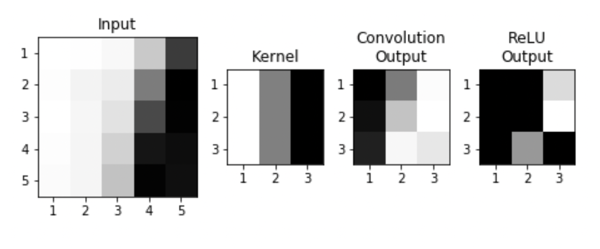{width=80%}
{width=80%}
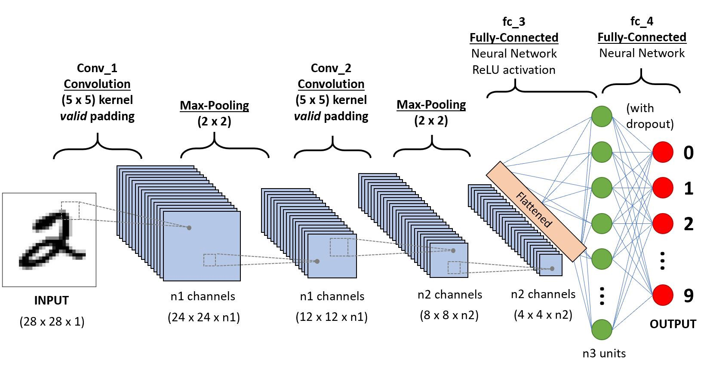{width=80%}

1. The input of image data into the convolution neural network is processed with the help of pixel values of the image in the convolution layer.
2. ==Filters== are generated that perform convolutions over the entire image and train the network to identify and learn features from images, which are converted to matrices.
3. ==Batch== normalization of input vectors is performed at each layer, so as to ensure all input vectors are **normalized** and hence regularization in the network is attained.
4. The convolutions are performed until better accuracy has been attained and maximum feature extraction is done.
5. Convolutions result in the **sub-sampling** of images and the dimensions of input get changed according to ==padding== and ==stride== chosen.
6. Each convolution follows the ==activation layer(ReLU)== and ==pooling layer==, which brings in **non-linearity** and helps in **sub-sampling** respectively.
7. After the final convolution, the input matrix is converted to feature vectors. This feature vector is the ==flattened layer==.
8. Feature vector serves as input to the next layer(fully connected layer), where all features are collectively transferred into this network. ==Dropout== of random nodes occurs during training to reduce overfitting in this layer.
9. Finally, the raw values which are predicted output by the network are converted to probabilistic values with the use of ==softmax function==.

## Keywords

==共享权重==, ==局部感知域 & 稀疏连接==,==Spatial Information==

### Shared Weights，共享权重

同一个filter在输入矩阵中进行扫描

一个隐藏层中的所有**神经元都检测在图像的不同位置处的同一个特征。权重共享，则检测特征相同。** 因此也将从输入层到隐藏层的这种映射称为<u>特征映射，filters, kernels</u>。该特征映射的权重称为**共享权重**，其偏置称为共享偏置。

### Local Receptive Fields & Sparse Connectivity, 局部感知域 & 稀疏连接

For convolution with kernel size $K$, each element in the output depends on a $K\times K$ receptive field in the input.
Each successive convolution contains multiple regions from the previous one.
输出矩阵中的每一个数值只由输入数据的一部分计算得来。与常规神经网络一样，输入层的神经元需要和隐藏层的神经元连接。但这里**不是将每一个输入神经元都与每一个隐藏神经元连接**，而是仅仅在一个图像的**局部区域创建连接**

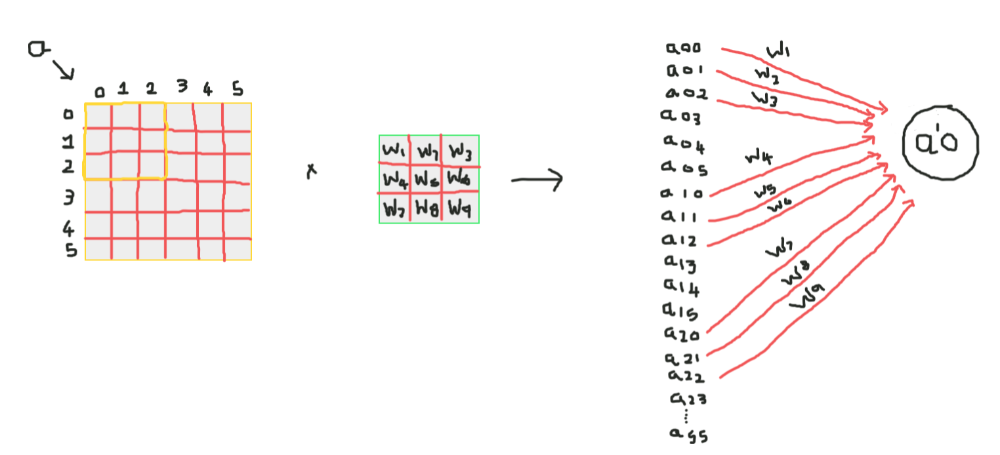{width=60%}
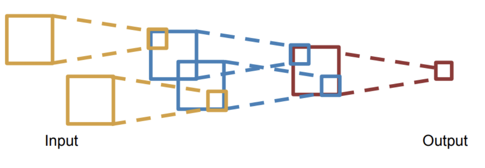{width=60%}

### Spatial Information

输入层：**二维矩阵排列**的**神经元**。

## Structure

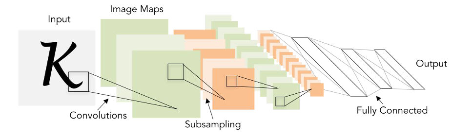{width=80%}

### Input Layer

**二维矩阵排列**的**神经元**。

### Convolution Layers, Conv

!!! p "Convolve the filter with the image $\Rightarrow$ <u>slide over the image spatially, computing dot products</u>"

完成图像和filter 的卷积就是

1. 用一个小小的 $F\times F\times D$ shared filter 在$N\times N\times D$ 图像上 slide spatially, 空间意义上地滑动。
2. 滑动的时候，每一次框定的**小小对应尺寸** $F\times F\times D$ 块 chunk of the image, Local Receptive Fields，和 $F\times F\times D$ shared filter 做 dot product ==element-wise multiplication==，.

    !!! danger ""
        D个 channel，都要分别和输入的D个channel 做卷积，得到D个特征图，然后**通道融合, sum all the (weights x inputs) of D channels**
3. 将所有滑动的到的结果按空间顺序重新拼成: $(N-F+1)\times(N-F+1)\times \red{1}$ tensor
4. 再加上 $(N-F+1)\times(N-F+1)\times \red{1}$ shared bias 偏置

以上是做一个filter的过程。$w^Tx+b$。
因为 input image 和 filter 的乘法是 ==element-wise multiplication==，就和向量点积一样，所以可以想象为多维的 chunk 和 filter 和 bias 展平成向量，$\R^{F\times F\times D}\xrightarrow{\text{Flatten}}\R^{F^2D\times 1}\xrightarrow{\text{dot product}}\R$

$K$ 个 filters 就有 $K$ 个 tensor，最后 **stack 堆叠** these up to get a new “image tensor”==activation map== of size as the input of the next layer. 立体卷积的输出结果的维度，长和宽和之前灰度图像的计算一样，而**结果的通道数则由过滤器的个数决定**
$$(N-F+1)\times(N-F+1)\times \red{K}$$

<div class="grid" markdown>
<figure markdown="span">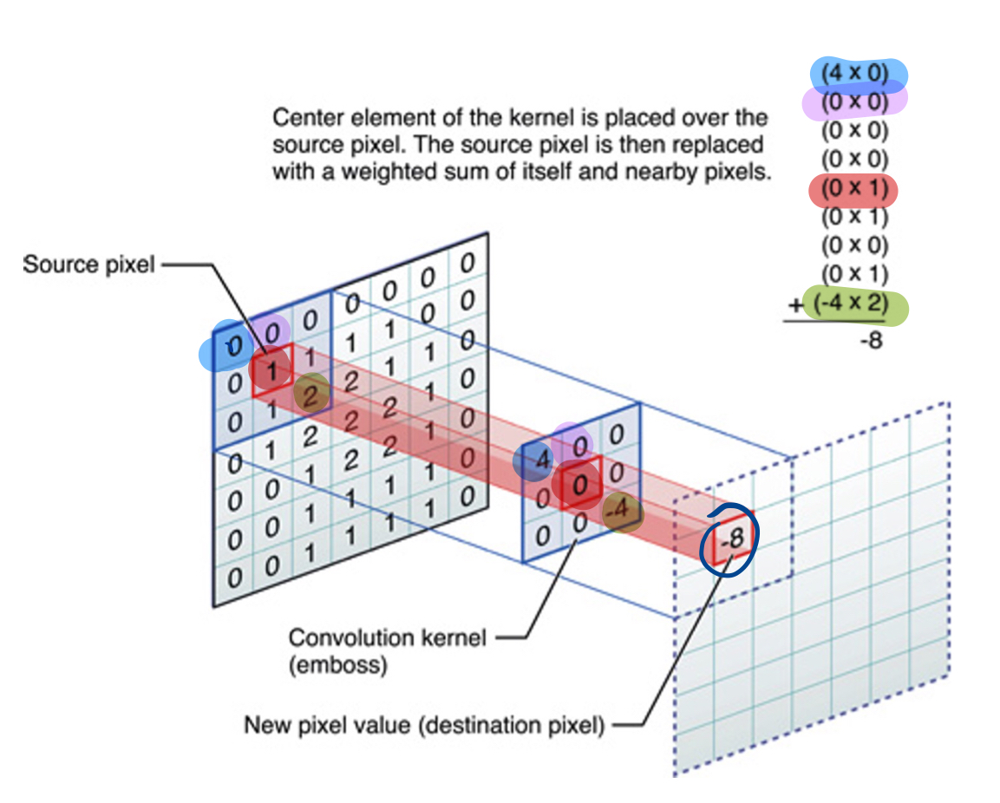{width=90%}<p>平面的，e.g.：**黑白照片灰度图像**</p></figure>
<figure markdown="span">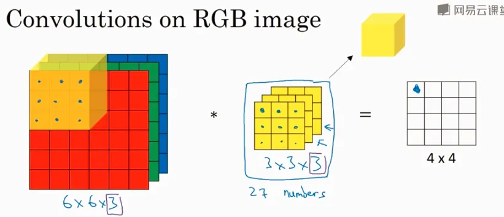<p>立体的，e.g：**彩色照片立体RGB图像**</p></figure>
</div>

- 立体的，e.g：**彩色照片立体RGB图像**
过滤器是一个立方体，在输入数据上扫描，每一个通道的权重分别与输入图片的每一个通道扫描到的值相乘再加和得到输出矩阵上的一个输出值

<figure markdown="span">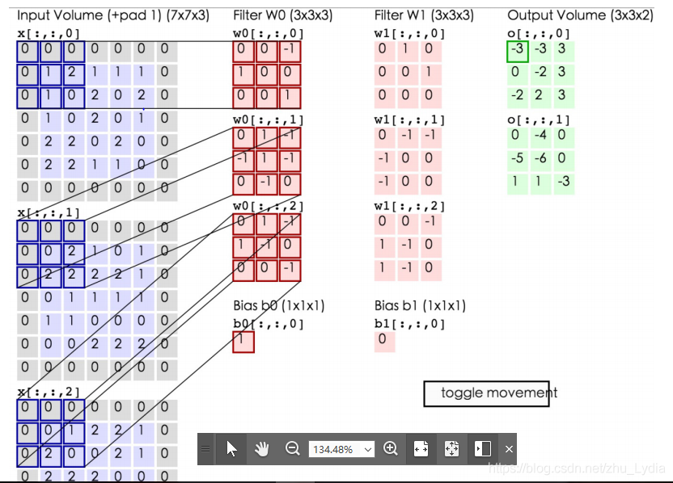{width=90%}<p>立体的，e.g：**彩色照片立体RGB图像**</p></figure>

<figure markdown="span">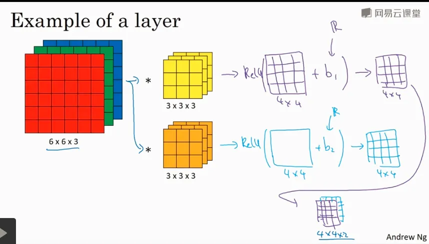{width=90%}<p>立体的，e.g：**彩色照片立体RGB图像**</p></figure>

### Filters, Kernels

!!! p "Input Image x  Feature Detector = ==Feature Map=="

#### about Size

1. always **extend the full depth o**f the input volume， 一个 filter 的深度(通道数)要和 input 的深度(通道数)一样，但是输出仍只有一个通道数。
    $$18=\cfrac{32-5}{1}+1, 30=\cfrac{32-3}{1}+1$$

    ```mermaid
    graph LR
    A[Input<br>32✖️32✖️<FONT COLOR="#ff0000">3</FONT>]
    B{Filter<br>5✖️5✖️<FONT COLOR="#ff0000">3</FONT>}
    C{Filter<br>3✖️3✖️<FONT COLOR="#ff0000">3</FONT>}
    A --> B
    A --> C
    D{Stride<br>1}
    B --- D
    C --- D
    E[Output<br>18✖️18✖️<FONT COLOR="#ff0000">1</FONT>]
    F[Output<br>30✖️30✖️<FONT COLOR="#ff0000">1</FONT>]
    D --> E
    D --> F
    ```

    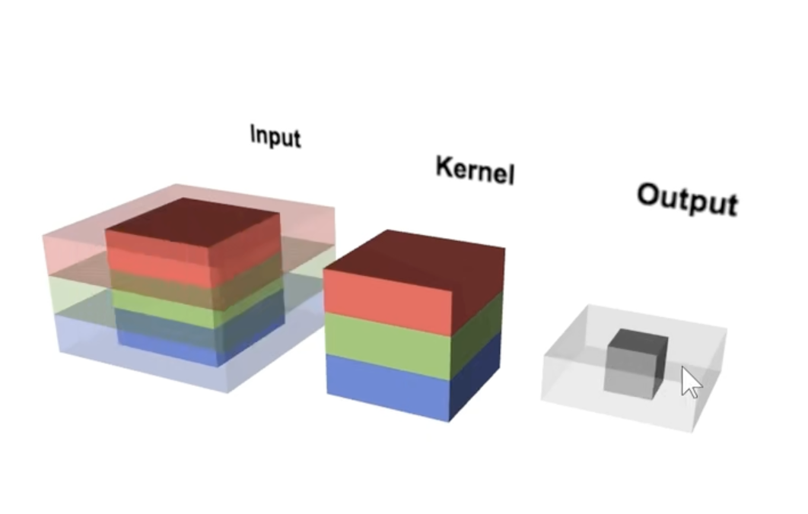{width=60%}

2. dim of **filter 一般为奇数，若为偶数，则会产生不对称填充**
3. **1✖️1 Convolution** is meaningful!
It computes the dot product over the channels.

<figure markdown="span">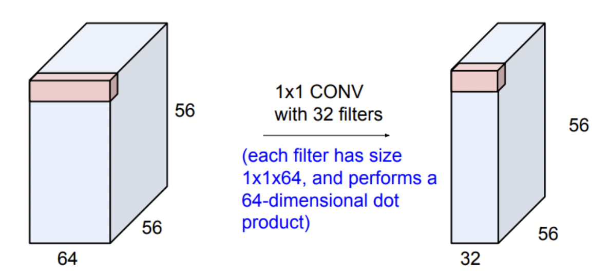{width=60%}<p>1✖️1 Convolution</p></figure>

**advantages：**

- Shrinking too volumes spatially
  
    !!! danger "Shrinking too fast is not good,"

比如说CNN，CNN是用卷积核和感受野做运算，每一个新产生特征数，也就是 output 的一个小小的数字，囊括的也只是一个小小的感受野的信息。对一个kernel 来说，虽然 output 是由所有的感受野 of input 卷积之后堆叠而成的一个 [L, W]矩阵，也就是这一个 kernel 和所有的感受野做运算的结果堆叠而成。但是 **简单局部特征堆叠不等于全局特征。** 这也是CNN稀疏链接的特点。

所以我们常说CNN对于那种长序列 long sequence input 不太友好，因为对于两个间隔比较远的 pixels 来说，要是想获得他们之间的关系特征，就需要堆叠很多个卷积层，才能获得他们的关系特征。

{width=60%}

#### about Stride s：移动的方格

1. s = 1 （default）
2. **do not want to capture all the data** or information available so we skip some.
3. 设置的 stride 要被刚好设置的filter卷积到$$\red{\text{Output Size }(\cfrac{N-F}{s}+1)\times(\cfrac{N-F}{s}+1) }, \quad\cfrac{N-F}{\text{stride}}\in Z $$

    {width=40%}

**drawbacks：**

- lose data over borders 容易丢失边缘或者是角落上的像素信息，譬如所当 stride=1 的时候，边边就出现一遍，中间的部分会在滑动的时候overlap 到，出现次数就会重复，这也体现了一种设定：图像中间总是比较重要，承载更多信息

**advantages：**

1. 输出的图片会缩小

#### about Padding

- 为什么要pad？
为了解决容易丢失边缘或者是角落上的像素信息。pad之后本来边缘的部分就不会只出现一次。 $\impliedby$<u>convolved 之前 pad</u>. Due to padding, information on the borders of images is also preserved similarly to at the centre of images.
- 在哪里pad？ pad 的范围多大
  - To 解决边缘容易丢失 $\implies$ <u>on the boundary</u>, image 的四周都要 pad. 范围自定义, **pad with p-pixel border**
  - To **卷积前后大小不变**，==$p=\cfrac{F-1}{2}\:\text{when s=1}$==
    $p=\cfrac{N(s-1)+F-s}{2}$

**保证卷积前后的维度不变，**

- proof of  formula of p **此处stride=1（default）**

    $N= N+2p-F+1\implies p=\cfrac{F-1}{2}$
- pad 什么？
<u>pad 0</u> on the boundary，因为做的是 dot product，不会影响结果

$$\begin{align*}
\text{Output Size without padding}&=(\cfrac{N-F}{s}+1)\times(\cfrac{N-F}{s}+1)\\  
\text{Output Size with padding}&=(\cfrac{N+2p-F}{s}+1)\times(\cfrac{N+2p-F}{s}+1)
\end{align*}$$

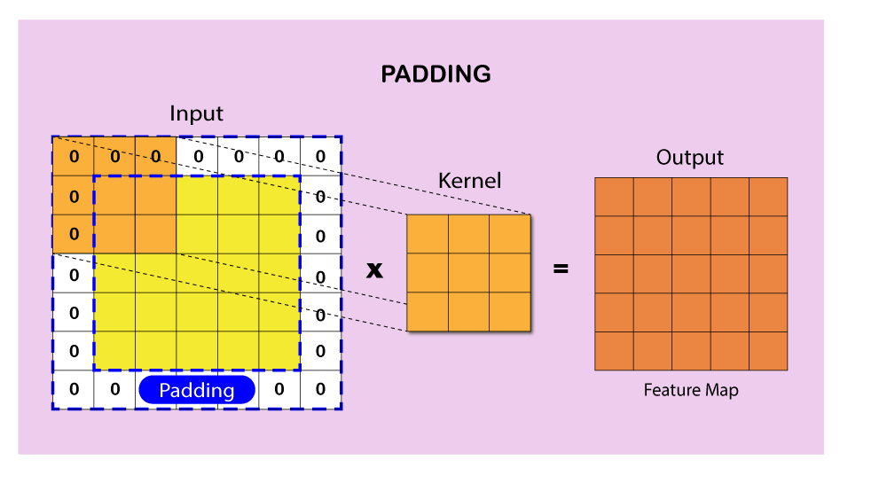{width=60%}

#### about Meaning

1. 同一张特征图，同一个通道，上的所有元素 (神经元) 都是对图像的不同位置的同一个特征的检测，通道中某一处 (特征图上某一个神经元) 数值的大小就是当前位置对当前特征强弱的反应。
2. 一个 filter 就是一个特征，每个 filter 体现的特质都不一样。
为了使得模型将注意力集中于图片的某些位置，**而在深度学习中，更好的方法是将过滤器里面的值设置成参数，让模型通过反向传播去学习到过滤器中的权重值**，代替人为的设定。

<div class="grid" markdown>
<figure markdown="span">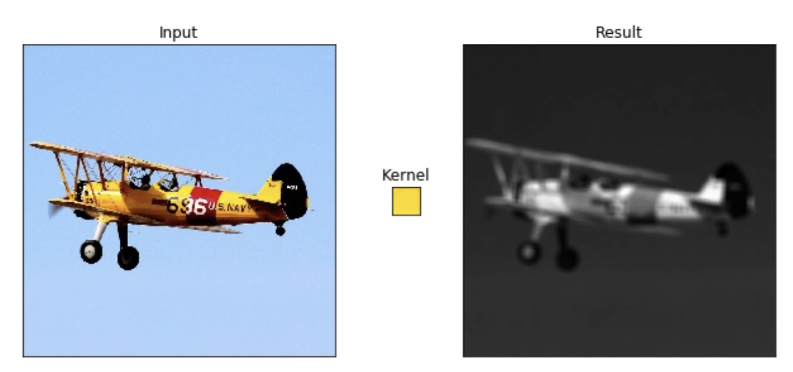<p>yellow</p></figure>
<figure markdown="span">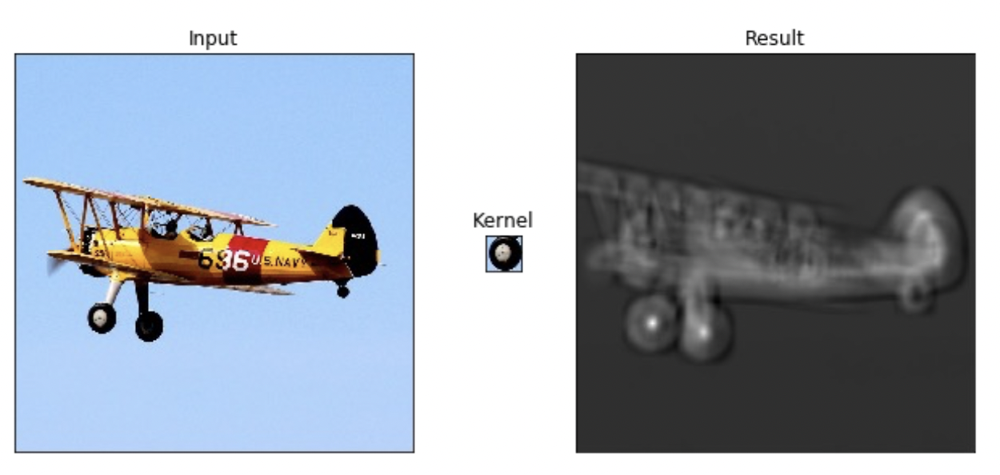<p>roll</p></figure>
</div>

1. <u>立体的 filter</u>，每一个通道的权重分别对应输入图片的每一个通道。**可以通过设置过滤器不同通道的权值来关注于原始图片不同通道的内容**

### Batch Normalization

Batch normalization is generally done in between convolution and activation(ReLU) layers. It normalizes the inputs at each layer, reduces internal co-variate shift(change in the distribution of network activations) and is a method to regularize a convolutional network.

Batch normalizing allows higher learning rates that can reduce training time and gives better performance. It allows learning at each layer by itself without being more dependent on other layers. Dropout which is also a regularizing technique, is less effective to regularize convolution layers.

### Activation function

卷积操作只是加权求和的线性操作，若神经网络只用卷积层，那么无论有多少层，输出都是输入的线性组合，网络的表达能力有限，无法学习到非线性函数。因此 CNN 引入激励函数，激活函数是个非线性函数，常作用于卷积层和全连接层输出的每个神经元（分量/元素），给神经元引入了非线性因素，使网络的表达能力更强，几乎可逼近任意函数，这样神经网络就可应用到众多的非线性模型中。

### Pooling Layer, 池化层

a ==down-sampling== strategy
1. Construct better translationally invariant features. 局部平移不变性，当输入有一定的平移时，经池化后输出不会发生改变。使得其特征提取不会因为目标位置的变化而受到较大的影响
2. Learn more compact features. 将某个元素邻域的**总体统计**特征作为网络在该位置的输出 we are taking **a summarized value** over all the values present !!! controls overfitting
3. 缩减模型的大小，简化卷积层的输出
4. 提高计算速度以及提高模型的鲁棒性等。
5. **没有需要学习的参数，只需要定义过滤器的大小以及步长即可**

!!! p "The Dimension After Pooling"
    Given a $M\times N\times D$ tensor, if we apply the pooling operator with size $K\times K$ and Stride $p$ , what are the dimensions of the output?
    - depth has no change
    - 在width和height那里就像卷积一样 $\text{without padding}=(\frac{N-F}{s}+1)\times(\frac{N-F}{s}+1)$
    - $\implies (\cfrac{M-K}{p}+1)\times (\cfrac{N-K}{p}+1)\times D$

|Pooling stategies||
|--|--|
|**Max Pooling**|（较常用）is robust to small perturbations.直观理解是能够提取出输入图片中比较显著的特征
**Average Pooling**|idk

<figure markdown="span">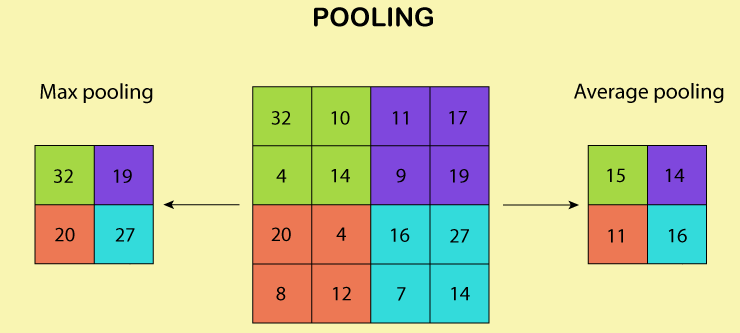{width=60%}<p>yellow</p></figure>

### Flatten Layer — Tensor Reshape

<div class="grid" markdown>
<figure markdown="span">{width=60%}</figure>
<p>the output feature map(matrix) will be converted into vector<br> 将前面卷积层或池化层输出的所有二维特征图一起映射成1个一维的特征向量</p>
</div>

### Fully- Connected Layer, FC

光卷积是不能完成分类任务的，所以就是要后面连 FC层，起到“分类器”的作用
**中间可能有多个FC层，**最后模型输出一个**维度等于类别数（输出的神经元个数）**的**向量**

<div class="grid" markdown>
<figure markdown="span">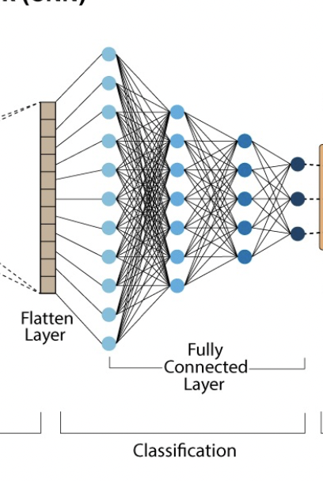{width=60%}</figure>
<figure markdown="span">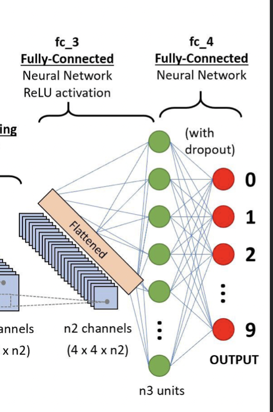{width=60%}</figure>
</div>

### softmax

softmax归一化，表示每一类的概率，然后**将得分最高的类别判为输入的类别**
The softmax function is used to map the non-normalized output of a network to a probability distribution.
软最大函数用于将网络的非规范化输出映射到概率分布。

## Famous CNN Architectures

### Deeper or Wider?

**Deep CNN**：Deeply stacked  Convolution Neural Network

|  | LeNet-5 | AlexNet | VGG Net | ResNet |GoogLeNet
| --- | --- | --- | --- | --- | --- |
| Key | 特征稀疏链接 | Relu activation  | smaller filters | ^ |
| Activation | Sigmoid | ReLU |  ^|^  |
| Advantages | basic architecture
奠定基础 | GPU | ^ |^  |
| Drawbacks | 算力不够 |^  |  |  |
| 设计用途 | 手写数字识别 | ImageNet classification with deep convolutional neural networks – NIPS 2012 | Very Deep Convolutional Networks for Large-Scale Image Recognition – ICLR 2015 |  Deep Residual Learning for Image Recognition – CVPR 2016|Going deeper with convolutions – CVPR 2015
| deep CNN |  |  ☑️|☑️  |☑️  |

!!! p "The Skip-connection was first proposed in ResNet"

### **LeNet-5**

**7 Layers** (input layer not counted)

**3 Convolution Layers** (C1; C3; C5)

**2 Pooling Layers** (S2; S4) — Mean

**2 Fully Connected Layers** (F6; Output)

**Sigmoid Activation!**

Details：

1. subsampling 中会在结果上多加一个偏置项
2. S2-C3 sparse connected 生成的16@feature map分别按相邻3个，相邻4个，非相邻4个和全部6个特征图进行feature mapping【因为算力不足，限制了连接数，减少计算开销；这样不同特征图的组合可以使新生成的feature map 学到不同的特征模式 】
3. MLP作为分类器
4. 这里的 faltten 是用CNN

### AlexNet

ReLU, max pooling, stride
Data augmentation
Optimizer parameters

### VGG Net

**152 layers for ImageNet.**

💡 **Key Idea of VGG**: Replace the large convolution filter by stacking some **smaller convolution filters.**

1. **More concise and generalizable.**
2. **Smaller filters can achieve better performance than larger filters. smaller filters 堆积可以比 larger更高**

3. **Demonstrate that increase depth can boost performance. 深度可提高表现**

5x5 conv = two 3x3 conv
7x7 conv = three 3x3 conv

### Residual Net, **ResNet**

keep origin information

Skip-connection
Batch-normalization
Bottleneck block

### **Dense Net**

### **GoogleNet**

There are some parallel polar level.
Okay? Blocks in in a certain layer that means You will send. You will
send I input. Okay, into different convolutions. Okay. And let's go
through different architectures. And then we merged guys okay, into a
final okay output. Okay, So this is a key idea. Okay, significant
difference. Okay, of Google, net with different, other, different neural
networks. Okay. But yeah you can try this. Okay. But we will not Talk
about the details of this neural networks, Okay

### Light-weight networks
!!! p "Performance on computation limits"

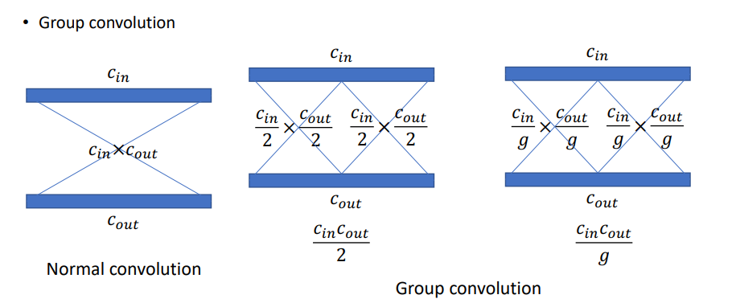{width=60%}
{width=60%}

!!! danger "a depthwise convolution involves applying a separate 3x3 filter to each input channel."
    > > For a depthwise 3x3 convolution, the number of  input channels and output channels are both 32, how many parameters does this convolution layer have ？
    >
    > $3*3*32$

**Group convolution:**

## Practical Exercise

## Parameters Initialization

快速 shrikage to point

## Bach Normalization

## Application

## Edge Detection

如上图所示：输入是一个6*6的矩阵，输入是一个左白右灰的图片（白色部分对应的矩阵值大于0，灰色部分的值为0），中间有一道竖线分割；中间的垂直过滤器是一个3*3的矩阵，由白灰黑三个部分组成，矩阵三列的值分别大于0，等于0和小于0；输出的结果矩阵中，中间的两列大于0，即输出的图片中间部分为白色，也就是说经过卷积之后，成功的检测出了原始图片中间存在的垂直竖线。

## Exercise

> >(in L5 in AMA564), input $\in\R^{5\times5}$,kernel $\in\R^{3\times3}$,bias=-500, activation function is ReLU

## code

[卷积神经网络（浅显易懂）-吴恩达课程学习]: https://zhuanlan.zhihu.com/p/35251749/

[神经网络及CNN中的通道、共享权重、特征映射等的理解_zhu_Lydia的博客-CSDN博客_cnn的通道]:https://blog.csdn.net/zhu_Lydia/article/details/88567648

[Convolutional Neural Network Architecture | CNN Architecture]:https://www.analyticsvidhya.com/blog/2020/10/what-is-the-convolutional-neural-network-architecture/

[Convolutional Neural Network | Deep Learning | Developers Breach]: https://developersbreach.com/convolution-neural-network-deep-learning/
