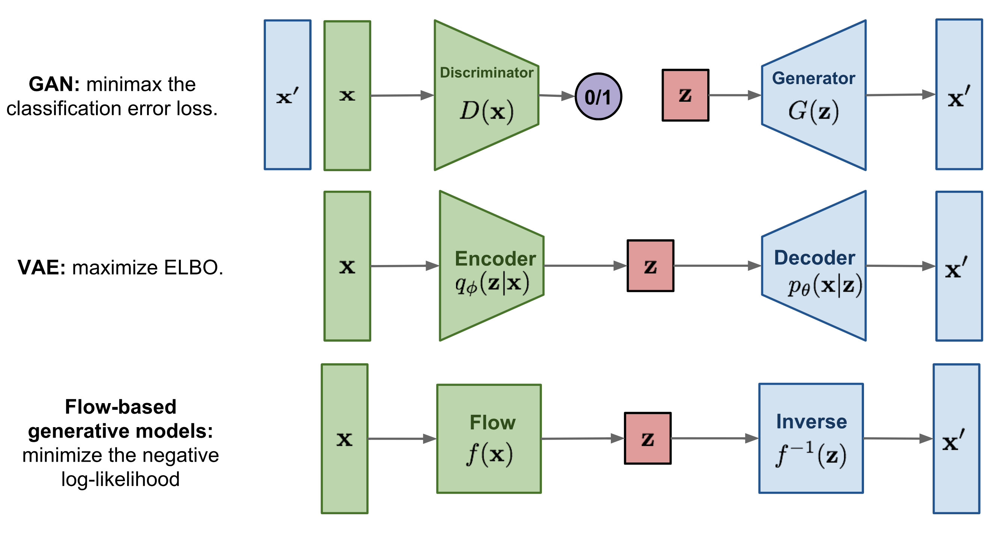
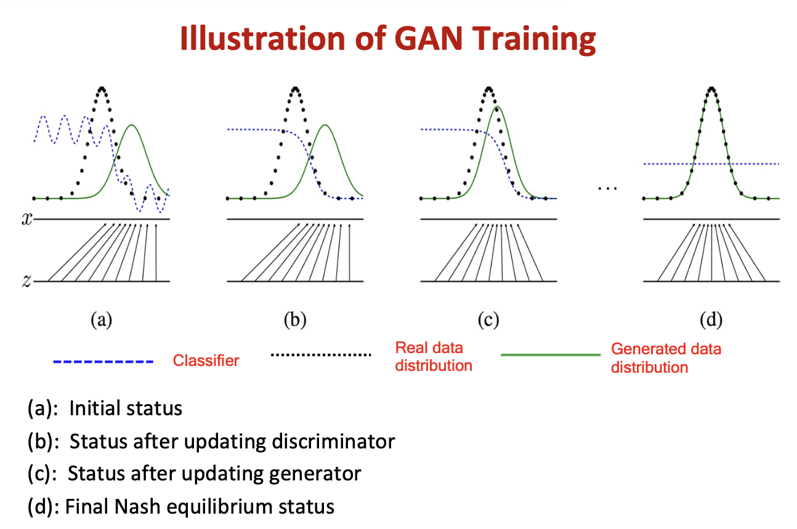
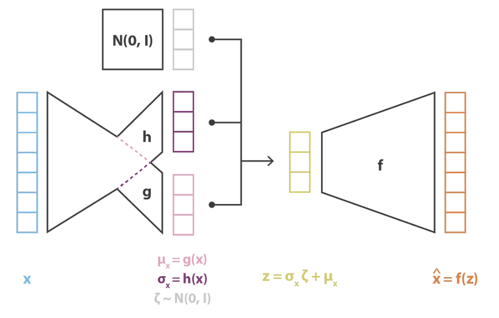

# Generative models

A ==generative model== is a type of machine learning model that **learns the probability distribution** of a dataset and **generates new samples** that are similar to the original data by modelling the underlying structure and patterns of the training data and can be used for tasks such as **image generation, text generation, and speech synthesis.**

<figure markdown="span">{width=80%}
生成学习
</figure>

|==Generator==|==Discriminator==|
|--|--|
|learns the probability distribution of a dataset and generates new samples that are similar to the original data |learn the decision boundary between different classes.|
|takes in random noise and returns generated a fake image| takes in both real and fake images and returns probabilities with 1 representing authenticity and 0 fake|

## categories

<figure markdown="span">{width=90%}
生成学习
</figure>

the reconstruction loss is the distance of the original data & the reconstructed data.
Target: the reconstruct the data = the Decoded latent features. So this laser feature comes from the encoding of the original data.

### Generative Adversarial Networks, GAN, 生成对抗网络

!!! p "Nash Equilibrium 纳什均衡思想"
    相互对抗，无人胜出
    **jointly train a strong discriminator and a generator**

!!! danger "minmax问题 ✅ maxmin问题 ❌"
    GAN的理想训练模式是这样的：固定生成器G，迭代k次训练判别器D；然后固定判别器D，训练生成器G，两者依次交替使用梯度下降法进行更新。
    而且，通常情况下：$\min\limits_G\max\limits_D V（G, D） \neq\max\limits_D\min\limits_G V（G, D）$
    - **maxmin 先G后D**: GAN的训练过程会产生mode collapse问题，就是指生成器生成的样本有大量的重复，**多样性非常差**（在实践中经常出现）一开始先迭代训练G的话，G学不了什么东西。因为告诉他的那个D还什么都不会，所以根本不知道对还是错，就只能胡乱生成

#### Main idea

==GAN== 由生成器 Generator 和判斷器 Discriminator 兩個神經網絡所組成. Discriminator D and Generator G **play an adversarial minimax game** to reach **a Nash equilibrium**. 因為之間的對抗關係，所以稱為生成對抗網絡.

- **Generator** takes in random **noise** and returns a **fake image**.
- **Discriminator** takes in both **real and fake** images and returns **probabilities** with 1 representing authenticity and 0 fake

> 很常聽到的形容是，`Generator`是負責做假鈔的人，`Discriminator` 是警察檢驗是否為假鈔。

{width=80%}
{width=70%}
{width=80%}

- **Model doesn’t converge** G,D parameters may oscillate
Uneven progress between G, D
- **Mode collapse (the Helvetica scenario)** G will only generate samples from a single mode。当 generator 在生产 某一种类型 就很厉害到足以骗到 discriminator，他就可能光生产这一类去了所以导致很不平衡。
- **Samples lack global structure** E.g., Some generated faces will have 3 eyes

<figure markdown="span">{width=70%}
(a) 光学习一种去了. (b) 缺少整体的结构
</figure>

#### MiniMax Optimization

$x～\text{data}(x):=$  real x sampled form data
$z～Z(z) :=$ noise z, $G(z):=$ fake generated by Generator

##### Update D to MAX V(D, G) when fixing G

==Cross-Entrophy==
$\max\limits_DV(D, G)=\mathbb {E}_{x～P_{data}(x)}\log D(x) + \underline{\mathbb E_{x～P_{Z(z)}}\log (1-D(G(z))) }\\
\xrightarrow{\text{forcing}}\begin{cases}D(x)\rightarrow1\\D(G(x))\rightarrow0\end{cases}$

##### Update G to MIN V(D, G)  when fixing D

the proportion of fake  defined as real
$\min\limits_GV(D, G)=\underline{\mathbb E_{x～P_{Z(z)}}\log (1-D(G(z)))}\\
\xrightarrow{\text{forcing}}D(G(x))\rightarrow1$

### Deep Convolutional Generative Adversarial Networks, DCGAN

!!! p "When reducing dimensionality, we want to keep the main structure there exists among the data."

#### Auto-encoder

==Autoen-coding== is a data compression algorithm. The compression and decompression functions are

1. data-specific,
2. lossy $l = \Vert x-\hat{x}\Vert^2=\Vert x-d(z)\Vert^2=\Vert x-d(e(x))\Vert^2$
3. learned **automatically** from examples rather than engineered by a human

#### Loss v.s. Information

$$l = \Vert x-\hat{x}\Vert^2=\Vert x-d(z)\Vert^2=\Vert x-d(e(x))\Vert^2$$

- The **more complex** the architecture is, the more the auto-encoder can proceed to **a high dimensionality reduction** while **keeping reconstruction loss low**. 架构越复杂，自动编码器就越能进行高维度降低，同时保持较低的重建损失。
- An encoder with“infinite power” could theoretically takes our N initial data points and encodes them as 1, 2, 3, ... up to N (or more generally, as an N integer on the real axis) and the associated decoder could make the reverse transformation, with no loss during the process.
- The lack of interpretable and exploitable structures in the latent space (lack of regularity)  没有重建损失的重要维度减少往往是有代价的：潜在空间中缺乏可解释和可利用的结构（**缺乏规律性**）

#### loss function

When reducing dimensionality, we want to keep the main structure there exists among the data.

- Irregular latent space prevents us from using autoencoder for new content generation.
- The quality and relevance of generated data depend on the regularity of the latent space.

### Variational Auto-Encoder, VAE, 变体自动编码器

==Variational autoencoders, VAEs, 自动编码器==。是一个神经网络，旨在以无监督的方式学习身份函数，以重建原始输入，同时在此过程中压缩数据，从而发现更有效和压缩的表示。are autoencoders that tackle the problem of the **latent space irregularity**. VAE makes the encoder return **a distribution over the latent space** instead of a single point. VAE loss function includes **a regularisation term** over the returned distribution in order to ensure a better organisation of the latent space.

<figure markdown="span">{width=60%}
(a) 光学习一种去了. (b) 缺少整体的结构
</figure>

### Conditional variational autoencoder (CVAE)
