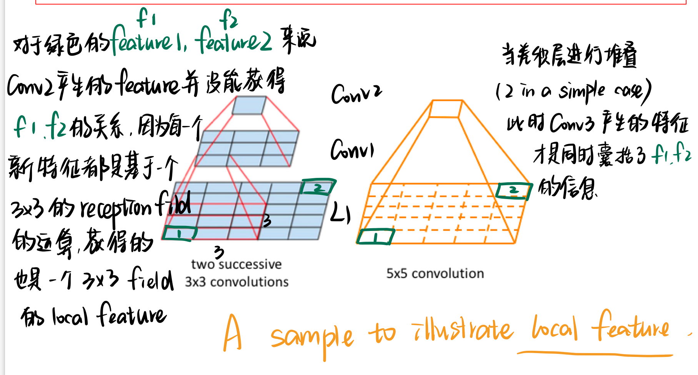

# DL

Deep learning is part of a broader family of machine learning methods based on **artificial neural networks** with representation learning (表征学习).

**properties of NN：**

1. Neural networks are **composited functions**.
2. Neural networks can **approximate other functions**.
Any continuous functions defined on **a compact set** can be approximated **arbitrarily well** by a shallow neural network if **the shallow neural network is arbitrarily wide**. 如果浅神经网络任意宽，则在紧集上定义的任何连续函数都可以被**浅神经网络任意近似**。
3. Neural networks can be expressive. 神经网络可以富有表现力。

## info

### global features 全局特征 🆚 local features

==全局特征==是指 信息由整块 input 产生
比如说 MLP，第一层的每一个 input 都是全连接的，就是每一个 out put 都是全体 input 的运算，收获的也是全体 input 的信息

==局部特征==是指 信息由部分 input 产生。 比如说CNN，CNN是用卷积核和感受野做运算，每一个新产生特征数，也就是 output 的一个小小的数字，囊括的也只是一个小小的感受野的信息。对一个kernel 来说，虽然 output 是由所有的感受野 of input 卷积之后堆叠而成的一个 [L, W]矩阵，也就是这一个 kernel 和所有的感受野做运算的结果堆叠而成。但是 **简单局部特征堆叠不等于全局特征。** 这也是CNN稀疏链接的特点。
所以我们常说CNN对于那种长序列 long sequence input 不太友好，因为对于两个间隔比较远的 pixels 来说，要是想获得他们之间的关系特征，就需要堆叠很多个卷积层，才能获得他们的关系特征。

## categories of Neural Networks

| Deep Neural Networks DNN | Learning Algorithms（learning task |
| --- | --- |
| Multi-Layer Perceptron MLP 多层感知器  | Regression|
|^| classification |
| Convolutional Neural networks CNN 卷积神经网络 | Classification|
|^|Generative Learning 生成式学习 |
| Recurrent Neural Networks RNN 递归神经网络 | Natural Language Processing (NLP) |

  
  
生成学习

- **关于层与层神经元的连接**
  从结构来说，排除 dropout 影响. ==global features  🆚 local features==
    - fully connected NN (FCNN)
    “**完全连接**”或有时称为“**紧密连接**”。所有可能的连接层都存在到图层，这意味着输入向量的每个输入都会影响输出向量的每个输出。
    - convolutional NN (CNNs)
    并非所有输入节点都会影响所有输出节点。这使卷积层在学习中具有更大的灵活性。此外，每层的权重数量要小得多，这对图像数据等高维输入有很大帮助。
    - Randomly wired NN
    随机布线的神经网络 also works

- 关于深度和广度
    - Shallow Neural Network <u>(better)</u>
    - Deep Neural Networks

    !!! question "For example, we have five nerouns. If you have two layers like 2*3=6 > 5 larger space 到底哪个更better"
- 大小
    **Larger** Neural Networks perform better on larger data
    增加隐藏层。隐藏层是输入层与输出层中间的网络层，并且可以有多个隐藏层。这增加了网络的深度，丰富了网络的表达能力。

- Ref
  [A Deep Learning Tutorial: From Perceptrons to Deep Networks]
  [What is a Neural Network?]
  [Backpropagation for Dummies]

[What is a Neural Network?]: https://www.tibco.com/reference-center/what-is-a-neural-network

[Backpropagation for Dummies]: https://medium.com/analytics-vidhya/backpropagation-for-dummies-e069410fa585

[A Deep Learning Tutorial: From Perceptrons to Deep Networks]: https://www.toptal.com/machine-learning/an-introduction-to-deep-learning-from-perceptrons-to-deep-networks

深度学习框架指明了设计方向：以计算图为核心，采用GPU设备加速。

## 科学计算

- 为什么使用多维数组， **为什么 batch 一般是64、128或256？**
现代计算机都是多核多处理器的，支持多线程和多进程，非常适合矩阵的并行计算。科学计算往往都是基于矩阵的计算，并且会指定一个适当的Batch。例如，**PyTorch视觉处理中通常将Batch指定为64、128或256，这也是为了充分利用计算机资源而考虑的**

## parameter tuning

$$
f(x;\theta)=\argmin\limits_{\theta}\sum\limits_{i=1}^n(Y_i-f(X_i))^2,X_i\in\R^p,Y_i\in\R\\\\\mathcal F=\{f:f(x;\theta)\text{ is a neural network parameterized by }\theta\in \R^S\}\\
$$

用 $\mathcal F=\{f:f(x;\theta) \}$ 去 approximate $f(x;\theta)$，但是它是 closed-form 的，所以我们没法像 LSE of Linear regression 一样 $\hat\beta_{LSE}=\argmin\limits_{\beta}\Vert \mathbb Y-\mathbb X\beta\Vert_2^2=(\mathbb X^T\mathbb X)^{-1}\mathbb X\mathbb Y$ 直接求解，所以需要 **search for θ using optimization algorithms.**
