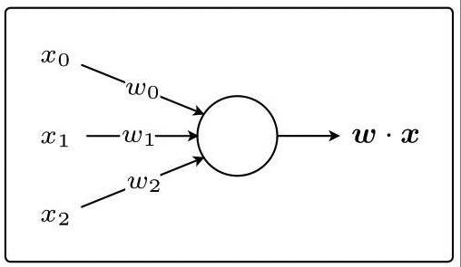
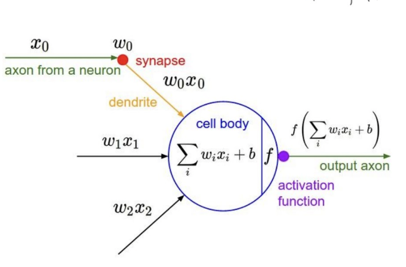

# MLP

- ==Deep Non-parametric Regression==。之前都是 function-assumed 出来的结果是closed-formed， 但是现在就是 **Nonparametric regression** 不在乎它是什么 the shape of the functional relationships is not predetermined ，就是用 deep learning 去 approximate 它。

    - 为什么能 **approximate？**
    Non-linearity is introduced by activation functions.
    Any **continuous functions** defined on **a compact set** can be approximated **arbitrarily** well by a shallow neural network if **the shallow neural network is arbitrarily wide. 如果浅神经网络是任意宽的，那么在紧集上定义的任何连续函数都可以被浅神经网络任意近似。(有理论证明)**
    神经网络因为涉及到更深层就是2*3个参数，但是一般就是2+3个参数，所以神经网络会更强，在一些确实复杂的数据分布上。

## architecture

**Feedforward Neural Networks** FNN 前向回馈 **Layers in MLP are fully connected**

### Perceptron, 感知机

<mark>Perceptron</mark>, 感知机是接受多个输入后将每个值与各自的权重<b>相乘，最后输出总和</b>的模型

<figure markdown="span">{width=60%}</figure>

### Mathematical Definition

The architecture of an MLP is expressed as **a composition of a series of functions**

$$
\begin{align*}f_\theta(x)=&\mathcal{A_L\circ\sigma \circ A_{L-1}\circ\sigma \circ\cdots\circ \sigma \circ A_1(x) }\\&\mathcal{A_i}(x)=W_ix+b_i\\&\theta=(W_1,b_1,...\dots,W_L,b_L)\end{align*}
$$

{width=60%}

|  | Neural Network |
| --- | --- |
| Input x | $\large x\in\R^{d_0}$ at 0-th layer |
| Output | at L-th layer |
| layers | L |
| hidden layer | $h_i(x)=\mathcal{A_i \circ A_{i-1}\circ\sigma \circ\cdots\circ \sigma \circ A_1(x) },i=1...L-1$ |
| $\theta$ | $(W_1,b_1,...\dots,W_L,b_L)$ |
| the depth of network | L-1 (number of hidden layers. |
| the width of  network | $\max\{d_1 , ... , d_{L-1}\}.$ |
| the size of  network | $\text{num}( \theta)$ |
|  | the i-th Layer |
| linear transformation | $\mathcal{A_i}(x)=W_ix+b_i$ |
| Input x | $\large x\in\R^{d_{i-1}}$ |
| weigth matrix | $ W_i\in\large \R^{d_i\times d_{i-1}}$ |
| bias vector | $b_i\in\large\R^{d_i}$ |
| activation function |  $\sigma$ |
| The width of the i-th layer | $d_i$ |

## Back Propagation

Loop over instances:

1. The forward steps
Given the input, make predictions layer-by-layer, starting from the first layer)
2. The backward steps
Calculate **the error in the output**
Update the weights layer-by-layer, starting from the final layer

> > The neuron is modelled by a unit connected by weighted links $w_i$ to other units 𝑖. Suppose $W=(w_0,w_1,w_2,w_3)=(-0.4336,0.8622,0.3188,-1.0377),\: z(w)=w_0+\sum\limits_{i=1}^nw_ix_i,\:o(w)=\text{sigmoid}(z(w)),\: L(w)=\cfrac{1}{2}(o(w)-y)^2.$
> > Now we have a sample (x,y) with $x = (x_1,x_2,x_3)^T = (0.5377,1.8339,-2.2588)^T, y = 0$.
> > 

## in classification problem

$\begin{cases}\text{Data: }(X_i,Y_i),i=1,\dots,n,X_i\in\R^p,Y_i \text{ is categorical }\\\text{classifier: }\mathcal F=\{f:f(\cdot)\text{ is categorical }\}\end{cases}$

**难点：**

1. 分类是label类型，输出的是label， 而 output of NN is a continuous value
2. 怎么应用 multi-classification， how to represent Y   $\rightarrow$ Matrix

**How to represent Y and** $\hat{Y}$

从一维的1，2，3，4，…，到二维的 0-1 bool 矩阵

- Example
    1. \#category = 2: $Y_i\in\{+1,-1\}, Y_i\begin{cases}+1\rightarrow (1,0)\\-1\rightarrow (0,1)\end{cases}$
    2. \#category = 4: $Y_i\in\{1,2,3,4\}, Y_i\begin{cases}1\rightarrow (1,0,0,0)\\2\rightarrow (0,1,0,0)\\3\rightarrow (0,0,1,0)\\4\rightarrow (0,0,0,1)\end{cases}$

一般最后输出层，神经元的数量就刚好是 category 的数量，并且是每一个神经元 model class probabilities. SO

1. $z_i=h(X_i,\theta)\in[0,1]$ $\rightarrow$ h = Sigmoid
2. $\sum\limits_{i=1}^{\#category}\hat{y}_i=\sum\limits_{i=1}^{\#category}g(z_i)=1\rightarrow$  g = Softmax
