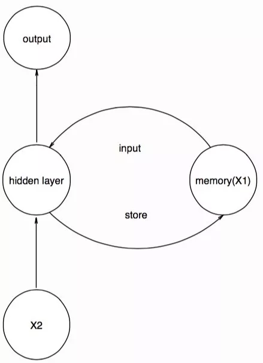

# Recurrent Neural Networks

## standard RNN

<kbd>Variable-length Sequene</kbd> <kbd>Sequential-Dependent</kbd> <kbd>Time-Dependent</kbd>

==recurrent==: **revisit or reuse past states as inputs** to predict the next or future states.

==Memory== 拥有前一个阶段的输出作为未来输出的灵感的一部分。

!!! p "The biggest difference between RNN and traditional neural networks is that each time the previous output is taken to the next hidden layer and trained together."

<figure markdown="span"></figure>
<figure markdown="span"></figure>

最后只要 o5 进行解码

<figure markdown="span">{width=70%}
x1 进去产生 h1，h1 同时存到 m1, 此时 o1 完全是 h1 的解码  为了统一，也可以自定义一个 m0 同样和 x1 进去产生 h1
</figure>
<figure markdown="span">{width=70%}
x2 & m1 进去产生 h2, h2 同时被存到 m12， 此时 o2 完全是 h2 的解码
</figure>
<figure markdown="span">{width=70%}
x3 & m12 进去产生 h3, h3 同时被存到 m123， 此时 o3 完全是 h3 的解码 
</figure>
<figure markdown="span">{width=70%}
memory (m1,m12,...) 并不是直接raw input 进去产生新一轮的 hidden state (h2,h3,...), 而是采用一个<b>权值矩阵 W 参数化</b>记忆单元
</figure>

### shortcoming

<figure markdown="span"></figure>

short-term memory has a large impact (such as the orange region), but long-term memory effects are small (such as black and green regions), which is the <b>short-term memory problem</b> of RNN.

如果序列足夠長，它們將很難將資訊從較早的時間步驟傳遞到較晚的時間步驟。因此，如果您嘗試處理一段文字來進行預測，RNN 可能會從一開始就遺漏重要資訊。
1. RNN has short-term memory problems and cannot handle very long input sequences
2. Training RNN requires significant cost

- <u>unfold</u>
- **数据是按照顺序进入**，我们在处理序列化的数据时，往往会在用**滑动窗口**的办法来调整不同的结构。
- m0 的设置：这个初始值可以作为一个参数进行反向传播，也可以将其简单的设置为零，表示前面没有任何信息。

!!! p "在同一层的隐藏单元中进行传播的 权值矩阵W & 输入到隐层的权值矩阵U & 隐层到输出的权值矩阵V，为什么是相同的？"
    就像是 CNN 用参数共享的卷积核来提取相同的特征，在RNN中，使用参数共享的 U,V 来**确保相同的输入产生的输出是一样**。参数共享的矩阵W **确保了对于相同的上文，产生相同的下文**。
    > 一段文本中，可能会出现大量的“小狗”。无论小狗出现在哪个位置（x?），参数共享使得神经网络在输入“小狗”的时候，在不考虑上下文的 memory，$x\xrightarrow{完全编码}h$ 的结果是一样。类似地，在不考虑当前输入 x，$m\xrightarrow{完全编码}h$ 的结果是一样。

## LSTM Long Short-Term Memory Network

!!! p "motivation"
    To solve short-term memory of RNN, LSTM can retain "important information" in longer sequence data, ignoring less important information.

<figure markdown="span"></figure>
<figure markdown="span"></figure>

All recurrent neural networks have chain repeating modules of neural networks.  ==standard RNN==: repeating module has a very simple structure, such as only a single tanh layer. ==LSTM==: Not a single neural network layer, but four, and interacting in a very special way.

## GNU Gated Recurrent Unit-GRU

a variant of LSTM. He retains the characteristics of LSTM to focus and forget unimportant information, and it will not be lost during long-term propagation.

## Ref

- [如何理解RNN？（理论篇）]
- [Long short-term memory network-Long short-term memory | LSTM]
- [Illustrated Guide to LSTM’s and GRU’s: A step by step explanation]

[如何理解RNN？（理论篇）]:https://easyai.tech/blog/rnn-understand/
[Long short-term memory network-Long short-term memory | LSTM]:https://www.easyai.tech/en/ai-definition/lstm/
[Illustrated Guide to LSTM’s and GRU’s: A step by step explanation]:https://towardsdatascience.com/illustrated-guide-to-lstms-and-gru-s-a-step-by-step-explanation-44e9eb85bf21
