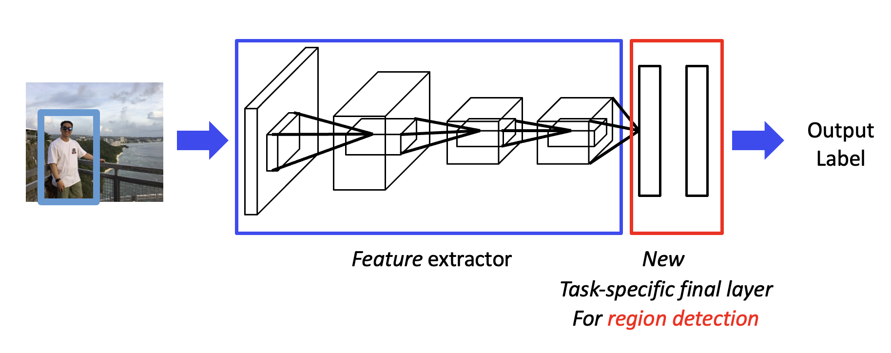
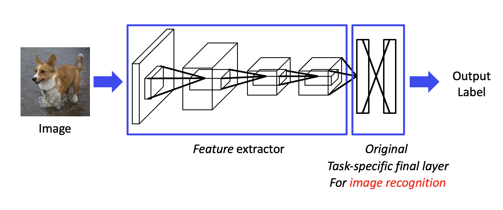

# Transfer learning

==Transfer learning== is a machine learning technique where knowledge gained from training a model on one task is applied to a different but related task. In transfer learning, a pre-trained model that has been trained on a large dataset is used as a starting point for a new task instead of training a model from scratch.
The idea behind transfer learning is that the features learned by a model on one task can be valuable for solving a different task. Instead of randomly initializing the model's parameters, the pre-trained model's weights are used as a starting point. These pre-trained models are typically trained on large-scale datasets, such as ImageNet for image classification or Word2Vec for natural language processing, and have learned to extract meaningful and generalizable features.

!!! question "If we have enough training data on a specific task, transfer learning can also be used to improve the performance of our DNN model. ❌"

{width=70%}
{width=70%}

- **Pre-training Stage**
    - ==Feature extractor layers, **backbone**== encode useful information of **original data**.
    - Remove ==original final layers== for the original image recognition purpose.
- **Fine-tuning Stage**
    - Add ==task-specific final layers==.
    - Train this new model with **task-specific data**.

**standard steps:**

- Pre-training stage
  1. Prepare large-scale training data $\leftrightarrow$ Publicly available  dataset.
  2. Select and train  a deep model with
training data $\implies$ backbone
- Fine-tuning
  1. Modify the  model for the target task
  2. Fine-tune the  target dataset

> $\xrightarrow{\text{on ImageNet-1K }} $ ResNet-50 $\xrightarrow{\text{Object detector}} $ MS-COCO detection

## Backbone （骨干网络）

通常指的是在任务中用于 **==提取特征== 的主干网络架构**。用于从输入中提取高级特征表示。这些特征表示可以用于后续任务。共同目标是通过层次化的特征提取来提高任务表现。

{width=80%}

Strong backbone → Better performance on the new task!

- **How to get strong backbone**
    - Bigger pre-training datasets
    - Better backbone architecture
    - Better training strategy

### for CV

some useful CNN backbones in computer vision.

- AlexNet
