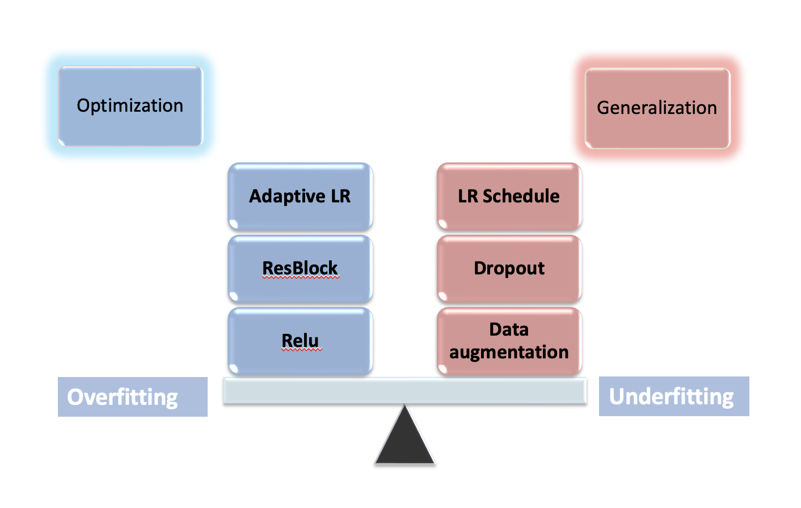
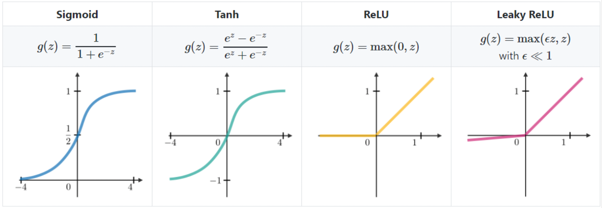
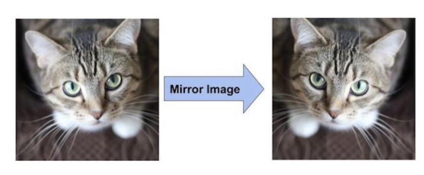
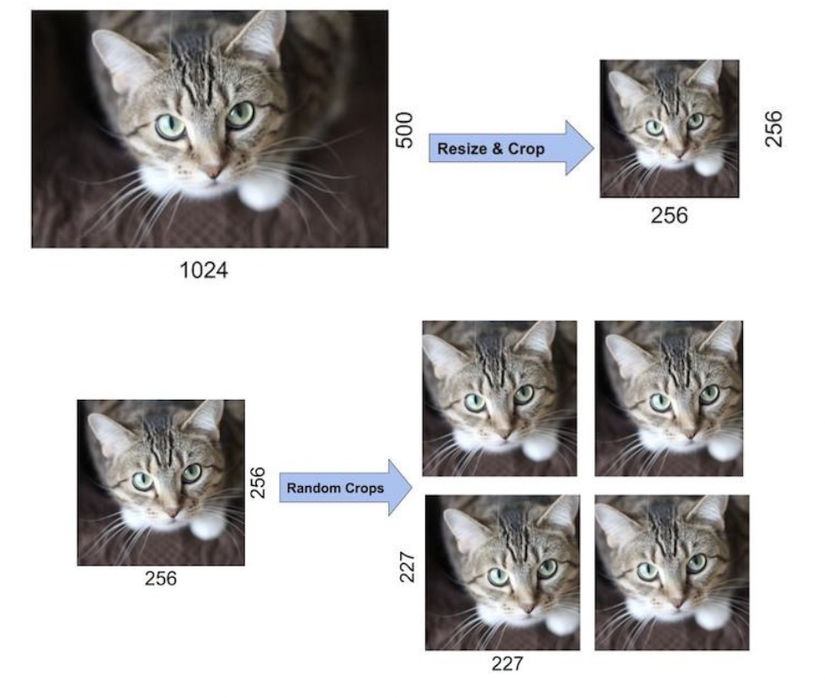

# 部件



## activation function

Non-linearity is introduced by activation functions **but non-polynomial !!**

[深度学习中saturation是什么意思？]

==saturated 饱和的==. 饱和的激活函数的值接近其边界(上下边界)的时候，接近临界值变化不大，会导致算法在反向传播时梯度消失。

$\sigma$ is ==non-saturated 不饱和的==. $\lim\limits_{x\rightarrow\infin}=\infin$

|Saturated Nonlinearity |Non-saturated Nonlinearity|
|--|--|
| Sigmoid| Rectified Linear Unit (ReLU) 线性整流函数|
|Tanh |Leaky ReLU 修正线性单元 |

!!! p "**ReLU** is a good default choice for most problems."



[深度学习中saturation是什么意思？]: https://www.zhihu.com/question/48010350

## Regularization

算法的性能，一是允许使用的函数种类，二是这些函数的数量。在假设空间中，相比于某一个学习算法，我们可能更偏好另一个学习算法。这意味着两个函数都是符合条件的，但是我们更偏好其中一个。只有非偏好函数比偏好函数在训练数据集上效果明显好很多时，我们才会考虑非偏好函数。

例如，可以加入权重衰减(weight decay)来修改线性回归的训练标准。带权重衰减的线性回归最小化训练集上的均方误差和正则项的和
可以看作拟合训练数据和偏好小权重范数之间的权衡。这会使得解决方案的斜率最小，或是将权重放在较少的特征上。我们可以训练具有不同
λ值的高次多项式回归模型。

更一般地，正则化一个学习函数的模型，我们可以给代价函数添加被称为 ==正则化项 regularizer== 的惩罚。在权重衰减的例子中，正则化项是。表示对函数的偏好是比增减假设空间的成员函数更一般地控制模型容量的方法。我们可以将去掉假设空间中的某个函数看作对不赞成这个函数的无限偏好。在权重衰减的示例中，通过在最小化的空间中额外增加一项，我们明确地表示了偏好权重较小的线性函数。

机器学习中的一个核心问题是设计不仅在训练数据上表现好，而且能在新输入上泛化的算法。在机器学习中，许多策略被显示地设计来减少测试误差(可能会增加训练误差为代价)。这些策略被统称为==正则化==。在实践中，过于复杂的模型族不一定包括目标函数或真实数据生成的过程，甚至也不包括近似过程。我们几乎从未知晓真实数据的生成过程，所以我们永远不知道被估计的模型族是否包含生成过程。然而，深度学习算法的大多数应用都是针对这样的情况，其中真实数据的生成过程几乎肯定在模型族之外。深度学习算法通常应用于记为复杂的领域，如图像、音频序列和文本，本质上这些领域的真实生成过程涉及模拟整个宇宙。从某种程度上来说，我们总是持方枘(数据生成过程)而欲内圆凿(模型族)。

这意味着控制模型的复杂度不是找到合适规模的模型(带有正则的参数个数)这样一个简单的事情。相反，我们可能会发现，或者说在实际的深度学习场景中我们几乎总是会发现，最好的拟合模型(从最小泛化误差的意义上)是一个适当正则化的大型模型

!!! p "原始目标函数 $\mathcal{J}(\theta;X,y)$"

!!! p "参数值的偏好"
    更一般地，可以将参数正则化为 参数空间任意的特定点，而这个偏好的特定点越接近真实值越好。
    而当我们并不知道正确的值是正还是负时，**0 是有意义的默认值。**
    舍弃数值比拟合一个数值更简单。（类噪声）

### 参数范数惩罚

$$\tilde{\mathcal{J}}(\theta;X,y)=\mathcal{J}(\theta;X,y)+C\Omega(\theta)\\[1em]\min\tilde{\mathcal{J}}$$

$\Omega(\theta):=$ 范数惩罚项。选择不同参数范数项 $\Omega(\theta)$ 会偏好不同的解。
$C:=$ 权衡范数惩罚

!!! warning "不对偏置做正则惩罚"
    在神经网络中，**参数 $\theta$ 包括每一层放射变换的权重 $w$ 和偏置 $b$，通常只对 $w$ 做惩罚而不对 $b$ 做正则惩罚。**
    **原因：**
    - 精确拟合 $b$ 所需的数据通常比拟合 $w$ 少得多。$w$ 通常和两个变量相关，每个 $b$ 仅控制一个单变量。$\implies$ 不对 $b$ 进行正则化也不会导致太大的方差。
        > in LR: $w=\cfrac{\partial y}{\partial x}; b\propto y$
    - 正则化偏置参数可能会导致明显的欠拟合。

#### L2 参数正则化

==weight decay 权重递减== ==岭回归== ==Tikhonov 正则化==

$$\Omega(w)=\frac{1}{2}\Vert w\Vert_2^2\\[1em]\tilde{\mathcal{J}}(w;X,y)=\mathcal{J}(w;X,y)+\cfrac{C}{2}w^Tw\\[1em]\min\tilde{\mathcal{J}}$$

- **使权重更加接近原点**

与之对应的梯度为 $\nabla_w\tilde{\mathcal{J}}=\nabla_w\mathcal{J}+C w$
使用单步梯度下降更新权重，即执行以下更新：$w\leftarrow w-\alpha(\nabla_w\mathcal{J}+C w)=(1-\alpha C)w-\alpha\nabla_w\mathcal{J}$（$\alpha:=$ 步长）：加入权重衰减后会引起学习规则的修改，即在每部执行通常的梯度更新之前先收缩权重向量(将权重向量乘以一个常数因子)。

- **为什么有效：**
<u>不含正则化的目标函数</u>: 令 $w^*:=\min\limits_{w}\red{\mathcal{J}}$
并在 $w^*$ 的邻域对 $\mathcal{J}$ 做**二次近似**：$\hat{\mathcal{J}}(w)=\mathcal{J}(w^*)+\nabla\mathcal{J}(w^*)(w-w^*)+\frac{1}{2}(w-w^*)H(w-w^*)$ （$H:=\nabla^2\mathcal{J}(w^*)$ Hessian 矩阵=二阶导数, $\nabla\mathcal{J}(w)=H(w-w^*)$）（如果目标函数确实是二次的(如以均方误差拟合线性回归模型的情况)，则该近似是完美的。）
$w^*:=\min\limits_{w}\red{\mathcal{J}}\implies\begin{cases}\nabla\mathcal{J}(w^*)=0\\H\succeq0
\end{cases}$
<u>含正则化的目标函数</u>: 令 $\tilde{w}:=\min\limits_{w}\red{\tilde{\mathcal{J}}}$
$\nabla\tilde{\mathcal{J}}(\tilde{w})=\nabla\mathcal{J}(\tilde{w})+C\tilde{w}=H(\tilde{w}-w^*)+C\tilde{w}=0$
$\rightarrow (H+CI)\tilde{w}=Hw^*\implies \tilde{w}=(H+CI)^{-1}Hw^*$：
  - 当 $C\rightarrow0, \tilde{w}\rightarrow w^*$；
  - 当 $C\uparrow, H\xlongequal{可分解为}Q\Lambda Q^T\implies $
  $$\begin{align*}
  \tilde{w}&=(H+CI)^{-1}Hw^*\\&=(Q\Lambda Q^T+CI)^{-1}Q\Lambda Q^Tw^*\\&=[Q(\Lambda+CI)Q^T]^{-1}Q\Lambda Q^Tw^*\\&=Q(\Lambda+CI)^{-1}\Lambda Q^Tw^*\end{align*}$$

## Dropout

==A dropout layer== randomly sets input elements to zero with a given probability.

> AlexNet uses dropout layers with a probability of 0.5.

Dropout is an approach used for regularization in neural networks. It is a technique where randomly chosen nodes are ignored in network during training phase at each stage.

This dropout rate is usually 0.5 and dropout can be tuned to produce best results and also improves training speed. This method of regularization reduces node-to-node interactions in the network which leads to learning of important features and also helps in generalizing new data better

## Parameters Initialization

**Assumption:**

1. 同一层的 X、W、b 相同独立；
2. 不同层的权重 X, W, b 各自独立同分布
3. $\mathbb EW = \mathbb EX=0$
4. $Var(b) =0$

    $$
    \begin{align*}Var(WX+b)&=Var(WX) + Var(b)\\&=\mathbb E(X)^2Var(W)+\mathbb E(W)^2Var(X) + Var(W)Var(X)+Var(b)\\&=Var(W)Var(X)+Var(b)\end{align*}
    $$

**Requirements:**
Xavier Glorot 认为：优秀的初始化应该使得各层的激活值和状态梯度在传播过程中的方差保持一致。即==方差一致性==。需要同时考虑正向传播和反向传播的输入输出的方差相同。

- ==随机初始化==
有不顾梯度死活的完全 random
也有将参数视为随机变量，给定一定分布的抽样
- ==固定值初始化==
是指将模型参数初始化为一个固定的常数，这意味着所有单元具有相同的初始化状态，所有的神经元都具有相同的输出和更新梯度，并进行完全相同的更新，这种初始化方法使得神经元间不存在非对称性，从而使得模型效果大打折扣
- ==预训练初始化==
比较早期的方法是使用 greedy layerwise auto-encoder 做无监督学习的预训练，经典代表为 Deep Belief Network；
而现在更为常见的是有监督的预训练+模型微调。 |

[【DL】初始化：你真的了解我吗？]
[神经网络之权重初始化 - 康行天下 - 博客园]

### Naive Initialization

#### 完全random

#### Guss Distribution

##### normal distribution

$W～N(μ,σ^2)$

Consider a 10-layer DNN with **tanh activation function.** If we initialize all the weights with normal distribution **N(0, 0.01)**.

##### Uniform Distribution

$W～U(a,b), n:=$ #input neurons of layer i

$$
W_i～U(-\cfrac{1}{n},\cfrac{1}{n})
$$

output i $h_i=\sum\limits_{j=1}^n(w_jx_j+b_j)$

$Var(W) = \mathbb E\{(W-\mathbb E W)^2\}=\cfrac{1}{3n^2}$

$Var(h) = \sum\limits_{j=1}^n \{Var(w_j)Var(x_j)+Var(b_j)\}$

Assume: 输入均值为 0，方差为 1 $\mathbb EX = 0, Var(X)=1$

$Var(h) = \cfrac{1}{3n}+\cfrac{1}{3}\rightarrow\lim\limits_{n\rightarrow\infin}Var(h)=\cfrac{1}{3}\rightarrow std(h)=\cfrac{1}{\sqrt{3}}\approx 0.5733<1$

通过上式进行计算，每一层神经元的标准差都将会是前一层神经元的$\cfrac{1}{\sqrt{3}}\approx 0.5733 <1$ 倍

当层数到达一定程度，标准差也将会是0

```python
class MLP(nn.Module):
    def __init__(self, neurals, layers):
        super(MLP, self).__init__()
        self.linears = nn.ModuleList(
            [nn.Linear(neurals, neurals, bias=False) for i in range(layers)])
        self.neurals = neurals

    def forward(self, x):
        for (i, linear) in enumerate(self.linears):
            x = linear(x)
            print("layer:{}, std:{}".format(i+1, x.std()))
            if torch.isnan(x.std()):
                break
        return x
    
    def initialize(self):
        a = np.sqrt(1/self.neurals)
        for m in self.modules():
            if isinstance(m, nn.Linear):
                nn.init.uniform_(m.weight.data, -a, a)
```

### Xavier Initialization

Forward propagation

$\text{layer k:  } h^k=\sum\limits_{i=1}^{n_{k-1}}(w_i^{k-1}h_i^{k-1}+b_i^{k-1})$

$Var(h^k)=n_{k-1}\cdot Var(w^{k-1})\cdot Var(h^{k-1})\xlongequal{SET}Var(h^{k-1})$

$Var(w^{k-1})=\cfrac{1}{n_{k-1}},\qquad n_{k-1}:=\# \text{input neurons}$

Backwards propagation

$\cfrac{\partial \text{ cost }}{\partial h^{k}}=\sum\limits_{i=1}^{n_{k+1}}w_i^{k+1}\cfrac{\partial \text{ cost }}{\partial h_i^{k+1}}$

$Var(h^{k})=n_{k+1}\cdot Var(w^{k+1})\cdot Var(h^{k+1})\xlongequal{SET} Var(h^{k+1})$

$Var(w^k)=\cfrac{1}{n_{k+1}},\qquad n_{k+1}:= \#\text{output neurons}$

通常不相等，所以这两个方差无法同时满足，作为一种折中的方案 Take an average

$Var(w^k)=\cfrac{2}{n_{k-1}+n_{k+1}}$

据均匀分布的方差，反推出W的均匀分布由于 [-b,b] 区间的均匀分布的方差为：

$\cfrac{b^2}{3}\xlongequal{SET} \cfrac{2}{n_{k-1}+n_{k+1}}\implies b = \cfrac{\sqrt 6}{\sqrt{n_{k-1}+{n_k+1}}}$

$W～U[-\cfrac{\sqrt 6}{\sqrt{n_{k-1}+{n_k+1}}}, \cfrac{\sqrt 6}{\sqrt{n_{k-1}+{n_k+1}}}]$

xavier权重初始化的作用，使得信号在经过多层神经元后保持在合理的范围（不至于太小或太大）。

[【DL】初始化：你真的了解我吗？]: https://mp.weixin.qq.com/s/S733ojKWA4Kk9kIL7mkPlA
[神经网络之权重初始化 - 康行天下 - 博客园]:https://www.cnblogs.com/makefile/p/init-weight.html

## Data Augmentation

相关的数据

1. generate some **Gaussian noise** and add the Gaussian noise to the image
2. 用 **generative models** to generate similar data

### for image

[深度学习训练中为什么要将图片随机剪裁（random crop）_随机裁剪__pinnacle_的博客-CSDN博客]
1️⃣
> 以下来自2012 paper
> 因为这是一个大型的图像分类数据集，里面图像并不是固定大小，但是算法需要一个 constant input, 所以作者进行了data resize，设定imput image $3@254\times254$。对于不满足要求的图形
>
> 1. 等比缩小，使其最短边等于254
> 2. 其他还是大于254的边就进行crop 剪裁（细节不知道）

2️⃣
> 以下来自ppt
> 作者进行了一个data  augmentation. 设定 imput image $3@257\times257$
> 还是上面的方法，但是这里加入了 random crop，再加一点 mirror image 和 rotation

<div class="grid" markdown>


</div>


[深度学习训练中为什么要将图片随机剪裁（random crop）_随机裁剪__pinnacle_的博客-CSDN博客]: https://blog.csdn.net/u010165147/article/details/78633858

## gradient disappears

> Resnet

越深不一定越好
