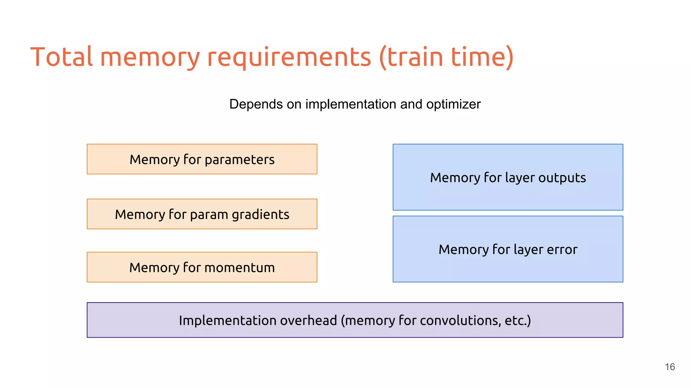
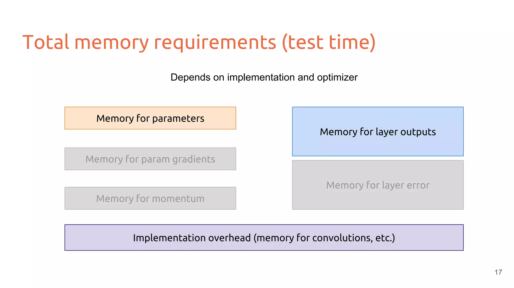
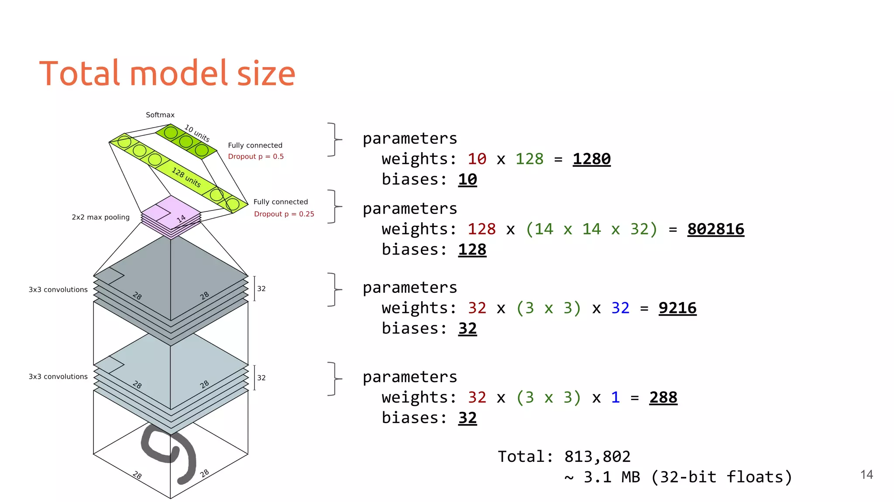
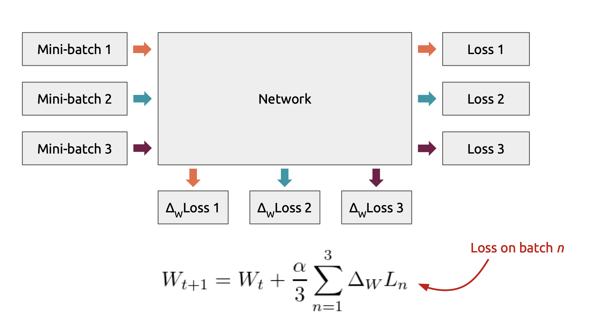
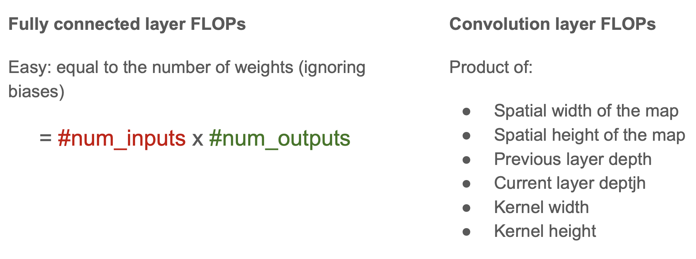
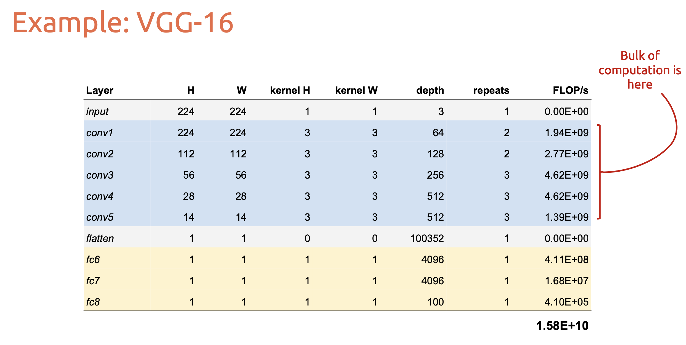

# utils

## GPU

!!! p "某某神经网络参数量有多少，大概占用多大的显存"

Estimating neural network memory consumption
● Mini-batch sizes and gradient splitting trick
● Estimating neural network computation (FLOP/s)
● Calculating effective aperture sizes

{width=80%}
{width=80%}

### Model size

> CNN
>
> !!! danger "per sample"
> {width=80%}
>
> !!! p "一个 filter 的深度(通道数)要和 input 的深度(通道数)一样"
> ==model size==
> 从下往上：
> Conv1: 32 个 filters \* ((3 \* 3 weight \* 1 depth)  + 1 bias)  per filter = 320 
> Conv2: 32 个 filters \* ((3 \* 3 weight \* 32 depth) + 1 bias) per filter = 9248 
> Fnn1: ((14 \* 14) \* 32 weight \* + 1 bias) per layer \* 128 layers = 802944 
> Fnn2: (128 weights + 1 bias) per layer\* 10 layers = 1290 
> Total = 320 + 9248 + 802944 + 1290 = 813804 
> If use 32-bit float : $813804\times4 \text{(bytes/float32)} \div1024\div1024\approx3.10M$ 
> ==intermedia output(parse layer)== 
> Input: 28W \* 28H \* 1D =  
> after Conv1: 28W \* 28H \* 32D = 25088 
> after Conv2: 28W \* 28H \* 32D = 25088 
> after Maxpool： 14W \* 14H \* 32D = 6272 
> after Fnn1: 128 
> after Fnn2: 10 = output

### optimization

In practice, we want to do mini-batch SGD:
● More stable gradient estimates
● Faster training on modern hardware
Size of batch is limited by model architecture, model size, and hardware memory. May need to reduce batch size for training larger models.
This may affect convergence if gradients are too noisy.

**GPU momory size:**

- GTX 980: 4GB
- Tesla K40: 12GB
- Tesla K20: 5GB

**Estimating computational complexity:**

==FLOPS | flop/s, Floating point operations per second== 衡量运算时计算性能，在使用浮点数科学运算时很有用。

在 deep NN 里的计算都被 FC & conv layers 里的**加乘 multiply-adds** 主宰，所以我们在估算计算复杂度的时候，可以直接 estimate the number of FLOPs (multiply-adds) in the forward pass。而忽略掉 非线性的操作、dropout、normalization layers...

> 
> 

**Refernce:**

- [Memory usage and computational considerations]
- [CNN 模型所需的计算力flops是什么？怎么计算？]

[Memory usage and computational considerations]:https://imatge-upc.github.io/telecombcn-2016-dlcv/slides/D2L1-memory.pdf
[CNN 模型所需的计算力flops是什么？怎么计算？]:https://zhuanlan.zhihu.com/p/137719986

