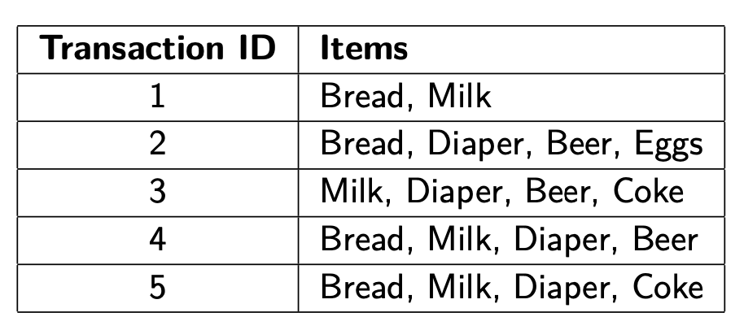
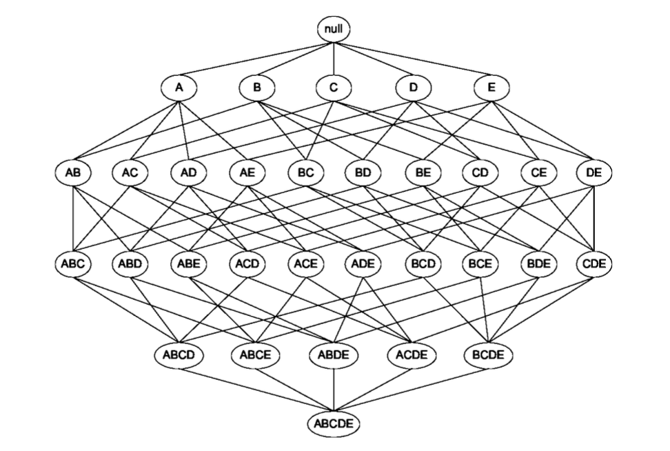
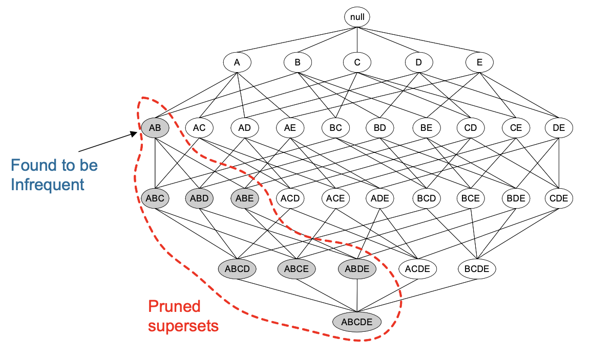
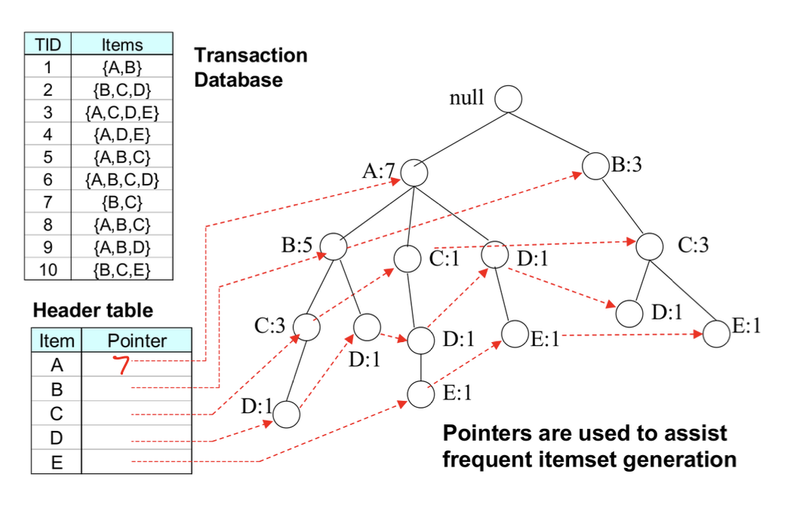

# Association Analysis

==Itemset==。A collection of one or more items. **k-itemset**: An itemset that contains k items.
==Support count σ==。 Frequency of occurrence of an itemset.
==Support s==。Fraction of transactions that contain an itemset.
==Frequent itemset==。An itemset whose support is greater than or equal to a “minsup” threshold.
==Confidence c==。Measures how often items in Y appear in records that contain X.

!!! p "Rules originating from the same itemset have identical support but can have different confidence."
    所以可以分开算。先算 support 后算 confidence。

==Association Rule==。An implication expression of form X to Y where X and Y are itemsets.
==Association Rule Mining Task==。Given a set of transactions T, the goal of association rule mining is to find all rules having

- support ≥ minsup threshold;
- confidence ≥ minconf threshold.

> > 
> >
> > Compute the support and confidence of the association rule {Milk, Diaper} → {Beer}.
>
> N = 5 = the total number of transactions
> σ({Milk, Bread, Diaper}) = 2.
> **Support** s({Milk, Bread, Diaper}) = $\frac{\sigma}{N}=\frac{2}{5}$
> Association Rule = {Milk, Diaper} -> {Beer}
> **Confidence** c=$\cfrac{\sigma(MDB)}{\sigma(MD)}=\frac{2}{3}$

## approach

- **Frequent Itemset Generation**: Generate all itemsets whose <u>support ≥ minsup</u>.
Given $d$ items, there are $2^d − 1$ possible candidate itemsets.

- **Rule Generation**: Generate <u>high confidence</u> rules from each frequent itemset.

==Brute-force approach== 暴力解。列出并求出全部。Computationally prohibitive!
Each frequent itemset of size $n$ leads to $2^n−2$ association rules X → Y. 每个item都有成为X和Y两种可能，然后减掉X或Y为空的两种情况。

==Apriori principle==

- {A} Non-frequenct, $\implies$ {AB}, {AC} 更严苛的要求一定是 Non-frequent.【itemset】【support】

- If a rule $\{X\} → \{Y−X\}$ does not satisfy the confidence threshold, then any rule $\{X′\} →\{Y−X′\}$ where $\{X′\}\sub\{X\}$. must not satisfy the confidence threshold as well.【rule】【confidence】

==Frequent Pattern (FP)-growth algorithm==
Using the data structure **FP-tree** to extract frequent itemsets directly. An FP-tree is a compressed representation of the input. 将相同点连接，逆向找寻

> > 
>
> search A: A=7
> search AB: 找B再看有没有A =5
> search AE：先找E再看看有没有A=1+1=2
