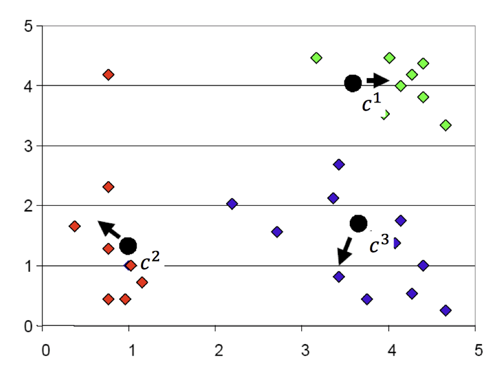

# 聚类, Clustering

==upsupervised==, ==distance sensitive==

Clustering is the process of dividing the entire data into clusters based on the patterns in the data.

1. all the data points **in a cluster** should be **similar** to each other.
2. the data points **from different clusters** should be as **different** as possible.


**application:**
根据付款历史的时间序列对现有客户进行分组/聚类，使类似的客户处于同一聚类中。

Maximize Inter-cluster distance
Minimize Intra-cluster distance
==Centroid==. 中心点

## similarities and distances

### point level

$d(X_i,X_j),\quad X\in\R^{p},i,j=1,\dots,n$

**requirements and properties:**

1. Symmetry $d(X_i,X_j)=d(X_j,X_i)$.
2. Positivity $d(X_i,X_j) > 0, X_i≠X_j$.
3. Identity $d(X_i, X_i) = 0$.
4. Triangle inequality $d(X_i , X_j ) ≤ d(X_i,X_k ) + d(X_k,X_j ).$

==Euclidean Distance==. $\sqrt{\sum\limits_{k=1}^p(X_{ik}-X_{jk})^2}$

==Canberra Metric==. $\sum\limits_{k=1}^p\cfrac{|X_{ik}-X_{jk}|}{X_{ik}+X_{jk}}$

==Minkowski Distance==. $\Big[\sum\limits_{k=1}^p|X_{ik}-X_{jk}|^m\Big]^{1/m}$

==Czekanowski Coefficient: signal-to-noise==.$1-\cfrac{\sum\limits_{k=1}^p\min(X_{ik},X_{jk})}{\sum\limits_{k=1}^p(X_{ik}+X_{jk})}$

### class level

|类簇 similarity||notes|
|--|--|--|
|单链接 single-linkage|$\min\limits_{x\in C_1, z\in C_2}\text{dis}(x,z)$|可以处理非椭圆形<br>对噪声和孤立点敏感|
|全链接 complete-linkage|$\max\limits_{x\in C_1, z\in C_2}\text{dis}(x,z)$|不易收到噪声和孤立点影响<br>趋向分裂为更大尺寸的类<br>偏向球形类|
|组平均 average-linkage|$\cfrac{1}{C_1C_2}\sum\limits_{x\in C_1}\sum\limits_{ z\in C_2}\text{dis}(x,z)$|^|


!!! danger "可不可以在监督性学习使用聚类？"
    ✅。可以创建聚类，在不同集群上构建单独的机器学习模型

## methods

| Non-hierarchical methods | K-means |  |
| --- | --- | --- |
| Hierarchical methods | Divisive hierarchical algorithms  | (start with a single cluster). |
| ^ | Agglomerative hierarchical algorithms |  (start with n clusters) |
| Gaussian mixture. |  |  |

### EM

!!! danger "EM不会陷于局部极小值 ❌"

### Hierarchical methods

#### Agglomerative hierarchical algorithms (start with n clusters)

1. Compute the proximity matrix ! Let each data point be a cluster. **Repeat**:
2. Merge the two closest clusters ! Update the ==proximity matrix== which defines the distances between each point
3. **Until**: only one single cluster remains.


> > Consider the following hypothetical distances matrix with group order (1); (2); (3); (4); (5), $D = (d_{ij}) = \begin{bmatrix}0\\9&0\\3&7&0\\6&5&9&0\\11&10&2&8&0\end{bmatrix}$

### K-means

==centroid-based==, ==distance-based==, ==a blind guess k clusters==


<div class="grid" markdown>
<figure markdown="span"></figure>
<figure markdown="span"></figure>
<figure markdown="span"></figure>
<figure markdown="span"></figure>
</div>

!!! p "能否保证找到最优解？"
    ❌。因为 Kmeans本身是一个NP问题，而且是非凸的，容易陷入局部最优。所以需要多次随机初始化中心点，然后选效果最好的，

**Target:**
minimize the distance between the points **within a cluster**.
minimize the sum of distances **between the points and their respective cluster centroid**.

**drawback:**

1. 计算量高，只能求到 local minimizer，不确定是不是 global
2. 根据原始随机的 centoid, different initials generate different solutions
because the local minimizer will be found for K-Means, some initials may converge at the same point, but some may converge in different local minimizers
3. May get bad results when points are distributed on manifold yet ambient distance is used.


#### Evaluating the choice of K

==Within Cluster Sum of Squares, WCSS==
$$WCSS = \sum_{i=1}^k\sum_{x_i\in C_i}\text{dist}(\text{Centoid}_i, x_i)^2$$
Then the ==Elbow Method== is then used to choose the best K value based on WCSS


#### Mathematical

$\Vert A \Vert_{F}=\sqrt{Tr(AA^T)}=\sqrt{\sum\limits_{i=1}^n\sum\limits_{j=1}^n\vert a_{ij}\vert^2}$

$M_{n,q}=\{M\in\R^{n\times p} : M \text{ has q distinct rows}\}$
**n**: #observation rows; **p**: #dimension; **q**: #clusters

$(c_1,\dots,c_n)^T=\min\limits_{M\in M_{n,p}}\Vert X_{n,p}-M\Vert_F^2\xleftarrow{大概}\begin{bmatrix}X_{n,p}\\x_1\in(1)\\x_2\in(2)\\\vdots\\x_n\in(1)\\\end{bmatrix}-\begin{bmatrix}M_{n,p}\\c(1)\\c(2)\\\vdots\\c(1)\\\end{bmatrix},(i):=\text{cluster i}$

Each row of Xn,p (i.e., each observation) can be viewed as a noisy version of some centroid ci. Final results rely on

1) how far away are the centroids from each other, and
2) how noisy are the observations from the centroid.

写起来数学公式很简单，但是我们并不知道哪个是属于哪个cluster的，如果有 k 个cluster的话，每个 observation 有 k 个选择，那么就会有 $k^n$ 种可能，在计算上是属于 high computational cost，这就是它的 drawback。所以我们就不会遍历所有的可能，我们往往就在 initial 的时 random 选择，这就导致我们极有可能走进 local minimizer

#### Steps


1. Pre-specifies the number of clusters K
2. Select k points as the initial centroids

   - ==random partitioning==. random nature will avoid bias. 对整个k-均值算法进行几次初始化，并从SSE最低的初始化中选择集群分配。
   - start with an additional set of starting points |
3. Re-assign and Re-calculate
Scan through the list of n items, assigning each item to the cluster **whose centroid (mean)** is closest. Each time the n items are reassigned we will **recalculate the cluster mean or centroid for the clusters.**
4. Repeat 2 until convergence.


**Stopping Criteria:**

1. Centroids of newly formed clusters do not change（理想，不仅分好了类，还找到中心
2. Points remain in the same cluster（完成任务，分好类才是我的核心任务
3. The maximum number of iterations is reached（没办法，已经尽人事了


#### Programming

`kmeanModel.inertia_` Sum of squared distances of samples to their closest cluster centre, weighted by the sample weights if provided. 样本到其最近的聚类中心的平方距离之和，如果提供的话，用样本权重进行加权。

`KMeans(n_clusters=k, random_state=r)`

`KMeans.fit(X).labels_` = `KMeans.fit_predict(X)`

```python
#@title 纯K-means
from sklearn.cluster import KMeans

kmeans_model = KMeans(n_clusters=k, random_state=)
kmeans_model = kmeans_model.fit(X)
y = kmeans_model.labels_
new_y = kmeans_model.predict(new_x)
cen = means.cluster_centers_
```

```python
#@title elbow to determine which k 肘部法

# Collecting the distortions into list
distortions = []
K = range(1,10)
for k in K:
    kmeanModel = KMeans(n_clusters=k)
    kmeanModel.fit(x)
    distortions.append(kmeanModel.inertia_)
# Plotting the distortions
plt.figure(figsize=(16,8))
plt.plot(K, distortions, 'bx-')
plt.xlabel('k')
plt.ylabel('Distortion')
plt.title('The Elbow Method showing the optimal clusters')
plt.show()
```

```python
#@title scatter plot 2D
# Visualising the clusters
plt.scatter(x[kmeans_predict == 0, 0], x[kmeans_predict == 0, 1], s = 100, c = 'red', label = 'Setosa')
plt.scatter(x[kmeans_predict == 1, 0], x[kmeans_predict == 1, 1], s = 100, c = 'blue', label = 'Versicolour')
plt.scatter(x[kmeans_predict == 2, 0], x[kmeans_predict == 2, 1], s = 100, c = 'green', label = 'Virginica')
# plt.scatter(x[kmeans_predict == 3, 0], x[kmeans_predict == 3, 1], s = 100, c = 'black', label = 'Another species')
# print(kmeans_model.cluster_centers_)

# Plotting the centroids of the clusters
plt.scatter(kmeans_model.cluster_centers_[:, 0], kmeans_model.cluster_centers_[:,1], s = 100, c = 'yellow', label = 'Centroids')

plt.legend()
plt.show()
```

```python
#@title scatter plot 3D
# Visualising the clusters
fig = plt.figure()
ax = Axes3D(fig)
ax.scatter(x[kmeans_predict == 0, 0], x[kmeans_predict == 0, 1], x[kmeans_predict == 0, 2], s = 10, c = 'red', label = 'Setosa')
ax.scatter(x[kmeans_predict == 1, 0], x[kmeans_predict == 1, 1], x[kmeans_predict == 1, 2], s = 10, c = 'blue', label = 'Versicolour')
ax.scatter(x[kmeans_predict == 2, 0], x[kmeans_predict == 2, 1], x[kmeans_predict == 2, 2], s = 10, c = 'green', label = 'Virginica')
# ax.scatter(x[kmeans_predict == 3, 0], x[kmeans_predict == 3, 1], x[kmeans_predict == 3, 2], s = 10, c = 'black', label = 'Another species')

print(kmeans_model.cluster_centers_)

# Plotting the centroids of the clusters
ax.scatter(kmeans_model.cluster_centers_[:, 0], kmeans_model.cluster_centers_[:,1], kmeans_model.cluster_centers_[:,2], s = 100, c = 'yellow', label = 'Centroids')

plt.legend()
plt.show()
```

[K-Means Clustering in Python: A Practical Guide – Real Python]
[sklearn.cluster.KMeans]
[The Ultimate Guide to K-Means Clustering: Definition, Methods and Applications]

[sklearn.cluster.KMeans]: https://scikit-learn.org/stable/modules/generated/sklearn.cluster.KMeans.html

[K-Means Clustering in Python: A Practical Guide – Real Python]: https://realpython.com/k-means-clustering-python/

[The Ultimate Guide to K-Means Clustering: Definition, Methods and Applications]:https://www.analyticsvidhya.com/blog/2019/08/comprehensive-guide-k-means-clustering/
