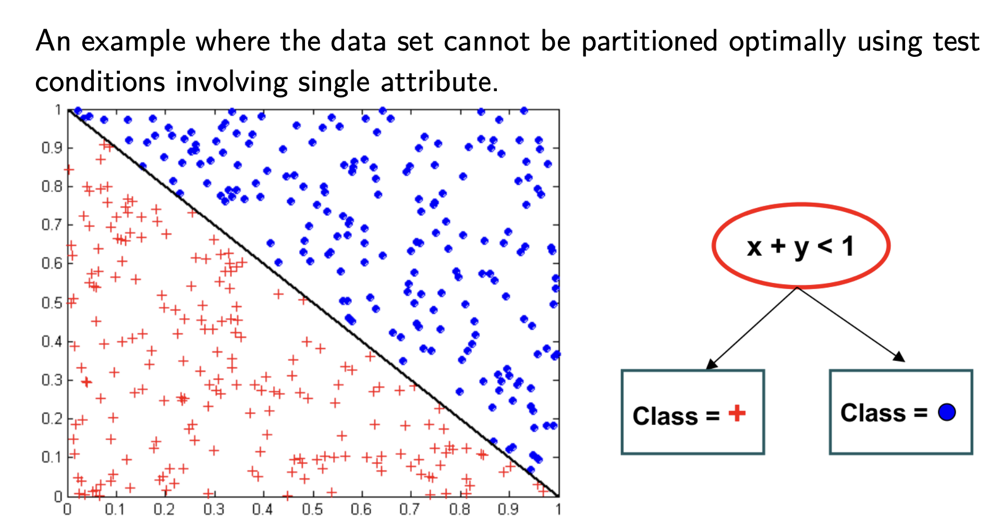

# 决策树

==A decision tree== allows a classification of an object by testing its values for certain properties.

策略：自顶而下，分而治之，递归

!!! danger "决策树没有 学习率"
!!! p ""
    已知训练集 $D=\{(x_1,y_1),\dots,(x_n,y_n)\}$ 属性集 $A=\{a_1,\dots,a_d\}$, 属性值集 $a_i^v=\{a_i^1,\dots,a_i^v\}$
    ```python
    def TreeGenerate(D, A):
        生成结点 node
        if ALL node.D 属于 一个类别 C:
            node = C 类叶结点  # 分类成功
            return
        if node.A == NULL or node.D 的样本的属性值都一样:
            node = node.D 中多数类 叶结点  # 不能再分
            return
        从 node.A 中选择最优划分属性 a_best
        for v in a_best:
            在 node 底下生成分支 node_by_v
            if node_by_v == NULL:  # 训练集里没有，但为了泛化性能
                node_by_v = node.D 中多数类 叶结点
                return
            TreeGenerate(D, A\{a_best})
    ```
    1. 叶子结点是样本所属的类别
    2. 递归结束：标记叶结点 ==- 如何判定：叶子结点==
       1. 结点包含分类全属一类： **分类成功，赋类值**
       2. 结点的属性集A为空，结点包含的所有样本在该结点的所有属性值取值相同：**无法划分，赋该结点多数类的类值**，当前结点的后验分布。
       3. 结点的样本集D为空：**不能划分，赋该父结点多数类的类值**，把父结点的样本分布当作当前结点的先验分布

优点：

- 非参数方法，不要求任何先验假设，不假定类和属性服从一定概率分布
- 对噪声数据鲁棒性强
- 能表示为多条 if-then 的决策规则，可解释性强
- 分类速度快，最坏情况下是 O(depth)
  
缺点：

- 叶结点实例数目太小
- 对离散值较好，但连续值的模拟表达不够
- 决策树有重复多次的子树，因为纯靠单个属性来分，在属性空间的不同部分多次使用同一个属性来划分

!!! p "如何处理：缺失值，连续变量"
    {width=80%}

## 如何度量：最佳划分

==impurity, 不纯度==，分支结点所包含样本的归属的度量指标。impurity ⬇️，类分布越倾斜。
==Information Gain==. **不纯度的降低程度**：确定划分效果的度量标准：最大化增益$\Delta$
$$\max_{I}\Delta_{I}=I(\text{parent})-\sum_{i=1}^k\cfrac{N(j)}{N}I(j)\\
\Leftrightarrow \min_I\sum_{i=1}^k\cfrac{N(j)}{N}I(j)$$
$k$: 该属性不同取值的种类数
$I(\text{parent})$: 父结点的不纯度, $N$ 父结点的样本数
$I(j)$: 第 j 个子结点的不纯度, $N(j)$ 第 j 个子结点的样本数

### impurity

|Impurity||DT|
|--|--|--|
熵 Entropy |$p(i)\log_2p(i)$|ID3
^|引入分裂信息|C4.5
Gini|$p(j)^2$|CART
误分类率|$\max_ip(i\|t)$|

!!! warning "不同的准则可能导致不同的答案"

#### 熵 Entropy = ID3 ➡️  C4.5
$$\text{Ent}(t)=-\sum_{i=1}^cp(i)\log_2p(i)$$
- $0\log_20=0$
- $\max=0.5 \text{ 均匀分布，}\min=0 \text{仅属于一个类}$

attri|“High Entropy”|“Low Entropy”
|--|--|--|
Variable distribution | uniform-like |many peaks and valleys
histogram| Flat | many lows and highs
information|less predictable Less information | more predictable More information


<div class=box2>
<div class="pic1">
    
</div>

<div class="pic1">
    
</div>
</div>

缺点：偏好选择具有较多属性值的属性 **高熵分裂，大量小部分**

💡证明**将结点划分为更小的后续结点，结点熵一定会减少或者维持不变**。
根据定义可知，熵越大，类分布越均匀；熵越小，类分布约倾斜。假设原结点属于各个类的概率相同(真实分布)，熵=1，则分出来的后续结点在各个类上均匀分布，各个后续结点的熵=1，加权后熵 🟰。假设原结点属于各个类的概率不一样，分出来的后续结点不均匀地分布在各个类上，则此时的分类比原有的分类更不均匀，所以熵 ⬇️

##### C4.5
为了惩罚**高熵分裂的属性**，引入 **分裂信息 split information** 的项 $-\sum\limits_{j=1}^kp(j)\log_2p(j)$ 作为分母，阻碍选择属性值均匀分布的属性。$p(j)$:当前结点中划分属性第j个属性值所占有样本的比例。

$$\begin{align*}
\text{GainRatio}(t)&=\cfrac{\Delta_I}{-\sum\limits_{j=1}^kp(j)\log_2^p(j)}\\
&=\cfrac{\sum\limits_{i=1}^cp_p(i)\log_2p_p(i)-\sum\limits_{j=1}^c\cfrac{N(j)}{N}\cdot\sum\limits_{i=1}^cp_j(i)\log_2p_j(i)}{-\sum\limits_{j=1}^kp_p(j)\log_2p_p(j)}\end{align*}$$

- <u>Q:</u> 当划分属性在当前结点中几乎相同的属性值时，会导致增益无定义或者非常大(分母非常小甚至为0)。偏好选择具有较少属性值的属性。
    A：启发式方法。先计算每个属性的信息增益及平均值，然后仅对信息增益高于平均值的属性应用增益率度量。

#### Gini 基尼系数

$$\text{Gini}(t)=1-\sum_{j=1}^kp(j)^2$$

**proof: 平均分配 1/2 worst**
假设有两类 $\text{Gini}(t)=1-x^2-(1-x)^2=2x-2x^2$
$\frac{b}{2a}=\frac{1}{2}$ 开口向下，此时是最高点。

#### 误分类率
$$\text{Error}(t)=1-\max_ip(i|t)$$
- $\max=1-\frac{1}{c} \text{ 均匀分布，}\min=0 \text{仅属于一个类}$

> > node: +:5; -:1
>
> $\text{Gini}(t)=1-\frac{1}{6}^2-\frac{5}{6}^2=0.278$
> $\text{Ent}(t)=-\frac{1}{6}\log_2\frac{1}{6}-\frac{5}{6}\log_2\frac{5}{6}=1.650$
> $\text{Error}(t)=1-\frac{5}{6}=0.167$
> > node: +:3, -:3
>
> $\text{Gini}(t)=1-\frac{1}{2}^2-\frac{1}{2}^2=0.5$
> $\text{Ent}(t)=-\frac{1}{2}\log_2\frac{1}{2}-\frac{1}{2}\log_2\frac{1}{2}=1$
> $\text{Error}(t)=1-\frac{1}{2}=0.5$
>
> > Exercise. Consider the following data set for a binary class problem.
> > (a). Calculate the **entropy** gain when splitting on A and B. Which attribute would the decision tree induction algorithm choose?
> > (b). Calculate the gain in the **Gini** index when splitting on A and B. Which attribute would the decision tree induction algorithm choose?
> > A F T T F T F F F T F
> > B T T T T T F F F T T
> > L + + + − + − − − − −
> > I 1 2 3 4 5 6 7 8 9 10
>
> A T:7(+:4;-:3) F:3(+:0;-:3)
> B T:4(+:3;-:1) F:6(+:1;-:5)
> Entropy
> $\text{Ent}(A)=\frac{7}{10}(-\frac{4}{7}\log_2\frac{4}{7}-\frac{3}{7}\log_2\frac{3}{7})+\frac{3}{10}\times0=0.6897$ (smaller $\implies A$)
> $\text{Ent}(B)=\frac{2}{5}(-\frac{3}{4}\log_2\frac{3}{4}-\frac{1}{4}\log_2\frac{1}{4})+\frac{3}{5}(-\frac{1}{6}\log_2\frac{1}{6}-\frac{5}{6}\log_2\frac{5}{6})=0.7145$
> Gini
> $\text{Gini}(A)=\frac{7}{10}(1-\frac{4}{7}^2-\frac{3}{7}^2)+\frac{3}{10}\times0=\frac{12}{35}$
> $\text{Gini}(B)=\frac{2}{5}(1-\frac{3}{4}^2-\frac{1}{4}^2)+\frac{3}{5}(1-\frac{1}{6}^2-\frac{5}{6}^2)=\frac{19}{60}$ (smaller $\implies B$)

### performance

**Not too small**: need to handle important but possibly subtle distinctions in  data
**Not too big**: Computational efficiency (avoid redundant, spurious attributes),Avoid over-fitting training examples
==Occam’s Razor==: find the simplest hypothesis (smallest tree) that fits the  observations.  **The best decision tree** is the smallest one that correctly classifies all given examples.

#### 过拟合

over-fitting due to

- presence of noise
- lack of representative samples

|策略||定义|
|--|--|--|
剪枝|pre-pruning|在算法完美划分训练数据前就停止树的生长（基于性能，比较软性
^|post-pruning|允许树过度拟合训练数据，然后对树进行后修剪。更成功
把复杂度加入考量|使用一个明确的标准来衡量决策树的复杂度（决策树的深度，比较硬性

- 后剪枝通常比预剪枝保留更多的<u>分支数</u>。
- 后剪枝的<u>欠拟合风险</u>更小，<u>泛化性能</u>通常优于预剪枝。
- 后剪枝是在生成完全决策树之后进行，并且要自底向上地对树中所有非叶结点进行逐一考察，<u>训练时间</u>远大于预剪枝。

#### 预剪枝, pre-pruning

- 结点实例数目小于预定义的阈值
- 实例类分布与属性值相互独立 $\leftarrow\Chi^2$检验
- 当前结点的扩展不能减小不纯度

#### 后剪枝, post-pruning

- 自上而下修剪
- 若剪枝改善泛化误差，则改结点代替子树
- 子树的叶实例的主要类确定节点的类标签
- 在后剪枝使用 MDL，最小描述长度

## 多变量决策树 multivariate decision tree

若我们把每个属性是为坐标空间的一个坐标轴，则d个属性值描述的样本对应了d维空间的一个具体的数据点，对样本的分类 其实是在这个样本空间中寻找不同类样本之间的分类边界。

<div class="pic1"></div>

||单变量 DT| 多变量 DT|
|--|--|--|
分类边界| 轴平行<br> 分类边界由若干个【与坐标轴平行的分段】组成|斜的，曲线
分类指标：|单个属性|属性的线性组合
^|为每个非叶结点找一个最优划分属性|$\sum\limits_{i=1}^dw_ia_i$
表现|在真实分类边界较为复杂的情况下，需要大量的属性测试和很深的决策树才能获得较好的近似|模型简单，但较难解释
