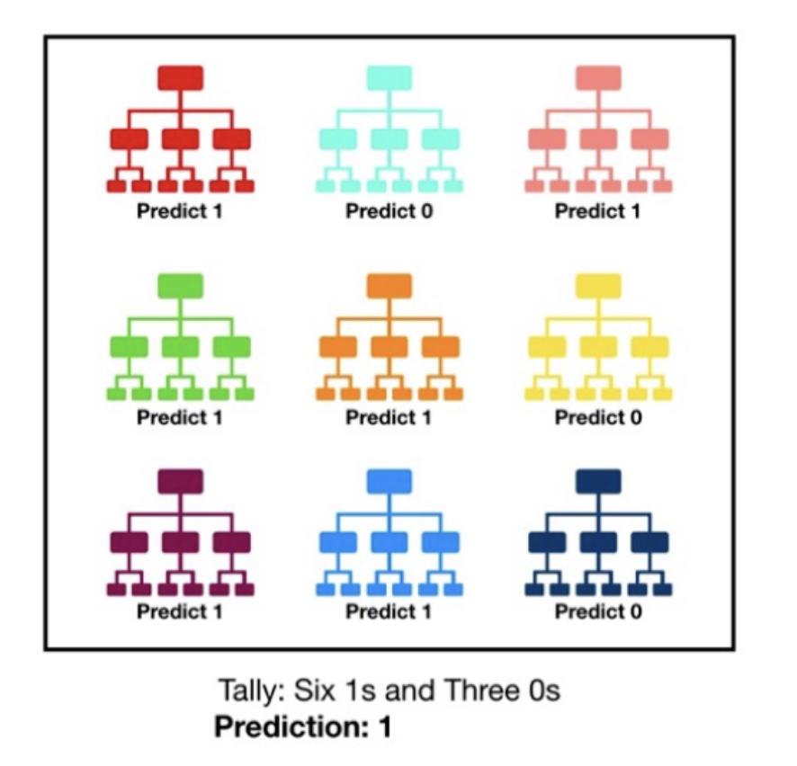

# 集成学习

将多个分类器的结果统一成一个最终的决策。其中的每个单独的分类器称为==基分类器==， 有时又被称为==弱分类器==，因为基分类器的错误率要大于集成分类器

## Content

**步骤：**

1. **找到误差互相独立的基分类器**
任何分类模型都可以作为基分类器，但**树形模型**由于结构简单且较易产生随机性所以比较常用
2. **训练基分类器**
3. **合并基分类器的结果**

### stacking & voting

==voting,投票==

||硬投票分类器|软投票分类器|
|--|--|--|
|各个弱分类器结果|最终选择的类别|每个类别的估算概率|
|最后结果|得票最多的|平均估算概率最大的|

==stacking,串行==

把前一个基分类器的结果输出到下一个分类器最终的输出
将所有基分类器的输出结果相加（或用更复杂的算法融合，比如把各基分类器的输出作为特征，使用逻辑回归作为融合模型进行最后的结果预测）

## Bagging & Boosting

||Bagging | Boosting|
|--|--|--|
||ramdom forest| Gradient Boosting Tree|
||单独学习，单独判断，投票决策|迭代思想，样本权重，加强学习|
|样本选择|训练集是在原始集里<u>有放回</u>选取，随机相互独立|训练集<u>不变</u> 每个样本的<u>权重根据上一轮的分类结果进行调整</u>|
|样本权重|均匀采样，权重相等|根据错误率来调整，错误率越多的样本权重越大|
|每个弱分类器|权重相等=1|分类误差小的会有更大的权重|
|训练方式|并行计算|串行训练  只能顺序生成每个弱分类器，因为后一个的参数需要前一轮的结果|
|消除基分类器的偏差和方差的角度来理|多次采样并分别训练出多个不同模型 减小方差。|提高分类器的表达能力 减小偏差|

!!! warning "Boosting 的一个优点是不会过拟合 ❌   boosting & bagging 都是组合多个分类器投票的方法，两者都是根据单个分类器的正确率确定其权重 ❌"

### Bagging

训练集分为若干子集，每个基分类器单独学习，单独判断，投票集体决策
当训练样本数量较少时，子集之间可能有交叠.学的内容可以重叠

#### RF

==Random forest== is a classification algorithm consisting of many decisions trees. It creates an **uncorrelated** forest of trees whose prediction by **committee** is more accurate than that of any individual tree.
==bagging== & ==feature randomness==

{width=50%}

### Boosting

基分类器层层叠加，每层训练对前一层的分错的样本给予更高权重，根据各层分类器的结果的加权得到最终结果。

- 对分类正确的样本**降低权重**
- 对分类错误的**样本升高或者保持权重不变**。
- 模型融合的过程中，也根据错误率对基分类器进行==加权融合==。错误率低的分类器拥有更大的“话语权”。

#### Adaboost

ID3决策树作为基分类器

!!! warning "所有错分的样本的权重更新比例相同"

!!! p "欠拟合"
    - 提高估算器的数量
    - 降低估算器的正则化超参数
    - 尝试稍微提高学习率

> > 考虑如下图的训练样本，用 Adaboost 进行分类，进行两轮迭代。在 Boosting 的每次迭代中，选择加权错误率最小的弱分类器。假设采用的弱分类器是为平行两个坐标轴的线性分类器。  1. 标出第一次迭代选择的弱分类器，用圆圈标出在第一次迭代后权重最大的样本，求出它的权重。  2. 第一次迭代后权重最大的样本在第二次迭代后权重变为多少？  3. 强分类器为弱分类器的加权组合，则在这些点中，存在被经过第二次迭代后的强分类器错分类的样本吗？给出简短理由。
> > 给定如图所示的训练数据假设弱分类器由 $x<v,x>v$ 产生，其阈值 $v$ 使该分类器在训练集上分类误差率最低。试用 Adaboost 学习一个强分类器。

#### GBDT， Gradient Boosted，梯度提升决策树

**核心思想:**每一棵树学的是之前所有树==结论和的残差==，这个残差就是一个加预测值后能得真实值的累加量。

使用残差继续学习，就是GBDT中Gradient Boosted所表达的意思。

> > GBDT
> > target: 预测视频网站用户年龄来进行年龄段推送
> > 特征：用户的访问的时长、时段、观看的视频的类型等。
> > 用户A真实是 25。
>
> Tree1 gt = 25, pred = 22, residual = 25-22 = 3
> Tree2 gt = 3, pred = 5, residual = 3-5 = -2
> Tree3 gt = -2, pred = -2, residual = 0
> Succeed, 22 + 5 + (-2) = 25. <u>将所有基分类器的输出结果相加</u>
