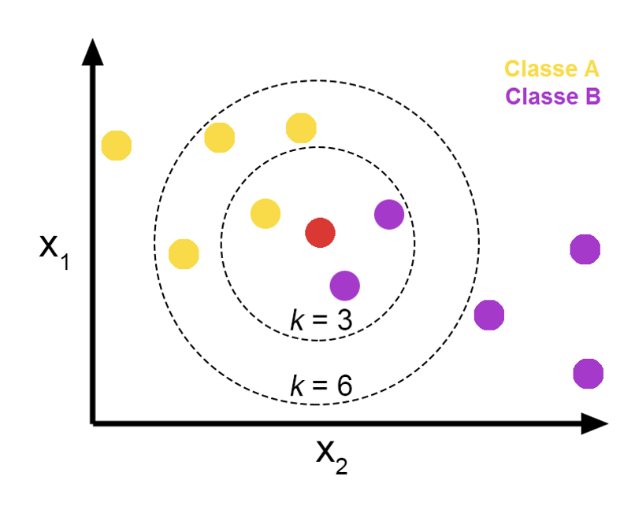
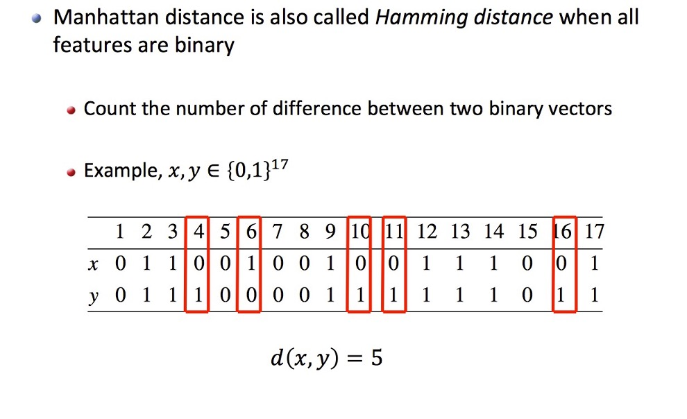
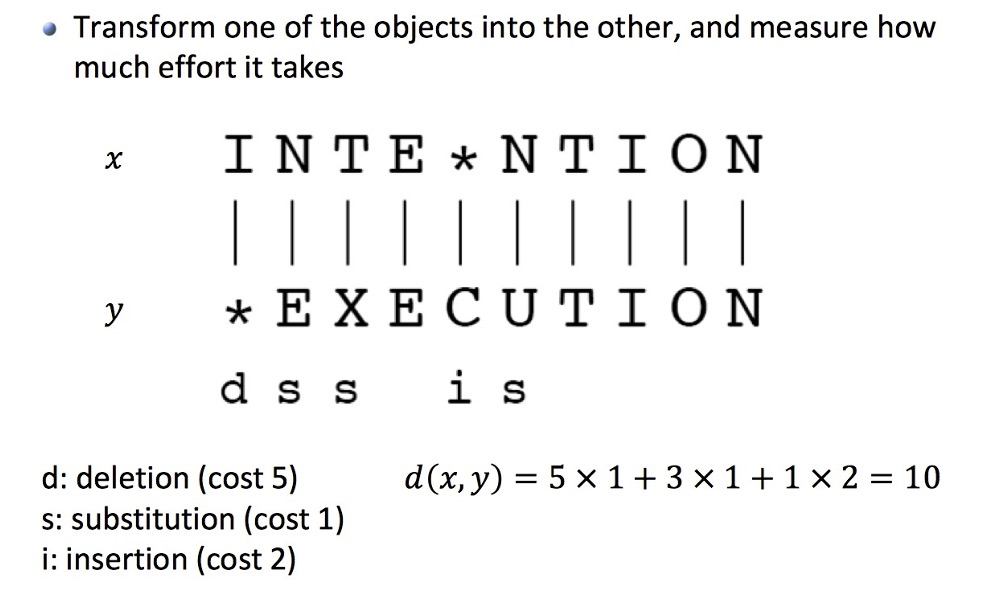
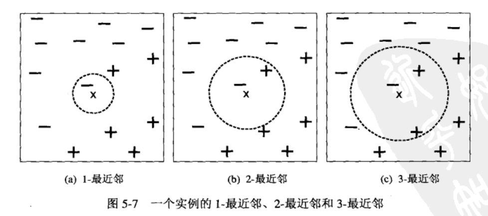

# KNN, K近邻

==lazy==, ==nearest==, ==non-parametric supervised==
[什么是 k 最近邻算法？ | IBM]

==k-NN== is a type of classification where the function is only approximated **locally** and all computation is deferred until function evaluation.

{width="40%"}

!!! p lazy learning
    1. 直接记住整个训练集，占用了更多的内存和数据存储。
    2. 不需要训练模型，但是在测试时time-consuming
    3. focus on real data,
    4. 局部逼近

## 距离 - similarity $d(\hat{x},x_i)$

|关系型数据|文本数据|
|--|--|
|欧氏距离|余弦相似度(cosine similaritv)|

||||
|--|--|--|
|L1 Manhanttan|$d_{L1}(a, b)=\sum\limits_{i=1}^n\vert a_i-b_i\vert$||
|L2, Euclidian|$d_{L2}(a, b)=\sqrt{\sum\limits_{i=1}^n(a_i-b_i)^2}$||
|Minkowski|$d_{Lp}(a, b)=\sqrt{\sum\limits_{i=1}^n(a_i-b_i)^2}$||
| inf-dis| $\max\|a_i-b_i\|$||

{width="60%"}

==Hamming Distance==

{width="60%"}

==edit distance==

{width="60%"}

## 多数表决

优点：build any decision boundary，更灵活

### Origin - Depend on k

$$y^*=\max\limits_u\sum\limits_{(x_i,y_i)\in D(\hat{x},\hat{y})}I(\hat{y}=y_i)$$

$D(\hat{x},\hat{y}):=$ the list of k nearest neighbors of $(\hat{x},\hat{y})$
$I(\hat{y}=y_i):=$ the indicator of $\{\hat{y}\}=y_i$

### Weighted -  Considering the distance

$$y^*=\max_u\sum\limits_{(x_i,y_i)\in D(\hat{x},\hat{y})}w_i\cdot I(\hat{y}=y_i)$$
$w_i:=$ considering the importance of distance

1. 能消除孤立噪声点

#### choices of w

$w= \cfrac{1}{d(\hat{x},x_i)}$, 越远就越不相似，他的类别就不重要

## list of K

!!! danger "k 很重要"
    |too small|too large|
    |--|--|
    |噪声敏感 <br> allergic to noises| the distance may be ignored so that the opposite points are included
    

1. 如果是odd
2. 如果是even，相当的时候random

k的选择是通过一个验证集合 ,或者是在训练集上交叉检验。即兴试一此不同k选择那个在验证集(或交叉检验)上最准确的k作为最后的结果。

### Parameter tuning：k

## 实现

``` python
import numpy as np

class NearestNeighbour():
    
    def __init__():
        self.objs = None
        self.labels = None
        
    def train(self, objs: List[obj], labels: List[str]):
        self.objs = objs
        self.labels = labels

    def predict(self, obj):
        distances = abs(self.)
```

[什么是 k 最近邻算法？ | IBM]:https://www.ibm.com/cn-zh/topics/knn
