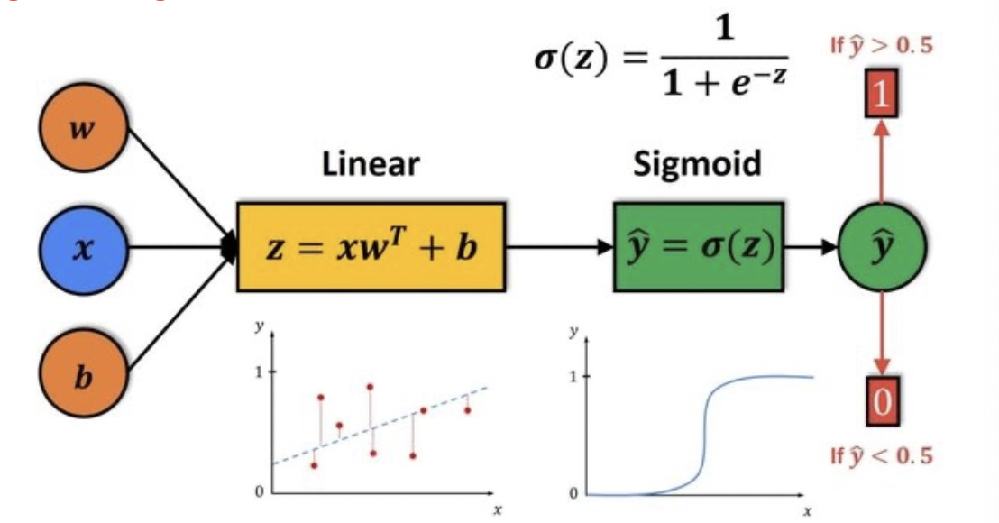
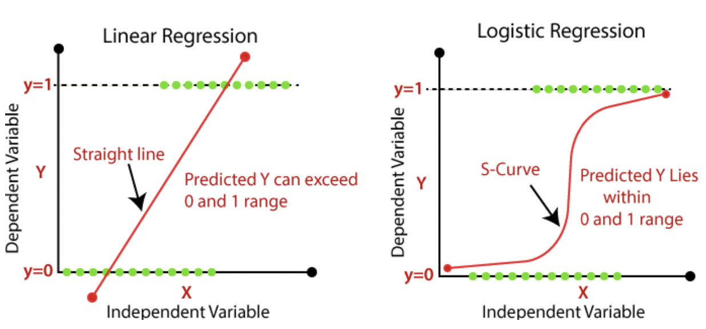

# Logistics Regression

!!! p "Logistic (Linear Regression)"
    <u>Sigmoid Function (S型函数，在机器学习特指 Logstic Function)</u>
    ```mermaid
    graph LR
    A[Linear R<br>regression]--Sigmoid+threshold--> B[Logistics R<br>classification]
    ```
    {width="60%"}

- 📑 ref
  - [浅析机器学习：线性回归 & 逻辑回归]
  - [Link Functions and Errors in Logistic Regression - The Analysis Factor]

## Background

在二分类 0-1 问题. Y 随机服从 **the binomial distribution**.

$$
Y ∼B(p(X,\tilde β)),\quad\begin{cases}P(Y =1|X)=p(X,\tilde β)\\  P(Y =0|X)=1−p(X,\tildeβ)\end{cases}\\
\begin{align*}
E(Y|X)&=1*P(Y=1|X)+0*P(Y=0|X)\\
&=p(X,\tilde\beta) = P(Y=1|X)  
\end{align*}
$$

**How to build $p(X, \tilde \beta)$?**
既然 Y 服从这么一个二项分布，那么 $p(X,\tilde\beta)$ 是什么？很显然它是关于一个 X 的函数，同时it is characterized by a custom $\beta$. So roughly speaking, it's like we have a set of X, but the event happens with a certain probability and this probability can be captured by a function of X and the function of X is also characterized by sudden beta.

💡 : 最简单的 linear regression，但

||linear regression|$p(X,\tilde\beta)$要求| Logistic Regression|
|--|--|--|--|
|1️⃣ 取值范围|infinity to infinity|$\in[0,1]$|Sigmoid|
|2️⃣ output|continuous|categorical|Threshold【based on LSM】|

### LR 的角度

#### Sigmoid

==Logistic Function(Sigmoid)==。 $y=\cfrac{1}{1+e^{-x}}\begin{cases}\lim\limits_{x\rightarrow-\infin}=0\\\lim\limits_{x\rightarrow+\infin}=1\end{cases}$

$\log\cfrac{p}{1-p}=a+X^T\beta\\\implies p(X,\tilde\beta) =\cfrac{\exp(a+X^T\beta)}{1+\exp(a+X^T\beta)},\tilde\beta=(a,\beta)$

- why Sigmoid?
  我们想 **map the continuous output space into a new 离散的 categorical 的 output space。**
  我们自然想到了 unit-step Function 单位跃迁函数。但是单位跃迁函数不连续不可微。所以我们又往前走了走，想到 <u>Sigmoid Function (S型函数，在机器学习特指 Logstic Function)</u>。
  至于为什么要使用 Sigmoid 函数中的对数几率函数，这涉及到伯努利分布的指数族形式，最大熵理论等

<figure class="span"><p> add sigmoid</p></figure>

所以 **A regularized Regression：
Linear Regression + LSM -》 Logistic Regression + 0.5**

#### threshold α

!!! p "Based on LSM."
    ==Least Minimum Method==。$\mathcal{L}_i=\Vert Y_i-f(X_i,\theta)\Vert^2,$ with target : condition Mean $E\{Y|X\}$

    in classification : $\small E\{Y|X\}=P\{Y=1|X\}$

    就是说这个 estimation 的生成的 estimator 其实就是E\{Y|X\}，在同等概率的01二分类里的 meaning 是 label=1 的概率，所以我们将 threshold 定位0.5。但是当不是两者不是同等概率，就需要使用 ==MLE==进行估计

$$\hat{y}=\begin{cases}0&P\{Y=1|X\}<0.5\\1&P\{Y=1|X\}>0.5\end{cases}$$

## Content

==Logistic Regression==.
$$P(Y=1|X)=p(X,\tilde\beta) =\cfrac{\exp(a+X^T\beta)}{1+\exp(a+X^T\beta)},\tilde\beta=(a,\beta)$$

### 极大似然角度去估计

$\begin{cases}P(Y = 1|X = X_i) = p(X_i,\tildeβ),\\ P (Y = 0 | X = X_i ) = 1−p( X_i , \tildeβ )\end{cases}\xrightarrow{\text{unified as}}$
$$P(Y=Y_i|X=X_i)=\{p(X_i,\tilde\beta)\}^{Y_i}\{1-p(X_i,\tilde\beta)\}^{1-Y_i}$$

当样本独立 + $\tilde\beta=(1 ,\beta_1,\dots,\beta_p)$

the likelihood function $L(\tilde β) = \prod\limits_{i=1}^n p(X_i,\tilde β)^{Y_i}\{1−p(X_i,\tilde β)\}^{1−Y_i}$

log-likelihood function $l(\tilde β)=\log L(\tilde β) = \sum\limits_{i=1}^n \{Y_i\tilde\beta^T\tilde X_i-\log(1+\exp(\tilde\beta^T\tilde X_i))\}$

Using MLE, $\hat\beta = \max\limits_{\tilde\beta} \mathcal{L}(\tilde\beta) = \min\limits_{\tilde\beta} -l(\tilde\beta)$

### compared with Linear R

==Linear R==$. Y=X^T\beta+\red\epsilon=\beta_0+\beta_1X_1+\dots+\beta_pX_p+\red\epsilon$
==Logistic==. $\mathbb E(Y|X)=X^T\beta=\beta_0+\beta_1X_1+\dots+\beta_pX_p$
**Logistic regression does not have error ε, but Linear regression**. Logistic 不是用预测均值加一个误差项对Y的每个值进行建模，而是简单地对预测均值进行建模，换言之是在给定值X处的均值。这是回归线上的值。

|比较|Linear R<br>$y=X^T\beta+\epsilon$ | Logistic R|
|--|--|--|
|Q|回归|分类|
|建模的角度|测Y的每个单独值 | 只预测平均值 $P(Y=1\|X)$|
|从计算的角度说|$\mathbb{E}\epsilon = 0$| $p(X,\tilde\beta)=P(Y=1\|X)=\mathbb{E}(Y\|X)$|
|参数估计方法|最小二乘法MSE|极大似然法MLE|

- 线性回归和逻辑回归都是**广义线性回归模型的特例**
- 线性回归无联系函数或不起作用，逻辑回归的联系函数是**对数几率函数**，属于Sigmoid 函数

[浅析机器学习：线性回归 & 逻辑回归]:https://zhuanlan.zhihu.com/p/39363869

[Link Functions and Errors in Logistic Regression - The Analysis Factor]:https://www.theanalysisfactor.com/link-functions-and-errors-in-logistic-regression/
