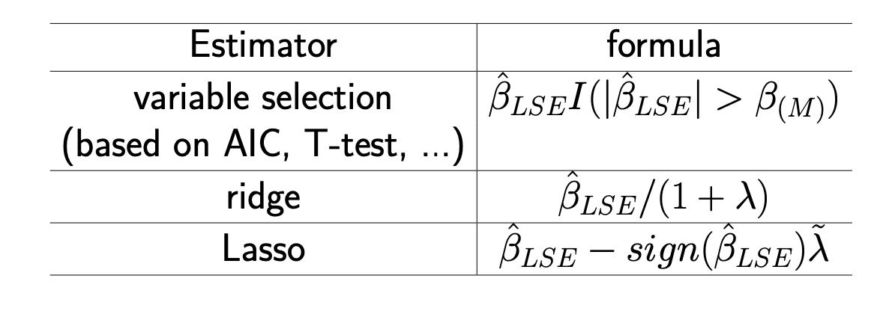

# LRs

==多重回归==.包含了多个变量的回归

## Problem Setting

$$y =β_0 +β_1x_1 +...+β_px_p +ε=\red{\beta^Tx}+\epsilon\\\quad\begin{cases}x_1,\dots,x_p:&\text{Predictors, }\red{\text{independent}}\text{ variable, covariates}\\Y:&\text{Response, dependent variable
}\\\epsilon:&\text{noises, error}\end{cases}$$

$$\begin{cases}Y_1=\beta_0+\beta_1x_{1,1}+\dots+\beta_{p}x_{1,p}+\epsilon_1\\Y_2=\beta_0+\beta_1x_{2,1}+\dots+\beta_{p}x_{2,p}+\epsilon_2\\\vdots\\Y_n=\beta_0+\beta_1x_{n,1}+\dots+\beta_{p}x_{n,p}+\epsilon_n\end{cases}\\\iff\begin{bmatrix}Y_1\\\vdots\\Y_n\end{bmatrix}=\begin{bmatrix}1&x_{1,1}&\dots&x_{1,p}\\\vdots\\1&x_{n,1}&\dots&x_{n,p}\end{bmatrix}\begin{bmatrix}\beta_0\\\beta_1\\\vdots\\\beta_p\end{bmatrix}+\begin{bmatrix}\epsilon_1\\\vdots\\\epsilon_n\end{bmatrix}\\=\begin{bmatrix}x_1^T&\dots& x_n^T\\\end{bmatrix}\beta+\Xi,x_i=\begin{bmatrix}1\\x_{i1}\\\vdots\\x_{ip}\end{bmatrix},\beta=\begin{bmatrix}\beta_0\\\beta_1\\\vdots\\\beta_p\end{bmatrix},\Xi=\begin{bmatrix}\epsilon_1\\\vdots\\\epsilon_n\end{bmatrix}$$

$$\iff Y=\red{X\beta}+\Xi,Y\in\R^n,X\in\R^{n\times(p+1)},\beta\in\R^{p+1},\Xi\in\R^n$$

**Assumptions** (for statistical inference)

- **predictor $x_i$ is usually assumed to be non-random.**
已经被观察到了，所以是一个值，"the independent variable is an observed value (so its value is known)"，我们研究的是对一个已知的x，y的条件分布 Y｜X
- 关于误差的 assumption：
    - $\red{ε_1,\dots,\epsilon_n}$ **are independent**
    - $\red{Eε_1 =Eε_2 =...=Eε_n =0\iff E\Xi\in\R^n=0}$
        - the model has to be identifiable.
        如果没有这个假设，那么不同的模型之间只是存在一个常数 C 级别上的不同，并没有本质区别，但是在在讨论的时候就容易存在差异，感觉有点像是规定了规定，才能更好的基于统一背景下讨论。
    - $\red{Var(ε_1)=...=Var(ε_n)=σ^2\iff Var(\Xi)=\sigma^2I\in\R^n}$
    这个是不一定的，在heterogeneous数据里，这个没怎么听懂

    !!! warning "期望和方差做 assumption 不等同于 指定分布 $\mathbb{E}(\epsilon)=0 + Var(\epsilon)=\sigma^2\neq\epsilon ~Ν(0,\sigma)$"
        有些书是assume $ε_1,ε_2,..ε_n\in~N(0, σ), i.i.d$,是否指定分布取决于我们想干什么
        线性回归残差满足正态分布只是一种假设，目的是使得后续对估计量的推断 inference 能够利用正态分布的性质。？因为在满足正态假设的前提下，hypothesis testing &confidential interval 比较容易
        做OLS并得出回归系数的无偏估计这一过程本身而言，并不需要分布假设，也就是说，即使Y的取值为 0、1（binary），我们仍然可以做OLS线性回归，得出回归系数的无偏估计，但此时，残差显然不服从正态分布，因此也就不能对回归系数做 wald test。
- $\red{\text{centered X}\in\R^{n\times(p+1)}, \mathbb{E}x=0,Var(X)=\Sigma\in\R^{(p+1)\times (p+1)}}$
- $\red{\mathbb{E}Y =0}$

$$β^∗ =\min_\beta \frac{1}{2}\red{\mathbb{E}}(Y − x^Tβ)^2, \colorbox{aqua}{\text{(Convex in β)}}$$

**常规思路：**
$\cfrac{\partial}{\partial\beta}f(\beta)=\mathbb{E}\big(x(Y-x^T\beta)\big)\xlongequal{SET}0\\[1em]\implies \beta^*=\mathbb{E}(x^Tx)^{-1}\mathbb{E}(xY)=\Sigma^{-1}Cov(x,Y)=Var(x)^{-1}Cov(x,Y)$

## Linear Regression

$$y = w^Tx+b$$

!!! p "estimate parameter using ==Least Squares Estimation, LSE=="

$$
\begin{align*}\hat{\beta}_{LSE}&=\min\limits_{\beta}\sum\limits_{i=1}^n(Y_i-\hat{Y_i})^2\\&=\min\limits_\beta\sum\limits_{i=1}^n\{Y_i-(\beta_0+\beta_1x_{i1}+\dots+\beta_px_{ip})\}^2\\
&\xlongequal{X(\text{population level})}\min\limits_\beta\sum\limits_{i=1}^n\{Y_i-X_i^T\beta\}^2\\
&\xlongequal{\mathbb X(\text{empirical level})}\min\limits_\beta(Y-\mathbb X\beta)^T(Y-\mathbb X\beta)\end{align*}\\Y\in\R^n,\mathbb X\in\R^{n\times(p+1)},\beta\in\R^{p+1}
$$

$$
\cfrac{\partial}{\partial\beta}(Y-\mathbb X\beta)^T(Y-\mathbb X\beta)=\mathbb X^T(Y-\mathbb X\beta)\xlongequal{SET}0\\[1em]\hat{\beta}_{LSE}=(\mathbb X^T\mathbb X)^{-1}\mathbb X^TY
$$

!!! p "如果 $\mathbb X$ 有被 centered，那么用 LSE 对参数进行估计，**本质上其实也是对样本方差 variance 和 correlation between features and response 的估计，这又回归到在高维空间里去. estimate is difficult**"
    $$\hat{\beta}_{LSE}=(\mathbb X^T\mathbb X)^{-1}\mathbb X^TY=(\cfrac{\mathbb X^T\mathbb X}{n})^{-1}\cdot \cfrac{\mathbb X^T Y}{n}=Var(\mathbb X)\cdot Cov(\mathbb X, Y)$$

**requirements:**

- X必须列满秩，$r(X)=p+1,n≥p+1$
$r(\mathbb X)=r(\mathbb X^T\mathbb X)=p+1 \iff (\mathbb X^T\mathbb X)^{-1} \text{exists}$

**properties:**

- $\hat{\beta}_{LSE}$ is unbiased $\mathbb E(\hat\beta_{LSE})=\beta$
- $Var(\hat\beta_{LSE})=\sigma^2(\mathbb X^T\mathbb X)^{-1}$
- $\hat{Y}$  is a linear function of Y.  $\iff \hat{Y}_{LSE}=X\hat{\beta}_{LSE}=X(X^TX)^{-1}X^TY$.
从这角度来卡，LR 就是使用了所有的observations
- ==residual sum of squares, RSS== $=\sum\limits_{i=1}^n\{Y_i-\hat{Y}_i\}^2$ RSS表示拟合模型后Y的变化仍然不能被X的变化解释的部分 $\hat{\sigma}^2=\cfrac{RSS}{n-p-1}$

### Graphical

Suppose $\mathbb{X}^T\mathbb{X}$ is **inverible**.
$\hat{Y}=\mathbb{X}\hat{\beta}\implies$ $\hat{Y}$ is an ==orthogonal projection image== of $\hat{Y}$ on the image of $\mathbb{X}$.  
$\hat{\epsilon}=Y-\hat{Y}$

### inference of LR model

!!! warning "更强的 assumption: $\Xi～N(0,\sigma^2I)(\text{i.e. correct model got})$"
    指定了 $\Xi$ 的分布，我们才能在此基础上推 distribution of $\hat\beta_{LSE}$ , 才能进行 hypothesis testing. 以下由此进行推断：

这里存在一点狭义：这里的 $\beta$ 是从包括1，也就是$\beta\in\R^{p+1}$, 为了更对称和完整，就直接用对应的分量 k对k来看，也就是说 $\hat\beta_0～N(1, c_{0,0}\sigma^2)$, start form 0.

$$
\begin{align*}&\hat{\beta}_{LSE}～N(\beta,(\mathbb X^T\mathbb X)^{-1}\sigma^2)&\tag{vector}\\&\hat\beta_k～N(\beta_k,c_{k,k}\sigma^2)&\tag{分量}\\&\hat\beta_k-\beta_k～N(0, c_{k,k}\sigma^2)\end{align*}
$$

$\qquad\begin{cases}c_{k, k}:=\text{ the  (k,k) entry of } (\mathbb X^T \mathbb X)^{-1}\\\sqrt{c_{k,k}\hat{\sigma}^2}:=\text{ the standard error of }\beta_k\\t_k=\cfrac{\hat{\beta_k}}{\sqrt{c_{k,k}\hat{\sigma}^2}}:=\text{ the t-statistic for } \beta_k\\P(|T|>|t_k|):=\text{ the p-value for }\beta_k,T～t(n-p-1)（自由度）\end{cases}$

- $\Xi～N(0,\sigma^2I)(\text{i.e. correct model got})\implies \hat{\beta}～N(\beta,c_{k+1,k+1}\sigma^1)$

> At significant level 0.05 (when n is large), $H_0=\beta_k=0$

{width=60%}

#### Confidence interval for the regression function

**【Uncentralized】** For a subject with predictor $X = (1, x_1, ..., x_p)^T$and response Y. fitted linear regression model $Y= β_0 +β_1x_1 +...+β_px_p+ ε$. the regression $\mathbb{E}Y=β_0 +β_1x_1 +...+β_px_p$ is a function of $X=(1,x_1,\dots,x_p)^T$

The estimator of $\mathbb{E}Y$ is $\mathbb{E}\hat{Y}=\hat β_0+\hat β_1x_1+...+\hat β_px_p=\mathbb X^T\hat β$

$$
\mathbb{E}Y～N\Big(\mathbb{E}\hat{Y},\sigma^2\mathbb X^T(\mathbb X^T\mathbb X)^{-1}\mathbb X\Big)
$$

The 95% confidence interval (CI) for EY is
$\Big[\mathbb{E}\hat{Y}-1.96\sigma\sqrt{ X^T(\mathbb X^T\mathbb X)^{-1} X}, \mathbb{E}\hat{Y}+1.96\sigma\sqrt{X^T(\mathbb X^T\mathbb X)^{-1}X}\Big]$
or approximately
$\Big[\mathbb{E}\hat{Y}-1.96\hat\sigma\sqrt{ X^T(\mathbb X^T\mathbb X)^{-1}X}, \mathbb{E}\hat{Y}+1.96\hat\sigma\sqrt{ X^T(\mathbb X^T\mathbb X)^{-1} X}\Big]$

**【Centralized】** For general p ≥ 1, If x and Y are both centralized，$\tilde x=x-\overline x, \tilde Y=Y-\overline Y$

- $\implies\beta_0=0\implies \tilde X=(\tilde x_1,\dots,\tilde x_p)\in\R^p$

fitted linear regression model $\tilde Y = β_1\tilde x_1 +...+β_p\tilde x_p+ \tilde ε$

the regression $\mathbb{E}(\tilde Y)=β_1\tilde x_1 +...+β_p\tilde x_p$ is a function of $\tilde X=(\tilde x_1,\dots,\tilde x_p)^T$

The 95% confidence interval (CI) for EY is

$\Big[\mathbb{E}\hat{\tilde{Y}}-1.96\tilde\sigma\sqrt{\tilde {X}^T(\tilde {\mathbb X}^T\tilde {\mathbb X})^{-1}\tilde {X}}, \mathbb{E}\hat{\tilde{Y}}+1.96\tilde\sigma\sqrt{\tilde X^T(\tilde {\mathbb X}^T\tilde {\mathbb X})^{-1}\tilde { X}}\Big]$

To see the contribution of each predictor on $\tilde Y$ , we can fix all the other variables at 0.
For example, the contribution of $\tilde x_1\xrightarrow{SET}\hat{\tilde Y}=\beta_1\tilde x_1+\beta_2\times0+\dots+\beta_p\times 0$
The 95% confidence interval (CI) for $E\tilde Y$ is
$\Big[\widehat{E\tilde Y}-1.96\tilde\sigma\sqrt{\tilde {\chi}^T(\tilde {\mathbb X}^T\tilde {\mathbb X})^{-1}\tilde {\chi}}, \space \widehat{E\tilde Y}+1.96\tilde\sigma\sqrt{\tilde \chi^T(\tilde {\mathbb X}^T\tilde {\mathbb X})^{-1}\tilde { \chi}}\Big],\chi=(\tilde x_1,0,\dots,0)^T$

Equivalence between hypothesis testing $H_0 : β_k = 0”$ and the band: After the data is centralized, we accept $H_0\iff$
$$0\in\Big[\hat{\beta}_k-1.96\hat{\sigma}\sqrt{c_{kk}}, \hat{\beta}_k+1.96\hat{\sigma}\sqrt{c_{kk}}\Big]$$

$$\iff0\in\Big[\widehat{E\tilde Y}-1.96\tilde\sigma\sqrt{\tilde {\chi}^T(\tilde {\mathbb X}^T\tilde {\mathbb X})^{-1}\tilde {\chi}}, \space \widehat{E\tilde Y}+1.96\tilde\sigma\sqrt{\tilde \chi^T(\tilde {\mathbb X}^T\tilde {\mathbb X})^{-1}tilde { \chi}}\Big]$$

where $\chi=(0,\dots,1,\dots,0)^T$. the kth element is 1 and the others 0.
This means 0 is included in the band at $x_k=1$. On the other hand, (0,0) is included in the band. Therefore, $H_0$ is accepted if and only if a horizontal line is included in the band.

==the confidence band==

**All the predicted expectations of Y and the bounds of the CI** are functions of x.
We can draw these functions and get the confidence band. 就是所有的置信区间值都画出来

!!! warning "不同于 conformal prediction interval（这个是囊括百分之九十五的数据点）,  confidence band 是说预测的数据 fitted value 有百分之九十五的可能被囊括"

<div class="grid" markdown>
<figure markdown="span"><p>uncentralized<br>$\hat{EY}=\hat\beta_0+\hat\beta_1x$</p></figure>

<figure markdown="span"><p>centralized<br>$\hat{EY}=\hat\beta_0+\hat\beta_1x$</p></figure>
</div>


==causal inference 因果推断==.是在一个较大系统内部确定指定现象的实际、独立效果的过程。因果推断和相关性推断的主要区别是前者分析结果变量在其原因变量变化时发生的回应。

==干扰因素 (Confounding)==. 又称为干扰因子、干扰变量、混淆变量、共变因等，在统计学和因果关系中是指会同时影响自变量和因变量，导致出现伪关系的一种变量。在不严谨的语境下，干扰因子也可以指所有未知变量，包括中介变因和对撞变因。干扰因子会造成伪关系，是相关不蕴涵因果的原因之一。
[Implementing Causal Inference: Trying to Understand the Question of Why]
[线性回归残差是否一定满足正态分布？ - 知乎]
[What does the assumption: "The independent variable is not random." in OLS mean?]

[Implementing Causal Inference: Trying to Understand the Question of Why]: https://towardsdatascience.com/implementing-causal-inference-a-key-step-towards-agi-de2cde8ea599
[What does the assumption: "The independent variable is not random." in OLS mean?]: https://stats.stackexchange.com/questions/462173/what-does-the-assumption-the-independent-variable-is-not-random-in-ols-mean
[线性回归残差是否一定满足正态分布？ - 知乎]: https://www.zhihu.com/question/489283459

!!! p "Assumption: both X and Y are centralized and standardized(scaled) (接下来都是基于这个设定来统一一下)"

## 广义线性模型

==generalized linear model 广义线性模型==。$g(*):=$联系函数 link function
$$y=g^{-1}(w^Tx+b)$$

> 当 y 不是线性变化，而是在指数尺度上变化
> $\ln y=w^Tx+b\Leftrightarrow g(*)=\ln(*)$
> 将指数曲线投影到一条直线上。

## 正则化 Regularization

==$L_p$ - Norm==。 $\Vert w\Vert_p=(\sum\limits_{i=1}^dx_i^p)^{1/p}$

!!! warning "针对的是 row"

避免过拟合的产生和减少网络误差
正则化的作用是选择**经验风险与模型复杂度同时较小**的模型。

### Ridge Regression  - L2 penalty

#### Background

**Why we need Ridge Regression ↔ Understanding of Ridge Regression?**

==the estimator $\hat{\beta}$ of LSE== $\hat\beta_{LSE}= (\mathbb X^T\mathbb X)^{-1}\mathbb X^T\mathbb Y$ exists only if $(\mathbb X^T\mathbb X)^{-1}$
exists.
However, $\hat\beta_{LSE}$  does not exist $\iff (\mathbb X^T\mathbb X)$ is not invertible:

1. $\mathbb X\in\R^{n\times p}, p>n$
2. the columns in $\mathbb X$ are linearly dependent.

<u>**idea 1: guarantee the invertibility**</u>
A simple way to **guarantee the invertibility** is to add **a diagonal matrix $I\in\R^{p\times p}$** to $\mathbb X^T\mathbb X$。 (加单位矩阵 λI 这个不止用在 linear regression)
$\implies\hat\beta_{\text{ridge}}= (\mathbb X^T\mathbb X+\lambda I)^{-1}\mathbb X^T\mathbb Y,\quad \lambda>0$
这也能避免一个问题就是当 eigenvalue is too small 0.00001 的时候， inverse 就会变超大 100000，导致说这个 more in-stable，在类似 using Newton Method 需要顾及 variance inverse 的时候 converge more slowly。我加一个 small lambda = 0.01，整个就会 around 在100左右

<u>**idea 2: regularize the coefficients**</u>
**FOR:** If the βs are unconstrained, they can explode and are susceptible to very high variance. 爆炸，容易受到非常高的方差影响 Thus, we need to regularize the coefficients.

**approach 1: penalize the value of beta:**
Using penalty approach
==L2- Norm==. $\Vert w\Vert_2=(\sum\limits_{i=1}^dx_i^2)^{1/2}=\sqrt{w^2}$
$\beta^*(\lambda):=\min\limits_\beta\sum\limits_{i=1}^n(Y_i-X_i^T\beta)^2+\lambda(\beta_1^2+\dots+\beta_p^2),\quad\lambda>0$
$\iff \beta^*(\lambda):=\min\limits_\beta \Vert\mathbb Y-\mathbb X\beta\Vert^2+\lambda\Vert\beta\Vert^2,\quad\lambda>0$
$\implies\hat\beta_{\text{ridge}}= (\mathbb X^T\mathbb X+\lambda I)^{-1}\mathbb X^T\mathbb Y,\quad \lambda>0$

1. if $λ → ∞ \implies \hatβ^*(λ) → 0;$
2. if $λ = 0\implies\hat \beta^*(λ) =\hat β_{LSE} ;$

**approach 2: constrain the value of beta:**
$\beta^*[t]:= \min\limits_{\beta}\sum\limits_{i=1}^n (Y_i-X_i^T\beta)^2,\quad s.t.\space\sum\limits_{j=1}^p\beta_j^2\le t \iff \text{ L2 norm}$
$\iff \beta^*[t]:=\min\limits_\beta \Vert\mathbb Y-\mathbb X\beta\Vert^2,\quad s.t.\space\Vert\beta\Vert^2\le t$

1. if $t = 0\implies \hat β^*[t] = 0$;
2. if $t ≥ \Vert\hat β_{LSE} \Vert^2 = t_0 \implies\hatβ^* [t] = \hatβ_{LSE};$

**The Penalty approach and the Constraint approach are equivalent and t and λ have a kind of inverse relationship.** $t=\Vert\hat\beta^*(\lambda)\Vert^2\implies\beta^*(λ)=\beta^*[λ]$

**approach 3: Data augmentation approach:**
$\beta^*(\lambda):=\min\limits_\beta\sum\limits_{i=1}^n(Y_i-X_i^T\beta)^2+\lambda(\beta_1^2+\dots+\beta_p^2),\quad\lambda>0$
Rewrite it:
$\min\limits_\beta\sum\limits_{i=1}^n(Y_i-X_i^T\beta)^2+(0-\tilde X_{n+1}^T\beta)^2+\dots+(0-\tilde X_{n+p}^T\beta)^2=\Vert  \tilde{ \mathbb Y}-\tilde{\mathbb X}\beta\Vert^2\\[1ex]\qquad\tilde X_{n+1}=(\sqrt\lambda,0,\dots,0)^T,\dots,\tilde X_{n+p}=(0,\dots,0,\sqrt\lambda)^T$

$\tilde{\mathbb X}=\begin{bmatrix}x_{1,1},&x_{1,2}&\dots&x_{1,p}\\x_{2,1},&x_{2,2}&\dots&x_{2,p}\\\vdots\\x_{n,1},&x_{n,2}&\dots&x_{n,p}\\\sqrt\lambda&0&\dots&0\\0&\sqrt\lambda&\dots&0\\\vdots&&\ddots\\0&0&\dots&\sqrt\lambda\end{bmatrix}_{(n+p)\times p}=\begin{bmatrix}\mathbb X\\\sqrt\lambda I_p\end{bmatrix},\tilde{\mathbb Y}= \begin{bmatrix}Y_1\\\vdots\\Y_n\\0\\\vdots\\0\end{bmatrix}_{(n+p)}= \begin{bmatrix}\mathbb Y\\0_p\end{bmatrix}$
$\implies \hat{\tilde\beta}_{LSE}=(\tilde{\mathbb X}^T\tilde{\mathbb X})^{-1}\tilde{\mathbb X}^T\tilde{\mathbb Y}\\[1ex]\qquad\qquad=(\begin{bmatrix}\mathbb X^T&\sqrt\lambda I_p\end{bmatrix}\times\begin{bmatrix}\mathbb X\\\sqrt\lambda I_p\end{bmatrix})^{-1}\begin{bmatrix}\mathbb X^T&\sqrt\lambda I_p\end{bmatrix}\begin{bmatrix}\mathbb Y\\\sqrt\lambda 0_p\end{bmatrix}\\[1ex]\qquad\qquad=(\mathbb X^T\mathbb X+\lambda I)^{-1}\mathbb X^T\mathbb Y$

#### Content

==the estimator $\hat\beta$ of Ridge Regression, Ridge==
$\hat\beta_{\text{ridge}}= \min\limits_\beta\Vert \mathbb Y-\mathbb X\beta\Vert^2+\red{\lambda\Vert\beta\Vert^2}=(\mathbb X^T\mathbb X+\lambda I)^{-1}\mathbb X^T\mathbb Y,\quad \lambda>0,$

**Properties** of ridge regression (assuming  $\mathbb X$ is nonrandom):

1. a **biased** estimator, $\begin{cases}\mathbb{E}\hat\beta_\text{ridge}=\beta-\lambda(\mathbb X^T\mathbb X+\lambda I)^{-1}\beta\\[1ex]\text{bias}(\hat\beta_\text{ridge})=-\lambda(\mathbb X^T\mathbb X+\lambda I)^{-1}\beta\end{cases}$
proof

$$\begin{align*}
\mathbb{E}\hat{\beta}&=\mathbb{E}\Big\{(\mathbb{X}^T\mathbb{X}+\lambda I)^{-1}\mathbb{X}^T\mathbb{Y}\Big\}\\
&\xlongequal{\mathbb{Y}=\mathbb{X}\beta+\epsilon}\mathbb{E}\Big\{(\mathbb{X}^T\mathbb{X}+\lambda I)^{-1}\mathbb{X}^T(\mathbb{X}\beta+\epsilon)\Big\}\\
&=\mathbb{E}\Big\{(\mathbb{X}^T\mathbb{X}+\lambda I)^{-1}\mathbb{X}^T\mathbb{X}\beta\Big\}+\mathbb{E}\Big\{(\mathbb{X}^T\mathbb{X}+\lambda I)^{-1}\mathbb{X}^T\epsilon\Big\}\\
&=(\mathbb{X}^T\mathbb{X}+\lambda I)^{-1}\mathbb{X}^T\mathbb{X}\beta+(\mathbb{X}^T\mathbb{X}+\lambda I)^{-1}\mathbb{X}^T\mathbb{E}\epsilon\\
&\xlongequal{\mathbb{E}\epsilon=0}(\mathbb{X}^T\mathbb{X}+\lambda I)^{-1}\mathbb{X}^T\mathbb{X}\beta\\
&\xlongequal{+1-1}(\mathbb{X}^T\mathbb{X}+\lambda I)^{-1}(\mathbb{X}^T\mathbb{X}+\lambda I)\beta-(\mathbb{X}^T\mathbb{X}+\lambda I)^{-1}\lambda\beta\\
&=\beta-(\mathbb{X}^T\mathbb{X}+\lambda I)^{-1}\lambda\beta\neq\beta
\end{align*}$$

$bias=\red{\beta}-\mathbb{E}\hat{\beta}$

$Var=\mathbb{E}(\red{\hat{\beta}}-\mathbb{E}\hat{\beta})^2$

1. Variance-covariance matrix
$\text{if }Var(\mathcal{E})=\sigma^2I_n\implies Var(\hat\beta_\text{ridge})=(\mathbb X^T\mathbb X+\lambda I)^{-1}\mathbb X^T\mathbb X(\mathbb X^T\mathbb X+\lambda I)^{-1}\sigma^2$
proof

$$\begin{align*}
Var(\hat\beta_\text{ridge})&=\mathbb{E}\Big\{(\hat{\beta}_\text{ridge}-\mathbb{E}\hat{\beta}_\text{ridge})^2\Big\}\\
&=\mathbb{E}\Big\{\big((X^TX+\lambda I)^{-1}\mathbb{X}^T\mathbb{Y}-\mathbb{E}(X^TX+\lambda I)^{-1}\mathbb{X}^T\mathbb{Y}\big)^2\Big\}\\
&\xlongequal[\mathbb{Y=X}\beta+\epsilon]{\mathbb{E\epsilon=0}}\mathbb{E}\Big[(\mathbb{X}^T\mathbb{X}+\lambda I)^{-1}\mathbb{X}^T\epsilon\Big]^2\\
&=\mathbb{E}\Big[(\mathbb{X}^T\mathbb{X}+\lambda I)^{-1}\mathbb{X}^T\epsilon\epsilon^T\mathbb{X}(\mathbb{X}^T\mathbb{X}+\lambda I)^{-1}\Big]\\
&=(\mathbb{X}^T\mathbb{X}+\lambda I)^{-1}\mathbb{X}^T\mathbb{E}\Big[\epsilon\epsilon^T\Big]\mathbb{X}(\mathbb{X}^T\mathbb{X}+\lambda I)^{-1}\\
&\xlongequal{Var(\epsilon)=\sigma^2I}\sigma^2\cdot(\mathbb{X}^T\mathbb{X}+\lambda I)^{-1}\mathbb{X}^T\mathbb{X}(\mathbb{X}^T\mathbb{X}+\lambda I)^{-1}
\end{align*}$$

##### λ := the shrinkage parameter - ridge

 1. **controls** the **size** of the coefficients, 它仅仅是调整参数的大小，并没有删去特征
 2. **controls** the amount of regularization
 $\lambda \rightarrow \begin{cases}0&\hat\beta_{ridge} =\hat\beta_{LSE}\\\infin&\hat\beta_\text{ridge}=0\end{cases}，\qquad λ\uparrow, Bias\uparrow,Var(\beta_{ridge})\downarrow$

每一个  λ 可以求出一个 $\hat\beta_{ridge} \iff$ the solution is indexed by the parameter λ。
对每一个 lambda 我们都能 画出它的 ==solution path==.  λs trace out **a path of solutions**

<div class="grid" markdown>
<figure markdown="span">{width=60%}<p>coefficients paths</p></figure>

右图是根据课上 centralized and standardized diabetes data 画出来的<br>$y=\beta_1x_1+\dots+\beta_{10}x_{10}+\epsilon$<br>一共有10个 $β_i$, 每一条线对应的是一个 $β_i$ <br>随着 λ 增大，logλ 增大，每一个 β 的绝对值都有不同程度的减少。当 λ 到达一个绝对大的值，所有的 β 都被收缩至 0.
</div>

<div class="grid" markdown>
<figure markdown="span">{width=80%}<p>coefficients paths</p></figure>

Except for t = 0, in the other cases none of the coefficient is zero
</div>

$\beta^*[t]:=\min\limits_\beta \Vert\mathbb Y-\mathbb X\beta\Vert^2,\quad s.t.\space\Vert\beta\Vert^2\le t$

!!! p "How to choose λ?  How to compare the different λ?"
    **a tuning parameter needs to be chosen**. 作为人为设定的参数，它是可调参的

**via CV:**

We select a large range for possible $λ\in [0, c]$. For each fixed λ in [0, c], consider the CV as follows. For each j,

$$\hatβ_{ridge}^j(λ) = (\sum\limits_{i≠j} X_i^TX_i + λI)^{−1} \sum\limits_{i≠j} X_i^TY_i.$$
The prediction error for $(X_j ,Y_j)$ is  $err^j(\lambda)=(Y_j-X_j\hat\beta_{ridge}^j(\lambda))^2$
The CV value is then $CV(\lambda)=n^{-1}\sum\limits_{j=1}^nerr^j(\lambda)$
$\implies\lambda^* = \min\limits_{\lambda}CV(\lambda)$

<figure markdown="span">{width="80%"}<p>The best λ is the minimum point of CV(λ). </p></figure>

### Lasso - L1 penalty, Least Absolute Shrinkage and Selection Operator

!!! p "这比估计所有确切值要容易得多，因为估计非常小的东西需要你需要很多信息，因为你必须增加样本量。否则，你无法正确估计一些弱信号，但一旦我们将3个信号定位为零，定位它们的位置就更容易了。我们确实牺牲了一些东西，"

==L1- Norm== $\Vert w\Vert_1=(\sum\limits_{i=1}^d|x_i|)=|w|$
==the estimator $\hat\beta$ of Lasso Regression, lasso==
$\hat\beta_{\text{lasso}}(\lambda):= \min\limits_\beta\sum\limits_{i=1}^n(\{Y_i-\sum\limits_{j=1}^pX_{ij}\beta_j\}^2+\lambda\red{\sum\limits_{j=1}^p|\beta_j|}=\min\limits_\beta\Vert Y-X\beta\Vert^2+\red{\lambda\Vert\beta\Vert_1}\\[1em]\qquad\hat\beta_{\text{lasso}}[\lambda]:= \min\limits_\beta\sum\limits_{i=1}^n(\{Y_i-\sum\limits_{j=1}^pX_{ij}\beta_j\}^2, \quad \red{\sum\limits_{j=1}^p|\beta_j|\le t}\iff \red{\Vert\beta\Vert_1\le t}$

The two approaches are also **equivalent**:
$$\hat\beta_{lasso}[\Vert\hat\beta_{lasso}(\lambda)\Vert_1]=\hat\beta_{lasso}(\beta)$$

==sparsity==. Because of the nature of the constraint, with letting t sufficiently small (or λ sufficiently large),  Lasso will cause **some of the coefficients to be exactly zero**. 对 Lasso 来说，他确实在产生0，所以 $\hat\beta_{lasso}$ is sparse 稀疏的，那么这就可以进行 variable selection

!!! question "那如果在lasso之后把beta为0的特征值扔掉之后再LSE的准确率会一样吗？"

#### λ := the shrinkage parameter -lasso

==t==

1. 如果 t 足够大到 $\sum\limits_{i=1}^p|{\hat\beta_{LSE}}_j|=\Vert\hat\beta_{LSE}\Vert_1=t_0\le t\implies\hat\beta_{lasso}=\hat\beta_{LSE}$
2. 如果 $t = 0\implies \Vert\beta\Vert_1=0\implies\hat\beta_{lasso}=0\implies$no variable is selected
3. $s:= \cfrac{t}{t_0}=\cfrac{t}{\Vert\hat\beta_{LSE}\Vert_1}=\begin{cases}0\iff t = 0 \implies\text{no variables selected}\\1\iff t = t_0\implies\hat\beta_{lasso}=\hat\beta_{LSE}\end{cases}$
4. it also inherits the properties of ridge regression and sometimes have more efficient estimator ——— exactly 0

**with CV:** Usually, 5-fold or 10-fold CV is used.

```r
mycv = cv.glmnet(x, y, lambda, type.measure, nfolds)
plot(mycv) 
# to plot the CV values against lambda

mylasso = glmnet(x, y, family, alpha, nlambda = 100, lambda=NULL, 
    standardize = TRUE, intercept=TRUE, standardize.response=FALSE)
plot(mylasso): 
# to plot the path of the estimated coefficients against t

mypred = predict(mylasso, newx, type=c(”link”,”response”, ”coefficients”,”nonzero”,”class”))
```

`mycv = cv.glmnet(x, y, lambda, type.measure, nfolds)`

- input
    - x: matrix of design of n×p
    - y: response y as in glmnet.
    - lambda=: Optional user-supplied lambda sequence; **default is NULL, and glmnet chooses its own sequence**
    - nfolds=: number of folds - **default is 10,** nfolds=n is the delete-one-observation CV.
- output
    - `mycv$cvm`: the mean cross-validated error - a vector of length(lambda).
    - `mycv$cvsd`: estimate of `the` standard error of cvm.
    - `mycv$cvup`: upper curve = cvm+cvsd.
    - `mycv$cvlo`: lower curve = cvm-cvsd.
    - `mycv$nzero`: number of non-zero coefficients at each lambda.
    - `mycv$lambda.min`: value of lambda that gives minimum cvm.
    - `mycv$lambda.1se`: vlargest value of lambda such that error is within 1 standard error of the minimum.

`mylasso = glmnet(x, y, family, alpha, nlambda = 100, lambda=NULL, standardize = TRUE, intercept=TRUE, standardize.response=FALSE)`

- input
    - x: input matrix, of dimension $n\times p$; each row is an observation vector.
    - y: response variable.
    - `family`: Response type, different generalized linear regression model
        - `gaussian` linear regression model
        - binomial”,”poisson”, ”multinomial”,”cox”,”mgaussian”)
    - `alpha`: The elasticnet mixing parameter, with 0 ≤ α ≤ 1. The penalty is defined as
    $(1-\alpha)/2\Vert\beta\Vert_2+\alpha\Vert\beta\Vert_1\rightarrow\alpha = \begin{cases}1&\text{ lasso(default)}\\0 &\text{ ridge}\end{cases}$
    - `nlambda`: the number of lambda values - default is 100. 用来生成 solution path
    - `lambda`: a user supplied lambda sequence.
    - `standardize` = TRUE( default) / FALSE. Logical flag for X variable standardization, prior to fitting the model sequence. The coefficients are always returned on the original scale.
    - `intercept`: Should intercept(s) be fitted (default=TRUE) or set to zero (FALSE)
    - `dfmax`: Limit the maximum number of variables in the model. Useful for very large p, if a partial path is desired.
- output
    - mylasso$a0: Intercept sequence of length length(lambda)
    - mylasso$beta: all the estimated β with different λs.
    - mylasso$lambda: The actual sequence of lambda values used
    - mylasso$df: The number of nonzero coefficients for each value of lambda.

`mypred = predict(mylasso, newx, type=c(”link”,”response”, ”coefficients”,”nonzero”,”class”))`

- mylasso: or any other name fitted ”glmnet” model object.
- newx: Matrix of new values for x at which predictions are to be made.
- type:
    - `link`
        - gives the linear predictors for ”binomial”, and ”multinomial” models;
        - for ” Gaussian” models it gives the fitted values.
    - `response` gives the fitted **probabilities** for ”binomial” or ”multinomial”;
    - `class` applies only to ”binomial” or ”multinomial” models. for ”binomial” models, results are returned only for the class corresponding to the second level.
- Please state the procedure of selecting the tuning parameter based on 5-fold CV.

### elastic net: A combination of Lasso and Ridge regression

==ridge==. $\hat\beta_{ridge}=\min\limits_\beta\sum\limits_{i=1}^n\{Y_i-\beta_1x_{i1}-\beta_2x_{i2}\}^2+\lambda\Vert\beta\Vert_2^2$

==lasso==. $\hat\beta_{lasso} = \min\limits_\beta\sum\limits_{i=1}^n\{Y_i-\beta_1x_{i1}-\beta_2x_{i2}\}^2+\lambda\Vert\beta\Vert_1$

==the elastic net estimator==
$\hat\beta_{net}:=\min\limits_\beta\sum\limits_{i=1}^n\{Y_i-\beta_1x_{i1}-\beta_2x_{i2}\}^2+\lambda\{(1-\alpha)\Vert\beta\Vert_2^2+\alpha\Vert\beta\Vert_1\},\alpha\in[0,1]$

## Comparison

|  | LSE | Ridge | Lasso
| --- | --- | --- | --- |
| $\mathbb{E}$ | $\beta$ | $\beta-\lambda(\mathbb X^T\mathbb X+\lambda I)^{-1}\beta$ | ?
| Bias | unbiased = 0 (smaller) | biased $= -\lambda(\mathbb X^T\mathbb X+\lambda I)^{-1}\beta$ | ?
| Variance | $(\mathbb X^T\mathbb X)^{-1}\sigma^2$ | $(\mathbb X^T\mathbb X+\lambda I)^{-1}\mathbb X^T\mathbb X(\mathbb X^T\mathbb X+\lambda I)^{-1}\sigma^2$ (smaller) |?

!!! warning "Obviously, $|\text{bias}(\hat\beta_\text{LSE})|\le|\text{bias}(\hat\beta_\text{ridge})|$, but $Var(\hat\beta_\text{LSE})\ge Var(\hat\beta_\text{ridge})$. But how do we know which is better?"

==Mean Squared Error, MSE==. one of evaluations of an estimator of parameter:

$$\begin{align*}MSE(\hat\mu)=\mathbb E\Vert \hat\mu-\mu\Vert^2&=\mathbb E\{\red{(\hat\mu-\mu)^T(\hat\mu-\mu)_{\in\R}}\}\\&=\mathbb Etr\{ \red{(\hat\mu-\mu)(\hat\mu-\mu)^T_{\in S^n}}\}\\&=tr\{Var(\hat\mu)\}+\Vert Bias(\hat\mu)\Vert^2\\&=tr\{Var(\hat\mu)\}+Bias(\hat\mu)^TBias(\hat\mu)\end{align*}$$

==Ridge & LSE==.  $\exist\lambda\ge0,\text{ such that }\mathbb E \Vert\hat\beta_{\text{ridge}}- \beta\Vert^2\le\mathbb E\Vert\hat\beta_{\text{LSE}}-\beta\Vert^2$
一个理论支撑：是存在这么一个 lambda，所以只要我们选对 lambda， ridge 会比 LSE 要好.(指的是MSE更小)

- Case 1 If X is orthonormal, then  $\mathbb X^T\mathbb X = I_p,$
$\begin{cases}\hat\beta_{\text{ridge}}= (\mathbb X^T\mathbb X+\lambda I)^{-1}\mathbb X^T\mathbb Y= (1+\lambda)^{-1}\mathbb X^T\mathbb Y\\\hat\beta_{LSE}=\mathbb X^T \mathbb Y\end{cases}\implies \hat\beta_{ridge}=\cfrac{1}{1+\lambda}\hat\beta_{LSE}$
The optimal choice of λ minimizing $\mathbb E\Vert\hat β_{ridge} − β\Vert^2$ and the expected prediction error is:
$\qquad\lambda^*=\min\limits_{\lambda}\mathbb E\Vert\hat β_{ridge} − β\Vert^2\\\qquad\qquad\implies \lambda^* = \cfrac{p\rho^2}{\sum\limits_{j=1}^p\beta_j^2}$
$(\beta_1,\dots,\beta_p):=$ the true coefficient vector.
At this time  $\mathbb E\Vert\hat β_{ridge} − β\Vert^2\red{<} \mathbb E\Vert\hat β_{LSE} − β\Vert^2$.
- Case 2  $\mathbb X^T\mathbb X = nI_p,$

crease more bias but the variance is smaller iff more confident

### LSE & Lasso & ridge

{width="60%"}

> > Consider a special case with **1 variable** and represent the problem。 $Y_i=\beta x_i+\epsilon_i,i=1,\dots,n$
> > And assume that after centralized and scaled $\iff\frac{1}{n}\sum\limits_{i=1}^nx_i = 0,\frac{1}{n}\sum\limits_{i=1}^nx_i^2=\mathbb X^T\mathbb X=1$
>
> $\hat\beta_{LSE}=(\mathbb X^T\mathbb X)^{-1}\mathbb X^T\mathbb Y=\mathbb X^T\mathbb Y=\sum\limits_{i=1}^nx_iy_i$
> $\hat\beta_{ridge} = (\mathbb X^T\mathbb X+\lambda I)\mathbb X^T\mathbb Y=\cfrac{\hat\beta_{LSE}}{1+\lambda}=\cfrac{\sum\limits_{i=1}^nx_iy_i}{1+\lambda}$
> $\hat\beta_{lasso}=\min\limits_{\beta}\{Y_i-\beta x_i\}^2+\lambda |\beta|\xlongequal[\tilde\lambda=\lambda/2]{rewrite}\min\limits_{\beta}\{Y_i-\beta x_i\}^2+2\tilde\lambda |\beta|,\quad\lambda=2\tilde\lambda>0$
> {width="80%"}

- Proof of Lasso.

$$\begin{align*}
\beta_\text{lasso}&:=\min_\beta\Vert\mathbb{Y}-\mathbb{X}\beta\Vert^2+\lambda\Vert\beta\Vert_1\\
&\xlongequal{1 \text{variable}} \min_\beta\sum_{i=1}^n(y_i-\beta x_i)^2+\lambda\vert\beta\vert\\
&\xlongequal[\tilde{\lambda}=\lambda/2]{Rewrite}\min_\beta\sum_{i=1}^n(y_i-\beta x_i)^2+2\tilde{\lambda}\vert\beta\vert
\end{align*}$$

Take a derivate $\cfrac{\partial f}{\partial\beta}\xlongequal{SET}0$

$$\begin{align*}
\frac{1}{2}\cdot\cfrac{\partial f}{\partial\beta}&=-\sum_{i=1}^n(y_i-\beta x_i)x_i+\tilde{\lambda}\cfrac{\partial\vert\beta\vert}{\partial\beta}\\
&=-\sum_{i=1}^nx_iy_i+\beta\sum_{i=1}^nx_i^2+\tilde{\lambda}\cfrac{\partial\vert\beta\vert}{\partial\beta}\\
&\xlongequal{\sum\limits_{i=1}^nx_i^2=1}-\hat{\beta}_{LSE}+\beta+\tilde{\lambda}\cfrac{\partial\vert\beta\vert}{\partial\beta}=0
\end{align*}$$

1. when 极值点存在于 $\beta>0$
$\implies\hat{\beta}_{\text{lasso}}=\hat{\beta}_{LSE}-\tilde{\lambda}$ exists when $\hat{\beta}_{LSE}-\tilde{\lambda}>0$
$\frac{1}{2}\cdot\frac{\partial f}{\partial\beta}(\beta=0)=-\hat{\beta}_{LSE}<0$
$\frac{1}{2}\cdot\frac{\partial f}{\partial\beta}(\beta<0)=-\hat{\beta}_{LSE}+\beta-\tilde{\lambda}<-\hat{\beta}_{LSE}+0-\tilde{\lambda}<0$
$\implies\hat{\beta}_{\text{lasso}}=\hat{\beta}_{LSE}-\tilde{\lambda}$ 是唯一一个极值点，开口向上，所是 **global minimizer**
1. when 极值点存在于 $\beta<0$
$\implies\hat{\beta}_{\text{lasso}}=\hat{\beta}_{LSE}+\tilde{\lambda}$ exists when $\hat{\beta}_{LSE}+\tilde{\lambda}<0$
$\frac{1}{2}\cdot\frac{\partial f}{\partial\beta}(\beta=0)=-\hat{\beta}_{LSE}>0$
$\frac{1}{2}\cdot\frac{\partial f}{\partial\beta}(\beta>0)=-\hat{\beta}_{LSE}+\beta+\tilde{\lambda}>-\hat{\beta}_{LSE}+0+\tilde{\lambda}>0$
$\implies\hat{\beta}_{\text{lasso}}=\hat{\beta}_{LSE}+\tilde{\lambda}$ 是唯一一个极值点，开口向上，所是 **global minimizer**
1. when 极值点存在于 $\beta=0$
$\implies\hat{\beta}_{\text{lasso}}=0$ exists when
$\frac{1}{2}\cdot\frac{\partial f}{\partial\beta}(\beta>0)=-\hat{\beta}_{LSE}+\beta+\tilde{\lambda}>0$ always true when $\hat{\beta}_{LSE}<\tilde{\beta}$
$\frac{1}{2}\cdot\frac{\partial f}{\partial\beta}(\beta<0)=-\hat{\beta}_{LSE}+\beta-\tilde{\lambda}<0$ always true when $\hat{\beta}_{LSE}>-\tilde{\beta}$
$\implies\hat{\beta}_{\text{lasso}}=\hat{\beta}_{LSE}=0$ 是唯一一个极值点，开口向上，所是 **global minimizer**

$$\hat{\beta}_\text{lasso}=\begin{cases}\hat{\beta}_\text{LSE}-\tilde{\lambda}&0<\tilde{\lambda}<\hat{\beta}_\text{LSE}\\
0&-\tilde{\lambda}<\hat{\beta}_{LSE}<\tilde{\lambda}\\
\hat{\beta}_\text{LSE}+\tilde{\lambda}&\hat{\beta}_\text{LSE}<-\tilde{\lambda}<0\\
\end{cases}=\hat{\beta}_{LSE}+\text{sgn}(\hat{\beta}_{LSE})\tilde{\lambda}$$

<u>shrinks big coefficients by a constant $\tilde{\lambda}=\frac{\lambda}{2}$ towards zero.truncates small coefficients to zero exactly</u>

### Lasso & ridge

**同是 shrinkage method，，但是在 penalty 项有所不同 (subtle but important differences)。**

Consider a case with 2 variables after centralized and scaled and represent the problem with a constraint format.

$\hat\beta_{ridge}=\min\limits_\beta\sum\limits_{i=1}^n\{Y_i-\beta_1x_{i1}-\beta_2x_{i2}\}^2,\quad s.t. \sum\limits_{j=1}^2\beta_j^2\le t$

$\hat\beta_{lasso} = \min\limits_\beta\sum\limits_{i=1}^n\{Y_i-\beta_1x_{i1}-\beta_2x_{i2}\}^2,\quad s.t. \sum\limits_{j=1}^2|\beta_j|\le t$

|  | Ridge | Lasso |
| --- | --- | --- |
| constraint/penalty | 平方 | 绝对值 absolute value |
| space | circle | square |
|  |  | 稀疏解（最优解常出现在顶点上，且顶点上的 w 只有很少的元素是非零的） |
|  | 凸函数，处处可微分 | 凸函数，不是处处可微分 |

<div class="grid" markdown>
<figure markdown="span"><p>the lasso (left) and ridge regression (right)</p></figure>

The solid blue areas are the constraint regions.<br>the red ellipses are the contours of the least squares error function
</div>

**Same:**
很明显，它被迫限制 search in the constraint area
**Difference:**

1. 他们都在 shrinkage in beta towards 0, 但 lasso creates zeros （这个 property is very attractive）

## solution path

Notice that the solution is indexed by the parameter λ – So for each λ, we have a solution

当我们不指定 coefficient lambda 就会给我们生成 a lot of different lambda.
when Lambda is very small, whereby your estimate is close to least square. All coefficient was estimated shrink is towards 0, so the L1 norm becomes smaller and smaller and smaller
And and and the solution path is **something like how different lambdas affects the solution and each line is actually estimated for for the corresponding feature.**
