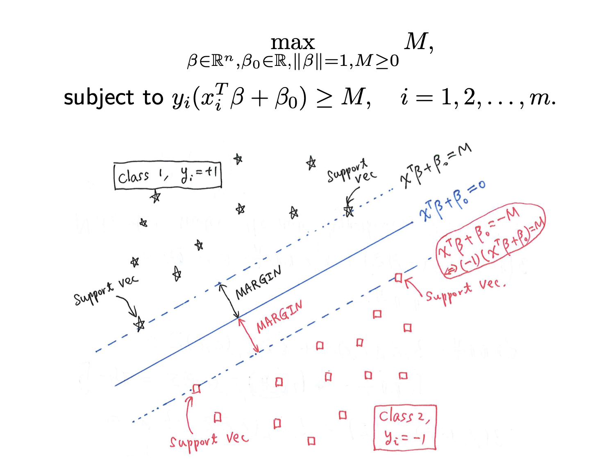
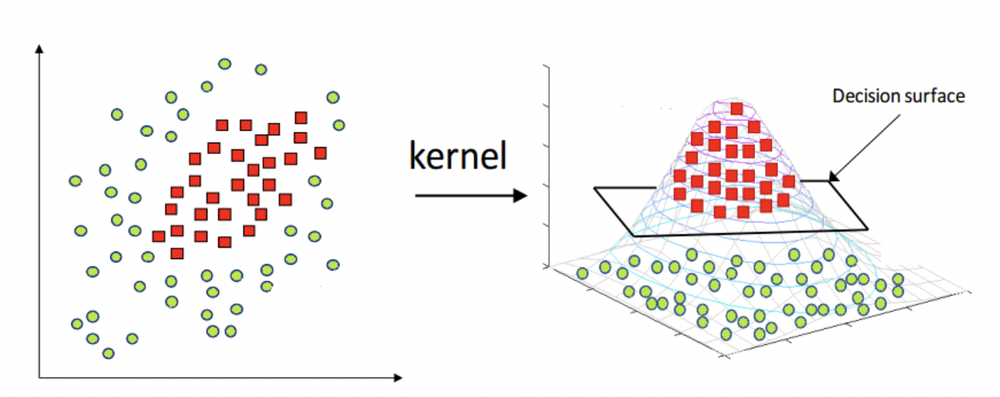
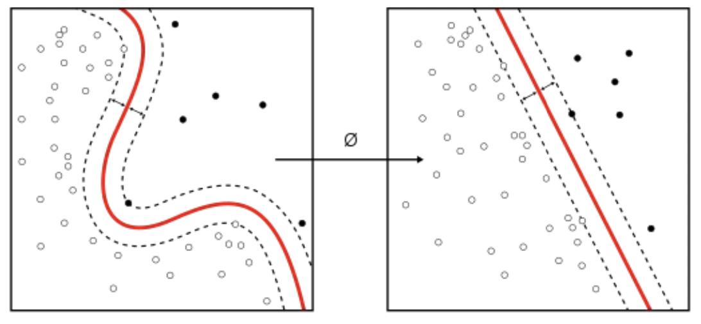

# SVM

SVM maps training examples to points in space so as to maximise the width of the gap between the two categories. New examples are then mapped into that same space and predicted to belong to a category based on which side of the gap they fall.

!!! p "find a best hyperplane with the largest margin to separate different class samples."
    ```mermaid
    graph  LR
    A[Linear SVM]
    B[soft margined ]
    C[kernel trick<br>低维完成运算]
    D[non-linear SVM<br>投射高维]
    E{线性可分}
    F{噪声存在<br>泛化⬇️}
    G[hard margined]
    Z[SVM<br>线性超平面<br>噪声敏感] --> E --Y-->A
    E --N--> D --计算内积困难--> C
    Z --> F --N--> G
    F --Y--> B
    ```

## 理论

==最大间隔超平面, Maximal Margin Hyperplan, Optimal Hyperplane==，在样本空间找一个超平面，将不同类别的样本分开。
==决策边界间隔, margin, $\gamma$==，$B_{-1}$ 和 $B_{1}$之间的间隔 $=$ 两个异类决策向量到决策边界的距离之和。具有较大间隔的决策便捷具有**更大的泛化误差**。
==支持向量, support vector==，距离决策边界最近的训练样本 $(x_{-1},-1),(x_1, 1)$ 分别位于超平面$B_{-1}$ 和 $B_{1}$上,令等式成立。$\begin{cases}
B_{-1}:& w^Tx_{-1}+b=-1\\B_1:&w^Tx_{1}+b=1
\end{cases}$

{width=60%}

**SVM 对噪声敏感的原因**
SVM 的目的：求出与支持向量有最大化距离的直线，以每个样本为圆心，该距离为半径作圆，可以近似为圆内的点与该样本属于相同分类。如果出现了噪声，那么这个噪声所带来的错误分类将最大化。

## linear SVM

Assumption：样本线性可分，根据**结构风险最小化原理**，最大化决策边界的间隔 $\Leftrightarrow$ 最坏情况下泛化误差最小。

!!! p "对偶问题"
    $\min f\xRightarrow{转化}\max \log f$
    - **优点**
      - 更容易求解
      - 求解出现了向量内积的形式，更容易引出核函数的概念。

### 最大边缘推导

$$\begin{align*}
B_{1}:&w^Tx_{1}+b=-1\\B_2:&w^Tx_2+b=1\end{align*}\implies
w^T(x_2-x_1)=2=w^T\overrightarrow{x_2x_1}\\
w^T\overrightarrow{x_2x_1}=\Vert w^T\Vert*\Vert\overrightarrow{x_2x_1}\Vert*\cos<w^T, \overrightarrow{x_2x_1}>=\Vert w^T\Vert * \Vert\gamma\Vert=2\\
\implies \Vert\gamma\Vert=\cfrac{2}{\Vert w\Vert} $$

$$\text{Question:} \max \gamma = \max_{w^T,b}\cfrac{2}{\Vert w^T\Vert}, \text{s.t.}\begin{cases} w^Tx_i+b\gt1&y_i=+1\\w^Tx_i+b\le-1&y_i=-1
\end{cases}\\
\Leftrightarrow \min_{w^T,b}\cfrac{1}{2}\Vert w^T\Vert, \text{ s.t. }\space y_i(w^Tx_i+b)\ge 1,  \forall i
$$

$(x_i,y_i)$ is a sample, which y is its actual type, $w^Tx+b$ is its prediction.

为了<u>在求导的时候方便约调系数 + 使用 KKT 条件</u>，$\min_{w^T,b}\cfrac{1}{2}{w^T}^{\red{2}}, \text{ s.t. }\space \red{-}(y_i(w^Tx_i+b)-1)\red{\le} 0,  \forall i$

!!! danger "**希望**：找到一个 $f(x):=w^Tx+b$ 使得所有属于类别 1 的算出来是 $\ge 1$的，所有属于类别 -1 的算出来是 $\le -1$的。但是不满足于此，还希望找到在所有符合以上条件的 $f$中，$\Vert w\Vert$ 最小。"

!!! p "拉格朗日乘子法：将条件融入到目标函数当中"
    $$\min_{x} f(x) \space\text{ s.t} \begin{cases} h(x)=0\\g(x)\red{\le}0
    \end{cases}\Leftrightarrow \min_{w^T,x}f+\lambda h + \mu g=:\mathcal{L}(x, \lambda, \mu)$$
    To solve, $\cfrac{\partial\mathcal{L}}{\partial x}=\cfrac{\partial\mathcal{L}}{\partial \lambda}=\cfrac{\partial\mathcal{L}}{\partial \mu}\xlongequal{SET}0$
    To achive optimal value, $\begin{cases} \frac{\partial\mathcal{L}}{\partial x}=0\\h(x)=0\\\mu g(x)=0
    \end{cases}$

$$\mathcal{L}(w^T,b, \alpha):= \cfrac{1}{2} {w^T}^2-\sum_{i=1}^n\alpha_i(y_i(w^Tx_i+b)-1)\\\space\\\min_{w^T,b}\max_{\alpha}\mathcal{L}(w^T,b, \alpha)$$

根据拉格朗日的对偶性，

$$\max_{\alpha}\min_{w^T, b}\mathcal{L}(w^T,b, \alpha)$$
求 $\cfrac{\partial\mathcal{L}}{\partial w^T}=\cfrac{\partial\mathcal{L}}{\partial b}\xlongequal{SET}0$

$$\begin{align*}\cfrac{\partial\mathcal{L}}{\partial w^T}&=w^T-\sum_{i=0}^n\alpha_iy_ix_i&=0\\
\cfrac{\partial\mathcal{L}}{\partial b}&=-\sum_{i=0}^n\alpha_iy_i&=0
\end{align*}$$

得到 ${w^T}^*=\sum\limits_{i=0}^n\alpha_iy_ix_i$ 回代 $\mathcal{L}(w^T,b, \alpha)$, 消掉 $w^T, b$

$$\begin{align*}
\mathcal{L}(w^T,b, \alpha)&=\frac{1}{2} {w^T}^2-\sum_{i=1}^n\alpha_i(y_i(w^Tx_i+b)-1)\\
&=\frac{1}{2}\Big(\sum_{i=0}^n\alpha_iy_ix_i\Big)^2
-\sum_{i=1}^n\alpha_iy_i\cdot\big(\sum\limits_{j=0}^n\alpha_jy_jx_j\big)\cdot x_i+\sum_{i=1}^n\alpha_i\\
&=-\frac{1}{2}\Big(\sum_{i=0}^n\alpha_iy_ix_i\Big)^2+\sum_{i=1}^n\alpha_i\\
&=-\frac{1}{2}\sum_{i=0}^n\sum_{j=0}^n\alpha_i\alpha_jy_iy_jx_i^Tx_j+\sum_{i=1}^n\alpha_i\end{align*}$$

$$\max_{\alpha}-\frac{1}{2}\Big(\sum_{i=0}^n\alpha_iy_ix_i\Big)^2+\sum_{i=1}^n\alpha_i$$

求 $\cfrac{\partial\mathcal{L}}{\partial \alpha}\xlongequal{SET}0$

$$\cfrac{\partial\mathcal{L}}{\partial \alpha_i}=-(\sum_{i=0}^n\alpha_iy_ix_i)\cdot y_ix_i+1=0$$

解得

$$\begin{align*}
{w^T}^*&=\sum_{i=0}^n\alpha_iy_ix_i\\
b^*&=\frac{1}{2}\Big[\max_{i:y=1}{w^T}^*x_i+\min_{i:y=-1}{w^T}^*x_i\Big]\\
f(x)&=\Big(\sum_{i=0}^n\alpha_iy_ix_i\Big)\cdot x+b\\
&=\sum_{i=0}^n\alpha_iy_i<x_i, x> + b
\end{align*}$$

而以上的过程需要满足 **KKT 条件** $\begin{cases}
a_i\ge0&\text{可行性}\\y_i(w^Tx+b)-1\ge0&\text{可行性}\\\alpha_i\cdot(y_i(w^Tx+b)-1)=0  &\text{互补松弛性}  
\end{cases}$

$\implies \forall (x_i,y_i), \begin{cases}
\alpha_i=0 &\text{样本对函数无影响}\\
\alpha_i\neq 0, y_i(w^Tx+b)=1&\text{支持向量，样本位于决策边界上}
\end{cases}$
$\implies$ 训练完成后，大部分的训练样本都不需要保留，<u>最终模型仅与决策向量有关</u>。

> >已知一个训练数据集，正例点 $x_1=(3,3)^T,x_2=(4,3)^T$，负例点 $x_3=(1,1)^T$， 求最大间隔分离平面。
>
> $x\in\R^2, f(x)=w_1x_1+w_2x_2+b$
> $$\min\frac{1}{2}(w_1^2+w_2^2), \text{ s.t. }\begin{cases}1*(3w_1+3w_2+b)\ge1\\1*(4w_1+3w_2+b)\ge1\\-1*(1w_1+1w_2+b)\ge1\end{cases}$$
> 构造对偶问题
> $$\max\limits_\alpha-\cfrac{1}{2}\sum\limits_{i=1}^3\sum\limits_{j=1}^3\alpha_i\alpha_jy_iy_jx_i^Tx_j+\sum\limits_{i=0}^3\alpha_i\\\text{s.t.}\alpha_i\ge0,\sum\limits_{i=1}^3\alpha_iy_i=\alpha_1+\alpha_2-\alpha_3=0$$
> 代入数据得：
> $\mathcal{L}(\alpha)=\alpha_1+\alpha_2+\alpha_3-\frac{1}{2}(18\alpha_1^2+25\alpha_2^2+2\alpha_3^2+2*21\alpha_1\alpha_2-2*7\alpha_2\alpha_3-2*6\alpha_1\alpha_3)\\=\alpha_1+\alpha_2+\alpha_3-9\alpha_1^2-\frac{25}{2}\alpha_2^2-\alpha_3^2-21\alpha_1\alpha_2+7\alpha_2\alpha_3+6\alpha_1\alpha_3$
> 代入 $\alpha_3=\alpha_1+\alpha_2$
> $$\mathcal{L}(\alpha)=2\alpha_1+2\alpha_2-4\alpha_1^2-\frac{13}{2}\alpha_2^2-10\alpha_1\alpha_2$$
> 求导 $\cfrac{\partial\mathcal{L}}{\alpha_1}=\cfrac{\partial\mathcal{L}}{\alpha_2}\xlongequal{SET}0$
> $$\begin{cases}2-8\alpha_1-10\alpha_2=0\\2-13\alpha_2-10\alpha_1=0\end{cases}\implies\begin{cases}\alpha_1=1.5\\\alpha_2=-1&\alpha_i\ge0\times
\end{cases}$$
> 极值在边界中取得
> 当 $\alpha_1=0, \mathcal{L}(\alpha)=2\alpha_2-\cfrac{13}{2}\alpha_2^2$ 在 $(0, \frac{2}{13})$ 取最大值 0.1538
> 当 $\alpha_2=0, \mathcal{L}(\alpha)=2\alpha_1-4\alpha_2^2$ 在 $(\frac{1}{4}, 0)$ 取最大值 0.25
> $\implies \alpha_3=\frac{1}{4}+0=\frac{1}{4}$
> $\alpha_1=\alpha_3>0\implies x_1,x_3$是支持向量
> 代入公式：
> $$\begin{cases}w^*=\sum_{i=1}^3\alpha_iy_ix_i=\cfrac{1}{4}\cdot1\cdot\begin{bmatrix}3\\3\end{bmatrix}+0+\cfrac{1}{4}\cdot-1\cdot\begin{bmatrix}1\\1\end{bmatrix}=\begin{bmatrix}1/2\\1/2\end{bmatrix}\\b=-\frac{1}{2}(3\cdot\frac{1}{2}+3\cdot\frac{1}{2}+1\cdot\frac{1}{2}+\cdot\frac{1}{2})=-2\end{cases}$$
> $f(x)=\cfrac{1}{2}x_1+\cfrac{1}{2}x_2-2$
> <u>超平面</u>=$\cfrac{1}{2}x_1+\cfrac{1}{2}x_2-2=0$

--

> >已知一个训练数据集，负例点 $x_1=(1,0)^T,x_2=(0,1)^T$，正例点 $x_3=(2,1)^T$， 求最大间隔分离平面。
>
> ==对偶问题解法==
> $x\in\R^2, f(x)=\begin{bmatrix}w_1\\w_2\end{bmatrix}^T\begin{bmatrix}x_1\\x_2\end{bmatrix}+b$
> $$\min_{w^T,b}\frac{1}{2}(w_1^2+w_2^2)\text{ s.t. }\begin{cases}-1*(w_1+b)\ge1\\-1*(w_2+b)\ge1\\1*(2w_1+w_2)\ge1\end{cases}$$
> 构造对偶问题
>$$\max_\alpha-\frac{1}{2}\sum_{i,j=1}^3\alpha_i\alpha_jy_iy_jx_i^Tx_j+\sum_{i=1}^3\alpha_i\text{ s.t. }\alpha_i\ge0, \sum_{i=0}^3\alpha_iy_i=-\alpha_1-\alpha_2+\alpha_3=0$$
> $\mathcal{L}(\alpha)=-\frac{1}{2}(\alpha_1^1+\alpha_2^2+5\alpha_3^2+2*2\alpha_1\alpha_3+2*2\alpha_2\alpha_3)+\sum\limits_{i=1}^3\alpha_i$
> 代入 $\alpha_3=\alpha_1+\alpha_2$
> $$\mathcal{L}(\alpha)=2\alpha_1+2\alpha_2-\alpha_1^2-2\alpha_2^2-3\alpha_1\alpha_2$$
> 求偏导 $\frac{\partial\mathcal{L}(\alpha)}{\partial\alpha_1}=\frac{\partial\mathcal{L}(\alpha)}{\partial\alpha_2}\xlongequal{SET}0$
> $$\begin{cases}2-2\alpha_1-3\alpha_2=0\\2-4\alpha_2-3\alpha_1=0\end{cases}\begin{cases}\alpha_1=-2\lt0\times\\\alpha_2=2 \end{cases}$$
> 极值在边界取得 $\begin{cases}\alpha_1=0&\mathcal{L}=2\alpha_2-2\alpha_2^2, \max_{(0, 1/2)}=1/2\\\alpha_2=0&\mathcal{L}=2\alpha_1-\alpha_1^2,\max_{(1,0)}=1\end{cases}$
> $(\alpha_1,\alpha_2,\alpha_3)=(1,0,1), \alpha_1=\alpha_3>0, x_1,x_3$支持向量
> 代入公式：
> $$\begin{cases}w^*=1*-1*\begin{bmatrix}1\\0\end{bmatrix}+0+1*1*\begin{bmatrix}2\\1\end{bmatrix}=\begin{bmatrix}1\\1\end{bmatrix}\\b^*=\frac{1}{2}(1*1+0+1*2+1*1)=-2
\end{cases}$$
> $f(x)=\begin{bmatrix}1\\1\end{bmatrix}^T\begin{bmatrix}x_1\\x_2\end{bmatrix}-2$
> 分离超平面 $\begin{bmatrix}1&1\end{bmatrix}\begin{bmatrix}x_1\\x_2\end{bmatrix}-2=x_1+x_2-2=0$
>
---
> > Consider the classification problem with data $\{(x_i,y_i)\}_{i=1}^m$ , where for each i $x_i\in\R, y_i\in\{±1\}$. Recall the hinge loss $φ_h(x) = \max\{0, 1−x\}$. Consider the SVM on $R^1$.
> > In particular, we set $λ = 1, m = 2, (x_1,y_1)=(1,−1), (x_2,y_2)=(-2,1)$ Find $(c^*, b^*)$
> >
> > $$\begin{align*}(c^*,b^*)&=\min_{c,b\in\R}\Epsilon_\lambda(c,b)\\\Epsilon_\lambda(c,b)&=\frac{1}{m}\sum_{i=1}^m\phi_h(y_i(cx_i+b))+\lambda_c^2
\end{align*}$$
>
> $\max\{0,1-x\}=\frac{1}{2}(1-x)+\frac{1}{2}|1-x|$
> $y_i(cx_i+b)=\begin{cases}-1(c+b)\\1(-2c+b)\end{cases}$
> $\Epsilon_\lambda(c,b)=\frac{1}{4}\times\frac{1}{2}\times\Big((1+c+b)+|1+c+b|+(1+2c-b)+|1+2c-b|\Big)+c^2\\
=\frac{1}{8}\Big((2+3c)+|1+c+b|+|1+2c-b|\Big)+c^2$
> $f(c,b):=|1+c+b|+|1+2c-b|$
> $\implies b^*\in[-1-c,1+2c], f(c,b)=|1+c+b+1+2c-b|=|2+3c|\xlongequal{SET}0\implies c^*=-\frac{2}{3}$
> $\Epsilon_\lambda(c,b)=\frac{1}{8}\Big(2+3c+|2+3c|\Big)+c^2$
> case 1 $2+3c<0$

!!! question "后面不太知道"

> > 考虑使用 linear SVM 对如下两类可分的数据进行分类：$\begin{cases}+1:&(1,1)(2,2),(2,0)\\-1&(0,0),(1,0),(0,1)\end{cases}$
> > 1.在图中作出6个样本点，构造具有最优超平面和最优间隔的权重向量。哪些是支持向量？<br>2.通过寻找拉格朗日乘子 $\alpha$ 来构造在对偶空间上的解，并与(1)求的结果进行比较。

## Non-linear SVM + kernel trick

如果原始空间是有限维，即数目有限，那么一定存在一个==更高维==的特征空间使样本线性可分。

!!! danger "将样本从原始空间映射到一个==更高维==的特征空间，使得样本在映射的高维空间内线性可分。<br> 低维 $x\in\chi\rightarrow \phi(x)\in\mathcal{F}$ 高维"
    💡 a **best** **hyperplane** with **the largest margin** in **transformed feature space**
    1. the largest margin 是在 **transformed feature space** 里的计算
    2. 在 **transformed** : **hyperplane(Linear)**; **original**: non-linear
    1. 这个 **transformed feature space 可以是同维度，也可以更高维**

设 $\begin{cases}(x, y)\xrightarrow{\text{\red{高维映射}}}(\phi(x), y)\\
f(x)\xrightarrow{\text{\red{高维映射}}}f(\phi(x))=w^T\phi(x)+b=\sum\limits_{i=1}^n\alpha_iy_i<\phi(x_i), \phi(x)>+b
\end{cases}$

原始问题：$\min\limits_{w^T,b}\frac{1}{2}{w^T}^2, \text{ s.t.}\space y_i(w^T\phi(x_i)+b)\ge 1,  \forall i$
对偶问题：$\max\limits_\alpha-\cfrac{1}{2}\sum\limits_{i=0}^n\sum\limits_{j=0}^n\alpha_i\alpha_jy_iy_j\red{<\phi(x_i)^T\phi(x_j)>}+\sum\limits_{i=1}^n\alpha_i, \text{ s.t. }\begin{cases}
\sum\limits_{i=1}^n\alpha_iy_i=0\\\alpha_i\ge0
\end{cases}$

{width=60%}
{width=60%}
{width=60%}

!!! p "$\red{<\phi(x_i)^T\phi(x_j)>}$ 是 $x_i, x_j$ 映射到高维空间之后的内积。由于维度很高计算困难，所以提出 ==核函数== $\kappa(x_i,x_j)$"

### 核函数 kernel trick

So we need kernel tricks to complete the inner product of vectors in the low-dimensional space to reduce the computation cost.
不显式地设计映射 $\phi(x)$，而是设计一个核函数 $\kappa(x_i,x_j)$，来解决映射到高维度空间后出现的<u>计算</u>上维度爆炸的问题，**减少计算代价**。
$$\kappa(x_i,x_j)=<\phi(x_i),\phi(x_j)>= \phi(x_i)^T\phi(x_j), \forall x\in\chi, \phi(x)\in\mathcal{F} $$

!!! p "$\kappa(x_i,x_j)$ 在<u>原始空间</u>的计算 $\Leftrightarrow x_i,x_j$ 在高维空间的内积。"
    !!! danger "==高维表现,低维计算=="
        特征是==从低维转到高维==！！！！<br> 核技巧是在低维空间完成高维空间向量内积的==计算==。只是在计算上取巧了一下。

重写：
- 对偶问题： $\max\limits_\alpha-\cfrac{1}{2}\sum\limits_{i=0}^n\sum\limits_{j=0}^n\alpha_i\alpha_jy_iy_j\red{\kappa(x_i,x_j)}+\sum\limits_{i=1}^n\alpha_i, \text{ s.t. }\begin{cases}
\sum\limits_{i=1}^n\alpha_iy_i=0\\\alpha_i\ge0\end{cases}$
- 函数 $f(x)=\sum\limits_{i=1}^n\alpha_iy_i\red{\kappa(x_i,x)}+b$

#### 核函数设计
满足：
$$\begin{bmatrix}
\kappa(x_1,x_1)& \dotsb&\kappa(x_1,x_n)\\
\vdots& \ddots&\vdots\\
\kappa(x_n,x_1)& \dotsb&\kappa(x_n,x_n)\end{bmatrix}\succeq0$$
- 对称
- 核矩阵半正定

**错误的核函数**， 将样本映射到了一个不合适的特征空间，导致性能不佳。

#### 常见核函数

|名|$\kappa(x_i, x_j)$|notes
|--|--|--|
线性核|$x_i^Tx_j$|for 线性可分
多项式核|$(x_i^Tx_j)^d$|$d\ge1$
高斯核|$\exp(-\cfrac{\Vert x_i-x_j\Vert^2}{2\sigma^2})$|$\sigma$ := 带宽
拉普拉斯核|$\exp(-\cfrac{\Vert x_i-x_j\Vert}{\sigma})$|$\sigma>0$
Sigmoid核|$\tanh(\beta x_i^Tx_j+\theta)$|$\beta>0,\theta<0$

### 软间隔 SVM

!!! p Q："噪声数据 outlier"
    SVM 要求所有的样本都满足约束。当数据中存在噪声数据，本身就偏离了正常位置， 导致划分的超平面被挤歪了，降低了 SVM 的泛化性能。（甚至说使得找不到 SVM

    !!! danger "Unfortunately, SVM is allergic to the noises so the robustness of the algorithm is not good." 
        we need to add the slack variables \$\xi_i$ to allow all training examples not satisfying the constraints strictly. Meanwhile, we set a small C to control the deviation of examples and constraints

==软间隔 SVM==：
1. 允许一些数据点不满足约束 $y_i(w^Tx_i+b)\ge1$，即可以在一定程度上偏移超平面。
2. 同时使得不满足约束的数据点尽可能少。</u>

$$\mathcal{L}(w^T,b, \alpha):= \frac{1}{2} {w^T}^2\red{+C}\sum_{i=1}^n\red{l_{0|1}(}y_i(w^Tx_i+b)-1\red{)}\\\space\\\min_{w^T,b}\max_{\alpha}\mathcal{L}(w^T,b, \alpha)\\
\red{C>0,l_{0|1}(z)=\begin{cases}0&\text{otherwise}\\1&z<0
\end{cases}}$$

$\red{C}$ 控制着目标函数与引入正则项之间的权重。当 $C\rightarrow\infin$ 会迫使所有样本满足约束。
$$\Leftrightarrow \mathcal{L}(w^T,b, \alpha):= \frac{1}{2} {w^T}^2\space\text{s.t.} y_i(w^Tx_i+b)\ge1$$

$\red{l_{0|1}(z)}$ 0-1损失函数，表现效果最好，但是非凸、非连续、数学性质不好，使得求解困难，因此也可使用其他函数作为替换。

特点|凸的、连续、是 $l_{0｜1}(z)$ 上界
|--|--|
hinge | $\max(0, 1-z)$
exponential | $\exp(-z)$
logistic | $\log(1+\exp(-z))$

#### hinge
$$\mathcal{L}(w^T,b, \alpha):= \frac{1}{2} {w^T}^2\red{+C}\sum_{i=1}^n\red{\max(0, 1-}y_i(w^Tx_i+b)\red{)}$$
引入松弛变量 $\xi$

$$\frac{1}{2} {w^T}^2+C\sum_{i=0}^n\red{\xi_i}\\
\text{s.t.} y_i(w^Tx_i+b)\ge\red{1-\xi_i},\space \xi_i\gt0$$

$\red{\xi_i}$, 每个样本都有一个对应的**松弛变量**，来表示该样本不满足约束的程度。
使用**拉格朗日乘子法**：

$$\mathcal{L}(w^T,b,\xi, \alpha,\beta):= \frac{1}{2} {w^T}^2+C\sum_{i=0}^n\red{\xi_i}-\sum_{i=0}^n\alpha_i(y_i(w^Tx_i+b)-1+\xi_i)-\sum_{i=0}^n\beta_i\xi_i\\
\alpha_i, \beta_i\ge0, \text{拉格朗日乘子}$$

求 $\cfrac{\partial\mathcal{L}(\cdot)}{\partial w^T}=\cfrac{\partial\mathcal{L}(\cdot)}{\partial b}=\cfrac{\partial\mathcal{L}(\cdot)}{\partial \xi}\xlongequal{SET}0$

$$\begin{align*}
\cfrac{\partial\mathcal{L}(\cdot)}{\partial w^T}&=w^T-\sum_{i=0}^n\alpha_iy_ix_i&=0 &\implies w^T=\sum_{i=0}^n\alpha_iy_ix_i \\
\cfrac{\partial\mathcal{L}(\cdot)}{\partial b}&=\sum_{i=0}^n
\alpha_iy_i&=0\\
\cfrac{\partial\mathcal{L}(\cdot)}{\partial \xi_i}&=C-\alpha_i-\beta_i&=0&\implies C=\alpha_i+\beta_i
\end{align*}$$

!!! p "唯一的差别在于对对偶变量的约束不同"
    |软间隔|硬间隔|
    |--|--|
    $0\le\alpha_i\red{\le C}$|$0\le\alpha_i$

> > 根据 KKT 对偶互补条件，分析带松弛变量的 SVM 优化问题中，图上所示的 $ABCDEFGHIJKL$这几个点的松弛变量 $\xi_i$, 拉格朗日因子$(\alpha_i,\mu_i)$,正则化变量 $C$之间的关系。注意：$0\le\alpha_i\le C,\mu_i\ge0,\xi_i\ge0,$ 对偶互补条件为 $\alpha_i(1-y_i(w^Tx_i)-\xi_i)=0,\mu_i\xi_i=0$
