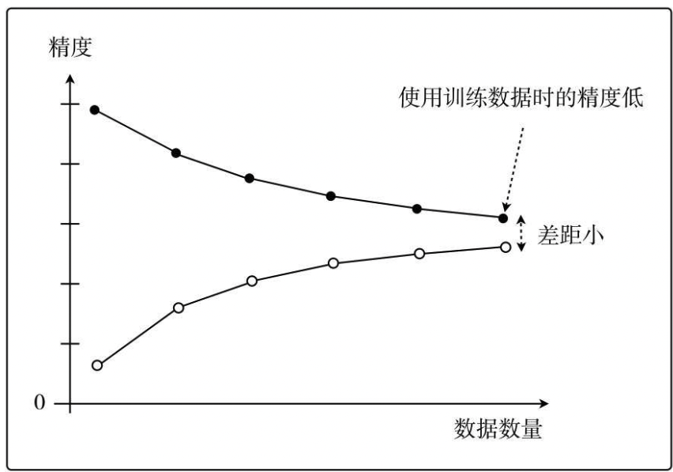
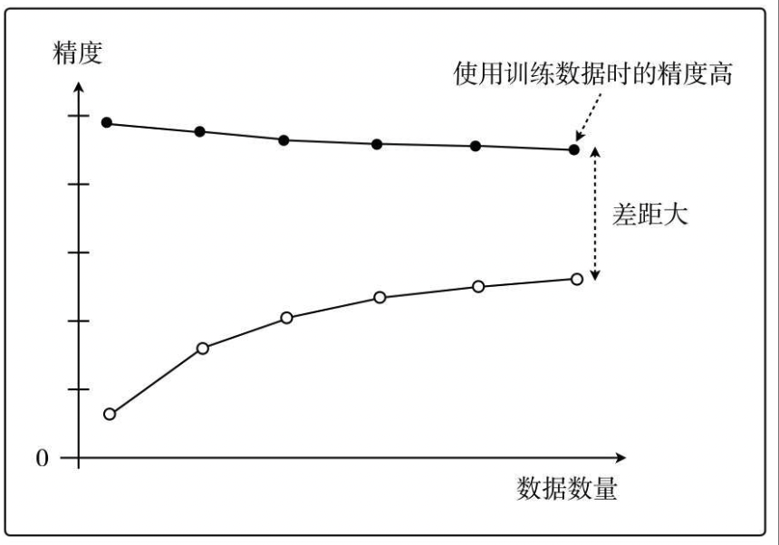

# 模型评估与选择

{width=60%}

!!! danger "训练误差 $\xrightarrow{近似}$ 测试误差  测试误差 $\xrightarrow{近似}$  泛化误差。"
    依据：训练集 & 测试集 **独立同分布** 地在数据空间中采样形成。
    通过降低**训练误差**来让**测试误差**⬇️，通过测量**测试误差**来衡量在整个数据集的**泛化性能**。

## 数据划分

**留出法和k折交叉验证**最常用。

dataset $D$；training set $S$；testing set $T$

==hold-out 留出法==。直接分成互斥大小不一两份，多次取误差平均。比例一般是
$$D=S\cup T, S\cap T=\empty, S:T=2:1 ～4:1$$
==k-fold cross- validation k折交叉验证==。分成k个大小相似，多次取误差平均。 p次k折交叉验证
$$D=D_1\cup D_2\cup\dots\cup D_k, D_i\cap D_j=\empty(i\neq j),k=10|5|20\\T=D_i, S=D-D_i,i=1\dots k$$
==Leave-One-Out LOO 留一法==。n折交叉验证，k=n=# 样本数量。$D-S=1$ 比较准确但计算成本大。
==bootstrapping 自助法== 有放回采样n次。从 n 个样本的数据集 $D$ **有放回采样** n 次得到 $D'$
$$S=D', T=D\setminus D'$$
对样本而言，在 n 次采样中始终找不到：$\lim\limits_{m\rightarrow\infin}(1-\frac{1}{m})^m=\frac{1}{e}\approx0.368\implies S:T=2:1$

### 数据采样

==stratified sampling 分层采样==。保留类比比例

## 评估指标

- 分类
准确率 Accuracy，错误率 Error rate
精确率 Precision，召回率 Recall
- 回归
    - MAE系列，即由 Mean Absolute Error 衍生得到的指标；
    - MSE系列，即由 Mean Squared Error 衍生得到的指标；
        - 均方根误差（Root Mean Square Error，RMSE）
        - $R^2$

在英语中，error 和deviation 的含义是一样的，所以Mean Absolute Error 也可以叫做 Mean Absolute Deviation(MAD)

[机器学习基础，回归模型评估指标]
[机器学习笔记_混淆矩阵（Confusion Matrix]

### 分类

{width=35%}
{width=80%}

==accuracy 准确率==. 分类正确的样本占总样本个数的比例.【正负一样重要】$$\cfrac{TP+TN}{all}$$

!!! warning "类别极度不平衡慎用(单纯准确率容易傻瓜判别)-> 类准确率"

!!! p "当有别的需要我们特殊关注："
    “<u>搜索结果(判定为 P )</u>中有多少是用户感兴趣？” $\frac{TP}{TP+FP}=$ precision
    “<u>用户感兴趣(真实为 P )</u>有多少出现在搜索结果中？” $\frac{TP}{TP+FN}=$recall
==precision 精确率 查准率==。分类正确的正样本个数占**判定为正**的样本个数的比例
$$\cfrac{TP}{TP+FP=～P}$$
==recall sensitivity Sensitivity 召回率，灵敏度，TPR， 查全率==。分类正确的正样本个数占**真正的正样本**个数的比例。【正重要】
$$\cfrac{TP}{TP+FN}$$

==Specificity特异性==。分类正确的负样本个数占**真正的负样本**个数的比例。【负重要】
$$\cfrac{TN}{TN+FP}$$

==False Positive Rate, FPR==。 分类错误的负样本个数占真正的负样本个数的比例。
$$\cfrac{FP}{TN+FP}$$

!!! p "有多个二分类混淆矩阵 (多次训练测试 ｜ 不同子数据集｜multi-class)"
    ==macro- 宏==。先各混淆矩阵分别计算，再平均。$\text{macro-P}=\overline{P}=\cfrac{1}{n}\sum\limits_{i=1}^nP_i$
    ==micro- 微==。先平均混淆矩阵，再一起计算 $\text{micro-P}=\cfrac{\overline{TP}}{\overline{TP}+\overline{FP}}$

#### precision & recall

!!! danger "定义经常记错"
    - precision 是==说多错多==。高 prec 值需要在<u>很有把握的时候</u>预测为正 $\implies$ <u>过于保守</u>，漏掉很多正样本，recall↓
     “<u>搜索结果(判定为 P )</u>中有多少是用户感兴趣？”
    - recall 是==人有多大胆地有多大产==。只要我全说正，那么 recall = 1.  $\implies$ <u>过于冒险</u>，错判很多负样本，precision↓
    “<u>用户感兴趣(真实为 P )</u>有多少出现在搜索结果中？”
  
    需要综合考虑 precision 和 recall

||P-R（Precision-Recall）|ROC|
|--|--|--|
|X|Recall = TP/(TP+FN) [0,1]| FPR = FP/(FP+TN)，假阳性率|
|Y|Precision = TP/(-P) [0,1]|TPR = TP/(TP+FN)，真阳性率|
|正负样本的分布变化|较剧烈的变化|基本保持不变 降低不同测试集带来的干扰|
||更直观看见特定数据集的表现|适用场景更多，被广泛用于排序、推荐、广告等领域|

!!! p "==socre-based classifier==."
    For a specified $\lambda$, let $f_C(x) = \begin{cases}P&f_z(x) ≥ λ\\N&f_z(x) < λ\end{cases}$.
    点的表示:在某一**阈值 λ**下，大于该阈值的样本会被判为正例 P，小于该阈值的样本会被判为负例 N。
    $λ\rightarrow-\infin$, the classifier predicts **everything as positive**.
    $λ\rightarrow\infin$, the classifier predicts **everything as negative**.

##### P-R 曲线, Precision-Recall

!!! quote "socre-based classifier"
    $λ\rightarrow\infin, P(\infin)=1,R(-\infin) =0$. an useless predictor.
    $λ\rightarrow-\infin, P(-\infin)=0,R(-\infin) =1$. an useless predictor

    As $λ=∞\rightarrow−∞, P(λ)\downarrow, R(λ)\uparrow$

$$x:\text{recall}；y:\text{precision}$$

<figure markdown="span"></figure>

通常情况下，<b>P-R曲线下的面积越大，模型性能越好</b>：即图中曲线B完全包住了曲线C，所以曲线B一定优于C。  但像A和B这样发生了交叉，不能断言孰优孰劣，只能在具体的P或R条件下分析。 另设别的性能度量：  <b>BEP</b>: B=0.72 < A=0.8，A优于B

==Break-Event Point 平衡点 BEP==。是“查准率==查全率”的点。该点代表模型的能力在两者表现都处于一个相对优秀的状态。(但是太简化)

==F1调和平均 和更一般 $F_\beta$==。更重视偏小值。适用于需要对查准率或查全率的某一项有偏好。

$$F1=\cfrac{2\times \text{precision}\times\text{recall}}{ \text{precision}+\text{recall}}\\
F_\beta=\cfrac{(1+\beta^2)\times \text{precision}\times\text{recall}}{ \beta^2\times\text{precision}+\text{recall}},\beta\begin{cases}=1&F1\\=2>1&\text{偏recall}\\=0.5<1&\text{偏precision}\end{cases}$$

!!! quote "F1调和平均更重视偏小值。"
    $\frac{1}{F1}=\frac{1}{2}(\frac{1}{P}+\frac{1}{R})=\frac{P+R}{2PR}\implies F1=\cfrac{2PR}{P+R}$
    Assume $P\rightarrow 0, R\rightarrow 1$ 极度不平衡
    $F1=\cfrac{2PR}{P+R}=\cfrac{\rightarrow0}{\rightarrow 1}\rightarrow0$（很糟）
    $F1=\cfrac{P+R}{2}=\cfrac{\rightarrow1}{2}\rightarrow0.5$（中等）
    Btw $\frac{1}{F_\beta}=\frac{1}{1+\beta^2}(\frac{1}{P}+\frac{\beta^2}{R})$

> 5 个样本按分数排列 （gt, score）
> （1，0.9）（1，0.8）（0，0.7）（1，0.6）（0，0.4）

|λ|(1，0.9)|(1，0.8)|(0，0.7)|(1，0.6)|(0，0.4)|P|R|
|--|--|--|--|--|--|--|--|
|0.9|1|0|0|0|0|$\frac{1}{1+0}$|$\frac{1}{1+2}$|
|0.8|1|1|0|0|0|$\frac{2}{2+0}$|$\frac{2}{2+1}$|
|0.7|1|1|1|0|0|$\frac{2}{2+1}$|$\frac{2}{2+1}$|
|0.6|1|1|1|1|0|$\frac{3}{3+1}$|$\frac{3}{3+0}$|
|0.4|1|1|1|1|1|$\frac{3}{3+2}$|$\frac{3}{3+0}$|

{width=50%}

##### ROC & AUC

==ROC, the Receiver Operating Characteristics curve 受试者工作特征曲线==。
$$x=FPR=\cfrac{FP}{TN+FP}; y=TPR=\cfrac{TP}{TP+FN}$$

!!! quote "socre-based classifier"
    $λ\rightarrow\infin, TPR(\infin)=0,FPR(-\infin) =0$. an useless predictor.
    $λ\rightarrow-\infin, TPR(-\infin)=1,FPR(-\infin) =1$. an useless predictor

    As $λ=∞\rightarrow−∞, FPR(λ)\: \&\: TPR(λ)\uparrow$

<figure markdown="span">{width=80%}</figure>

<mark>5 ROC curves</mark> <u>Curve I</u> is typical. 一般在 y=x 上面。 <u>Curve II</u> 随机预测 ☹️  <u>Curve III</u> is kind of useful in the sense that one benefits by using it reversely.  <u>IV</u> perfect classifier 👍  so is <u>V</u>.预测对调后翻转完👍

<figure markdown="span">{width=80%}
AUC, ROC曲线下的面积大小
</figure>

==AUC Area Under ROC Curve==。 量化地反映基于ROC曲线衡量出的模型性能 $AUC\in[0,1]$ 一般在0.5-1之间，↑👍

- $AUC\rightarrow1$ <u>Good</u>
- $AUC\rightarrow0$ <u>Good</u> yet one should use it **reversely**.
- $AUC\rightarrow0.5$ <u>**BAD**</u> **like a random guess**.

> 5 个样本按分数排列 （gt, score）
> （1，0.9）（1，0.8）（0，0.7）（1，0.6）（0，0.4）

|λ|(1，0.9)|(1，0.8)|(0，0.7)|(1，0.6)|(0，0.4)|TPR|FPR|
|--|--|--|--|--|--|--|--|
|0.9|1|0|0|0|0|$\frac{1}{1+2}$|$\frac{0}{2+0}$|
|0.8|1|1|0|0|0|$\frac{2}{2+2}$|$\frac{0}{2+0}$|
|0.7|1|1|1|0|0|$\frac{2}{2+1}$|$\frac{1}{1+1}$|
|0.6|1|1|1|1|0|$\frac{3}{3+0}$|$\frac{1}{1+1}$|
|0.4|1|1|1|1|1|$\frac{3}{3+0}$|$\frac{2}{0+2}$|

##### 代价敏感错误率 & 代价曲线

为权衡不同类型错误所造成的损失，将错误赋予“非均等代价”。上述的那些其实是**默认均等代价, target：最小错误次数**.
==Cost Matrix 代价矩阵==。 $\text{cost}_{ij}:=$ 将 i 类 误认为 j 类的代价。**target：最小总体代价 total cost**.

==cost curve 代价曲线==。反映出期望总体代价。（ROC不能反映）

#### MSE 系列

==MSE==。$$MSE=\cfrac{\sum\limits_{i=1}^n(\hat{y}-y)^2}{n}$$

==RMSE, Root Mean Square Error, 均方根误差==

$$RMSE=\sqrt{\cfrac{\sum\limits_{i=1}^n(\hat{y}-y)^2}{n}}$$

!!! danger "RMSE很高但是在95%预测误差都小于1%"
    是否存在 ==outliers==。是 noise 还是正常的样本多样性。
    1. noises: 预处理时过滤
    2. 正常样本的多样性：
        - 增加关于 outliers 建模
        - 选择更鲁棒的 metrics ：MAPE

#### MAE

$$MAPE=\cfrac{1}{n}\sum\limits_{i=1}^n\vert\hat{y_i}-y_i\vert \times100\%$$

##### MAPE, Mean Absolute Percent Error, 平均绝对百分比误差

$$MAPE=\cfrac{1}{n}\sum\limits_{i=1}^n\vert\cfrac{\hat{y_i}-y_i}{y_i}\vert \times100\%$$

相比RMSE，MAPE相当于==把每个点的误差进行了归一化==，降低了个别离群点带来的绝对误差的影响
相当于加权版的 MAE
MAPE 可以看做是 MAE 和 MPE (Mean Percentage Error) 综合而成的指标

#### 排序问题

!!! question ""
    在排序问题中，通常没有一个确定的阈值把得到的结果直接判定为正样本或负样本，而是采用Top N返回结果的Precision值和Recall值来衡量排序模型的性能，即认为模型返回的Top N的结果就是模型判定的正样本，然后计算前N个位置上的准确率Precision@N和前N个位置上的召回率Recall@N

## 比较检验

!!! warning "直接数值比较吗？"
    ❌。需要测的是泛化性能，但是在选出的 testing set 上测的。（两者不等价，且后者受测试集的大小和选择影响）
    ✏️ ==统计假设检验 hypothesis test==。<u>若在测试集上观察到 A 比 B 好，则 A 的泛化性能是否在统计意义上优于 B？以及这个结论的把握有多大？</u>

    !!! danger "但实际上极少人用 [为什么做机器学习的很少使用假设检验？]"

!!! quote ""
    以 错误率 $\epsilon$ 举例。
    测试集的测试错误率 $\hat{\epsilon}$ 是对泛化性能的泛化错误率 $\epsilon$ 的一个**预测**。可从 $\hat{\epsilon}$ 推测 $\epsilon$ 的分布。
    $\epsilon:=$ 算法在**一个样本上**犯错的概率是 $\epsilon$
    $\hat{\epsilon}:=$ 是在 m 个测试样本中，**恰好**有 $m\times\hat{\epsilon}$ 个样本被误分类。

在包含 m 个样本上的测试集上，泛化错误率🟰$\epsilon$ 的算法被测得测试错误率🟰$\hat{\epsilon}$的概率：
$$P(\hat{\epsilon};\epsilon)={m\choose m\times\hat{\epsilon}}\epsilon^{m\times\hat{\epsilon}}(1-\epsilon)^{m(1-\hat{\epsilon})}～Bin(m, \epsilon)$$
满足二项分布(伯努利分布).
使用二项检验 binomial test 来对 $\epsilon\le\epsilon_0$ 的假设进行检验。使用==置信度 confidence $1-\alpha$==
在 $1-\alpha$ 的概率所能观测的最大错误率=:临界值 $1-\overline{\epsilon}$：
$$\text{临界值 }\overline{\epsilon}=\max_{\epsilon} \epsilon\\\text{s.t.} \sum_{i=m\times\epsilon+1}^m{m\choose i}\epsilon^i(1-\epsilon)^{m-i}\le\alpha$$

- $\hat{\epsilon}<\overline{\epsilon}$: 在 α 的显著度下，假设 $\epsilon\le\epsilon_0$ 不能被拒绝 🟰 在 1-α 的置信度认为，$\epsilon\le\epsilon_0$
- $\hat{\epsilon}\ge\overline{\epsilon}$: 在 α 的显著度下，假设 $\epsilon\le\epsilon_0$ 被拒绝 🟰 在 1-α 的置信度认为，$\epsilon\gt\epsilon_0$
  
!!! p "确定一个显著度 α 即 置信度 1-α，在测试集上测出 $\hat{\epsilon}$，算出临界值 $\overline{\epsilon}$， $\epsilon\xlongequal{SET}\overline{\epsilon}$"
    α 一般是 0.05， 0.1

!!! p "我们多次重复留出法｜交叉验证法，获得多次测试错误率。 ✏️ ==t检验 t-test==。双边假设。"

k 次测试，k 个测试错误率 $\hat{\epsilon}_1,\dots,\hat{\epsilon}_k$
$\implies$ 平均测试错误率 $\mu=\frac{1}{k}\sum\limits_{i=1}^k\hat{\epsilon}_i$, 方差 $\sigma^2=\frac{1}{k-1}\sum\limits_{i=1}^k(\hat{\epsilon}_i-\mu)^2$。$\hat{\epsilon}_1,\dots,\hat{\epsilon}_k$ 是对泛化错误率 $\epsilon$ 的独立采样。
$\implies \tau_t=\cfrac{\sqrt{k}(\mu-\epsilon)}{\sigma}～t(k-1)$，自由度=k-1
对假设“$\epsilon=\epsilon_0$” 和显著度 α ,

[机器学习基础，回归模型评估指标]: https://zhuanlan.zhihu.com/p/73330018
[机器学习笔记_混淆矩阵（Confusion Matrix]: https://blog.csdn.net/seagal890/article/details/105059498

## generalization 泛化性能

==generalization error, 泛化误差==。训练数据集的损失与一般化的数据集的损失之间的差异

泛化误差可以分解为 **Bias 偏差**、**Variance 方差、Noise 噪声**
**期望泛化误差 = 偏差 + 方差
偏差=学习器的拟合能力
方差=学习器稳定性**

==bias-variance decomposition, 偏差-方差分解==，就是从偏差和方差的角度来解释学习算法泛化性能的一种重要工具。

### MSE

==Mean Squared Error, MSE==. one of evaluations of an estimator of parameter.

$$
 \begin{align*}MSE(\hat\mu)=\mathbb E\Vert \mu-\hat\mu \Vert^2&=\mathbb E\{\red{(\mu-\hat\mu)^T(\mu-\hat\mu)_{\in\R}}\}\\&=\mathbb Etr\{ \red{(\mu-\hat\mu)(\mu-\hat\mu)^T_{\in S^n}}\}\\&=tr\{Var(\hat\mu)\}+\Vert Bias(\hat\mu)\Vert^2\\&=tr\{Var(\hat\mu)\}+Bias(\hat\mu)^TBias(\hat\mu)\end{align*}
$$

!!! p "为什么MSE常用?"
    因为MSE可以化成 variance of estimate + bias of variance。
    - 前者我们希望越小越好，因为方差就是随机变量的分散程度
    - 后者我们希望越小越好，甚至希望他能达到0→ unbiased estimate, 因为偏差是 estimate 和ground truth 之间的期望距离

==UMVUE, uniformly minimum-variance unbiased estimator==, 在无偏估计器中进行最佳选择的标准：如果它们都是无偏的，则选择方差最小的那个！更通俗的说法就是就是“**如果有两个具有相同偏差的估计器，我们选择方差较小的一个**”

assume that $Y=f(X)+ε,ε～N(0,σ_ε)$

$$
\begin{align*}MSE&=\mathbb E\{(Y-\hat Y)^2\}=\mathbb E\{(f_X-\hat f_X)^2\}\\&=(\mathbb E\hat f- f)^2+\mathbb E\{(\hat f-\mathbb E \hat f)^2\}+\sigma_\epsilon^2\\&=Bias^2+Var+\text{Irreducible Error}\end{align*}
$$

#### bias, 偏差

==Bias==. $=\mathbb E\hat f- f$
用所有可能的训练数据集训练出的**所有模型**的输出**值**与**真实模型**的输出值之间的差异。度量了学习算法的期望预测与真实结果的偏离程度，即刻画了**学习算法本身的拟合能力。**
Bias的对象是**单个模型**，是期望输出与真实标记的差别。它描述了**模型对本训练集的拟合程度**。

#### variance, 方差

==Variance==$=\mathbb E\{(\hat f-\mathbb E \hat f)^2\}$
数据的离散程度，不同的训练数据集训练出的模型**输出值之间的差异**.度量了同样大小的训练集的变动所导致的学习性能的变化，即刻画了**数据扰动所造成的影响。**
Variance的对象是**多个模型**，是相同分布的不同数据集训练出模型的输出值之间的差异。它刻画的是数据扰动对模型的影响。

#### noise, 噪聲

==Noise==. $=ε～N(0,σ_ε)$
学习算法所无法解决的问题，数据的质量决定了学习的上限。我们要做的就是尽可能的接近这个上限。表达了在当前任务上任何学习算法所能达到的**期望泛化误差的下界**，即刻画了学习问题本身的难度

### bias-variance dilemma, 偏差-方差窘境

!!! p "训练误差 $\xrightarrow{近似}$ 测试误差$\xrightarrow{近似}$  泛化误差。"
    决定机器学习算法效果是否好的因素：
    - 降低训练误差
    - 缩小 训练误差 & 测试误差的差距。

<figure></figure>

<u>训练不足时</u>：学习器的拟合能力不够强，训练数据的扰动不足以使学习器产生显著变化，此时<b>偏差主导了泛化错误率。模型在训练集上不能获得足够低的误差</b>； <u>训练程度充足后</u>：学习器的拟合能力已经非常强，训练数据发生的轻微扰动都会导致学习器发生显著变化，<b>方差主导了泛化错误率，训练误差和测试误差的差距</b>。若训练数据自身的、非全局的特性被学习器学到了，则将发生过拟合

[Understanding the Bias-Variance Tradeoff]
[Understanding the Bias-Variance Tradeoff]:https://link.zhihu.com/?target=http%3A//scott.fortmann-roe.com/docs/BiasVariance.html

### underfitting 欠拟合

表示模型不懂数据，无法学到数据之间内在的规律，忽略数据特征。忽略了多少数据

**Methods to Prevent Underfitting：**

1、寻找更好的特征 -- 具有代表性。
2、用更多的特征 -- 增大输入向量的维度。（增加模型复杂度）

!!! danger "欠拟合： 单纯增加训练数据集没有用。核心是模型太拉学不到东西。增加模型复杂度才是正道。"
    即使增加数据的数量，无论是使用训练数据还是测试数据，精度也都会很差的状态

### overfitting, 过拟合 - 高方差

是指模型对数据的依赖程度.

**Methods to Prevent Overfitting:**

1. more training examples 增大数据集合 -- 使用更多的数据，减少数据扰动所造成的影响
2. smaller  sets of features, 减少数据特征 -- 减少数据维度，减少模型复杂度
3. increasing regularization hyperparameter lambda. decrease model complexity 正则化方法
4. 交叉验证法

### OF vs UF

<figure></figure>

假设红色的靶心区域是学习算法完美的正确预测值，蓝色点为训练数据集所训练出的模型对样本的预测值 左边一列的蓝色点比较集中——方差较小，右边一列的蓝色点比较分散——方差较大 上边一行的蓝色点比较靠近红色靶心——偏差较小，下边一行的蓝色点比较远离靶心——偏差较大

<figure></figure>

点到拟合直线距离和的大小作为偏差的大小 选出<u>拟合曲线上的点</u>，然后计算这些点的方差，方差越大表示越离散，拟合直线穿过的点越多，方差往往越大，越容易过拟合

我们以数据的数量为横轴、以精度为纵轴，然后把用于训练的数据和用于测试的数据画成学习曲线.

==学习曲线==, 以**数据的数量**为横轴、以**精度**为纵轴，比较用于训练的数据和用于测试的数据。

<figure markdown="span"></figure>
<figure markdown="span">
过拟合 只对训练数据拟合得较好
</figure>

### 解决方法

||underfitting|overfitting|
|--|--|--|
|performace|**high** training error  high testing error|**low** training error  high testing error|
|^|high bias 高偏差 low variance|low bias high variance 高方差|
|stategies|**increase model complexity**==根本==|1. more training examples,  2. smaller  sets of features,  3. increasing regularization hyperparameter lambda.   decrease model complexity|

✏️ 通过调整模型的容量，控制模型是否偏向 UF｜OF

#### capacity 容量

==模型的容量 capacity==。其拟合各种函数的能力。
容量低的模型可能很难拟合训练集，容量高的模型可能会过拟合，因为记住了不适用于测试集的训练集性质。

==表示容量 representational capacity==。模型规定了调整参数降低训练目标函数时，学习算法可以从函数族中选择那个具体函数。
==有效容量 effective capacity==。学习算法并不会真的选到最优函数，而是受限于额外的限制因素，选择一个可以大大降低训练误差的函数。

!!! p ""
    表示容量（最优函数） > 有效含量（最终选择的函数）

!!! warning "但是容量理论很少应用于实际的深度学习算法"

- 选择 ==假设空间 hypothesis space==。学习算法可以选择为解决方案的**函数集**。
    > 线性回归函数 ➡️ 所有线性函数
    > 广义线性回归 ➡️ 所有线性函数+多项式函数

[为什么做机器学习的很少使用假设检验？]:https://www.zhihu.com/question/55420602/answer/394028426
