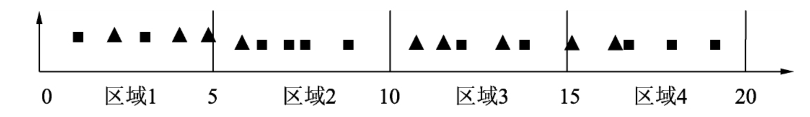
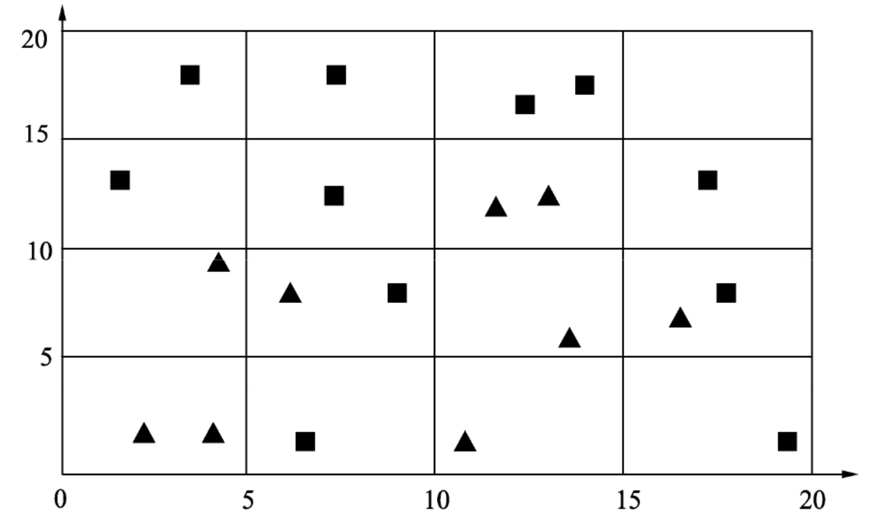
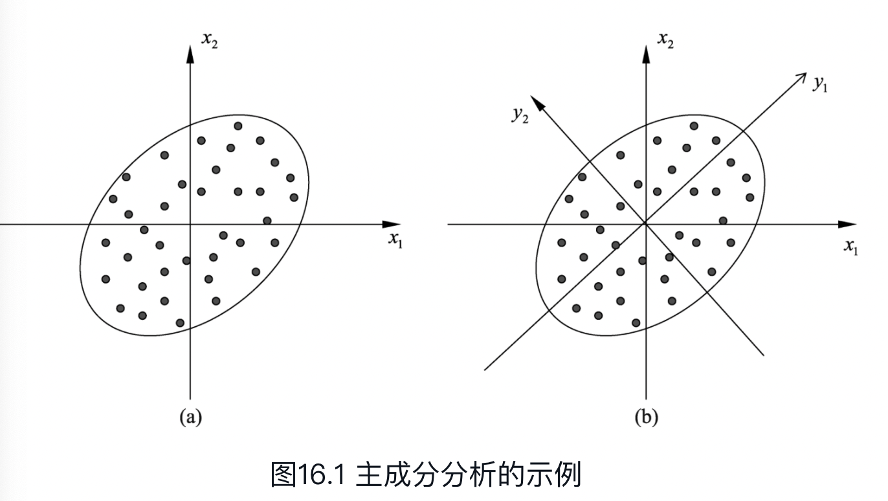

# high dimentional DA

==Data mining== is the process of discovering new patterns from LARGE DATA sets using methods of artificial intelligence, machine learning, statistics and database systems.

==Curse of Dimensionality 维度灾难==。 会导致分类器出现**过拟合**。这是因为<u>在样本容量固定时，随着特征数量的增加，单位空间中的样本数量会变少。</u>恰当的维数特征数对于机器学习模型非常重要。深度学习通过对样本的特征进行复杂的变换，得到对类别最有效的特征，从而提高机器学习的性能。

<figure markdown="span">{width=60%}<figure>
<figure markdown="span">{width=60%}<figure>

假设样本集是由圆形和三角形组成的20个样本，假设这些样本均匀地分布在这4个区域，则每个区域的样本个数约为5个。若希望在二维空间中每个区域的样本数量与一维时大致相等，则需要400个样本；若是三维空间，则需要8000个样本

!!! danger "很少 **observation n，** 很多 **features p** 情况下的高维.  p is very large, but n is relatively small."
    就拿医学来说，病人总是少数的，但是相关的因素总是特别多的。譬如那个基因检测。我们总得解决这种高维问题。
    > 有569个observations，30个 features。对于求features 的 covariance matrix $Σ\in S$来说，有$\cfrac{30*29}{2}\approx 430$个 parameters 要去 estimate。如果 take average 几乎是一个parameter 一个observation，这已经算是 high dimensional problem，除非数据very clean.

| 数据降维 dimensionally reduction | 特征选择 Variable Selection |
| --- | --- |
| 多个特征合成为一个特征 | 在多个特征中选择某个特征 |
| 获取无法解释的特征与变量之间的关系 | 可解释性强 |

## some special notation

==Random Vector== $Z=\begin{bmatrix}Z_1\\\vdots\\Z_p\end{bmatrix}\in\R^p$

- ==Expectation Matrix== $\mathbb EZ=\begin{bmatrix}\mathbb EZ_1\\\vdots\\\mathbb EZ_p\end{bmatrix}$
- ==Covariance Matrix== $\Sigma=Var(Z)\\=\mathbb E\{(Z-\mathbb EZ)(Z-\mathbb EZ)^T\}\\=\begin{bmatrix}Var(Z_1)&Cov(Z_1,Z_2)&\dots&Cov\{Z_1,Z_p\}\\Cov(Z_1,Z_2)&Var(Z_2)&\dots&Cov(Z_2,Z_p)\\\vdots&&\ddots&\vdots\\Cov(Z_p,Z_1)&Cov(Z_p,Z_2)&\dots&Var(Z_p)\end{bmatrix}$
    - $\Sigma \succeq0$
    proof: the sample covariance matrix is non-negative definite.

Correlation只是考察线性关系的相关性，并不是代表independent

- $\mathbb E(X+Y)=\mathbb EX+\mathbb EY$
- $W:=A_{p\times p}Z_{p\times 1}+c\in\R^p$, **constant** matrix A, **constant** vector c

    $\mathbb E(AZ+c)=c+A\mathbb EZ$

    $Var(AZ+c)=Var(AZ)=AVar(Z)A^T$

- $\mathbb E(AXB+c)=A\mathbb EXB+c$

1. Positive-definite matrices )

    Eigenvalue decomposition $A=\Gamma\Lambda\Gamma^T=\sum\limits_{i=1}^p\lambda_i\gamma_i\gamma_i^T$

==Multivariate Normal Distribution== $Z～N(b,\Sigma)$
Suppose $Z=\begin{bmatrix}ξ_1\\\vdots\\ξ_p\end{bmatrix}\in\R^p$ is a random vector, $\mathbb EZ=b\in\R^p,Var(Z)=\Sigma\in S^p$
$\forall l\in\R^p,l^TZ\in\R$ ～ Normal distribution. $\implies Z$ follows Multivariate Normal Distribution.
$\iff Z～N(b,\Sigma),b=\begin{bmatrix}b_1\\\vdots\\b_p\end{bmatrix},\Sigma=\begin{bmatrix}\sigma_{11}&\dots&\sigma_{1p}\\\vdots&\ddots&\vdots\\\sigma_{p1}&\dots&\sigma_{pp}\\\end{bmatrix}\\
\iff  f_Z(ξ_1,\dots,ξ_p)=\cfrac{1}{(2\pi)^{k/2}|\Sigma|^{1/2}}\exp\Big(-\cfrac{1}{2}(Ζ-b)^T)\Sigma^{-1}(Z-b) \Big)$

**properties:**

1. $\forall\text{ constant }l\in\R^p,c\in\R,\space l^TZ+c～N(l^Tb+c,l^T\Sigma l)$
2. Partial correlation and conditional independence
$(Ζ_1^T,Ζ_2^T)^T～N\Big(\begin{bmatrix}b_1^T&b_2^T\end{bmatrix}^T,\begin{bmatrix}\Sigma_{11}&\Sigma_{12}\\\Sigma_{21}&\Sigma_{22}\end{bmatrix}\Big)$
$\\\quad \iff \begin{bmatrix}ξ_{11}\\\vdots\\ξ_{1p}\\ξ_{21}\\\vdots\\ξ_{2p}\end{bmatrix}～N\Big(\begin{bmatrix}b_1\\b_2\end{bmatrix},\begin{bmatrix}\Sigma_{11}&\Sigma_{12}\\\Sigma_{21}&\Sigma_{22}\end{bmatrix}\Big)\\\quad\iff \begin{cases}Z_i～Ν(b_i,\Sigma_{ii})\\Z_1|Z_2～N\Big(b_1+\Sigma_{12}\Sigma_{22}^{-1}(X_2-b_2),\Sigma_{11}-\Sigma_{12}\Sigma_{22}^{-1}\Sigma_{21}\Big)\end{cases}$

- proof:

1. 在 normal multivariate distribution 里 Covariance = 0  等同于 independent
$cov(Z_1,Z_2)=\sigma_{ij}=0\iff Z_1,Z_2 \text{ are independent}$
   - proof
2. $ξ_k～N(b_k,\sigma_{kk}),\begin{cases}ξ_i+ξ_j～N(b_i+b_j,\sigma_{ii}+2\sigma_{ij}+\sigma_{j})\in\R\\ξ_i-ξ_j～N(b_i-b_j)～Ν(\sigma_{ii}-2\sigma_{ij}+\sigma_{jj})\in\R\end{cases}$

==I.I.D. observations==. $\text{Suppose } X_1,X_2,\dots,X_m\in\R^p \text{ are i.d.d.}$

1. $\mathbb EX=\overline X=\cfrac{1}{n}\sum\limits_{i=1}^nX_i$
2. ==Sample covariance matrix== $S=\begin{cases}\cfrac{1}{n}\sum\limits_{i=1}^n(X_i-\overline X)(X_i-\overline X)^T\\\cfrac{1}{n-1}\sum\limits_{i=1}^n(X_i-\overline X)(X_i-\overline X)^T\end{cases}\in S^{p}$
关于这个 n-1 是因为均值已知，无偏估计
3. ==Central Limit Theorem CLT==. Suppose $X_1,X_2,\dots,X_m\in\R^p \text{ are i.d.d.},\mathbb EX=\mu\in\R^p,Cov(X)=\Sigma\\\qquad\lim\limits_{n\rightarrow\infin}\cfrac{1}{n}\sum\limits_{i=1}^n(X_i-\mu)\rightarrow N(0,\Sigma)$
4. ==Law of Large numbers==. Suppose $X_1,X_2,\dots,X_m\in\R^p \text{ are i.d.d.},EX_i=\mu,Cov(X_i)=\Sigma\\\qquad\begin{cases}\lim\limits_{n\rightarrow\infin}\cfrac{1}{n}\sum\limits_{i=1}^nX_i\rightarrow E(X_i)=\mu\\\lim\limits_{n\rightarrow\infin}\cfrac{1}{n}\sum\limits_{i=1}^n(X_i-\mu)(X_i-\mu)^T\rightarrow\Sigma\end{cases}$

> > (AMA565_L0_T2) Suppose $e ～ N(0,σ^2I)$, what is the distribution of $\hat{β} = (X^TX)^{−1}X^T(Xβ + e)$? (Assume that the inverse and matrix multiplication are well defined)

---

> > (AMA565_L0_T3) Suppose $X ～ N (μ, Σ)$, and let the eigenvalue decomposition of $Σ = (σ_{ij})_{1≤i,j≤p}$ be given as $Σ = ΓΛΓ′$ where Γ is an orthogonal matrix and $Λ = \text{diag}\{λ_1, . . . , λ_p\}$ is the matrix of the eigenvalues.
> > 1). What is the distribution of $Γ′X$?> > 2). Let $Σ^{− 1/2} = ΓΛ^{− 1/2} Γ′.$ What is the distribution of $Σ^{− 1/2} X$?
> > 3). Suppose p = 2 and denote $X = (X_1, X_2)′$. In addition, $σ_{11}=σ_{22} = 1, σ_{12}=ρ$. What is the distribution of $(Y_1,Y_2), Y_1=\cfrac{(X_1+X_2)}{\sqrt{2+2ρ}}, Y_2 = \cfrac{(X_1 − X_2)}{\sqrt{2 − 2ρ}} ?$

## Special Matrix

$A=11^T=\begin{bmatrix}1&1&\dots&1\\\vdots&\ddots&\dots&\vdots\\1&\dots&\dots&1\end{bmatrix}\in\R^p=p\cdot \begin{bmatrix}\cfrac{1}{\sqrt p}\\\vdots\\\cfrac{1}{\sqrt{p}}\end{bmatrix}*\begin{bmatrix}\cfrac{1}{\sqrt p}&\dots&\cfrac{1}{\sqrt{p}}\end{bmatrix}+0...$

==AR(1) model== $A=\begin{bmatrix}1&\rho&\rho^2&\dots&\rho^{n-1}\\\rho&1&\rho&\dots&\rho^{n-2}\\\vdots&\vdots&\vdots&\ddots&\vdots\\\rho^{n-1}&\rho^{n-2}&\dots&\dots&1\end{bmatrix} \xrightarrow{e.g,}\begin{bmatrix}1&0.9&0.9^2&0.9^3\\0.9&1&0.9&0.9^2\\0.9^2&0.9&1&0.9\\0.9^3&0.9^2&0.9&1\end{bmatrix}$

## Variable Selection

📑 ref

- [如何进行特征选择（理论篇）机器学习你会遇到的“坑”]
- [Are screening methods useful in feature selection? An empirical study]

[Are screening methods useful in feature selection? An empirical study]: https://journals.plos.org/plosone/article?id=10.1371/journal.pone.0220842
[如何进行特征选择（理论篇）机器学习你会遇到的“坑”]:https://baijiahao.baidu.com/s?id=1604074325918456186&wfr=spider&for=pc

特征
|useful, important features|irreverent features|redundant feature|
|--|--|--|
|我们希望能：extract 他们，他们能主导整个 signals|无关特征。有他没他都一样|冗余特征。Delete|

==redundant variable==. that preditor with 0 coefficient  $\beta_k=0\implies$  unimportant and meaningless

Variable, Predictor, in the model, plays two roles: **improving the model flexibility and adversely affecting the model stability**. Redundant variables are not helpful in prediction, thus should be removed.

**为什么我们要 Figure out what important variables are and Delete redundant features？**

因为如果我们不处理掉 redundant variables， 那些 noises created by redundant variables maybe dominate the signals, causing trouble to ask for allocating those useful signals.
比如，通过房屋的面积，卧室的面积，车库的面积，所在城市的消费水平，所在城市的税收水平等特征来预测房价，那么消费水平（或税收水平）就是多余特征。证据表明，消费水平和税收水平存在相关性，我们只需要其中一个特征就够了，因为另一个能从其中一个推演出来。（如果是线性相关，那么我们在用线性模型做回归的时候，会出现严重的多**重共线性问题**，将会导致过拟合。）
特征选择还可以使模型获得更好的解释性，加快模型的训练速度，一般的，还会获得更好的性能

**常见的方法包括过滤法（Filter, Screening、包裹法（Warpper），嵌入法（Embedding）。**

### Filter, Screening, 过滤法

选择一些 important features, which is a **subset** of all features, 但我们不是简单的选择，而是设置一个 threshold 尽量 save all signals。但 No free lunch, it just a trade.

**SAME Assumptions:**

$\begin{cases}\text{centered X: } \mathbb EX=0,Cov(X)=\Sigma, \text{centered Y: } \mathbb EY=0\implies \beta_0=0\\(X_i,Y_i)\text{ are IDD}\\(X_i,Y_i,\epsilon_i)\text{ are independent}\\\red {\Xi}:=\text{error between estimator and truth}\in\R^n=\begin{bmatrix}\epsilon_1&\dots&\epsilon_n\end{bmatrix}^T\\\mathbb E\Xi=0,Var(\Xi)=\sigma^2I\in\R^{n\times n}\end{cases}$

|  | Perfect Models | More Redundant Variables | Less Important Variables |
| --- | --- | --- | --- |
| p | $p=p_0$ | $p>p_0$ | $p<p_0$ |
|  | Correct  | Correct  | Wrong |
| $\epsilon_i$ | $N(0,\sigma^2)$ | $N(0,\sigma^2)$ | $\red {\tilde\epsilon_i ,E(\tilde\epsilon_i)\neq0}$ |
| $Bias(\hat{Y}_{new})$ | ❌ | ❌ | ⭕ $E\tilde{\beta}-\beta)^TX_{new}$ |
| $E\{(Y-\hat{Y})^2\}$ | $\approx\sigma^2(1+\cfrac{p_0}{n})$ | $\approx\sigma^2(1+\cfrac{p}{n})$ | $\approx\sigma^2+(\beta_{p+1}^2+\dots+\beta_{p_o^2})\lambda_{min}(\Sigma)$ |

#### Perfect Models with General Variables

==Perfect model ($p=p_0$) variables==. $Y_i=\beta_1x_{i,1}+\dots+\beta_{p_0}x_{i,p_0}+\red{\epsilon_i}$
$\iff Y_i=\beta^TX_i+\epsilon_i, \begin{cases}Y_i\in\R,\\\beta=\begin{bmatrix}\beta_1&\dots&\beta_{p_0}\end{bmatrix}^T\in\R^{p_0}\\X_i=\begin{bmatrix}x_{i,1}&\dots&x_{i,p_0}\end{bmatrix}^T\in\R^{p_0}\\[1em]Cov(X)=\Sigma\in\R^{p_0\times p_0}\\\red{\epsilon_i\text{ are IID}～N(0,\sigma^2)}\end{cases}$
$\implies Y=X\beta+\Xi,\begin{cases}Y\in\R^n\\ X\in\R^{n\times p_0 }=\begin{bmatrix}X_1^T&\dots&X_n^T\end{bmatrix}^T\\\beta\in\R^{p_0}\end{cases}$

==the estimator==. $ \hat{\beta} = (\mathbb X^T\mathbb X)^{-1}\mathbb X^T\mathbb Y=\beta+(\mathbb X^T\mathbb X)^{-1}\mathbb X^T \red {\Xi }$
$\\\quad \begin{cases}\mathbb X:= \text{training dataset with n traing samples } X_i\\\mathbb X^T\mathbb  X =\sum\limits_{i=1}^nX_iX_i^T,\\X_i \text{ are IID }～N(0,\Sigma)\implies\mathbb  X^T\mathbb X=\sum\limits_{i=1}^n(X_i-0)(X_i-0)^T=\red{n\Sigma}\\\end{cases}$

$\hat{\beta}=\beta+(n^{-1}\mathbb X^T\mathbb X)^{-1}n^{-1}\mathbb X^T\Xi\approx \beta+\Sigma^{-1}n^{-1}\mathbb X^T\Xi\implies\\[1em]\hat{\beta}-\beta=(n^{-1}\mathbb X^T\mathbb X)^{-1}n^{-1}\mathbb X^T\Xi\approx\Sigma^{-1}n^{-1}\mathbb X^T\Xi$

!!! p "前者 $(n^{-1}\mathbb X^T\mathbb X)$ 是样本算出来的，后者  $\Sigma$  是分布的方差，前者 converge into 后者，减少了 randomness，所以是 approximately"

**For a new random observation** $X_{new}$
$$\begin{align*}Y_{new}&=\beta^TX_{new}+\epsilon_{new}\\\hat{Y}_{new} &=\hat{\beta}^TX_{new}
\end{align*}$$

$(X_{new},Y_{new},\epsilon_{new})$ is independent of $(X_i,Y_i,\epsilon_i)$

$$\begin{align*}
Y_{new}-\hat{Y}_{new}&=\underline{\red {\epsilon_{new}}+\beta^{\red{T}}X_{new}}-\underline{\hat{\beta}^{\red T}X_{new}}\\
&=\red {\epsilon_{new}}+(\beta-\hat{\beta})^{\red T}X_{new}\\
&\approx\red {\epsilon_{new}}-\underline{n^{-1}\Xi^T\mathbb X\Sigma^{-1}}X_{new}
\end{align*}$$

Square of Prediction Error

$$
\begin{align*}(Y_{new}-\hat{Y}_{new})^2&\approx(\red {\epsilon_{new}}-\underline{n^{-1}\Xi^T\mathbb X\Sigma^{-1}}X_{new})^2\\[1em]&\approx\red {\epsilon_{new}}^2-2\red {\epsilon_{new}}\cdot n^{-1}X_{new}^T\Sigma^{-1}\mathbb X^T\Xi+n^{-2}(\Xi^T\mathbb X\Sigma^{-1}X_{new})^2\end{align*}
$$

Take expectation:

$$
\begin{align*}\mathbb E\{(Y-\hat{Y})^2\}&=\mathbb E\{(Y-\hat{\beta}^TX)^2\}\\&\approx\mathbb E\Big(\red {\epsilon}^2-2\red {\epsilon}\cdot n^{-1}X^T\Sigma^{-1}\mathbb X^T\Xi+n^{-2}(\Xi^T\mathbb X\Sigma^{-1}X)^2\Big)\\&\approx\sigma^2-0+\cfrac{p_0}{n}\sigma^2\\&\approx\sigma^2(1+\cfrac{p_0}{n})\end{align*}
$$

$\implies$ **When n is large, the perfect model has the smallest prediction error**

#### Working Model with More Redundant Variables

如果我们不选择重要特征，我们尝试为折有事物添加估计系数，那么误差将汇总权将汇总，即每次我们估计某些东西时，您都会创一个错误。

==Wroking model with more redundant variables ($p$ variables, $\red{p>p_0}$)==

 $Y_i=\beta_1x_{i,1}+\dots+\beta_{p_0}x_{i,p_0}+0\times x_{i,p_0}+\dots+0\times x_{i,p}+\red{\epsilon_i},$
 $\iff Y_i=\beta^TX_i+\epsilon_i,i=1,\dots,n, \\\qquad\begin{cases}Y_i\in\R,\\\beta=\begin{bmatrix}\beta_1&\dots&\beta_{p_0}&0&\dots&0\end{bmatrix}^T\in\R^p,X_i=\begin{bmatrix}x_{i,1}&\dots&x_{i,p_0}&x_{i,p_0}&\dots&x_{i,p}\end{bmatrix}^T\in\R^p\\Cov(X)=\Sigma\in\R^{p\times p}\\\red{\epsilon_i\text{ are IID}～N(0,\sigma^2)}\end{cases}$

==the estimator== $\hat{\beta} = (\mathbb X^T\mathbb X)^{-1}\mathbb X^T\mathbb Y=\beta+(\mathbb X^T\mathbb X)^{-1}\mathbb X^T \red {\Xi }\\\quad \begin{cases}\mathbb X\in\R^{n\times p},\mathbb X^T\mathbb  X =\sum\limits_{i=1}^nX_iX_i^T\in\R^{p\times p},\\X_i \text{ are IID }～N(0,\Sigma)\implies\mathbb  X^T\mathbb X=\sum\limits_{i=1}^n(X_i-0)(X_i-0)^T=\red{n\Sigma}\in\R^{p\times p}\\\end{cases}$

Expected Square of Prediction Error

$$\mathbb E\{(Y-\hat{Y})^2\}=\mathbb E\{(Y-\hat{\beta}^TX)^2\}\approx\sigma^2(1+\cfrac{p}{n})>\sigma^2(1+\cfrac{p_0}{n}),p>p_0
$$

proof of

$\implies$  **the more redundant variables, the worse the prediction is.**
$\implies$  **if n is very large, it is ok to put all features in model as well since $\cfrac{p_0}{n}$  would vanish**

#### Working Model with Less Important Variables

==Wroking model with less important variables ($p$ variables, $\red{p<p_0, \beta_{p_0}\neq0}$==
$Y_i=\beta_1x_{i,1}+\dots+\beta_p\times x_{i,p}+\red{\tilde{\epsilon_i}}$
$\iff Y_i=\beta^TX_i+\red{\tilde{\epsilon_i}},i=1,\dots,n, \\\qquad\begin{cases}Y_i\in\R,\\\beta=\begin{bmatrix}\beta_1&\dots&\beta_{p}\end{bmatrix}^T\in\R^p,X_i=\begin{bmatrix}x_{i,1}&\dots&x_{i,p}\end{bmatrix}^T\in\R^p\\Cov(X)=\Sigma\in\R^{p\times p}\\\red{!!E(\tilde{\epsilon})\neq 0\impliedby\text{wrong model without enough variables}}\\\lambda_{\min}(\Sigma)>0\end{cases}$

==the estimator== $\hat{\beta}=\begin{bmatrix}\hat{\beta_1}&\dots&\hat{\beta_p}\end{bmatrix}^T\in\R^p,\red{p<p_0}\\\xrightarrow{变形}\red{\tilde{\beta}}=\begin{bmatrix}\hat{\beta}\\0\end{bmatrix}=\begin{bmatrix}\hat{\beta_1}&\dots&\hat{\beta_p}&0&\dots&0\end{bmatrix}^T\in\R^{p_0}$

$\implies\hat{Y}_{new}=\hat{\beta}_{1\times p}{X_{new}}_{p\times1}=\tilde{\beta}^T_{1\times p_0}{X_{new}}_{p_0\times1}\\\qquad\qquad=\hat\beta_1x_1+\dots+\hat{\beta_p}x_p+0\times x_p+\dots+0\times x_{p_0}$

**There is a bias in the prediction for a given X.**

$Bias(\hat{Y}_{new})=\mathbb EY_{new}-\mathbb E\hat{Y}_{new}=\mathbb E\{(\beta-\tilde{\beta})^TX_{new}+\epsilon_{new}\}=(\mathbb E\tilde{\beta}-\beta)^TX_{new}$

Expected Square of Prediction Error

$$
\begin{align*}\mathbb E\{(Y-\hat{Y})^2\}&=\sigma^2+\mathbb E\{(\beta-\tilde{\beta})^T\Sigma(\beta-\tilde{\beta})\}\\[1em]&\ge\sigma^2+\Vert\beta-\tilde\beta\Vert^2\lambda_{min}(\Sigma)\\[1em]&\ge\sigma^2+(\beta_{p+1}^2+\dots+\beta_{p_0^2})\lambda_{min}(\Sigma)\end{align*}
$$

- proof of

$\implies$  If the working model does not include all the important variables (those with $β_{k}≠ 0,k=1,\dots,p_0$), the prediction error (lower bound) is also bigger than the model with exactly the important variables.
$\implies$ **样本数 n 再大也拯救不了这个error 因为$(\beta_{p+1}^2+\dots+\beta_{p_0^2})\lambda_{min}(\Sigma)$ is constant，而且这只是下界 lower bound**

#### Candidate Models for p+1 predictor $1， x_1, ..., x_p$

<figure markdown="span">{width=80%}
un-centralized
</figure>

Suppose we have n samples. Consider any sub-model (A)
$(A):= Y =\beta_0+β_1x'_1 +...+β_qx'_q+ε, \space\{x'_1,\dots,x'_q\}\sub\{x_1,\dots,x_p\}$

==RRS of A==. $RSS(A)=\sum\limits_{i=1}^n\{Y_i-\hat{Y}_{A,i}\}^2$.
$\hat{Y}_{A,i}:=$ the fitted value(estimation) of $Y_i$ generated by model (A

!!! warning "Fitted error (RSS) 可以去衡量how good model are， 但是 cannot be used as one criterion for the selection."

1. For any two models A and B, if A is a sub-model of B, then $RSS(A) ≥ RSS(B).$ 只要 A是 B 的子集，那么 RSS(A) 一定≥ RSS(B)。
2. 而且这个RSS是在 training set 1-n 上进行，如果是 overfitting 的话，error再小，但是在鲁棒性还是很垃圾的。所以我们不能用在训练集上的RSS去 compare

### Model Selection for LR

For example, an empirical method like Cross-Validation, Bootstrap methods or sample penalties such as AIC, BIC, Mallow's CP.

[Model Selection: AIC/BIC and Cross-Validation gives different conclusion]

==Cross validation==. 因为要比较一些模型，如果每个模型都拿一些进行训练然后测验证集的准确率。当训练集的 n 非常大的时候，就很容易 time-consuming。

==K-fold==. 和交叉验证比，是 computation more efficient， 但更model is less stable

==AIC==

/BIC

the computational efficiency of AIC/BIC or when the sample size is relatively small for cross-validation
AIC and BIC explicitly penalize the number of parameters, cross-validation not, so again, it's not surprising that they suggest a model with fewer parameters (though nothing prohibits cross-validation from picking a model with fewer parameters).

[Model Selection: AIC/BIC and Cross-Validation gives different conclusion]: https://stats.stackexchange.com/questions/578982/model-selection-aic-bic-and-cross-validation-gives-different-conclusion

## Dimensionality Reduction，数据降维

数据降维其实还有另一个好处：数据可视化。因为超过三维的数据就无法可视化了。数据降维最常用的方法是主成分分析。

!!! danger "我们想找到重要信号的位置。其次，我们找到重要信号或强信号，或者这些弱信号现在是零，就扔掉，我们希望为这些强信号提供适当的估计。"
    我们肯定没有 enough information，因为同时存在着 noise。决定我们是否能完成目标就是：whether the important signals in data are stronger than noises。我们现在假定这个 important signals are **stronger** than noises. 接下来就要想如何将important information 剥离 noise？

### Principal Component Analysis, PCA, 主成分分析

The basic idea is to transform the p random variables into <u>linear combinations</u> called ==Principal Components==. Extracting linear combinations from multivariate data, a subset of PCs <u>captures most of the variability </u> in the data.

正交变换把由线性相关变量表示的观测数据转换为少数几个由线性无关变量表示的数据，**线性无关**的变量称为==主成分==

#### KEY: Maximize the variance

!!! p "Maximize the variance"
    Identify key components which can <u>maximize the information</u> with a reasonable dimension.
    Find **unit-vector g** to transform X into Y with the target that <u>maximizes the variance of Y</u>.

Suppose $X=\begin{bmatrix}X_1\\\vdots\\X_p\end{bmatrix}\in\R^p$ is a random vector with ==Covariance Matrix== $Var\{X\}=\Sigma=\begin{bmatrix}\sigma_{1}^2&\dots&\sigma_{1p}\\\vdots&\ddots&\vdots\\\sigma_{p1}&\dots&\sigma_{p}^2\\\end{bmatrix}$

Look for <u>the linear transformations</u>:

$$
\begin{align*}\begin{cases}Y_1=g_{11}X_1+\dots+g_{1p}X_p\\Y_2=g_{21}X_1+\dots+g_{2p}X_p\\\vdots\\Y_p=g_{p1}X_1+\dots+g_{pp}X_p\end{cases}\iff\begin{bmatrix}Y_1\\\vdots\\Y_p\end{bmatrix}&=\begin{bmatrix}g_{11}&\dots&g_{1p}\\\vdots\\g_{p1}&\dots&g_{pp}\end{bmatrix}\begin{bmatrix}X_1\\\vdots\\X_p\end{bmatrix}\\&=\begin{bmatrix}g_1^T&\dots&g_p^T\\\end{bmatrix}\begin{bmatrix}X_1\\\vdots\\X_p\end{bmatrix}\end{align*}\\\vec{g_i}=\begin{bmatrix}g_{i1}\\\vdots\\g_{ip}\end{bmatrix},\Vert \vec{g_i}\Vert_2=1,\forall i=1,...p
$$

==property of  r.vector== $Y=g^TX, g\in\text{constant}\\\implies Var(Y)=g^TVar(X)g=g^T\Sigma g$

**Target:**

$$g=\max\limits_{\Vert g\Vert_2=1} Var(Y)=\max\limits_{\Vert g\Vert_2=1} g^T\Sigma g\tag{1}$$

==eign about postive definite A==.$\Sigma=\sum\limits_{i=1}^{p}\lambda_i\gamma_i^T\gamma_i=\Gamma^T\Lambda\Gamma$  specially suppose $\lambda_1>\dots>\lambda_p>0$ in <u>anascending order</u>

1. $g_1:=\max\limits_{\Vert g\Vert_2=1} g^T\Sigma g\implies g_1=\gamma_1 \text{ of }\Sigma$
$\implies g_1$ is the **direction** **where the variance is maximized.** <u>（not PC</u>
$\implies g_1^Tx$ is the **1st PC**
2. $g_2:=\max\limits_{\Vert g\Vert_2=1,\:g_2^Tg_1=0} g^T\Sigma g\implies g_2=\gamma_2 \text{ of }\Sigma$
$\implies g_2$ is the one that maximizes the variance among all directions **orthogonal** to $g_1$
3. proof: **i th-PC = i th eigen vector**
Let $\lambda_i:=$ the i-th largest eigen-value of $\Sigma$, $\gamma_i:=$ the eigen-vector corresponding to $\lambda_i$. Therefore, $\{\gamma_1,\gamma_n\}$ are one set of the basis of $\R^p$ <u>特征向量是特征空间的一组 basic vectors。</u>
$\implies\forall g\in\R^p,\exist c_1, c_2,\dots, c_p\text{ s.t. } g=c_1\gamma_1+c_2\gamma_2+c_n\gamma_n$

$$\begin{align*}\implies g^T\Sigma g&=\sum\limits_{i=1}^n\sum\limits_{j=1}^nc_ic_j\gamma_i^T\Sigma\gamma_j\\
&\xlongequal{\Sigma\gamma_i=\lambda_i\gamma_i}\sum\limits_{i=1}^n\sum\limits_{j=1}^pc_ic_j\gamma_i^T\gamma_j\lambda_j\\
&\xlongequal[\lambda_i^T\lambda_i=1]{\lambda_i^T\lambda_j=0,\forall i\neq j} \sum_{i=1}^nc_i^2\lambda_i\\
&\le\lambda_1\sum_{i=1}^nc_i^2\\
&\xlongequal[\Vert g\Vert_2^2=1=c_1^2+\dots+c_n^2]{\text{when }c_2=\dots=c_n=0 }\lambda_1
\end{align*}$$

$$\implies g=\gamma_1\iff g^T\Sigma g=\lambda_1$$

**Conclusion:**

1. the best direction is **the direction of eigenvectors**
2. the **variance** of the direction is **Eigen value**
$Var(Y_i)=g_i^T\Sigma g_i=g_i^T\lambda_i g_i = \lambda_i\\tr(\Sigma)=tr(\Gamma\Lambda\Gamma^T)=tr(\Lambda\Gamma\Gamma^T)=tr(\Lambda)=\sum\limits_{i=1}^p\lambda_i$
3. What is the relationship between $Y_i \& Y_j, i\neq j$
**orthogonal and are the Eigen-vector of Sigma**
4. What if X is following a multivariate normal distribution?
==Multivariate Normal Distribution== $Z～N(b,\Sigma),\forall l\in\R^p,l^TZ\in\R～$ Normal distri... $\implies Z$ ～ Multivariate Normal Distri...
If X is following a multivariate normal distribution, $g_i^TX～N$

**Advantages:**

1. Identify **key components** which can **maximize the information** with a reasonable dimension. 发现数据中的基本结构，即数据中变量之间的关系,能近似地表达
2. **Reduce the dimension** of other forms of analysis.
3. Linearity is assumed.

**Limits:**

1. It can be **more difficult to interpret** than using a subset of the original variables.
2. It uses only covariances/correlations but not higher-order moments. This can be extended to ==independent component analysis ICA==

#### PCA Transformation

$Y_i = g_i^TX\implies Y=\Gamma^TX$

the 1 PC $Y_1=g_1^TX, g_1:= $ the eigen-vector with the 1 largest eigen-value $\lambda_1$
the 2 PC $Y_2=g_2^TX, g_2:=$ the eigen-vector with the 2 largest Eigen-value $\lambda_2$
$$\vdots\\
\begin{bmatrix}Y_1\\\vdots\\Y_p\end{bmatrix}=\begin{bmatrix}g_1^T\\\vdots\\g_p^T\end{bmatrix}_{p\times p}\begin{bmatrix}X_1\\\vdots\\X_p\end{bmatrix}\iff \Gamma=\begin{bmatrix}g_1&\dots&g_p\end{bmatrix}\in\R^{p\times p}$$

##### Practical Use

1. <u>**Standardize 规范化**</u> the data, 使得数据每一变量的均值为0，方差为1
2. <u>**SVD 正交分解**</u> of the sample **covariance M/correlation M**
3. **Sort** the eigenvalues in descending order and choose the K largest eigenvectors (plots, the proportion of variances interpreted etc.)
4. <u>**Linear Transform 变换**</u> X into Y(Dimension Reduction!)

原来由线性相关变量表示的数据，通过正交变换变成由若干个线性无关的新变量表示的数据。新变量是可能的正交变换中变量的方差的和（信息保存）最大的，**方差表示在新变量上信息的大小**。将新变量依次称为第一主成分、第二主成分等。

!!! p "**how large dimensions we keep：**"
    这里所说的**信息是指原有变量的方差**。
    可以设置一个 certain level, maybe 85%，90%，然后我们看 <u>the cumulative proportion of k PCs</u>, 因为这就是说 这k 个 PCs 能够在多大程度上描述这些点的差异间隔。而在剩下的PCs里，这些点大多是重叠，并不具有很高的差异信息价值。只要这个 cumulative达到了这个 certain level 我们就采用前 k 个 PCs

!!! p "covariance M vs correlation M? —— <kbd>Scale</kbd>"
    ==covariance M==. $Cov(x,y)=\cfrac{1}{n}\sum\limits_{i=1}^n(x-\overline{x})(y-\overline{y})$
    ==correlation M==. $\rho_{xy}=\cfrac{Cov(x,y)}{\sqrt{Var(x)}\sqrt{Var(y)}}$
    [Covariance Vs Correlation: Here are the Difference You Should Know ,Simplilearn]
    当我们要去除**特征值量纲的区别** 我们使用 correlation，<kbd>scale=true</kbd>
    如果不去，就是covariance，<kbd>scale=false</kbd>（默认
    > > Suppose $x_1$ is a length measured either in cm. or mm., $x_2$ is a weight measurement in gm. The covariance M with $y_1$ in cm. is $\begin{bmatrix}80&44\\44&80\end{bmatrix}$ the Covariance M with $y_1$ in mm. is $\begin{bmatrix}8000&440\\440&80\end{bmatrix}$

[Covariance Vs Correlation: Here are the Difference You Should Know ,Simplilearn]:https://www.simplilearn.com/covariance-vs-correlation-article

#### Graphical: Rotate the data without scaling

数据集合中的样本由实数空间（正交坐标系）中的点表示，空间的一个坐标轴表示一个变量，规范化处理后得到的数据**分布在原点附近**。对原坐标系中的数据进行主成分分析等价于进行**坐标系旋转变换，将数据投影到新坐标系的坐标轴上。**

!!! p "**Graphical:** $Y=\Gamma^TX$: Multiplication by an orthogonal matrix: **Rotation**!"
    <u>proof of rotation</u>: $\Vert y_1-y_2\Vert_2=\Vert x_1-x_2\Vert_2, $ without scaling $\forall x_1,x_2,$ any two points in space

    $$\begin{align*}\Vert y_1-y_2\Vert_2^2&=(y_1-y_2)^T(y_1-y_2)\\&=(x_1-x_2)^T\Gamma\Gamma^T(x_1-x_2)\\&\xlongequal[\Gamma\Gamma^T=I]{\Gamma^T=\Gamma^{-1}}(x_1-x_2)^T(x_1-x_2)=\Vert x_1-x_2\Vert_2^2\end{align*}$$

新坐标系的第一坐标轴、第二坐标轴等分别表示第一主成分、第二主成分等，数据在每一轴上的坐标值的平方表示相应变量的方差；并且，这个坐标系是在所有可能的新的坐标系中，**坐标轴上的方差的和最大的**

**方差和最大:**
主成分分析旨在选取正交变换中方差最大的变量，作为第一主成分，旋转变换中**坐标值的平方和最大**的轴, 旋转变换中选取**离样本点的距离平方和最小**的轴

<figure markdown="span">{width=45%}
transformation：<u>旋转变换</u>
<figure>

原坐标系:很明显有正向线性相关，13象限最多 新坐标系:线性无关，1234象限都差不多

如果主成分分析只取第一主成分，即新坐标系的y1轴，那么等价于将数据投影在椭圆长轴上，用这个主轴表示数据，将二维空间的数据压缩到一维空间中。

| 1st PC | 2nd PC |
| --- | --- |
| 方差最大 | 与第一坐标轴正交，且方差次之 |
| 第一坐标轴 $y_1$ | 第二坐标轴 $y_2$ |
| 椭圆的长轴 | 椭圆的短轴 |

### Linear Discriminant Analysis, LDA, 线性判别分析

LDA的目标是**提取一个新的坐标系，将原始数据集投影到一个低维空间中。**
和PCA的主要区别在于，LDA不会专注于数据的方差，而是优化低维空间，**以获得最佳的类别可分性**。意思是，新的坐标系在为分类模型查找**决策边界**时更有用，<u>非常适合用于构建分类流水线</u>。

**优点：**基于类别可分性的分类
- 有助于避免机器学习流水线的过拟合，也叫防止维度诅咒。
- LDA也会降低计算成本。

!!! danger "Fisher’s LDA and Bayes’ LDA are essentially different! They are equivalent under the <u>Gaussian assumption with a common Σ for the two-class case</u>"

Both Fisher’s LDA and Bayes rule reduce to:

|  | empirical estimators |
| --- | --- |
| $μ_X$ | $\overline{X}$ |
| $μ_Y$ | $\overline{Y}$ |
| $Σ$ | $Σ$ |

!!! danger "不可将线性判别分析与==隐狄利克雷分配LatentDirichlet Allocation, LDA== 相混淆。"
    隐狄利克雷分配用于文本和自然语言处理，与线性判别分析没有关系。

| 类内 within-class |  类间 between-class
| --- | --- |
 S_w | S_b

#### Fisher’s LDA

LDA的目标是提取一个新的坐标系，将原始数据集投影到一个低维空间中，以获得最佳的类别可分性。

**Target：** 获得最佳的类别可分性
Find the line $P_Z = w^TZ$ that best separates the two classes.
$$w =\max\limits_w \cfrac{w^TS_Bw}{w^TS_Ww}$$
Force $\begin{cases}S_B=(\mu_X-\mu_Y)(\mu_X-\mu_Y)^T&\text{ between-class}\uparrow\\S_W=\Sigma&\text{ within-class}\downarrow\end{cases}$

1. the center of the two after transformation linear projection be as **far** away as possible $S_B\uparrow$
2. the variance of two classes to be as **small** as possible  $S_w \downarrow$

<figure markdown="span">{width=60%}
LDA:最佳的类别可分性 假设：正态分布
</figure>

[機器學習: 降維(Dimension Reduction)- 線性區別分析( Linear Discriminant Analysis)]

#### Bayes’ LDA

!!! p "贝叶斯的优点：不需要知道具体的分布"

$f_X (·):=$ pdf  for Class-X, $f_Y (·) := $ pdf  for Class-Y

==Bayes rule==. $δ(Z) = I\{π_1f_X(Z) > π_2f_Y(Z)\}$.
$\begin{cases}\pi_i \text{ prior possibility },\pi_1+\pi_2=1 \\f_i(Z)\text{ likelihoood function}\end{cases}$

For simplicity let’s assume that $π_1 = π_2 = 1/2.$ without any assumption.

$δ(Z) =I \{[Z−(μ_X+\mu_Y)/2]^T Σ^{−1}(μ_X−\mu_Y)>0\}\\\hat{δ}(Z) =I \{[Z−(\overline{X}+\overline{Y} )/2]^T \hat{Σ}^{−1}(\overline{X} − \overline{Y})>0\}$
Z will be assigned as $ \begin{cases}X&δ(Z) =1\\Y&δ(Z) =0\end{cases}$

### Quadratic Discriminant Analysis, QDA

Assume: $Y_1∼N(μ_1,Σ_1), Y_2∼N(μ_2,Σ_2)$ The two classes have **different** covariance matrices!

$\delta(x) = (x−μ)^TΩ(x−μ)+δ^T(x− μ)+η\\\begin{cases}μ=(μ_1+ μ_2)/2\space\text{ (mean)}\\\Omega=\Sigma_2^{-1}-\Sigma^{-1}\space\text{ the difference of the two precision matrices}\\\delta=(\Sigma_1^{-1}+\Sigma_2^{-1})(\mu_1-\mu_2)\\η=2\log(\pi_1/\pi_2)+\frac{1}{4}(\mu_1-\mu_2)^T\Omega(\mu_1-\mu_2)+\log|\Sigma_2|-\log|\Sigma_1|\end{cases}$

因为是关于x的二次函数，所以是 quadratic 二次

> > (T1 in Chap1.1 in AMA565) Suppose the covariance M of a p-dimensional random vector X is $Σ = \text{diag}\{1, 2, . . . , p\}.$ What are the Principal Components of X?
> > (T2 in Chap1.1 in AMA565) *Suppose the covariance matrix of a p-dimensional random vector X is $Σ = {11}^T$. What are the Principal Components of X?
> > (T3 in Chap1.1 in AMA565) *Suppose $X ∼ N(μ_1,Σ),Y ∼ N(μ_2,Σ).\:f_1(x):=\text{ pdf of }X, f_2(x):= \text{ pdf of }Y$, and let π_i be the prior probability that X is coming from class i, i = 1, 2. Show that $π_1f_1(x)/[π_2f_2(x)] > 1\iff (Σ^{−1}(μ_1 − μ_2))T (x − (μ_1 + (μ_2)/2)) > c$ Derive c.*

[機器學習: 降維(Dimension Reduction)- 線性區別分析( Linear Discriminant Analysis)]: https://chih-sheng-huang821.medium.com/機器學習-降維-dimension-reduction-線性區別分析-linear-discriminant-analysis-d4c40c4cf937
