# Artificial Intelligence, AI

!!! quote "==data_drived== 的这个概念"
    世界瞬息万变，如何使AI具有人脑的智能从而处理千变万化的问题，定死一个定义和写死一个程序永远不是 best。我们需要数据驱动。==ML和DL正是同出这一脉==。

AI is intelligence exhibited by machines, rather than humans or other animals (natural intelligence, NI).

!!! quote "==AI== is a big concept, ==ML== is just one subarea of AI. ==DL== is just a part of ML, which uses DNN mapping function."

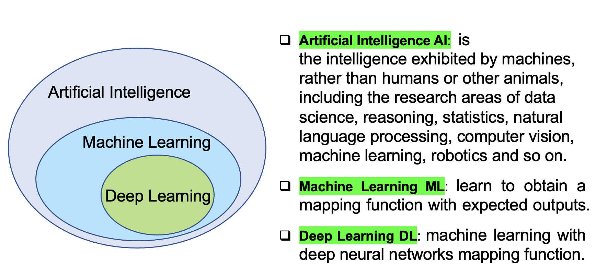

**List six subareas of AI:**
Knowledge Data science, Reasoning, Statistics, Nature Language Process (NLP), Planning, Computer Vision (CV), Neuroscience, Machine Learning (ML), Robotics and so on.
**the differences between traditional ML & DL?**

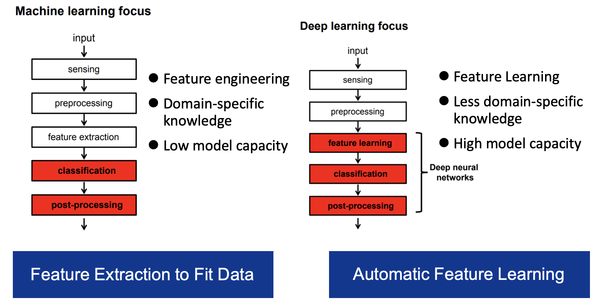

|diff|Traditional  ML|DL|
|--|--|--|
|feature|feature engineering|feature learning|
|domain-specific knowledge|more|less|
|model capacity |low |high |

## Terminology

- records 记录 = instance 实例 = sample 样本 = feature vector  特征向量 = example 样例(严格：有了 label 的 sample)
- attribute 属性 = feature 特征
attribute value 属性值
attribute space 属性空间 = sample space 样本空间（维数 dimension $d$
- label 标签 prediction 预测
label space 标签空间
- training：training sample - training set
- testing：testing sample
- ground truth 真实 learner 学习器 hypotheis 假设
学习器从真实中学习假设
- version space 版本空间：同时多个符合训练集的假设。
- inductive bias 归纳偏好。算法在学习过程中对某种类型假设的偏好。学习算法自身在一个可能很庞大的假设空间中对假设进行选择的启发式或”价值观“
    > 偏好 复杂 | 简单 奥卡姆剃刀 **Occam‘s razor**
    > 偏好 某个特征，权重设置

## Task

- ==Classification 分类==。 binary, multi-class
Decision Tree, Naive Bayes, k-Nearest Neighbor (KNN), Support Vector Machines (SVM), Logistic Regression
- ==Regression 回归==。real-valued, multi-output, functional
- ==Ranking==。 pointwise, pairwise, listwise
- ==Transcription 转录==。非结构化的数据 ➡️ 离散的文本形式。
    > 文字识别, 语音识别
- ==Machine Translation 机器翻译==。A语言符号**序列** ➡️ B 语言符号**序列**
- ==结构化输出==。输出 🟰 向量｜其它包含多个值的数据结构，并且构成输出的不同元素之间具有重要关系。
    > 理论上包括转录&翻译
    > 语法分析：句子➡️语法结构树，标记树的节点为 动｜名｜副
    > 图像的像素级分割：将像素分配到特定类别。：标注航拍中的道路。
    > 为图片添加描述。
- ==异常检测==。在一组事件或对象中筛选出，并标记**不正常｜非典型**的个体。
    > 信用卡欺诈检测
- ==合成｜采样==。生成一些和训练数据相似的新样本。希望输出的结果是更加自然和真实。
    > 视频游戏自动生成大型物体或风景的纹理
    > 语音合成【结构化输出】
- ==缺失值填补==。给定一个新样本，填补样本中缺失的元素。
- ==去噪==。输入 🟰 经过未知损坏过程后的**损坏样本** $\tilde{x}$；输出 🟰 干净样本 $x$｜条件概率 $p(x|\tilde{x})$
- ==密度估计｜概率质量函数估计==。。。。。
  
## ML

==“Machine learning== is the field of study that gives computers the ability to  learn without being explicitly programmed.” — Arthur Samuel (1959)
“A computer program is said to learn from experience E with respect to  some class of tasks T and performance measure P, if its performance at  tasks in T, as measured by P, improves with experience E.” — Tom  Mitchell (1998)

### 分类

==Supervised learning==。learning $x\xrightarrow{P(y|x)} y$ with labels｜targets.

!!! warning "生成模型 & 判别模型 $\in$ Supervised learning"

- ==生成模型==。学习得到**联合概率分布** $P(x,y)$ 然后求条件概率分布。以 统计学 & bayes 为理论基础。
    > 朴素贝叶斯，混合高斯模型，隐马尔可夫模型
- ==判别模型==。学习得到**条件概率分布** $P(y|x)$
    > SVM，决策树。LR，。。。。

==Unsupervised learning==: learning $P(x)$ without labels.

- ==clustering 聚类==
- representation
- self-supervised
- generative models/AIGC

!!! p "监督学习 & 无监督学习 界限是模糊的。"
    因为没有客观的判断来区分监督者提供的值**是 feature｜target**。通俗地说，无监督学习的大多数尝试是指从不需要人为注释的样本的分布中抽取信息。
    > $p(x)=\prod\limits_{i=1}^np(x_i|x_1,\dots,x_{i-1})$ 无监督学习 $p(x)$ 可被分解成 n 个监督学习问题。
    > $p(y|x)=\cfrac{p(x,y)}{\sum\limits_{y'}p(xy')}$ 有监督学习 $p(y|x)$ 用无监督学习的法子先学习联合分布。

==Semi-supervised learning 半监督学习==。一些样本有，一些样本没有。
==Reinforcement learning 强化学习==。machine takes an action; teacher provides rewards

- control
- pricing
- games

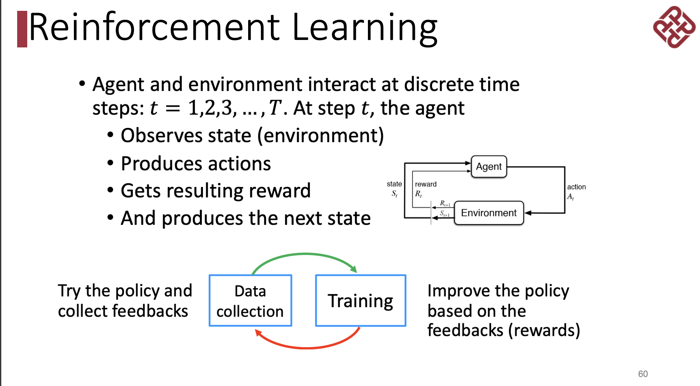{width=80%}

==Semi-supervised / active learning==

Evaluation  words
**Representation**: how to encode the raw data?
**Generalization**: how well can we do on unseen data?
**Interpretation**: how to explain the findings?
**Complexity**: how much time and space?
**Efficiency**: how many samples?
**Privacy**: how to respect data privacy?
**Robustness**: how to degrade gracefully under (malicious) error?

==Big data== is a collection of data sets so large and  complex that it becomes difficult to process using on-  hand database management tools or traditional data  processing applications.

**Characteristics of Big Data:** **4V**
Volume
Velocity
Variaty
Veracity

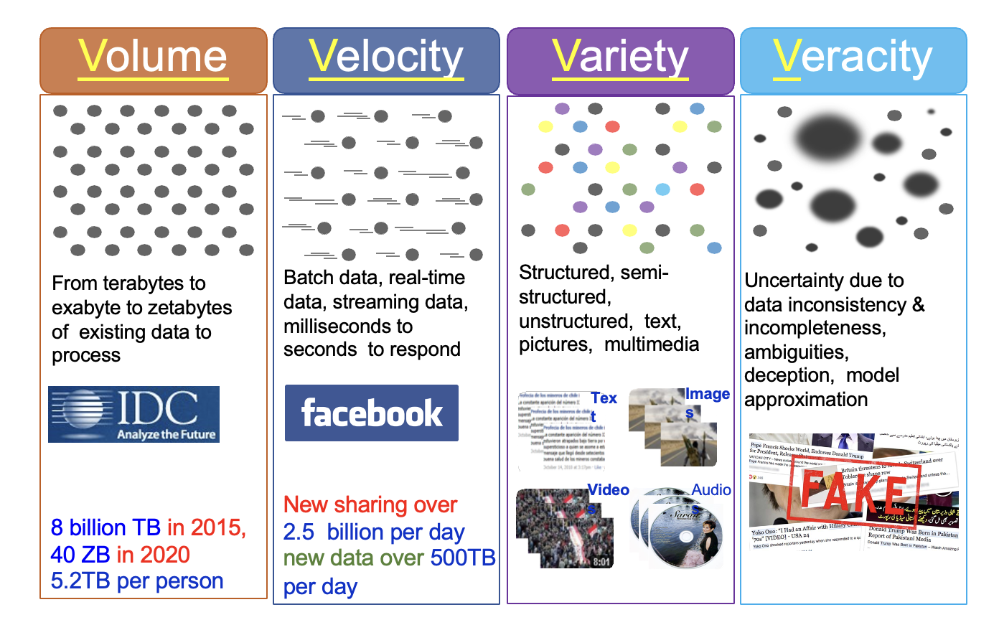{width=80%}

## Assumption

==独立同分布 independent & identically $(i.i.d.)$==。假设样本空间中全体样本服从一个未知 “分布 distribution” $D$，现有的每个 sample 都是独立地从这个分布上采样得到的。

关于分类

有很多的分类模型，他们各自有各自的作用原理，也有各自的几何表示。但归根其本质还是estimate distribution.

<figure markdown="span">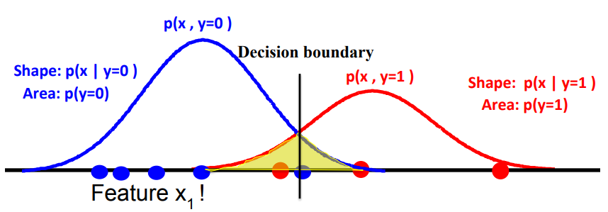
贝叶斯 长这样
</figure>
<figure markdown="span">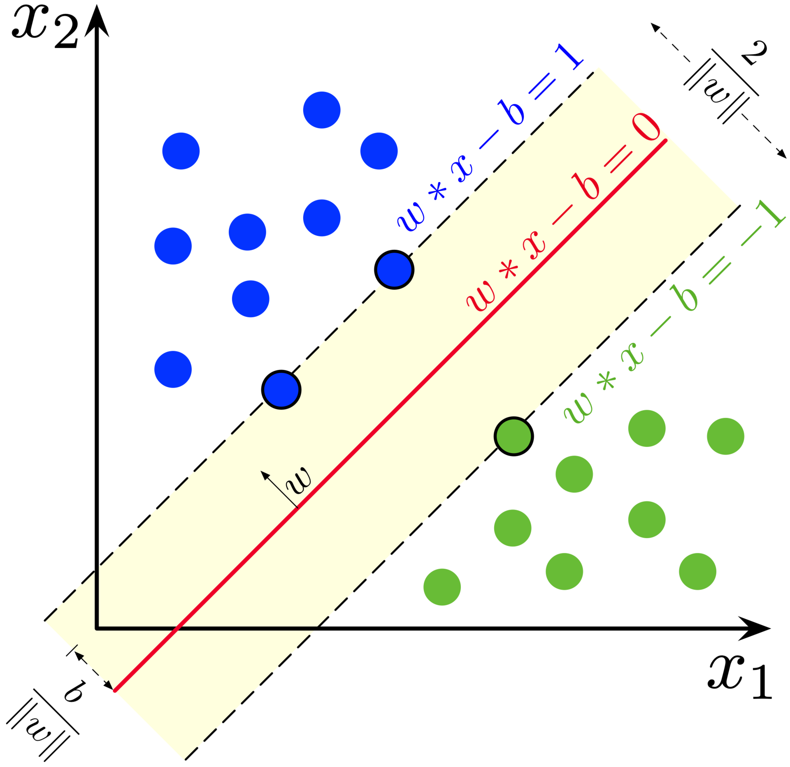{width=70%}
SVM 长这样，这个其实也是一个分布
</figure>

## identifiability of model 模型的可识别性

[Statistical Modelling and Identifiability of Parameters](https://www.analyticsvidhya.com/blog/2021/05/statistical-modelling-and-identifiability-of-parameters/)

参数的 ==可识别性 identifiability== 使我们能够获得该参数值的精确估计值。在没有可识别性的情况下，即使有无限次观测，我们也无法估计参数θ的真实值。
> X～N(a+b, σ) is not identifiable
> X～N(μ, σ) is identifiable
> 每个不同的 μ 都指向一个不同的期望，指向不同的正态分布，同样地每一个拥有不同期望的正态分布都能唯一求出一个 μ。但是对不同的 a 和 b 来说，a+b 也许是相同的，意味着一个正态分布并不能唯一推断出 (a, b, σ)的值。（e.g. (1, 1, σ) = (0, 2, σ)

## DNN

!!!p "why it is difficult for neural networks to be deep before 2010s."
    1. No enough computation resources,
    2. No enough training data,
    3. Gradient vanish problem and no advanced optimization techniques

## condition

!!! p "Product Rule, Chain Rule and Bayes’ Rule?"
    Product Rule: P(y)P(x|y)=P(x,y)
    Chain Rule: P(A1A2A3…An)= P(A1|A2A3…An) P(A2|A3A4…An)… P(An-1| An) P(An)
    Bayes’ Rule: $P(F|E)=\cfrac{P(E|F)P(F)}{P(E|F)P(F)+ P(E|\neg F)P(\neg F)}$

> ❓Suppose 1 in 1000 persons has a certain disease. We have two test methods: 1️⃣  detect the disease (produce positive results) in 99% of the diseased persons and in 5% of the healthy persons (false alarm). 2️⃣ : detect the disease (produce positive results) in 90% of the diseased persons and in 1% of the healthy persons (false alarm). Which test method is better? Give the reason.
>
> 💡
>
> D:={Diseased person}; H={Healthy Persons}, +I ={Persons with positive results with Test method I}, +II ={Persons with positive results with Test method II }
$P(D)=0.001,\\ P(+I|D)=0.99, P(+I|H)=0.05,\\ P(+II|D)=0.90, P(+II|H)=0.01$
We compute the probability of a diseased person that can be detect by Test method I or Test method II, repectively, which is|
$P(D|+I)= \cfrac{P(+I|D)P(D)}{P(+I|D) P(D)+ P(+I|H) P(H)}=\frac{0.99\times 0.001}{0.99\times0.001+0.05\times0.999}=0.0194$
$P(D|+II)= \cfrac{P(+II|D)P(D)}{P(+II|D) P(D)+ P(+II|H) P(H)}=\frac{0.90\times 0.001}{0.90\times0.001+0.01\times0.999}=0.0826$
>
> $P(D|+ I)< P(D|+ II)$ It means if a person has the disease, it has more chance of being detected by Test Method II. So Test method II is better.

## search

!!! p "A search algorithm is admissible if it is guaranteed to find a minimal path to a solution whenever such a path exists."

### j

!!! p "Q4. the motivations of employing heuristics in solving AI problems?"
    1.A problem may not have an exact solution because of ambiguities in problem statement or available data
    2.A problem may have an exact solution, but the computational cost (time and space) of finding it may be prohibitive.

!!! p "informed search method"
    Hill-climbing search; A* algorithm; Best-first.

#### Best-first search

Best-first search is neither complete nor optimal ✅

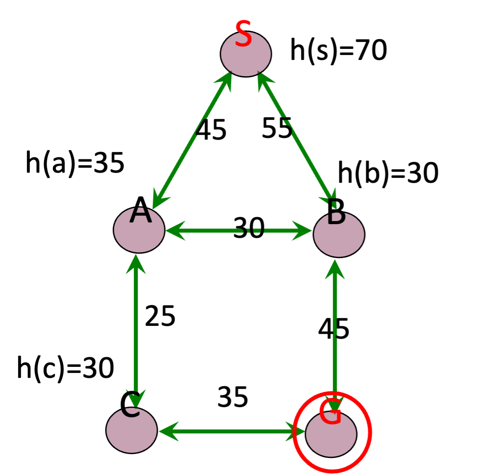{width=40%}

|step|open|closed|notes|
|--|--|--|--|
|1 | [S70] | [ ] | S=0+70|
|2 | [A80, B85] | [S70] | A=45+35 < B=55+30|
|3 | [B85, C100] | [A80, S70] | B85 < B_A=45+30+30 B85 < C= 45+25+30 |
|4 | [G100, C100] |  [B85, A85, S70] |G=55+45 =C100|
|5 |[]|[G100, C100, B85, A85, S70] |Goal reached. Stop.|

Solution path : S-B-G

!!! danger "Best-first $\xRightarrow{\forall n, h(n)\leq h^*(n)}$ A \*algorithm  Algorithm A* is a special best-first search algorithm ✔️"
    > example1

    |$n$|$h(n)$ heuristic estimation|?|$h^*(n)$  actual n$\rightarrow$ goal G|
    |--|--|--|--|
    S| 70 | < | 55 +45
    A| 35 | < | 25 + 35
    B| 30 | < | 45
    C| 30 | < | 35
    G| 0 | = | 0
    > All h(n)<=h*(n),so it is an A* algorithm and it is admissible. The path S-B-G is the shortest path.

### BNN, Bayesian Belief Net

A Bayesian Belief Net consists of a graph and some local conditional probabilities.

!!! p ""
    Serial connection:      $P(AVB)=P(B|V)P(V|A)P(A)$
    Diverging Connection:   $P(AVB)=P(B|V)P(A|V)P(V)$
    Converging Connection: $P(AVB)=P(V|AB)P(A)P(B)$
    Modus Ponens rule $\cfrac{a,a\implies b}{b}$

> 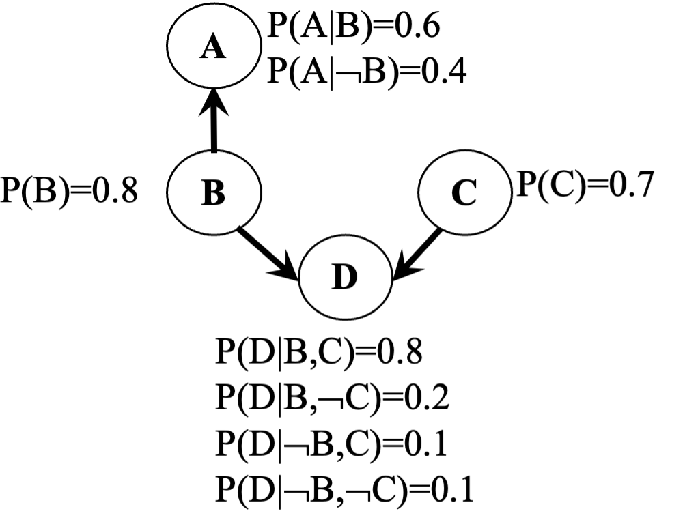{width=40%}
>
> $P(ABC)=P(AB)P(C)=.6*.8*.7=.336$
>
> $P(A)=.6*.8+.4*.2=.56$
>
> $P(AC)=P(A)P(C)=.56*.7=.392$
>
> $P(D|B)=P(D|BC)P(C)+(PD|B\neg C)P(\neg C)=.8*.7+.2*.3=.62$
> $P(D|\neg B)=P(D|\neg BC)P(C)+(PD|\neg B\neg C)P(\neg C)=.1*.7+.1*.3=.1$
> $P(B|D)=\cfrac{P(BD)}{P(D)}=\cfrac{P(D|B)P(B)}{P(D|B)P(B)+P(D|\neg B)P(\neg B)}=\cfrac{.62*.8}{.62*.8+.1*.2}=.9612$
> $P(B|\neg D)=\cfrac{P(B\neg D)}{P(\neg D)}=\cfrac{P(\neg D|B)P(B)}{1-P(D)}=\cfrac{(1-P(D|B))P(B)}{1-P(D)}=.6281$

### Breadth-firth search

!!! danger "If the search space contains very deep branches without solution, breadth-first search will be a better choice than depth-first search.  T"
    搜索空间包含非常深的分支 $\neq$ 目标在很深的分支里。
    <u>contains very deep branches without solution</u> 这个深的支是没有解，那么解在浅层的节点里 $\implies$ BFS better

!!! p "breadth-first search"
    ==storage cost==
    - branch factor $b$
    - storage cost $s$ bytes/node
    - search speed $v$ nodes/second
    - goal depth $d$
    $$\sum_{i=0}^db^i\times s$$
    > ❓ For a searching tree, assume that the branch factor is b=10, the storage cost is 1000 bytes/node and the searching speed is 10,000 nodes/second. With breadth-first search, what is the required storage space at depth 3?
    💡 At depth 3, the number of created nodes is 1+10+100+1000=111,1, and thus the storage space is 111,11000=11,11K bytes.

    ==time complxity==
    - branch factor $b$
    - goal depth $d$
    $$b^{d+1}$$

## 离散

!!! p "Why in some cases we need to use First Order Logic (FOL) rather than Propositional Logic (PL)?"
    1.Propositional logic (PL) is too “coarse” to easily describe properties of objects.
    2.First order logic (FOL) is to extend the expressiveness of PL.

!!! p ""
    Forward chaining in first order logic is a data-driven algorithm.
    Backwards chaining in first order logic is a goal-driven algorithm.

!!! p "$\forall$ & $\exist$"
    - $\forall x\forall y=\forall y\forall x$
    - $\exist x, y = \neg \forall x\neg y$
    - $\exist x\forall y\neq \forall y \exist x$

Satisfiable: A sentence is satisfiable if there is some interpretation for which it is true.
Unsatisfiable: A sentence is unsatisfiable if there is no interpretation for which it is true.
Valid: A sentence is valid if it is true for every
interpretation.

> Compute the loss of eight-puzzle
> 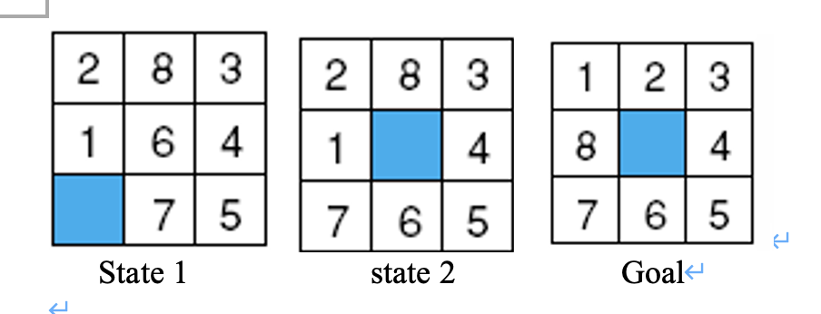{width=80%}
>
> ||1|2|3|4|5|6|7|8|
> |--|--|--|--|--|--|--|--|--|
> |State1|❌ 1|❌ 1|✔️|||❌ 1|❌ 1|❌ 2|
> |State2|❌ 1|❌ 1|✔️|||||❌ 2|
> ---
>
> ||Tiles out of place  不对的有几个|Sum of distances out of places  改回来需要几步|
> |--|--|--|
> |State1|5|6|
> |State2|3|4|

## dt

|?|High Entropy|Low Entropy|
|--|--|--|
|Distribution of variable| uniform like  | may have many peaks and valleys|
|histogram |Flat|may have many lows and highs|
|Values sampled from it|  less predictable|more predictable|
|information(about label) | Less| More|

> We flip two different coins independently for 16 times, which have the following results:
>
> Sequence 1 : 0 0 0 1 0 1 0 1 0 0 0 1 0 0 0 0 [0:1=12:4]
>
> Sequence 2 : 0 1 1 0 0 1 0 1 0 1 0 1 0 1 1 0 [0:1=8:8]
> Compute the information content (entropy) of the outcome of tossing these two coins, respectively.
>
> I(conin_toss_1)= -0.75log2(0.75)-0.25log2(0.25)=0.811 bits
> I(conin_toss_2)= -0.5log2(0.5)-0.5log2(0.5)=1 bits

## kmeans

!!! danger "Manhattan distance is <u>usually</u> larger than Euclidean distance. ✔️"
    当存在三角形形状，斜边比直角边加和要小

## parameter tuning

### Guess

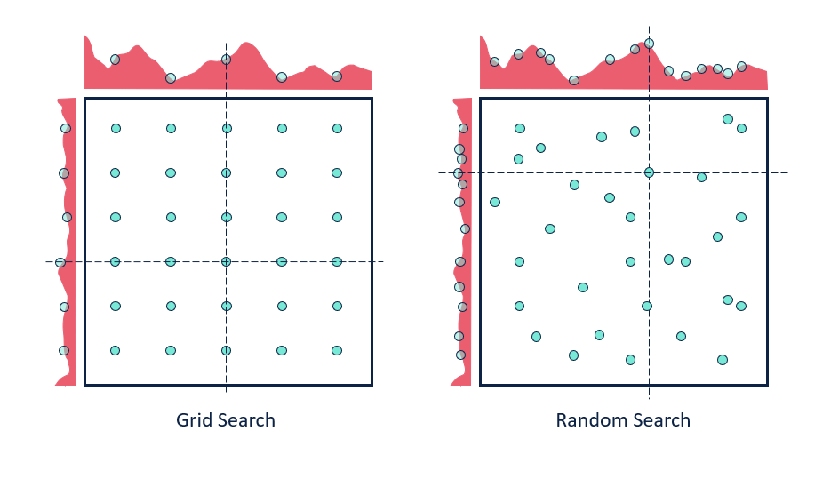{width=80%}

#### Grid Search

1. specify a **list** of possible hyperparameter values 需要人为设定超参数的范围
2. **Grid Search** will train models with every possible combination of the provided hyperparameter values and assess the performance of each trained model using a specified metric (e.g., the accuracy of predictions on a test data set). **Grid Search** 就会用设定区间内的**各种组合**进行训练并根据人为指定的metric进行assess

**Limitation：**

1. 事先很难知道最优是在哪里，所以是否找到最优很依赖人为选择的范围，并且只是进行范围内的compare，并不确定是否全局最小
2. 容易loss control，如果是2个hyper-parameter，每个有3个备选都要训练$3^2$个model

#### Random Search

**Idea** ==Monte Carlo method，蒙特卡洛法，统计模拟法==.
所求解问题可以转化为某种随机分布的特征数，比如随机事件出现的概率，或者随机变量的期望值。通过随机抽样的方法，以随机事件出现的频率估计其概率，或者以抽样的数字特征估算随机变量的数字特征，并将其作为问题的解。这种方法多用于求解复杂的多维积分问题。

**Loop: 1. Random guess 2. Check and compare 3. Update.**

1. provide statistical **distributions** of hyperparameter values 人为设定超参数的分布
2. **Random Search** **randomly** **samples** hyperparameter values from the defined distributions and then tests them by generating a model. **Random Search** 就会在设定分布内**随机sample**进行训练并根据人为指定的metric进行assess

**Advantage：**

1. 随机搜索有效地搜索了比网格搜索更大的配置空间。因为是随机取样
2. 找到这些显性超参数的最佳值将比获得所有超参数的最佳组合更有性价比
3. 重要的超参数因数据集而异。网格搜索就会很难具体制定某一个

## tuning parameter work

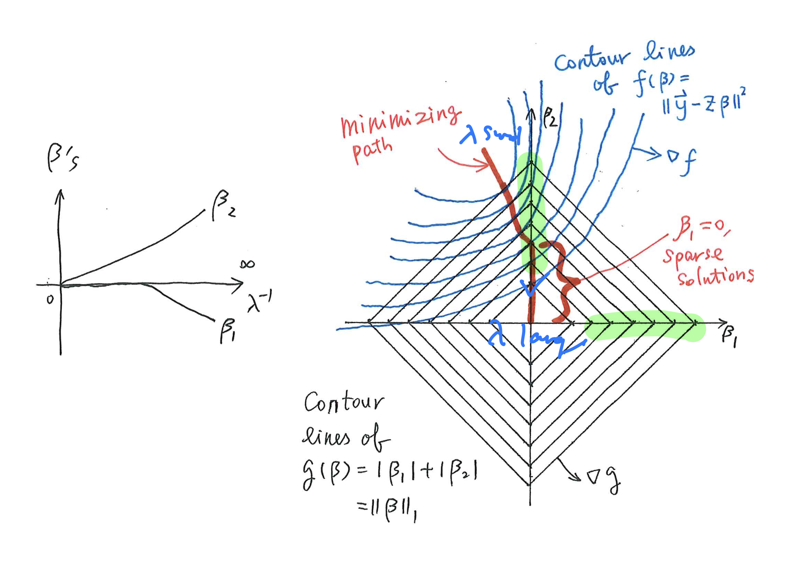
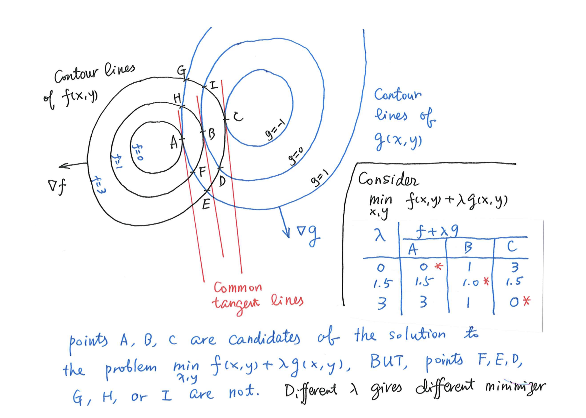
