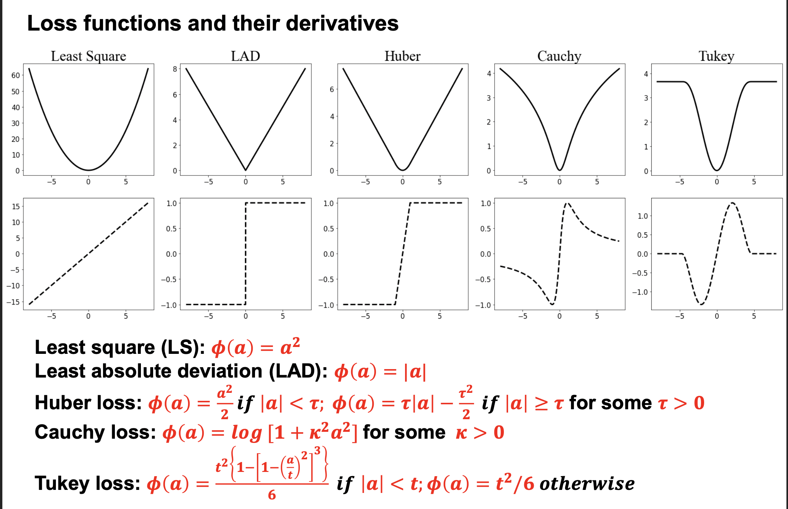
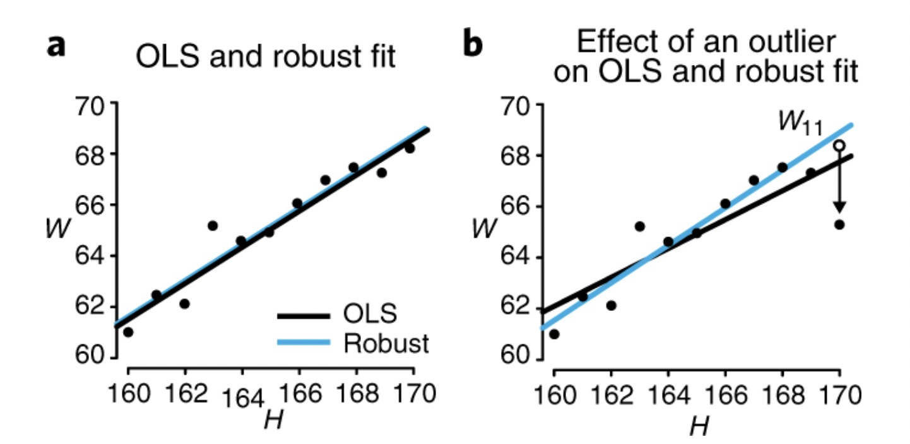
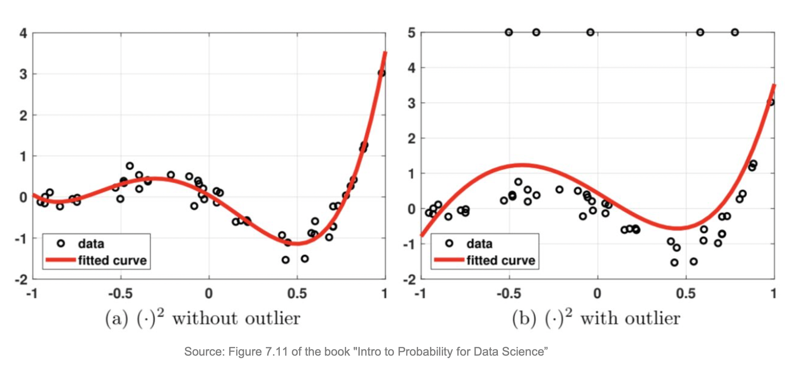
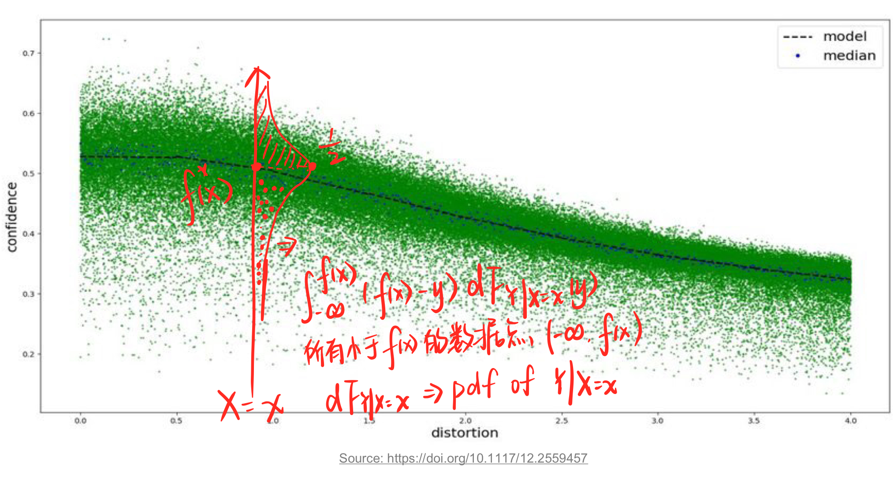
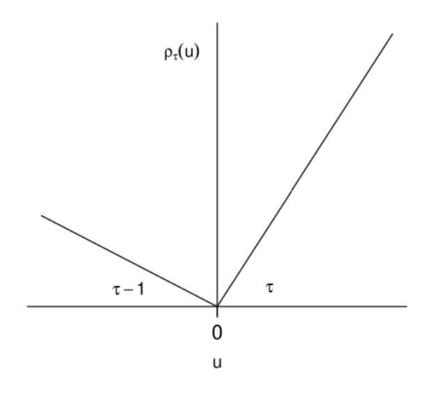
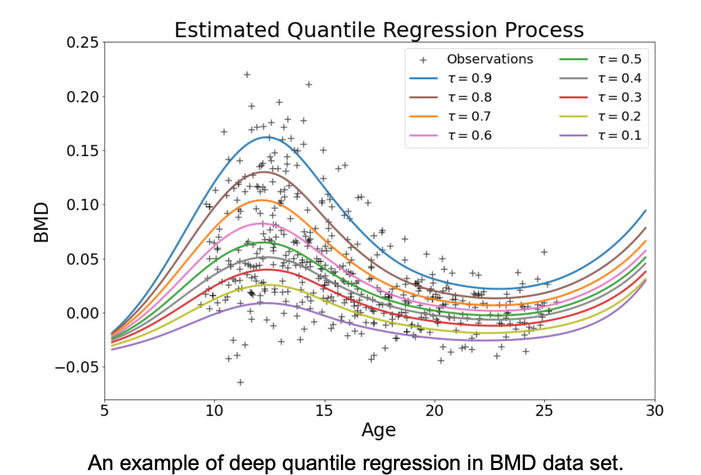
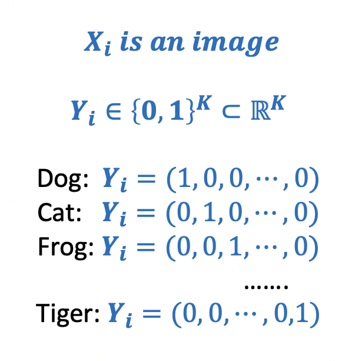

# Loss

**What do we care about？**

1. What types of errors do we care about？ 什么样的错误是我更关注的
    一些很微小的 errors 需要在意吗？
    一些错得很离谱的errors 我们要怎么调整它的权重呢？(outlier?)
    which class data do we care about？
2. How much do we care about the errors？ 我们非常在意这个错误吗？

**Two types of error 𝜂 are considered:**

1. Standard Cauchy distribution(with location parameter 0 and scale parameter 1)
$$η～\text{Cauchy}(0; 1);$$
2. Normal mixture distribution, denoted by “Mixture”,
$$η～ 0.8 × N(0,1) + 0.2 × N(0,10^4)$$

## Data Loss

==Data loss==: Model predictions should match training data. Loss over the dataset is an average of loss over examples:

做 data mining 目的是要找到数据的分布，这个时候的数据就是一个大的概念，真正的数据，属于population level，此时的所有数据的统计值包括均值，包括损失函数，都是 **expected 期望的，population 总体的**。但是我们不可能知道真正的数据分布是什么，因为在不知道具体分布情况下，我们只能通过极高极高数量的样本去靠近它，但是 observations 是无穷无尽的，我们几乎不可能靠有限的 observations 去找到数据分布。所以我们只能说我们收集样本，通过有限的样本去观测去 observe，此时我们所得到统计值只是建立在我们所采的样本，是 **empirical 经验**的。

### 结构风险 & 经验风险

$$\min_f\Omega(f)+C\sum_{i=1}^nl(f(x_i),y_i)$$

$\Omega(f)$, ==结构风险，structural risk==，描述 $f$ 的某些性质。==正则化项==
**结构经验最小化**可以看作是采用了**最大后验概率估计**的思想来推测模型参数，不仅依赖数据，海依靠模型参数的先验假设。

$\sum\limits_{i=1}^nl(f(x_i),y_i)$, ==经验风险，empirical risk==，描述 $f$ 与数据的契合程度. = ==训练误差 training error==
**经验风险最小化**可以看作是采用了**极大似然**的参数评估方法，更侧重从数据中学习模型的潜在参数，只看重数据本身。

$C$，折中

> |实质计算|概率角度|～|
> |--|--|--|
> |最小二乘法 |最大似然估计 MAE| $(y-\hat{y})^2$|
> |岭回归 |最大后验估计 MAP|引入正则项 $P(w), w^2$|
>
> 最大似然法 $\xrightarrow{\text{奠定}}\\\xrightarrow{\text{概率解释}}$ 最小二乘法
最大后验估计 $\xrightarrow{\text{奠定}}\\\xrightarrow{\text{概率解释}}$ 岭回归
> (最小二乘法 & 最大似然法),(岭回归 & 最大后验估计) **形式实质相等，实质思想一致，但出发角度不同**
> 最大后验估计是增加了 $p(w)$先验，作为正则项存在。
> |～|最大似然|最大后验估计|
> |--|--|--|
> |目标函数|$P(x\vert w)$|$P(w\vert x)=\cfrac{P(x\vert w)P(w)}{P(x)}$|
> |假设|$\epsilon～N(0,\sigma^2)$高斯噪声|$\epsilon～N(0,\sigma_\epsilon^2)$高斯噪声 $w～N(0,\sigma_w^2)$高斯先验|

从结构风险最小化的角度上看，$\Omega(f)$ 希望获得具有何种性质的模型(e.g. 复杂性较小 or 引入领域知识 or 加入用户意图)，有助于削减假设空间，从而降低了最小化训练误差的过拟合风险。

!!! danger "如果在一个完全相同的训练集上训练出五个不同的模型，哪怕他们单个准确率都很高，将它们使用投票集成组合成一个新的分类器，通常也会带来更好的结果。尤其是模型之间非常不同，例如(SVM, DT, LR, ...) 效果更优。"
    !!! question "如果他们是不同的训练实例上完成训练，那就更好了"

\\\qquad \rightarrow \begin{cases}R_{LAD}(f)=\mathbb E\Vert Y-f(X)\Vert_1&\text{population level}\\R_n(f)=\frac{1}{n}\sum\limits_{i=1}^n\Vert Y_i-f(X_i)\Vert_1&\text{empirical risk}\end{cases}$

### loss functions

**requirements:** (其实本质上就是预测点和实际真实点的 **distance measure** )

1. symmetric
2. non-negative
3. identified
4. 尽可能的 robust

{width=80%}

#### 0-1

$$L_i=I(Y_i\neq f(X_i;\theta))$$

<figure markdown="span">{width=40%}
non-continuous, non-smooth 
</figure>

**extremely complicated ! The optimization problem is extremely hard !**

#### Least Squares Error, LSE, L2-loss —— conditional mean

$$L_i=(Y_i-f(X_i;\theta))^2$$

Regression → Ordinary Least Squares (OLS) according to estimation 分类

**Targets**: **conditional mean** $\iff f^*(x)=\mathbb E(Y|X=x)=\min\limits_f\mathbb E\mathbb\{(Y-f(X))^2|X=x\}$

**Properties:**

1. differentiable and convex
    Differentiability allows us to take the **derivative** and locate the **minimum** point. Convexity allows us to claim a **global** **minimizer** (also unique if the objective function is strictly convex).
2. 会更重视 outliers

!!! danger "LSE fail with contaminated data   数据存在 outliers 的时候就容易不 robust"
    - 因为平方放大了差别 $\text{large}\rightarrow\text{large}^2,\text{small}\rightarrow\text{small}^2$. 和 outlier 相对应的 loss 就会 dominate the empirical risk, 在 regression with outliers 里就会更偏向 approximate the outliers, the fitted curve has been distorted quite significantly.
    - LSE 预测出来的 conditional mean，其中 outlier 点有参与计算，（比起 median 来说 mean 是更容易受到 outlier 影响，更不 robust metric）
    

    {width=60%}
    {width=60%}
    

#### Least Absolute Deviation, LAD —— conditional median

$$\Vert Y_i-f(X_i)\Vert_1=|Y_i-f(X_i;\theta)|$$

**Targets**: **conditional median** $\iff f^*(x)=\text{median}(Y|X=x)=\min\limits_f\mathbb E\{\vert Y-f(X)\vert\: |X=x\}$

{width=80%}

- proof $f^*(x)=\text{median}(Y\vert X=x)=\min\limits_f\mathbb{E}\{\Vert Y-f(X)\Vert_1\vert X=x\}$
  Assume:
    - $\forall x, \mathbb{E}[Y|X=x]\lt\infin$(存在)
    - $F_{Y|X=x}(\cdot):=$ the conditional cdf of $Y|X=x, \begin{cases}\text{cdf of} -\infin=0\\\text{cdf of} +\infin=1\\\text{cdf of median} =\frac{1}{2}\end{cases}$

$$\begin{align*}
\mathcal{L}(f)&=\mathbb{E}\{\Vert Y-f(X)\Vert_1\vert X=x\}\\
&=\int_{-\infin}^{f(x)}f(x)-y\text{d}F_{Y|X=x}(y)+\int_{f(x)}^{+\infin}y-f(x)\text{d}F_{Y|X=x}(y)\\
\cfrac{\partial\mathcal{L}(f)}{\partial f}&=\int_{-\infin}^{f(x)}1\cdot\text{d}F_{Y|X=x}(y)+\int_{f(x)}^{+\infin}-1\cdot\text{d}F_{Y|X=x}(y)\\
&=F_{Y|X=x}(y)\Big\vert_{-\infin}^{f(x)}-F_{Y|X=x}(y)\Big\vert^{+\infin}_{f(x)}\\
&=F_{Y|X=x}(f(x))-0-1+F_{Y|X=x}(f(x))\xlongequal{SET}0\\
\implies & F_{Y|X=x}(f(x))=\cfrac{1}{2}\implies f(x)\text{ is median}
\end{align*}$$

**Properties:**

1. No amplification 放大. $\text{large}\rightarrow\text{large},\text{small}\rightarrow\text{small}$. 在很多数据的情况下， their contributions are less prominent. （如果太多 strong outliers 依旧会failed
2. **try to downplay the importance of the data point with a large deviation.** 尝试以较大的偏差淡化数据点的重要性。
3. Non-differentiable.
    exists an alternative approach for solving this problem: using linear programming 单纯形法

#### Check Loss function —— conditional quantile

!!! p "Which class of data do we care about？ We can trace the Quartile"

$$L_i=\rho_τ(a)=(τ-I\{a<0\})*a=\begin{cases}τa&a>0\\(τ-1)a&a<0\end{cases}$$

<figure markdown="span">{width=80%}</figure>
<figure markdown="span"></figure>

**Targets: conditional median** $\iff f^*(x)=τ-\text{th quantile of }(Y|X=x)=\argmin_f\mathbb\{\Vert Y-f(X)\Vert_1｜X=x\}$

- proof:
  Assume:
  - $\forall x, \mathbb{E}[Y|X=x]\lt\infin$(存在)
  - $F_{Y|X=x}(\cdot):=$ the conditional cdf of $Y|X=x, \begin{cases}\text{cdf of} -\infin=0\\\text{cdf of} +\infin=1\\\text{cdf of median} =\frac{1}{2}\end{cases}$

$$\begin{align*}
\mathcal{L}(f)&=\mathbb{E}\{\rho_τ\cdot\Vert Y-f(X)\Vert_1\vert X=x\}\\
&=\int_{-\infin}^{f(x)}(τ-1)(y-f(x))\text{d}F_{Y|X=x}(y)+\int_{f(x)}^{+\infin}τ(y-f(x))\text{d}F_{Y|X=x}(y)\\
\cfrac{\partial\mathcal{L}(f)}{\partial f}&=\int_{-\infin}^{f(x)}(1-τ)\cdot\text{d}F_{Y|X=x}(y)+\int_{f(x)}^{+\infin}-τ\cdot\text{d}F_{Y|X=x}(y)\\
&=(1-τ)F_{Y|X=x}(y)\Big\vert_{-\infin}^{f(x)}-τF_{Y|X=x}(y)\Big\vert^{+\infin}_{f(x)}\\
&=(1-τ)(F_{Y|X=x}(f(x))-0)-τ(1-F_{Y|X=x}(f(x)))\xlongequal{SET}0\\
\implies & F_{Y|X=x}(f(x))=τ \implies f(x)\text{ is τ th quantile of}
\end{align*}$$

  $F_{Y|X=x}(f^*(x))=τ,\forall τ\in(0,1)\implies f^*(x)=F_{Y|X=x}^{-1}(τ)$ **will be the conditional** 𝝉–th quantile of 𝒀|𝑿 = 𝒙

#### Hinge Loss

$$L_i=\sum\limits_{j≠y_i}\max(0,s_j-s_{y_i}+1)$$

#### Squared Hinge Loss

$$L_i=\sum\limits_{j≠y_i}\max(0,s_j-s_{y_i}+1)^2$$

#### Softmax

$$L_i=-\log\Big(\cfrac{\exp(s_{y_i})}{\sum\limits_j\exp(s_j)}\Big)$$
更关注少见的错误

## Regularization - measure complexity and penalize

Prevent the model from doing *too* well on training data, control 复杂度

## according to problem

### classification

- data: $(X_i,Y_i),i=1,\dots,n,X_i\in\R^p,Y_i$ is categorical
- Classifier: $\mathcal{F}=\{f:f(\cdot)\in \text{dom}(Y)\}$
- input: $X_i\in\R^{p}\iff X\in\R^{n\times p}$
- output: $\hat{y_i}\in \text{dom}(Y)$

因为Y是属于label型，并没有 numerical meaning，我们只在乎**whether sample is assigned into the correct label or not**

回归的时候处理的是误差，所以要最小化，而现在考虑的是联合概率，我们希望概率尽可能大，所以要最大化

<figure markdown="span">{width=40%}
多分类  Adjust the output of neural network
</figure>

#### the number of success 错有多少的角度

因为是类别，所以没有numerical意义，只有属于和不属于。所以我们先想到的是：Indictor & 0-1 loss

##### From 0-1 loss

==Empirical Risk with 0-1 Loss==.
$$\min_f R(f) =\cfrac{1}{n}\sum\limits_{i=1}^nI(f(X_i≠Y_i))$$

!!! danger "0-1 loss is non-continuous, non-smooth."
    

    <figure markdown="span">{width=40%}
non-continuous, non-smooth
</figure>
    
but we expect: <b>continuous, smooth</b>  💡 <u>Surrogate Loss function 代理</u>。Proper surrogate loss function will lead to a consistent classifier.

    

##### Surrogate Loss function

==Surroogate Loss Function==。$L_i=\phi(f(X_i,\theta)\times Y_i) $.
$\phi$ is continuous and decreasing.

==Empirical Risk with Surroogate Loss Function==。
$$\min_f R(f) =\cfrac{1}{n}\sum\limits_{i=1}^n\phi(f(X_i,\theta)\times Y_i)$$

**properties of** $\phi(\cdot):$

1. continuous: 能通过梯度求解优化
2. decreasing: $f(Χ_i,\theta)Y_i\uparrow\iff \phi(f(X_i,\theta)\times Y_i)\downarrow $
$\begin{cases}Y_i=+1&\xrightarrow{\text{force}} f(X_i,\theta)>0\uparrow\implies\hat{Y_i}=+1 \\Y_i=-1&\xrightarrow{\text{force}} f(X_i,\theta)<0\downarrow \implies \hat{Y_i}=-1\end{cases}$

|  | $\phi(\cdot)$ | Loss Function |
| --- | --- | --- |
| 0-1 loss: | $I(\cdot)$ | $I(y\cdot f(x,\theta)<0)$ |
| Exponential loss (AdaBoost) | $e^{-(\cdot)}$ | $e^{-y\cdot f(x,\theta)}$ |
| Logistic loss  | $\log\{1+e^{-(\cdot)}\}$ | $\log\{1+\exp(-y\cdot f(x,\theta))\}$ |
| Hinge loss (SVM) | $\max\{1-(\cdot),0\}$ | $ \max\{1-y\cdot f(x,\theta),0\}$ |

{width=50%}

#### The Likelihood 似然的角度 Cross Entropy

==The Likelihood Function==

$\small{[P(_i=(1,0,...)|X_i=x)]^{I(Y_i=(1,0,...))}\times\dots\times [P(Y_i=(0,...,1)|X_i=x)]^{I(Y_i=(0,...,1))}}\\
=\prod\limits_{j=1}^{\text{\#category}}[P(Y_i=j|X=x)]^{I(Y_i=j)}\\
=[\hat{y_{i1}}]^{I(Y_{i1}=\red{1})}\times[\hat{y_{i2}}]^{I(Y_{i2}=\red{1})}\times\dots\times [\hat{y_{ij}}]^{I(Y_{ij}=\red{1})}\times\dots, \red{\begin{cases}\hat{y_i}=(\hat{y_{i1}},...,\hat{y_{ij}}\dots)\\\hat{y_{ij}}=P(Y_i=j|X=x)\\\hat{y_{ij}}\in[0,1],\sum\limits_{j=1}^m\hat{y_{ij}}=1\end{cases}}\\
=[\hat{y}_{i1}]^{Y_{i1}}\times[\hat{y}_{i2}]^{Y_{i2}}\times\dots\times [\hat{y}_{ij}]^{Y_{ij}}\times\dots,\qquad \red{Y_{ij}\in\{0,1\}:=X_i\text{是不是属于}j类}$

$$L(Y_i|X_i)=\prod \limits_{j=1}^{\text{\#category}}[\hat{y}_{ij}]^{Y_{ij}}=[\hat{y}_{i1}]^{Y_{i1}}\times[\hat{y}_{i2}]^{Y_{i2}}\times\dots\times [\hat{y}_{ij}]^{Y_{ij}}\times\dots$$

==Log Likelihood Function==. $l(Y_i|X_i)=\log(L(\cdot))=\sum\limits_{j=1}^{\text{\#category}}Y_{ij}\times\log[\hat{y_{ij}}]\\\qquad =Y_{i1}\log[\hat{y}_{i1}]+Y_{i2}\log[\hat{y}_{i2}]+\dots+Y_{ij}\log[\hat{y}_{ij}]+\dots$

##### Cross Entropy

==Cross Entropy Loss==. $\text{CELoss}_i =-\sum\limits_{j=1}^{\text{\#category}}Y_{ij}\times \log \hat{y}_{ij}$

==Empirical Risk with Cross Entropy Loss==. $R(f)=\frac{1}{\text{\#sample}} \sum\limits_{i=1}^{\text{\#sample}}\Big[-\sum\limits_{j=1}^{\text{\#category}}Y_{ij}\times \log \hat{y_{ij}}\Big]=\cfrac{1}{\red{n}} \sum\limits_{i=1}^{\red{n}}\Big[-\sum\limits_{j=1}^{\text{\red{m}}}Y_{ij}\times \log \hat{y_{ij}}\Big]$

$\begin{cases}n:=\text{\#samples},m:=\text{\#catrgories}\\Y_{ij}\in\{0,1\}, \hat{y_{ij}}\in[0,1],\sum\limits_{j=1}^m\hat{y_{ij}}=1\end{cases}$

首先它是联合概率。概率都是1以下的数，所以像联合概率这种概率乘法的值会越来越小。[插图] 的确如此。如果值太小，编程时会出现精度问题—— **为什么float16会损害正确率**

可以说交叉熵是直接衡量两个分布，或者说两个model之间的差异。而似然函数则是解释以model的输出为参数的某分布模型对样本集的解释程度。因此，可以说这两者是“同貌不同源”，但是“殊途同归”啦。

## 📑 ref
- [Understanding the Bias-Variance Tradeoff]
- [偏差（Bias）与方差（Variance）]
- [【深度学习】一文读懂机器学习常用损失函数（Loss Function）]
- [Chapter 7 Regression]

[偏差（Bias）与方差（Variance）]: https://zhuanlan.zhihu.com/p/38853908
[Understanding the Bias-Variance Tradeoff]:http://scott.fortmann-roe.com/docs/BiasVariance.html
[【深度学习】一文读懂机器学习常用损失函数（Loss Function）]:https://cloud.tencent.com/developer/article/1165263
[Chapter 7 Regression]: https://probability4datascience.com/ch07.html
