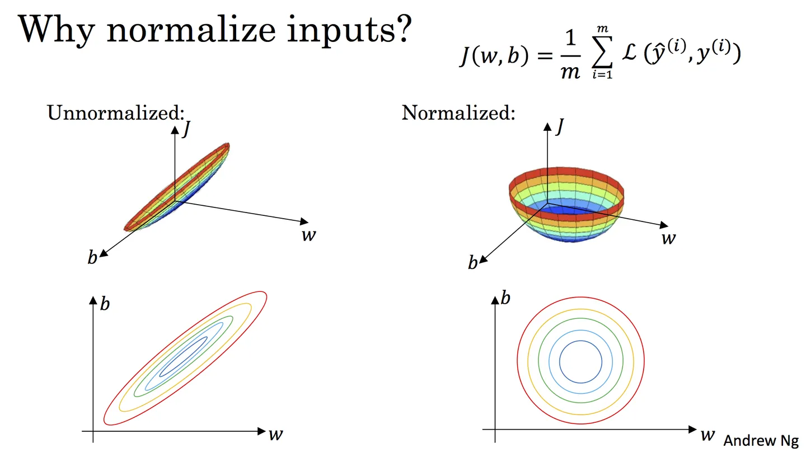

# 预处理

!!! p ""
    "Garbage in，garbage out”
    数据和特征往往决定了结果的上限，而模型、算法的选择及优化则是在逐步接近这个上限

|数据|结构化数据|非结构化数据|
|--|--|--|
||关系型数据库的一张表，每列都有清晰的定义|没有简单的清晰定义|
||数值型,类别型|文本、图像、音频、视频数据|
||有限，可列|?|

数据预处理没有标准的流程，一般包括这几个步骤：
**去除唯一属性→处理缺失值→属性编码→数据标准化→特征选择→主成分分析**等。
特征工程中有很多处理数据的小技巧，如**多重共线性的分析、异常值的检测**等。
[ML 入门：归一化、标准化和正则化]

## duplicate data

在异源, heterogeneous sources 比较容易出现。比如说一个人在不同的网站使用不同的邮箱
Data cleaning Process

## 缺失值处理

缺失值补全的方法有均值插补、同类均值插补、建模预测、高维映射、多重插补、极大似然估计、压缩感知和矩阵补全

- ==drop 缺失值的样本==
适用于训练数据量较大并且缺失数据占总数据比例不超过2%的情况
- ==插补==
样本属性的距离是可度量的值, 他的大小增减是具有意义的，numerical
    - 所有样本的众数
    - 同类样本的众数
- 计算
    - 对每个可能值计算概率
    - ==建模预测==
    用其他非空特征的数据训练一个模型，用模型预测缺失值的特征

## 组合特征

为了提高复杂关系的拟合能力，在特征工程中经常会把<u>一阶离散特征两两组合</u>，构成高阶组合特征

- 基于决策树的特征组合寻找方法

### 属性变量处理

> 【存在顺序关系】「高中低」= {1, .5, 0}
> 【不存在顺序关系】「男女」= {1, 0}

### 连续变量处理

- 无监督
    - 等深分箱： 每个分箱<u>样本数量</u>一样
    - 等宽分箱： 每个分箱<u>取值范围</u>一样
- 高斯分布模拟
- 有监督
    - 二分法
      对连续取值的属性按选定的阈值 a 分割成 $x\gt a, x\le a$
      确定 a：$\forall a$ 扫描数据集获得计数矩阵并计算基尼系数。穷举复杂度 $O(n^2)$
    - MDL, 最小描述长度
      二分法的拓展，多个区间
  
### 类别编码

==序号编码, Ordinal Encoding==。排序
类别间具有大小关系，有优劣关系
**缺点:** 稀疏向量，纬度高，占空间，
  
!!! p "优化"
    1. 稀疏表示，节省空间
    2. 特征选择，减少维度，合并特征

==独热编码, One-hot Encoding==。只有某一维取值为1，其他都是0
类别间不具有大小关系的特征，无分优劣

==二进制编码,Binary Encoding==。1.序号编码2.转为类别ID对应的二进制编码。本质上是利用二进制对ID进行**哈希映射**，最终得到0/1特征向量，且**维数少于独热编码**，节省了存储空间。
无要求

>> 血型 A，B，AB，O
>
> **One-hot Encoding**
> A   (1, 0, 0, 0)， B   (0, 1, 0, 1)
> AB (0, 0, 1, 0)， O   (0, 0, 0, 1)
> **Binary Encoding**
> 0A, 1B, 2AB, 3O
> A 00； B 01；AB 10； O 11

### 高维度

**问题:**

- ==KNN==，高维空间下两点之间的距离很难得到有效的衡量；
- ==Logistic Regression==，参数的数量会随着维度的增高而增加，容易引起过拟合问题；
- 通常只有部分维度是对分类、预测有帮助

## 去量纲 → Normalization 数据标准化

==Normalization， 数据标准化==是将数据按比例缩放，使之落入<u>一个大致相同数值区间</u>上，从而消除数据之间量纲的差异。通过标准化处理，可以使不同的特征具有相同的尺度（Scale）

!!! p "为什么要去量纲？"
    - 数量级大的will dominate the signal →可能模型变差
      > 比如样本中有两个属性（年龄、年收入），两个个体的属性值分别为（25、60000）和（55、61000），如果不进行数据的标准化，直接将两个属性的差异值（30, 1000）作为个体的差异程度，就会得出年收入的差异远大于年龄差异的结果，而实际上却明显是年龄的差异远大于年收入的差异
    - 数量级不一样可能会使收敛更慢. 模型会倾向于<u>数值差别比较大</u>的特征，导致寻优变慢
      > $z=ax+by,x\in[0,10],y\in[0,3]$
      > 梯度下降法：$\nabla w = -\frac{\partial f}{\partial w}*\alpha \implies \nabla a = -x*\alpha, \nabla b = -y*\alpha$
        $\because x>>y \therefore\nabla a>\nabla b$, a 参数容易跳跃
      
      

      **标准化后可以更加容易地得出最优参数以及计算出** J(w,b) **的最小值，从而达到加速收敛的效果** 
    - 单位不同会影响distance-sensitive的模型较大。依赖于样本距离的算法对于数量级非常敏感。

通过<u>梯度下降法</u>求解的模型通常是需要归一化的，包括线性回归、逻辑回归、支持向量机、神经网络等模型。

!!! quote "数据归一化失效"
    但对于决策树模型则并不适用，以C4.5为例，决策树在进行节点分裂时主要依据数据集D关于特征x的信息增益比，而信息增益比跟特征是否经过归一化是无关的，因为归一化并不会改变样本在特征x上的信息增益

==线性函数归一化, Min-Max Scaling==. 对原始数据进行线性变换，使结果映射到[0, 1]. $x_i'=\cfrac{x_i-\min(A)}{\max(A)-\min(A)}$

1. 新数据可能会导致 max 和 min 的值发生变化，需要**重新定义**。
2. **对离群点敏感**，因为离群点会导致最大值或最小值发生很大的变化，从而改变样本数据的统计分布规律

==z-score==. 会将原始数据映射到 $N(0,1)$.$x_i'=\cfrac{x_i-\mu}{\sigma},\begin{cases}\hat\mu=\cfrac{1}{n}\sum\limits_{i=1}^nx_i\\\hat\sigma=\sqrt{\cfrac{\sum\limits_{i=1}^n(x_i-\hat\mu)^2}{\red{n-1}}}\end{cases}$

!!! warning "要求样本属性值数据服从正态分布，这就要求**样本数量足够多**，<u>样本数量太少时无法保证能达到此要求</u>，因此不适合使用Z-score标准化。"
需要注意的是，这里除以 n-1 而不是 n，是因为使用样本对方差进行估计是有偏估计，除以n-1 **是对这个偏差的修正**

<figure markdown="span">
Z-score Normalization （a. origin; b. after extracting mean; c. after z-score Normalization）
</figure>

[ML 入门：归一化、标准化和正则化]:https://zhuanlan.zhihu.com/p/29957294
