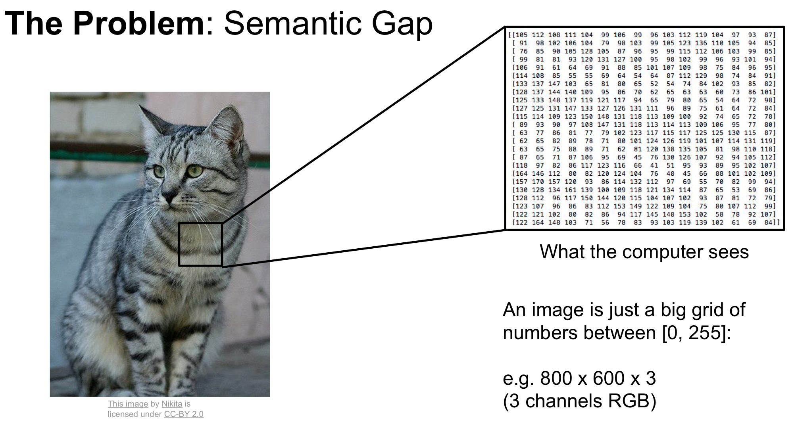

# Introduction

## Problems

- **Viewpoint variation**，观察角度的变化
    “不识庐山真面目，只缘身在此山中”。
- **Scale variation**，尺度变换
- **Deformation**，变形
    猫是液体。
- **Occlusion**，遮挡
- **Illumination**，光线
- **Background Clutter**，背景干扰
    如果物体和背景有很相似的颜色和纹路，那么就很难被识别。
- **Intra-class variation** 种间差异
    同一物种可能也有差异很大的形态

## Data

## image

## Image Classification

## KNN

- :question:距离是什么
  ==**p**ixel-wise== 像素级别
  $$ d_{L1}(I1, I2)=\sum\limits_{p}|{I_1}_p-{I_2}_p| $$
