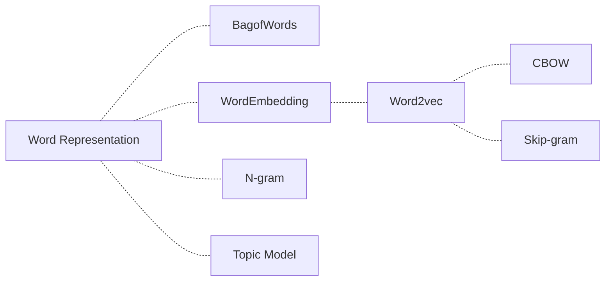
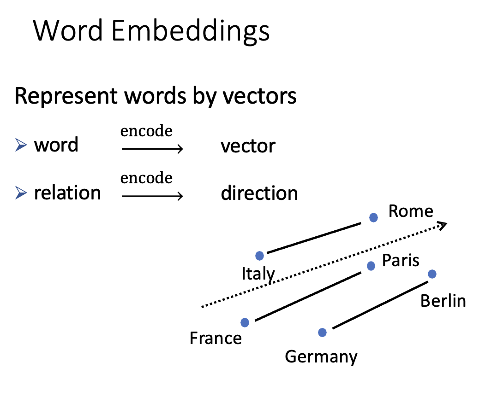
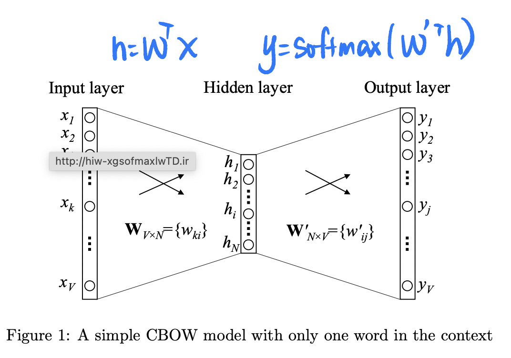
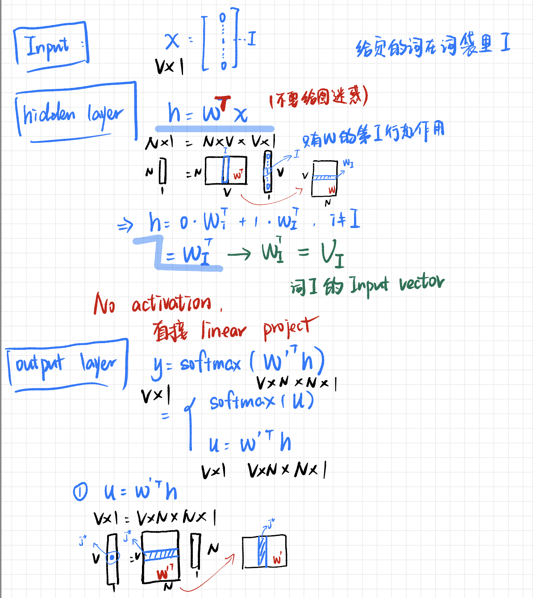
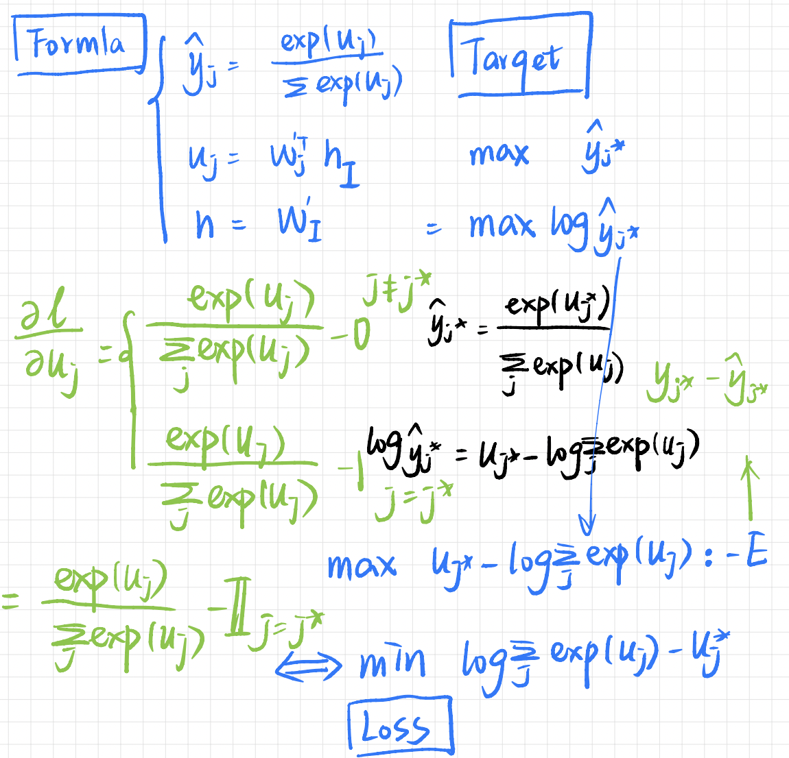
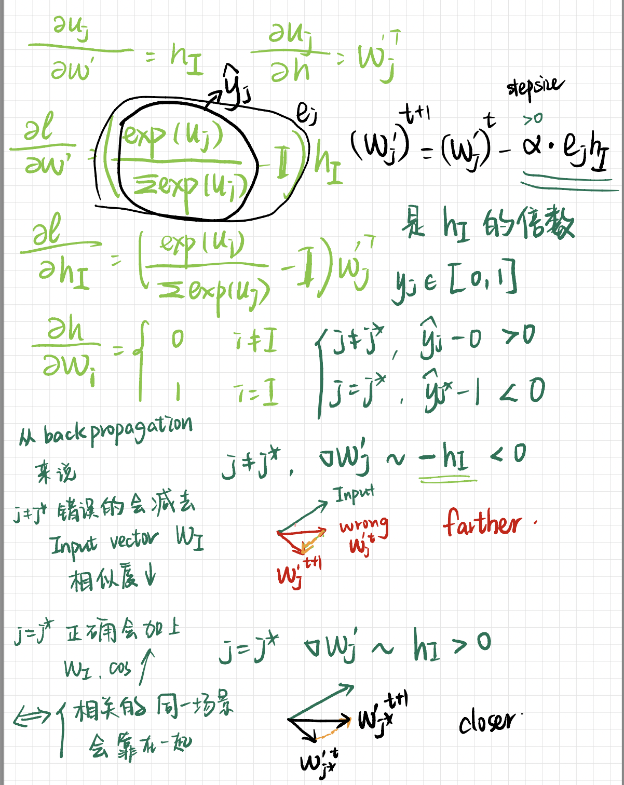

# Word Representation

==Word Stemming，词干抽取== 将不同词性、形态的单词统一成为同一词干的形式

## TFIDF

**理解：**

- TF：如果一个词在这篇文章中出现很多次，那么它可能是这篇文章的关键词
- IDF：如果一个词在很多文章中里都出现，那么它可能是一个比较通用的词

## 词袋模型 Bag of Words

维度是词袋的大小，独热编码
单纯用词袋模型 Binary vector 是行不通的：
    1. 过于高维，几十万的词就得有几十万的维度
    2. 过于傻瓜，不能通过 向量的数值 体现更多的信息
    3. 过于依赖，未出现在词袋的词不能表示

## N-gram

连续出现的n个词组成的词组 as 一个单独的特征

## Topic Model

每个主题上面词的分布特性），并且能够计算出每篇文章的主题分布

## Word Embedding

!!! danger "与全连接的网络结构相比，卷积神经网络和循环神经网络一方面很好地抓住了文本的特性，另一方面又减少了网络中待学习的参数，提高了训练速度，并且降低了过拟合的风险。"

==a word embedding== is a representatin of a word.
将文本映射到数学空间中，以向量的形式可以保留其语义, 旨在用向量的运算推导出语义。
将每个词都映射成低维空间（通常K=50～300维）上的一个稠密向量。

> 'King' - 'Man' + 'Woman' = 'Queen'

{width=80%}

## Background

!!! p "不仅是本义相似要在一块，高度相关的也要在一块"
    words that are closer in the vector dpace are expected to be ==similar(cosine)== in meaning

!!! warning "Word Similarity 相似 & Linguistic Relationships 相关"
    - Word Similarity ～ Synonyms
        讲究同义，相似意义，可以替换而不影响本义
    - Linguistic Relationships
        侧重相关，不能替换
        |relationship|example|
        |--|--|
        父子级 | 法国-巴黎
        反义|正-负

## Algorithm

!!! p "个人理解"
    过程类似于：学习一个抽象词比如`高兴`，一开始并不确切知道是什么，但是当读完很多篇文章，标为`积极`的情感的文章大部分有它，标为`消极`的文章确很少有它。此时大概能摸索出`高兴`属于积极的一类词，它语义的某一部分组成就是`积极`。
    ==通过下游任务来确定词义== $\implies$ 不同的下游任务将决定词义的获得
    > word2vec 的下游任务，就是**预测附近的词**

### Word2Vec

!!! warning "实际的 word2vec 就是一个==三层神经网络=="
    网络层(#神经元)：输入层$(V)\xrightarrow{W\in[V\times N]}$ 隐藏层$(N)\xrightarrow{W'\in[N\times V]}$ 输出层 $(V)$  
    {width=60%}

!!! danger "训这样一个带一个隐藏层的NN是为了 这个==下游任务prediction task==， 但目的其实是要学这个 word embedding = ==隐藏层的权重=="
    **理解：** 模型中的每个隐层都可以认为对应着<u>不同抽象层次</u>的特征，抽取出一些高层的语义特征

$$
V:=\text{词袋大小 vocabulary}
\\N:=\text{嵌入维度 embedding = 隐藏层神经元大小}
$$

#### one-word context (最简单来说明)

通过 **back propagation** 使得 同在一个场景（也就是真实数据集所给的 pairs）的词语向量相似度会接近, similarity between word vector pairs，$\lrArr N$ 维空间中，相关性高的词语会靠近，相关性低低词语会相互远离。

==$\cfrac{\partial \text{loss}}{\partial W'}\implies\nabla W'_j\approx\begin{cases}-h=-W_I&j\neq j^*\\+h=+W_I&j=j^*\end{cases}\lrArr$ 一个输入对不同输出(相关性高和相关性低)的影响==

==$\cfrac{\partial\text{loss}}{\partial W_i}\implies\nabla W_i=\begin{cases}0&i\neq I\\\sum e_jW'_j&i=I\end{cases}\lrArr$ 不同的输出对一个输入的**拉扯**==

同时，经过很多轮 **iterations** 使得 一个词 在不同场景下的语义进行“加权组成”

{width=60%}
{width=60%}
{width=60%}
{width=60%}

||CBOW|Skip-gram|
|--|--|--|
|Same|Word2vec,浅层的神经网络|<|
|目标|根据上下文出现的词语 预测当前词的生成概率|根据当前词 预测上下文中各词的生成概率|
|网络结构|1->N|N->1|

#### CBOW, Continues Bag of Words ==n➡️1==

<u>相较于one-word context</u>

- input = 所有输入单词的平均 ⬅️ 只有一个输入的单词

#### Skip-Gram ==1➡️n==

- :question: skip-gram 的输出个数固定吗？
- :question: 用同一个$W'$怎么能输出 C multi- distribution 的结果？

#### Q&A

通过 Q&A 再次梳理关系，==基于 one-word context==

- :question: 为什么隐藏层的参数矩阵 $W$ 就是 word vector = word embedding？
从 input 和 target output来看：
    - **input** $x$ 是一个 binary vector，只有 given word(在词袋的索引是$I$ )是 1， 其余的都是 0。
      $\implies h=W^Tx$, 只有 $W^T$的一列 = $W$的一行 = $W_I$ 是有用的
    $\implies h=W_I$ ，传入模型的 就只有第 $I$ 那么一个词，也就 参数矩阵 $W$ 第 $I$ 行 $W_I$那么一个向量。
    所以非常自然地， ==$\text{word}_I\lrArr W_I\implies \text{words}_{in}\lrArr W_{in}$==
    - **target output** $\hat{y}$ 同样是一个 binary vector，只有 target word(在词袋的索引是$j^*$) 是 1， 其余都是 0。（和前面类似）
    $\implies \hat{y}=\text{softmax}(W'^Th)\rightarrow{\text{理想情况}}\begin{cases}\hat{y}_{j^*}=y_{j^*}=1\lrArr W'^T_{j^*}h=1&j= j^* \\\hat{y}_j=y_j=0\lrArr W'^T_jh=0&j\neq j^* \end{cases}$
    $\implies$ 输出模型的 就只有第 $j^*$ 那么一个词，除去代表输入词 的$h=W_I$, 也就 参数矩阵 $W'$第 $j^*$列 $W'^T_{j^*}$那么一个向量参与到运算。
    所以非常自然地， ==$\text{word}_{j^*}\lrArr W'^T_{j^*}\implies \text{words}_{out}\lrArr W'^T_{out}$==
        - **输入和输出同是一个词袋**，所以经过这个训练，同时==有两种不同==的嵌入
        - :question: 为什么不看 output？ 、
          因为 output 的值还跟模型能力有关。target output 更能体现理论上的设计。
- :question: 为什么 $W$,$W'$ 不一样
  1. $h=W_I$，输入完全由 $W_I$组成；
- :question: 为什么要扔掉 `contex matrix`，只要 `matirx`？
    其实选择 $W$还是$W'$作为 word embedding matrix 都是个人选择。
    $W$ ✅， $W'$ ✅， $\cfrac{W+W'}{2}$ ✅   ...
- :question: 为什么

##### 一些trciks

###### Hierarchical Softmax

###### Negative Sampling

数据集不应该只有 正确的 ‘A$\rightarrow$B’， ‘B$\rightarrow$C’，应该还有 ‘A$\nrightarrow$D‘,‘A$\nrightarrow$E‘

{width=50%}
