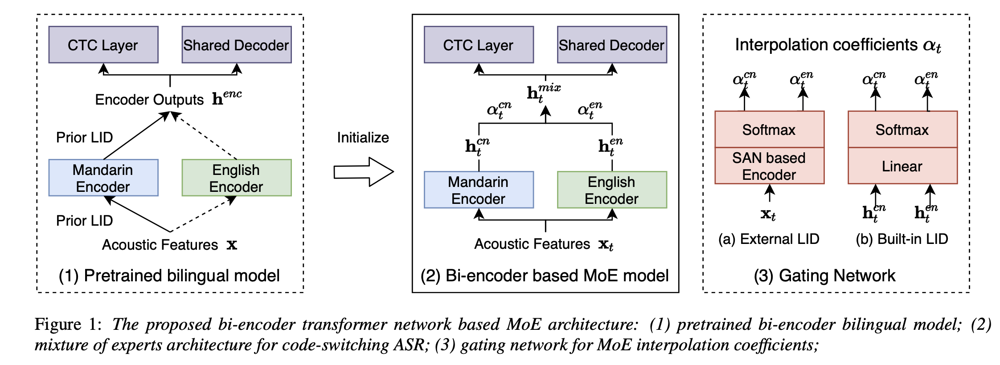

# Temp

## [Automatic Spelling Correction with Transformer for CTC-based End-to-End Speech Recognition]

==Connectionist Temporal Classification CTC==。CTC based end-to-end SR system usually need to incorporate an external language model by using WFST-based decoding in order to achieve promising results. This is more essential to Mandarin speech recognition since it owns a special phenomenon, namely homophone, which causes a lot of substitution errors.

!!! quote Abstract
    Connectionist Temporal Classification CTC based end-to-end SR system usually need to incorporate an external language model by using WFST-based decoding in order to achieve promising results. This is more essential to Mandarin speech recognition since it owns a special phenomenon, namely homophone, which causes a lot of substitution errors. The linguistic information introduced by language model will help to distinguish these substitution errors. **In this work, we propose a ==transformer-based== ==spelling correction== model to automatically correct errors especially the substitution errors made by ==CTC-based Mandarin speech recognition system==. Specifically, we investigate using the recognition results generated by CTC-based systems as input and the ground-truth transcriptions as output to train a transformer with encoder-decoder architecture, which is much similar to machine translation.**  Results in a 20,000 hours Mandarin speech recognition task show that the proposed spelling correction model can achieve a CER of 3.41%, which results in 22.9% and 53.2% relative improvement compared to the baseline CTC-based systems decoded with and without language model respectively.

[Automatic Spelling Correction with Transformer for CTC-based End-to-End Speech Recognition]:https://arxiv.org/pdf/1904.10045.pdf

## [Bi-encoder Transformer Network for Mandarin-English Code-switching Speech Recognition using Mixture of Experts]

[Bi-encoder Transformer Network for Mandarin-English Code-switching Speech Recognition using Mixture of Experts]:https://x-lance.sjtu.edu.cn/en/papers/2020/yzl23-lu-is2020.pdf

!!! quote Abstract
    Code-switching speech recognition is a challenging task which has been studied in many previous work, and one main challenge for this task is the lack of code-switching data. **In this paper, we study ==end-to-end== models for Mandarin-English ==code-switching== ==automatic speech recognition==.** **External monolingual data** are utilized to alleviate the data sparsity problem. More importantly, we propose **a bi-encoder transformer network based ==Mixture of Experts (MoE)== architecture** to better leverage these data. We **decouple Mandarin and English modeling with two separate encoders** to better capture language-specific information, and **a gating network is employed to explicitly handle the language identification task**. For the gating network, different models and training modes are explored to learn the better **MoE interpolation coefficients**. Experimental results show that compared with the baseline transformer model, the proposed new MoE architecture can obtain up to 10.4% relative error reduction on the code-switching test set.

In this work we focus on leveraging rich resources monolingual data to achieve a better code-switching ASR performance, and a new MoE structure is proposed to better handle Mandarin and English modeling.

The new approach mainly includes three parts: bi-encoder bilingual model pretraining, mixture of experts architecture construction and a gating network for MoE interpolation coefficients.
We train the transformer model with joint CTC-attention [11, 12] framework to exploit the advantages from both CTC and S2S models.
For the modeling units, we combine Chinese characters and English BPE subwords [31] as final units. We also apply SpecAugment [14] for all data through out our experiments.

<figure markdown="span">
<p class="notes"><b>Figure 1：The proposed bi-encoder transformer network based MoE architecture:</b><br> (1) pretrained bi-encoder bilingual model; (2) mixture of experts architecture for code-switching ASR; (3) gating network for MoE interpolation coefficients;</p></figure>

$$h^{cn}=\text{Mandarin Encoder}(x)\\h^{en}=\text{English Encoder}(x)$$

$$h_t^{mix}=\alpha_t^{cn}h_t^{cn}+\alpha_t^{en}h_t^{en}$$

$\begin{cases}\alpha_t^{cn},\alpha_t^{en}\in[0,1]\\\alpha_t^{cn}+\alpha_t^{en}=1\end{cases}$

1. Pretrain a bi-encoder bilingual model with only monolingual Mandarin and English data.
两个编码器结构可以不一样。
Since language identity for monolingual data can be obtained in advance, we are able to decouple Mandarin and English language with two separate encoder. As shown in the left part of Figure 1, when given acoustic features inputs, prior LID information is used to decide which encoder to use. Denote Xcn and Xen as the col- lection of all Mandarin inputs and English inputs separately, we formulate this procedure as:

1. **<u>Gating network</u> for MoE interpolation coefficients.**
    处理成 LID classification 二分类问题。
    output = probability of each language 直接是权重 $\alpha_t^{cn},\alpha_t^{en}$
    1. **External LID method.** Train a self attention network (SAN) based model
    input = raw features $x$
    2. **Built-in LID method**.
    input = the outputs of the two separate encoders $h^{cn}\& h^{en} $ 知道所谓的专家输出 = 高纬表达
    For this build-in LID method, the ASR and LID modules in this MoE architecture can be trained jointly, and the objective loss is changed to:

The LID and ASR are trained independently. To improve the performance of LID classifier, we adopt transfer learning strategy and a pretrained CTC model is used for initialization.

### Experimental setup

- Dataset:【CN:EN:CS=25:23:10】
**ASRU 2019 Mandarin-English code-switching Challenge** dataset (500 hours Mandarin data and 200 hours code-switching data) & a subset of 460 hours English data from **Librispeech corpus**
**DEV:** Additional 20 hours code-switching data
**TEST:** 3test sets: CN & EN & CS
- Data Preprocess
For acoustic feature, 80 dimensional log-mel filterbanks are extracted with a step size of 10ms and window size of 25ms, and utterance-level CMVN is applied on the fbank features.
    - modeling unit.
    we combine Chinese characters and English BPE subword units [31].

    ```mermaid
    graph LR
    A[Mandarin character]
    B{训练集<br>>25次}
    C[UNK]
    D[English data]
    E[modeling unit 4006]
    F[BPE units]
    G[SOS&EOS]
    A-->B--Y(3003)-->E
    B--N-->C--(1)-->E
    D-->F--(1000)-->E
    G--(2)-->E
    ```

- EVA
character error rate (CER) 纯 Mandarin
word error rate (WER) 纯 English
mix error rate (MER) 各自语言用各自统计
