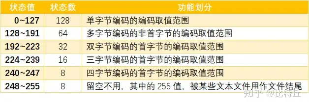
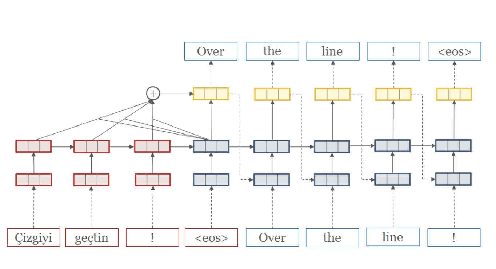

# Subword Segmentation

<div class="grid" markdown>
==vocabulary size== 字典的大小<br>
==step size== 去编码一个句子需要的 tokens数量。the number of tokens required to encode the sentence。 挂钩  decoding efficiency

> "今天吃啥" & "至今不吃"
>
> |size|vocabulary | step size
> |--|--|--|
> |6|今/天/吃/啥/至/不 | 4 & 4
> |5|今天/吃/啥/至今/不 | 3 & 3
> |5|今天/吃/啥/至今/不吃 |3 & 2

</div>

only with a small fixed size of vocabulary (**usually 16k to 32k**), the number of required symbols to encode a sentence will not significantly increase, which is an important feature for an efficient decoding.

!!! danger "open vocabulary issue"
    NLP 以前是使用 fixed word vocabularies, 训练和推断都很依赖 vocabulary size. 但是 limiting vocabulary size 会新增 `UNK` 的数量。导致一些场景下（an open vocabulary setting）（翻译、具有高效构词过程）表现不好。
    比起把这些高复合词编码成一个定长向量，更倾向编码成一个可分割的不定长的向量。

✏️ Break up rare words into subword units 把出现较少的词分割成更小的子词。

Neural Machine Translation with multiple subword segmentations

==NMT training with on-the-fly 即时 subword sampling==

Given a source sentence $X$ and a target sentence $Y$, let $x = (x_1,...,x_M), y = (y_1,...,y_N)$ be the corresponding subword sequences segmented with an underlying subword segmenter, e.g., BPE.
NMT models the translation probability $P (Y |X ) = P (y|x)$ as a target language sequence model that generates target subword $y_n$ conditioning on the target history $y_{<n}$ and source input sequence $x$:
$$P (\bold{y}|\bold{x};θ) = \prod_{i=1}^NP (y_n|\bold{x}, y_{<n}; θ)$$

A common choice to predict the subword $y_n$ is to use a RNN architecture. However, note that subword regularization is not specific to this architecture and can be applicable to other NMT architectures without RNN, e.g., (Vaswani et al., 2017; Gehring et al., 2017).
NMT is trained using the standard maximum likelihood estimation, i.e., maximizing the log- likelihood L(θ) of a given parallel corpus D =

Strictly speaking, wordpiece model (Schuster and Naka- jima, 2012) is different from BPE. We consider wordpiece as a variant of BPE, as it also uses an incremental vocabulary generation with a different loss function.

Wordpiece model uses a likelihood instead of frequency.

## Subword segmentations with language model

|?|BPE|unigram|
|--|--|--|
|encoder|dictionary encoder|entropy encoder|
||frequency|probabilistic model|
|multiple segmentations|❌|✅|

!!! p "BPE & unigram 【SAME】"
    the same idea that they encode a text using fewer bits with a certain data compression principle (dictionary vs. entropy).

### Byte-Pair-Encoding BPE

[Neural Machine Translation of Rare Words with Subword Units]

原始是 data compression literature。
BPE is a variant of dictionary (substitution) encoder that incrementally finds a set of symbols such that the total number of symbols for encoding the text is minimized.

**Steps:** 首先切成单个字符，再不断合并最频繁的，字典 size 一直变少到想要的 size。

1. splits the whole sentence into individual characters
2. The most **frequent** adjacent pairs of characters are then consecutively merged until reaching a desired vocabulary size

**advantage：**

- 有效平衡 vocabulary size & step size (the number of tokens required to encode the sentence)
- 合并组成子词只和子词的频率相关 $\implies$ 常见的词会被保留成一个单独的 symbol = 拥有自己的 ID。不常见的词会被分解成更小的单元（子字符串｜字符）。

**disadvantage：**

- 基于贪婪原则和确定的符号替代 deterministic symbol replacement $\implies$ 不能根据概率提供多重分割。

[Neural Machine Translation of Rare Words with Subword Units]: https://arxiv.org/pdf/1508.07909.pdf

### Unigram language model

On the other hand, the unigram language model is reformulated as an entropy encoder that minimizes the total code length for the text.

## Questions

!!! danger "multiple segmentation candidates"
    即使是同样的字典，还是有不一样的分割表示方式。is a spurious ambiguity
    However, a sentence can be represented in multiple subword sequences even with the same vocabulary.
    > > **Multiple subword sequences encoding the same sentence “Hello World”**
    >
    > Subwords( meansspaces)  Vocabulary id sequence
    > Hell/o/ world 13586 137 255
    > H/ello/ world 320 7363 255
    > He/llo/ world 579 10115 255
    > /He/l/l/o/ world 7 18085 356 356 137 255
    > H/el/l/o/ /world 320 585 356 137 7 12295

## [Subword Regularization: Improving Neural Network Translation Models with Multiple Subword Candidates]

!!! quote "Abstract"
    ==Subword units== are an effective way to alleviate the open vocabulary problems in neural machine translation (NMT). While sentences are usually converted into unique subword sequences, ==subword segmentation== is potentially ambiguous and multiple segmentations are possible even with the same vocabulary. **The question addressed in this paper is whether it is possible to harness the segmentation ambiguity as a noise to improve the robustness of NMT. We present a simple regularization method, ==subword regularization==, which trains the model with multiple subword segmentations probabilistically sampled during training.** In addition, for better subword sampling, we propose a new subword segmentation algorithm based on a unigram language model. We experiment with multiple corpora and report consistent improvements especially on low resource and out-of-domain settings.
    把子词分割当作噪声进行优化，从而提高鲁棒性。

Subword regularization consists of the following two sub-contributions:

- A simple NMT training algorithm to integrate multiple segmentation candidates. Our approach is implemented as an on-the-fly data sampling, which is not specific to NMT architecture. Subword regularization can be applied to any NMT system without changing the model structure.
我们提出了一种简单的 NMT 训练算法来集成多个分割候选者。我们的方法被实现为动态数据采样，这不是 NMT 架构所特有的。子字正则化可以应用于任何NMT系统，而不改变模型结构。
- A new subword segmentation algorithm based on a language model, which provides multiple segmentations with probabilities. The language model allows to emulate the noise generated during the segmentation of actual data.

A common choice to predict the subword $y_n$ is to use a RNN architecture. However, note that subword regularization is not specific to RNN and can be applicable to other NMT architectures without RNN.
NMT is trained using the standard maximum likelihood estimation, i.e., maximizing the log-likelihood L(θ) of a given parallel corpus D =

In this paper, we propose a new subword segmentation algorithm based on a unigram language model, which is capable of outputing multiple sub-word segmentations with probabilities. The unigram language model makes an assumption that each subword occurs independently, and consequently, the probability of a subword sequence

[Subword Regularization: Improving Neural Network Translation Models with Multiple Subword Candidates]: https://arxiv.org/pdf/1804.10959.pdf

## [Neural Machine Translation of Rare Words with Subword Units]

!!! quote "Abstract"
    Neural machine translation (NMT) models typically operate with a fixed vocabulary, but translation is an open-vocabulary problem. Previous work addresses the translation of out-of-vocabulary words by backing off to a dictionary. In this paper, we introduce a simpler and more effective approach, **making the NMT model capable of open-vocabulary translation by encoding rare and unknown words as sequences of ==subword units==**. This is based on the intuition that various word classes are translatable via smaller units than words, for instance names (via character copying or transliteration ), compounds (via compositional translation), and cognates and loanwords (via phonological and morphological transformations). 這是基於這樣的直覺：各種詞類都可以透過比單字更小的單位進行翻譯，例如名稱（透過字元複製或音譯轉寫）、化合物（透過組合翻譯）以及同源詞和外來詞（透過語音和形態轉換）。**We discuss the suitability of different word segmentation techniques, including simple character n-gram models and a segmentation based on the ==byte pair encoding== compression algorithm**, and empirically show that subword models improve over a back-off dictionary baseline for the WMT 15 translation tasks English→German and English→Russian by up to 1.1 and 1.3 BLEU, respectively.

我们的主要目标是在 NMT 网络本身中对开放词汇翻译进行建模，而不需要稀有词的回退模型，前者更有效。Our main goal is to model open-vocabulary translation in the NMT network itself, without requiring a back-off model for rare words.

Byte Pair Encoding (BPE) is a simple data compression technique that iteratively replaces the most frequent pair of bytes in a sequence with a single, unused byte.

Firstly, we initialize the symbol vocabulary with the character vocabulary, and represent each word as a sequence of characters, plus a special end-of-word symbol ‘·’, which allows us to restore the original tokenization after translation. We iteratively count all symbol pairs and replace each occurrence of the most frequent pair (‘A’, ‘B’) with a new symbol ‘AB’.

```python
import re, collections

def get_stats(vocab):
    pairs = collections.defaultdict(int) 
    for word, freq in vocab.items():
        symbols = word.split()
        for i in range(len(symbols)-1):
            pairs[symbols[i],symbols[i+1]] += freq
    return pairs

def merge_vocab(pair, v_in):
    v_out = {}
    bigram = re.escape(' '.join(pair))
    p = re.compile(r'(?<!\S)' + bigram + r'(?!\S)') 
    for word in v_in:
        w_out = p.sub(''.join(pair), word)
        v_out[w_out] = v_in[word] 
    return v_out

vocab = {'l o w </w>' : 5, 
        'l o w e r </w>' : 2, 
        'n e w e s t </w>':6,
        'w i d e s t </w>':3}
num_merges = 10
for i in range(num_merges):
    pairs = get_stats(vocab)
    best = max(pairs, key=pairs.get) 
    vocab = merge_vocab(best, vocab) 
    print(best, pairs[best])

# >>> ('e', 's')
# >>> ('es', 't')
# >>> ('est', '</w>')
# >>> ('l', 'o')
# >>> ('lo', 'w')
# >>> ('n', 'e')
# >>> ('ne', 'w')
# >>> ('new', 'est</w>')
# >>> ('low', '</w>')
# >>> ('w', 'i')
# >>> vocab = {'low</w>': 5, 'low e r </w>': 2, 'newest</w>': 6, 'wi d est</w>': 3}
# >>> pairs = {('low', 'e'): 2, ('e', 'r'): 2, ('r', '</w>'): 2, ('w', 'i'): 3, 
# >>> ('i', 'd'): 3, ('d', 'est</w>'): 3}
```

Each merge operation pro- duces a new symbol which represents a charac- ter n-gram. Frequent character n-grams (or whole words) are eventually merged into a single sym- bol, thus BPE requires no shortlist. The final sym- bol vocabulary size is equal to the size of the initial vocabulary, plus the number of merge operations – the latter is the only hyperparameter of the algo- rithm.
For efficiency, we do not consider pairs that cross word boundaries. The algorithm can thus be run on the dictionary extracted from a text, with each word being weighted by its frequency. A minimal Python implementation is shown in Al-

## [Neural Machine Translation with Byte-Level Subwords]

!!! quote "Abstract"
    Almost all existing machine translation models are built on top of character-based vocabularies: characters, subwords or words.
    Rare characters from noisy text or character-rich languages such as Japanese and Chinese however can unnecessarily take up vocabulary slots and limit its compactness.
    Representing text at the level of bytes and using the 256 byte set as vocabulary is a potential solution to this issue. High computational cost has however prevented it from being widely deployed or used in practice.
    In this paper, we **investigate byte-level subwords, specifically ==byte-level BPE (BBPE)==, which is co**mpacter than character vocabulary and has no out-of-vocabulary tokens, but is more efficient than using pure bytes only is. We claim that **contextualizing BBPE embeddings is necessary, which can be implemented by a convolutional or recurrent layer**. 
    Our experiments show that BBPE has comparable performance to BPE while its size is only 1/8 of that for BPE. In the multilingual setting, BBPE maximizes vocabulary sharing across many languages and achieves better translation quality. Moreover, we show that BBPE enables transferring models between languages with non-overlapping character sets.

    - character-level: 稀少的会占用词典大小，会导致OOV，limit compactness
    - byte-level: 高计算成本
    - byte-level subword：需要用 CNN｜RNN 来 contextualize BBPE embedding。

[Neural Machine Translation with Byte-Level Subwords]:https://arxiv.org/abs/1909.03341

## BBPE

!!! quote "Abstract"
    Almost all existing machine translation models are built on top of character-based vocabularies: characters, subwords or words.
    Rare characters from noisy text or character-rich languages such as Japanese and Chinese however can unnecessarily **take up vocabulary slots and limit its compactness**.
    Representing text at the level of bytes and using the 256 byte set as vocabulary is a potential solution to this issue. **High computational cost** has however prevented it from being widely deployed or used in practice.
    In this paper, we investigate byte-level subwords, specifically **==byte-level BPE (BBPE)==, which is compacter than character vocabulary and has no out-of-vocabulary tokens, but is more efficient than using pure bytes only is.**
    **We claim that ==contextualizing BBPE embeddings== is necessary, which can be implemented by a convolutional or recurrent layer.** Our experiments show that BBPE has comparable performance to BPE while its size is only 1/8 of that for BPE.
    In the multilingual setting, BBPE maximizes **vocabulary sharing** across many languages and achieves better translation quality. Moreover, we show that BBPE enables **transferring models between languages** with non-overlapping character sets.

比 character-level 更 compacter, no out-of-vocabulary
比 byte-level 更 efficient, smaller
在 multi-lingual 上 能 vocabulary sharing & transferring models between languages

原本：data compression = 》 <kbd>byte</kbd> + <kbd>subword</kbd>

### Encoding

- UTF-8 encoding
- learn (B)BPE vocabularies jointly on source and target sentences using SentencePiece

!!! p "UTF-8 encoding"
    encodes each Unicode character into 1 to 4 bytes
    represent a sentence in any language as a sequence of UTF-8 bytes (248 out of 256 possible bytes).

    

    The design of UTF-8 encoding ensures the uniqueness of this recovery process: for a character UTF-8 encoded with multiple bytes, its trailing bytes will not make a valid UTF-8 encoded character. 

    [搞搞字节，byte的小知识](https://zhuanlan.zhihu.com/p/449954688)


BBPE symbols can be partial characters shared by different characters or the combination of complete and partial
characters. This arbitrariness may necessitate incorporating
a larger context surrounding each symbol for disambiguation and learning the character boundaries.

!!! p "==Contextualized（Dynamic）Word Embedding=="
    在很多的NLP工作里面，一个单词可以表示成很多种意思（即一词多义），如何处理一词多义、考虑单词在上下文中的意思
    [From Static Embedding to Contextualized Embedding](https://zhuanlan.zhihu.com/p/147938963)

We propose to use either **a depth-wise convolutional layer or a bidirectional recurrent layer with gated recurrent units** to contextualize BBPE embeddings before feeding them into the model

$$
x_{ctx\_emb}=\text{DepthWiseConv}(X_{emb})\\
x_{ctx\_emb}=\text{BiGRU}(X_{emb})
$$

### decoding

Empirically, we find that invalid outputs from trained models are very rare.

And a common error pattern in halftrained models is redundant repeating bytes. In our system,
we try to recover as many Unicode characters as possible
from this error pattern efficiently in linear time.

The design of UTF-8 encoding ensures the uniqueness of this recovery process: for a character UTF-8 encoded with multiple bytes, its trailing bytes will not make a valid UTF-8 encoded character. Then the best selection in Eq. 1 is unique and so is the final solution.

### Experiment

learn (B)BPE vocabularies jointly on source and target sentences using SentencePiece



learning rate schedule
set attention and ReLU dropout to 0.1
use 0.2 residual dropout for Tbase models in X-En
use a kernel size of 5 and a padding of 2 on both sides for all convolutional layers.

Inference and Evaluation

set beam width to 4 for EnDe and 5 for the other and
use the best checkpoint by **validation loss** to generate the predictions. 
We calculate casesensitive tokenized BLEU (Papineni et al. 2002) as the metrics using **sacreBLEU** (Post 2018).
