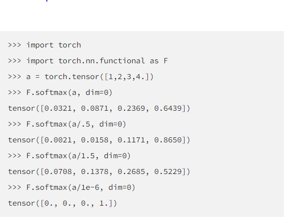

# Synthesize Training Data

## Introduction

for TvD, Teaching via Data
fine-tune lightweight student model for running system

## Limitations

1. 对一些像 NER 的 tasks（ICST, NER），不能生成 token-level label (slot tags) [<sup>1</sup>](#reference)
   - before：use a separate model to do work alignment. __Res:__ noise ↑
2. scoped，不能 control 它的 output

3. LLM 都是在真实的大型数据集上进行训练。由 LLM 合成的 generated data 受到 origin dataset 的影响,進一步 worse performance of the fine-tune model. [<sup>2</sup>](#reference)
   1. limit the diversity
    size of vocabulary of synthesing's << size of ground truth's
   2. inherit systematic biases
    词的 frequency 两极分化更严重
    -> sol:

## Approaches with gpt

### Prompt Format

#### HTML/XML [<sup>1</sup>](#reference)

- target: control output

!!! quote ""
    [CLM] Sentence: example1 \<br> Translation in French: ... \<br> Sentenc:target \<br> Translation in French:

    !!! quote "" 
    
        [CLM] Sentence: example1 <br> Translation in French: ... <br> Sentenc:target <br> Translation in French:

#### common

### for multi-languages

- Back-translate
    English -> French ->English

    !!! quote ""
        Senetence:... <br> Translation in English:

- Paraphrase

    !!! quote ""
        another way to say "...":

### for slot tags

#### LINGUIST[<sup>1</sup>](#reference)

**L**anguage Model **In**struction Tuning to **G**enerate Annotated **U**tterances for **I**ntent Classification and **S**lot **T**agging

!!! p task: joint intent classification and slot tagging = IC+ST
    outperforms state-of-the-art baselines like translation and paraphrasing

introduce an **output format** with **brackets and numbers** that enables the model to produce synthetic data with the slots already tagged.


!!! summary
    1. XML format
    2. 生成的 textdata 包括了 `[label, entity]`
    3. 最好是 few shots，0-shot $\implies$ more noise
    4. wildcard instruction `*` 自由发挥，which did not appear in the original examples
    5. 可以改 language

#### CLASP[<sup>1,7</sup>](#reference)

Few-shot **C**ross-**L**ingual Data **A**ugmentation for **S**emantic **P**arsing

!!! p "task: few-shot multilingual semantic parsing, SP"
    machine translation


!!! summary ""
    1. multi-language

### for diversity

#### AttrPrompt [<sup>2,8</sup>](#reference)

[AttrPrompt github]

- origin **SimPrompt**
    simple class-conditional prompt


##### process

For a given classification task

1. initail step
    identify attribute dimensions and their corresponding attribute values in an interactive, semi-automated process facilitated by the LLM.
    1. use `gpt` help establish both attribute dimensions and attribute values.
        !!! quote ""  
            Which attribute dimensions do you consider vital in determining the topic of a news article?”

            !!! quote "" 
                “subtopics, length, location, reader group, style, time”
    2. adopt the human-ai collaboration scheme to interactively select the attribute dimensions of **the highest quality** that best suit the dataset. **人为地选择** Best Top-N attributes.
    3. generate values corresponding to selected attributes similarly
        !!! quote ""
             List 10 diverse subtopics for {class_name} news on NYT.

        |atrrs|class-depe|class-indepe|
        |--|--|--|
        ||need value filtering|remain unchanged across different classes|
        |examples|subtopic|length|
    4. **Class-Dependent Attribute Value Filtering, CAF**
        - target： avoid ambiguity and potential connections to multiple classes
        对 gpt 根据任务给出的 Top-5 个相似 classes，$\forall \text{value}\in \text{class}$进行询问：是否和别的类相关。相关就 remove.

        !!! quote ""  
            List 5 similar classes for {class-name} news on NYT. The set of classes is listed as: {[a list of class-names]}.

            if the answer is positive which indicates a potential ambiguity, we remove that attribute value for the specific class. 

2. generate diverse prompts by combining attributes randomly.

    !!! quote ""
        Suppose you are a review writer. Please write a review for {product-class} product in Amazon following the requirements below:
       1. The review should be about the product of {subtopic};
       2. The brand for the product should be {brand};
       3. Should be in length between {length:min-words} and {length:max-words} words;
       4. Should describe the usage experience {usage-experience}
       5. The writing style of the review should be {style};
       6. the review must be relevant to {product-class} and irrelevant to: {similar-class}.

    !!! summary
        设计一种使用不同的attributed prompt（带有特征的prompt）生成训练数据的方法（比如限制长度、风格）
        展望：
        -  exploring automated or semi-automated methods for identifying high-quality attribute dimensions and values
        - Domain Limitation 只在 text classification 中
        - 生成的数据继承了 LLM 的 hallucination 幻觉问题(生成的文本中在语义或句法上看似合理但实际上不正确或无意义的错误)

#### increasing diversity wihile maintain accuracy [<sup>3</sup>](#reference)

!!! quote ""
    Write a movie review (text type) to cover all following elements
    Elements: positive sentiment (label)
    Movie review (text type): "This is a great movie"


``` python
openai.Completion.create(
    engine=’davinci’,
    prompt='q: What is the capital of france?\na:', 
    logprobs = 5,  # TopN the natural log of the probability
    stop = '\n', 
    temperature=0,
    logit_bias={Token_ID:logprob} # map: {6342:-1, 1582:-10}
    )

"""
- logit_bias:
    Accepts a json object that
    maps tokensto an associated bias value from -100 to 100
    token_ID: in the GPT tokenizer
"""
```

##### logit supression[<sup>9</sup>](#reference)

[OpenAI API]

- **Logit bias** parameter
  
    GPT3 的一个很有用的参数。通过 modify the likelihood of tokens 控制 token in [GPT Tokenizer(convert text to token IDs)] 的生成，unwanted tokens ↓， wanted tokens ↑.[<sup>9</sup>](#reference) **bias 会直接加到 gpt 生成的 logprob 上。**
    $\text{logprob}\begin{cases}-1|1&\uparrow\downarrow\text{the likelhood of tokens}\\-100|100&\text{禁止或者直接指定 }\end{cases}$
     [create-logit_bias in openAI Docs]

    !!! question
        - 中文？会有在那50000
        
        - only 100 tokens for logit biasing

- how gpt generate tokens
    When run, GPT-3 takes the prompt and predicts the probabilities of the token that is going to occur next. [<sup>9</sup>](#reference)
    **Rather than the percentages, logprobs is used. $\text{logprob}→0\iff\text{prob}↑$** .[<sup>9</sup>](#reference)

!!! quote ""  
    Specifically, for the logit bias weights, we multiplied the token appearance ratio (in percentage) by -7.5 while capping the minimum weight at –7.5.[<sup>9</sup>](#reference)

    !!! quote ""  
      1. 统计 tokens 的 frequency 
      2. logprob = 出现的 freq * -7.5（也就是说最低不可能超过 -7.5

##### temperature-based sampling[<sup>5,6</sup>](#reference)

温度 采样受到统计热力学的启发，其中高温意味着更有可能遇到低能态。在概率模型中，logits 扮演着能量的角色，我们可以通过将 logits 除以温度来实现温度采样，然后将其输入到 softmax 中并获得采样概率




!!! quote ""  
    0.3, 0.7, 0.9, and 1.3[<sup>3</sup>](#reference)

- [create-temperature in openAI Docs]
    $\text{temperature} \in[0,2]\begin{cases}\uparrow\ge0.8&\text{more random}\\\downarrow\le 0.2&\text{more focused and deterministic}\end{cases}$

!!! question more about sampling
    [The Curious Case of Neural Text Degeneration]
    We generally recommend altering this or top_p but not both.


## metrics

!!! danger the quality of synthesized training data [<sup>4</sup>](#reference)
    - fidelity
        how closely the synthetic data matches with the original data
    - utility
        synthetic data performs well on common tasks in data science
    - privacy
        protect sensitive information，此處沒管
    - diversity

- 【fidelity】
  
- 【utility】**Feature importance score**[<sup>4</sup>](#reference)
    檢查順序
- 【utility】**QScore？？？？？？？？？？？？？？？？**:
  This score is used to check if a model trained on synthetic data will give the same results as a model trained on original data. It does this by running random aggregation-based queries on both datasets and comparing the results. If the results are similar, it means the synthetic data has good utility.
- 【utility】the accuracies of models [<sup>3</sup>](#reference)

    !!! quote ""  
        We compared the accuracies of models trained with generated data to 1) models trained with oracle datasets (oracle model) and 2) GPT-3’s few-/zero-shot classifications

- label accuracy[<sup>3</sup>](#reference)
    the accuracy of the alignment between the generated texts and the specified labels

- 【diversity】average mean pairwise distances[<sup>3</sup>](#reference)
  - Remote-Clique metric cox2021directed, which is the average mean pairwise distances. S
  - we embedded generated data with BERT devlin2019bert, then calculated the distances

- 【utility】similarity between dataset [<sup>3</sup>](#reference)
 We also measured the similarity of the generated dataset to the oracle dataset with the average mean pairwise distances between the two. For similarity, we also used BERT to embed the generated texts.


- 【diversity】**vocalbulary size** for lexical diversity of datasets[<sup>2</sup>](#reference)


- 【diversity】**cosine similarity** for the diversity from the semantic perspective[<sup>2</sup>](#reference)
    - the cosine similarity is calculated based on the embedding of Sentence-BERT Reimers and Gurevych
    - cosine similarity ↓  diversity ↑


- 开销

    !!! quote ""  
        attributed prompt只需要simple prompt 5%的开销（主要用于query chatgpt）就可以达到和后者一样的效果。

## Reference

- [Using large language models LLMs to synthesize training data]
- [Large Language Model as Attributed Training Data Generator: A Tale of Diversity and Bias]
- [Increasing Diversity While Maintaining Accuracy: Text Data Generation with Large Language Models and Human Interventions]
- [HOW TO USE LLMS IN SYNTHESIZING TRAINING DATA]
- [temperature-based sampling（基于温度系数的采样）]
- [How to sample from language models]
- [CLASP: Few-Shot Cross-Lingual Data Augmentation for Semantic Parsing]
- [AttrPrompt：一个关于多样性与偏见的故事]
- [Controlling GPT-3 with Logit Bias]
- [The need for sampling temperature and differences between whisper, GPT-3, and probabilistic model's temperature]

[AttrPrompt github]: https://github.com/yueyu1030/attrprompt
[The Curious Case of Neural Text Degeneration]: https://arxiv.org/abs/1904.09751
[OpenAI API]: https://platform.openai.com/docs/api-reference/introduction
[create-logit_bias in openAI Docs]: https://platform.openai.com/docs/api-reference/completions/create#completions/create-logit_bias
[GPT Tokenizer(convert text to token IDs)]: https://platform.openai.com/tokenizer?view=bpe
[create-temperature in openAI Docs]: https://platform.openai.com/docs/api-reference/completions/create#completions/create-temperature
[Using large language models LLMs to synthesize training data]:https://www.amazon.science/blog/using-large-language-models-llms-to-synthesize-training-data
[Large Language Model as Attributed Training Data Generator: A Tale of Diversity and Bias]:https://www.arxiv-vanity.com/papers/2306.15895/
[Increasing Diversity While Maintaining Accuracy: Text Data Generation with Large Language Models and Human Interventions]:https://www.arxiv-vanity.com/papers/2306.04140/
[HOW TO USE LLMS IN SYNTHESIZING TRAINING DATA]:https://www.leewayhertz.com/llms-in-synthesizing-training-data/
[temperature-based sampling（基于温度系数的采样）]:https://zhuanlan.zhihu.com/p/427186055
[How to sample from language models]:https://towardsdatascience.com/how-to-sample-from-language-models-682bceb97277
[CLASP: Few-Shot Cross-Lingual Data Augmentation for Semantic Parsing]:https://aclanthology.org/2022.aacl-short.56.pdf
[AttrPrompt：一个关于多样性与偏见的故事]:http://www.carol-gutianle.top/index.php/archives/89/
[Controlling GPT-3 with Logit Bias]:https://aidungeon.medium.com/controlling-gpt-3-with-logit-bias-55866d593292
[The need for sampling temperature and differences between whisper, GPT-3, and probabilistic model's temperature]:https://shivammehta25.github.io/posts/temperature-in-language-models-open-ai-whisper-probabilistic-machine-learning/

<mark>未完待续</mark>
