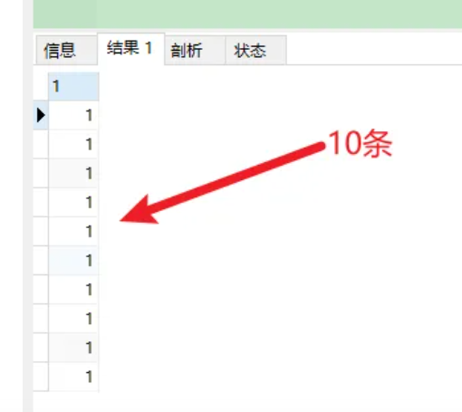

# SQL

mysql 底层的索引是B+ tree

!!! danger "集合操作提高连表效率"
    查找男女重名的名字
    ```sql
    select name, count(name)
    from(
        select distinct name
        from student
        where sex = 'male'
        union all
        select distince name
        from student
        where sex = 'female'
        ) as s1
    group by name
    having count(name) = 2
    ```

## datatype

### <div id ='unicode' > 编码</div>

#### charset

|charset||
|--|--|
|`utf8`| `utf8_general_ci`|
|`utf8mb4`|`utf8mb4_unicode_ci`|

#### collate

实际上符号都是编码储存的，编码会影响读取的速度、排序的位置、是否区分大小写、支持的符号等等问题。

||example||
|--|--|--|--|
|`general`| `utf8mb4_general_ci` |在排序時比較快，但在某些特殊情況會排錯
|`unicode` 👍| `utf8mb4_unicode_ci` | 完整的 Unicode 標準，會存中文、德文、Emoji

|大小写区分||大小寫 |特殊符号 |
|--|--|--|--|
|`ci` **default** | case-insensitive | ❌ |❌|
|`bin` | binary value | ✅ | ❌|
|`cs` | case-sensitive | ✅ |✅|

- [MySQL 編碼挑選與差異比較]

### int

!!! p int(M)
    `int(M:max_display_width)` ,无论 M 是多少，都是 int 类型，也就是存储 `bytes = 4`
    - [int(1)和int(11)的区别]
|datatype|bytes|default_M||
|--|--|--|--|
tinyint|1|
smallint|2|
mediumint|3|
**int**|4|
bigint|8|

### char

!!! p "根据 Mysql 官方建议，使用 VARCHAR 替代 CHAR"

### format

- 四舍五入，保留n位小数 `round(col, n)`
- 大小写 `lower(col)`, `upper(col)`

## query

`select * from users;`
`select <old_col_name> as <new_col_name> from users;`

!!! p "尽量不要使用 `select *`, 而是显式列列表 `select col1, col2,...`"
    在项目中 `select *` 会影响到整个项目的性能，会给服务器造成一定的压力。

!!! p "`select 1 from table;` 的用法"
    当我们只关心数据表有多少记录行而不需要知道具体的字段值。
    通常用于子查询。
    - 结果
        对符合条件的记录返回的永远只有一个值 `1`，当然，如果有返回值的话。 查询到有多少记录行存在就输出多少个“1”，每个“1”代表有1行记录
    - 优点
      - `select 1 ...` > `select constant  ...` > `select col ...` >  `select * ...`
      - 此时数据库就不会去检索数据表里每条具体的记录和每条记录里每个具体的字段值并将它们放到内存里，可以**减少系统开销，提高运行效率**
      - 选用数字`1`是因为它所占用的内存空间最小，而且具有统计用途

    ``` sql
    # 1. 查看存不存在
    $ select 1 from usrs where [conditions] limit 1

    # 2. 快速统计有多少条
    $ select count(1) from users where [conditions]

    # 3. 子查询
    select * from t1 where exists (select 1 from t2 where t1.id = t2.id)
    ```

{width=40%}

- [SELECT 1 FROM TABLE的作用]
- [select 1 in SQL]

### 一些特别的选取

- 条件
    - 为空 `null`

    ``` sql
    select cols
    from users
    where col is not null
    ```

#### 日期

- 格式
    - 常见的日期数据格式`'yyyy-mm-dd h:m:s'` 和 `'yyyymmdd'`
      !!! danger "要加引号"
    - 转换
    - 轉換格式 `date_format(date, format)`

      |format|description
      |--|--|
      `%Y`|4位，2022
      `%y`|2位，22
      `%M`|月名，June
      `%m`|月（00-12），06
      `%d`|天（00-31），06
      `%e`|天（0-31），6

    - 时间戳
      !!! p  "时间戳和日期格式之间"
          在实际工作环境中，对于用户行为发生的时间通常都是用**时间戳**进行记录，时间戳和日期格式之间可以利用`from_unixtime` 和 `unix_timestamp` 进行转换。
          ``` sql
          # 1. 时间戳 -> 日期
          select from_unixtime(timestamp,'yyyy-MM-dd') as date
          From question_practice_detail;

          # 2. 日期 -> 时间戳
          select unix_timestamp(date,'yyyy-MM-dd') as timestamp
          From question_practice_detail;           
          ```
- 拿到信息，based on 常见时间格式
  
    |||examples|
    |--|--|--|
    `year(date), month(date), day(date)`|提取年月日|return int
    `last_day(date)` |這年這月的最後一天的date| `last_day('20170221')`-> 2017-02-28
- 日期差計算
  |case|计算时间间隔： **在这之前，在这之后**|
  |--|--|
  |天数|`datediff(date_1, date_2)`
  |自定义|`timestampdiff(unit,date_1,date_2)`, unit:`day,month,miniute`

    - 如果 date_1 or date_2 is null , return null
    - `date_sub(start_date, interval n day)` 返回start_date **减少** n 天后的日期。
    - `date_add(start_date, interval n day)` 返回 start_date **增加** n 天后的日期

  ``` sql
  # 1. 返回来的单位是天数
  select datediff('2021-08–01', '2021-08–05') ... ;
  select timestampdiff(minute,'2021-08–01', '2021-08–05') ...;
  
  # 2. 
  select date_sub('2021-08–01',interval 8 day) ...;
  
  # 3. 
  select date_add('2021-08–01',interval 8 day) ...;
  ```

  > 请把exam_record表中2021年9月1日之前开始作答的未完成记录全部改为被动完成，即：将完成时间改为'2099-01-01 00:00:00'，分数改为0

  ``` sql
  update exam_record
  set submit_time = '2099-01-01 00:00:00', score = 0
  where datediff(start_time, '2021-09-01') < 0 and
    submit_time is null;
  ```

  > 请删除exam_record表中作答时间小于5分钟整且分数不及格（及格线为60分）的记录；

  ``` sql
  delete from exam_record
  where timestampdiff(minute, start_time, submit_time) < 5 and score < 60; 
  ```  

- [日期函数]

> 现在运营想要计算出2021年8月每天用户练习题目的数量

``` sql
select day(date) as day, count(1) as question_cnt
from(
    select date 
    from question_practice_detail
    where year(date)=2021 and month(date)=8
    ) as new
group by day;
```

#### 数字

``` sql
# 1. 区间内 [m , n]
select cols
from users
where col >= m and col <= n
----------------------------
# 在用 between and 的时候要先去看看数据库的这个语法的规定
# 在 mysql 里是__双闭区间__
select cols
from users
where col between m and n; 
```

#### 字符串字段

``` sql
# 1. 等于
select cols 
from users
where col = '';
---------------
select cols 
from users
where col != '';

# 2. 区间
select cols
from users
where col in ('val1', 'val2', ...);
```

#### 长字符串 long string

需要进行再一步提取处理

- 找位置， return 位置索引
  返回子串 `substr` 在字符串 `str` 中第一次出现的位置，if not exist: 0；
    - `locate(substr, str)`
    - `find_in_set(substr,str)`
    - **`str` 必须以","分割开**
    - `instr(str, substr)`

    !!! danger "参数位置"
        locate、position 和 instr 的差別只是参数的位置不同，
        同时locate 多一个请始位置的参数外,可以自定义选择的起始位置
- 替代 like

    ```sql
    # 1. 替代 like
    select cols from users 
    where locate(substr, str) > 0;
    ----------------------------
    select cols from users 
    where position(substr in str); 
    ------------------------------
    select cols from users 
    where instr(str, substr) > 0,
    -------------------------------
    select cols from users 
    where find_in_set(substr,str);
    ```

    !!! p "`locate, position, instr, like`"
        速度上这三个比用 like 稍快了一點。

- 截取
    - 单纯根据 位置索引
        - `left(str, n)`, `right(str, n)`
        - `substring(str, n, m)`：str[n:n+m] 第 n 个开始，m 个
    - 根据 `substr`
        - `substring_index(str, substr, n)`：  `substr` 在 `str` 中**第 n 次出现之前的字符串**;
            $$\small{n\begin{cases}>0&\text{从左往右数，第n个的左边的所有内容}\\<0&\text{从右往左数，第n个的右边的所有内容}\end{cases}}$$

- 替换
    - `replace(str, substr_a, substr_b)`：`str` 中的 `substr_a` 替换成 `substr_b`；
- 信息
    - `length(str)`

- [MySQL常用函数——字符函数]

> 1.现在运营举办了一场比赛，收到了一些参赛申请，表数据记录形式如下所示，现在运营想要统计每个性别的用户分别有多少参赛者
> 2.现在运营举办了一场比赛，收到了一些参赛申请，表数据记录形式如下所示，现在运营想要统计每个年龄的用户分别有多少参赛者，请取出相应结果
> user_submit|||result
> |--|--|--|--|
> dvice_id|profile|gender|number
> 2138|180cm,75kg,27,male|male|2

``` sql
# 1. 每个性别
select substring_index(profile, ',', -1) as gender, count(1) as number
from user_submit
group by gender;

# 2. 每个年龄
select substring_index(substring_index(profile,',',-2),',',1) as age,
    count(1) as number
from user_submit
group by age;
```

> 编写 SQL 语句，返回顾客 ID（cust_id）、顾客名称（cust_name）和登录名（user_login），其中登录名全部为大写字母，并由顾客联系人的前两个字符（cust_contact）和其所在城市的前三个字符（cust_city）组成。

``` sql
select cust_id, cust_name, 
    upper(concat(left(cust_name,2), left(cust_city, 3))) as user_login
from Customers;
```

#### 模糊查询

!!! danger "尽量避免通配符在开头"
    当 `like` 模式以通配符（例如“%xyz”）开头时，MySQL不能使用索引，并在这种情况下执行完整表扫描。
    通常会导致服务器性能下降。
    - 后缀搜索

      !!! p "对后缀搜索的优化："
            可以通过创建新列、将其值设置为与目标列逆序的值并对其建立索引来执行高效的后缀搜索。从后缀转为前缀
            ``` sql
            select name
            from table
            where name like '%ic'; 
            # ---------------------- 后缀转前缀
            where name_reversed like 'ic%'
            ```
    - 中缀搜索
  
        !!! danger "`fulltext index`"
            没有有效的方法来执行**中缀搜索**，无论是LIKE在索引列上还是使用全文索引。

1. sql 自带 模式匹配 `like` + 通配符 `%_`

    通配符|含义
    |--|--|
    `%` | 任意多个，包括0
    `_` | 单个，有长度限制

    - 精确匹配。如果不跟通配符合用就等于 `=`：精确等于。不能返回包含关系的行

        ``` sql
        # 精确匹配
        select cols 
        from users
        where col like 'yes'
        ---------------------- # 只有'yes'能被匹配到
        ```

    - **注意大小写**，因为sql自带的，所以是否区分大小写看用户对MySQL的配置方式
    - **不能匹配到 `null`**

        ``` sql
        # 1. 以 ‘yes‘ 开头
        select cols
        from users
        where col like 'yes%';

        # 2. 以 ‘yes’开头，长度为6的字符串
        select cols
        from user
        where col like 'yes___';
        ```

    > 从 Products 表中检索产品名称（prod_name）和描述（prod_desc），仅返回在描述中以先后顺序同时出现 toy 和 carrots 的产品。

    ``` sql
    select prod_name, prod_desc
    from Products
    where prod_desc like '%toy%carrots%';
    ```

2. 正则表达 `regexp`
    - 模糊匹配。如果不跟任何符号用也能模糊匹配，能返回包含关系的行
  
        ``` sql
        # 模糊匹配
        select cols
        from users
        where col regexp 'yes';
        ----------------------- # 只要有'yes'都能被匹配到

        select prod_name,prod_desc
        from Products
        where prod_desc not REGEXP 'toy'
        order by prod_name;
        ```

#### 复合条件的查询
  
!!! p "复合条件的查询 `or, union, union all`"
    1. 是否去重
        只要满足一个条件就被筛选出来，但总会存在一个人满足了多个条件， 但返回的结果是多少条呢？
        每条记录只返回一次就是**去重**， 满足多少个条件就返回多少次是**不去重**
    2. 怎么看
        先看完 condition1 再看 condition2， 有分界线的是 **分别**
            - 先 match `condition1` 然后又再 match `condition2`。每一条都先过完一遍 `condition1`，再过一遍 `condition2`
        无所谓区分，condition1 和 condition2 混杂的是 **按索引排序**
            - 每一条都过一遍排查`condition1`或者`condition2`。
            - 感觉这个会快一点，因为 match `condition1` 就不用再 check `condition2`

    |code|去重|分别
    |--|--|--|
    `or` | ✅|❌
    `union` | ✅| ✅
    `union all` |❌ |✅
    
    > 现在运营想要分别查看学校为山东大学或者性别为男性的用户的device_id、gender、age和gpa数据
        
    ``` sql 
    # 1. or
    select device_id, gender, age, gpa
    from user_profile
    where university = '山东大学' or
        gender = 'male';
    ------------------------------------ # 山东和男的交织，没有分界线，记录去重
    
    # 2. union
    select device_id, gender, age, gpa
    from user_profile
    where university = '山东大学'
    union 
    select device_id, gender, age, gpa
    from user_profile
    where gender = 'male';
    ------------------------------------ # 先是山东再是男的，记录去重
    
    # 3. union all
    select device_id, gender, age, gpa
    from user_profile
    where university = '山东大学'
    union all
    select device_id, gender, age, gpa
    from user_profile
    where gender = 'male';
    ------------------------------------ # 先是山东再是男的，记录不去重
    ```

!!! "and & or 的优先级"
    and 的优先级大于 or，所以可以考量括号加的情况

!!! danger "多個 `order by` 和 `union` 一起用 "
    order by不能直接出现在union的子句中，但是可以出现在子句的子句中。所以在外面再套一层 .
    ``` sql
    select * from (select ... order by)
    union all
    select * from (select ... order by)
    ```

> 请统计每个题目和每份试卷被作答的人数和次数，分别按照"试卷"和"题目"的uv & pv降序显示

``` sql
select *
from (
    select exam_id as tid, count(distinct uid) as uv, count(1) as pv
    from exam_record
    group by tid
    order by uv+pv desc
    ) exam 
union all
select *
from(
    select question_id as tid, count(distinct uid) as uv, count(1) as pv
    from practice_record
    group by tid
    order by uv+pv desc
    ) question;
```

- 去重

!!! p "谨慎使用 DISTINCT & UNION"
    查询调优的另一个好建议是仅在必要时使用DISTINCT和UNION运算符，因为与它们的查询会导致服务器开销，并通常会增加响应时间。考虑用UNION ALL取代UNION，用GROUP BY取代DISTINCT，以提高流程的效率

    ``` sql
    # 1. 
    select distinct cols
    from users;

    # 2. 
    ```

#### 统计- 聚合函数 with `group by`

`select cols from users group by col having condition`

!!! danger  "聚合函数（列）都是对非null进行"

- `max(col)`，`avg(col)`，

> 现在运营想要了解浙江大学的用户在不同难度题目下答题的正确率情况
>
> - user_profile,device_id,university
> - question_practice_detail, device_id, question_id, result
> - question_detail, question_id,difficult_level

``` sql
select qd.difficult_level, 
    round(sum(case when qpd.result = 'right' then 1 else 0 end)/count(1), 4) as correct_rate
from (
    select device_id
    from user_profile
    where university = '浙江大学'
) up
inner join question_practice_detail qpd
on up.device_id = qpd.device_id
left join question_detail qd
on qpd.question_id = qd.question_id
group by qd.difficult_level
order by correct_rate;
```

> 运营想要了解每个学校**答过题**的用户平均答题数量情况。
> user_profile， device_id指终端编号（认为每个用户有唯一的一个终端），university
    > question_practice_detail，question_id是题目编号，result是答题结果
    > 存在学校没答过题的情况， 需要用 inner join 并且需要指明 `device_id` ，因为 user_profile 里的 id 在 question_practice_detail 没出现过，就会 ambiguilous

``` sql
select u.university, 
    round(count(1)/count(distinct(q.device_id)), 4) as avg_answer_cnt
from user_profile u
inner join question_practice_detail q 
on u.device_id = q.device_id
group by university
order by university;
```

- 限制记录数量
  计数同样从 0 开始

    ``` sql
    # 1. 前 n 条 [0,n)
    select cols
    from users 
    limit n;

    # 2. 一个连续的区间[m, m+n)
    select cols
    from users
    limit m, n;
    -----------
    select cols
    from users
    limit n, offset m;
    ```

- 分组
    `select cols from users group by col having condition;`

    !!! p "`HAVING` 用于二次过滤; 在分组前先用 `WHERE` 过滤一些数据,分组的效率就会更高"

    > 运营想要查看参加了答题的山东大学的用户在不同难度下的平均答题题目数，请取出相应数据
    > - user_profile, device_id, university
    > - question_practice_detail, device_id, question_id
    > - question_detail, question_id, difficult_level
    >
    > WHERE在前面先筛了山东大学，整个执行起来效率就会高很多

    ``` sql
    select sdU.university, qd.difficult_level,round(count(1)/count(distinct(qpd.device_id)), 4) as avg_answer_cnt
    from 
        (
            select university, device_id
            from user_profile
            where university = '山东大学'
        ) as sdU
    inner join question_practice_detail qpd
    on sdU.device_id = qpd.device_id
    inner join question_detail qd
    on qpd.question_id = qd.question_id
    group by qd.difficult_level;
    ```

    !!! danger "only_full_group_by"
         > "Expression #1 of SELECT list is not in GROUP BY clause and contains nonaggregated column ... which is not functionally dependent on columns in GROUP BY clause; this is incompatible with sql_mode=only_full_group_by"

        对于GROUP BY聚合操作，如果在SELECT中的列，没有在GROUP BY中出现，那么这个SQL是不合法的，因为列不在GROUP BY从句中
        **查出来的列必须在group by后面出现否则就会报错，或者这个字段出现在聚合函数里面。**
        **Sol: 只需要在非group by的列上加any_value()**

    > 现在运营想要找到每个学校gpa最低的同学来做调研，请你取出每个学校的最低gpa
    > 请从中统计出2021年每个月里用户的月总刷题数month_q_cnt 和日均刷题数avg_day_q_cnt（按月份升序排序）以及该年的总体情况

    ``` sql
    select date_format(submit_time,'%Y%m') as submit_month,
        count(1) as month_q_cnt, 
        any_value(round(count(1) /day(last_day(submit_time)), 3)) as avg_day_q_cnt
    from practice_record
    where year(submit_time) = 2021
    group by submit_month
    union all # union all
    select '2021汇总' as submit_month,
        count(1) as month_q_cnt,
        round(count(1) /31, 3) as avg_day_q_cnt
    from practice_record
    where year(submit_time) = 2021
    order by submit_month;
    ```

- 划分

    ``` sql
    select cols,
        (
            case
                WHEN SCORE = 'A' THEN '优'
                WHEN SCORE = 'B' THEN '良'
                WHEN SCORE = 'C' THEN '中' 
                ELSE '不及格' 
            end
        ) as new_col;
    ```

    > 现在运营想要将用户划分为25岁以下和25岁及以上两个年龄段，分别查看这两个年龄段用户数量.
    > 本题注意：age为null 也记为 25岁以下
    >
    ``` sql
    select (case 
            when age>=25 then '25岁及以上'
            else '25岁以下'
            end) as age_cut, 
            count(1) as number
    from user_profile
    group by age_cut;
    ```

- 序列
    `select cols from users order by col;`
    `select cols from users order by n;`根據列索引

    - `asc`
    - `desc`

    ``` sql
    select quantity, item_price
    from OrderItems
    order by 1 desc, 2 desc;
    ```

#### 连表查询

!!! p "连接多张表"
    就一直写一直写就行
    ``` sql
    select cols  
    from t1
    inner join t2
    on t1.col = t2.col2
    inner join t3
    on t1.col = t3.col
    ...;
    ```

!!! danger "Every derived table must have its own alias"
    每个派生出来的表都必须有一个自己的别名。一般在多表查询时，会出现此错误。
    因为进行嵌套查询的时候子查询出来的的结果是作为一个**派生表**来进行上一级的查询的，所以子查询的结果必须要有一个别名
    把MySQL语句改成：`select * from (select * from ……) as 别名;`
    [mysql错误Every derived table must have its own alias解决]

!!! p "子查询和连表查询"
    子查询如果能大量减小信息熵，会比联表查快很多，数据多的时候联表会让表的大小成指数级增长，两者看具体情况选择。
    执行子查询时，MYSQL 需要创建临时表，查询完毕后再删除这些临时表，所以，子查询的速度会受到一定的影响，这里多了一个创建和销毁临时表的过程。
    https://blog.csdn.net/qiuchaoxi/article/details/81123920
    https://learnku.com/articles/43105

> 现在运营想要查看用户在某天刷题后第二天还会再来刷题的平均概率。
> keys
> 【去重】，同一个用户可能在某天刷了多次题，也可能在第二天刷了多次题。所以要同时 `distinct debice_id, date`
> 【先筛再连表】

```sql
select round(count(tmr.date) / count(1), 4) as avg_ret
from(
        select distinct device_id, date
        from question_practice_detail
    ) td
left join (
        select distinct device_id, date_sub(date, interval 1 day) as date
        from question_practice_detail
    ) tmr 
on td.device_id = tmr.device_id and td.date = tmr.date;
```

> 现在运营想要了解复旦大学的每个用户在8月份练习的总题目数和回答正确的题目数情况，请取出相应明细数据，对于在8月份没有练习过的用户，答题数结果返回0.

``` sql
select up.device_id, up.university, 
    count(result) as question_cnt,
    sum(case when qpd.result = 'right' then 1 else 0 end) as right_question_cnt
from(
    select device_id, university from user_profile
    where university = '复旦大学'
    ) as up
left join(
    select device_id, result from question_practice_detail
    where month(date) = 08
    ) as qpd
on up.device_id = qpd.device_id
group by device_id;
```

> 请从表中统计出 “当月均完成试卷数”不小于3的用户们爱作答的类别及作答次数，按次数降序输出
>
>> !!! danger "注意題意"
    1. 先看用戶
    2. 再統計愛作答的列別

``` sql
select tag, count(1) as tag_cnt
from examination_info info
inner join exam_record rec using(exam_id)
where rec.uid in (
    select distinct uid
    from exam_record
    group by date_format(submit_time, '%Y%m'), uid
    having count(submit_time) >= 3
    )
group by tag
order by tag_cnt desc;
```

> 请计算每张SQL类别试卷发布后，当天5级以上的用户作答的人数uv和平均分avg_score，按人数降序，相同人数的按平均分升序

``` sql
select rec.exam_id, 
    count(distinct user_info.uid) as uv, 
    round(avg(rec.score), 1) as avg_score
from exam_record rec
inner join (
    select exam_id, release_time
    from examination_info
    where tag = 'SQL'
    ) exam_info
on (rec.exam_id, date(rec.submit_time)) = (exam_info.exam_id, date(exam_info.release_time))
inner join (
    select uid 
    from user_info
    where level > 5
    ) user_info
on rec.uid = user_info.uid
group by rec.exam_id
order by uv desc, avg_score asc;
```

#### 拼接

|||Notes|
|--|--|--|
連接多行|`group_concat([distincrt] col [order by asc/desc col][separator ','])`
連接多列|`select concat(col1, ',', col2,...)...;`|有什麽連接什麽
||`select concat_ws(',', col1, col2, ...;)`|指定分隔符

> 请统计2021年每个未完成试卷作答数大于1的有效用户的数据（有效用户指完成试卷作答数至少为1且未完成数小于5），输出用户ID、未完成试卷作答数、完成试卷作答数、作答过的试卷tag集合，按未完成试卷数量由多到少排序。
>> !!! danger "如果沒有 distinct"
>>
>>     |實際|expected|
>>     |--|--|
>>     |dd2021-07-02:SQL;2021-07-05:SQL;**2021-09-01:算法;2021-09-01:算法;**2021-09-02:SQL;2021-09-05:SQL |2021-07-02:SQL 2021-07-05:SQL;**2021-09-01:算法**;2021-09-02:SQL;2021-09-05:SQL

``` sql
select rec.uid, 
    any_value(sum(case when rec.submit_time is null then 1 else 0 end)) as incomplete_cnt,
    any_value(count(rec.submit_time)) as complete_cnt,
    any_value(group_concat( distinct
        concat_ws(':', date(rec.start_time), info.tag)
        order by rec.start_time separator ';'
    )) as detail
from (
    select submit_time, start_time, exam_id, uid
    from exam_record 
    where year(start_time) = 2021
    ) as rec
inner join examination_info info
on rec.exam_id = info.exam_id
group by rec.uid
having incomplete_cnt < 5 and complete_cnt >= 1 and incomplete_cnt > 1
order by incomplete_cnt desc

```

### 分组

> 在日常工作中，经常会遇到需要在每组内排名，比如下面的业务需求：
>
> - **排名问题**：每个部门按业绩来排名
> - **topN 问题**：找出每个部门排名前N的员工进行奖励
>
> 非全局排序，需要在某个维度下进行排序

#### 窗口函数

窗口函数, OLAP, Online Anallytical Processing，联机分析处理，可以对数据库数据进行实时分析处理。

- 同时具有分组和排序的功能
- 不减少原表的行数

`<窗口函数> over (partition by <用于分组的列名> order by <用于排序的列名>)`

- `<窗口函数>`
    是对`where`或者`group by`子句处理后的结果进行操作，所以窗口函数原则上只能写在`select`子句中
    - 专用窗口函数，`rank, dense_rank, row_number`
          函数后面的括号不需要任何参数，保持()空着就可以。
          |排序相同时|会重复|维持总数|排序结果
          |--|--|--|--|
          `rank()`|✅|✅|1、1、3
          `dense_rank()`|✅|❌|1、1、2
          `row_number()`|❌|✅| 1、2、3（根据primary key 来）

    - 聚合函数，如`sum. avg, count, max, min`等

- `partition by`
        可省略，省略就是不指定分组, 但是，这就失去了窗口函数的功能，所以一般不要这么使用

``` sql
# 1. 【专用窗口函数】不要分组 
select id, class, score,
    rank() over (order by score desc) as ranking,
    dense_rank() over (order by score desc) as dese_rank,
    row_number() over (order by score desc) as row_num
from scores;

# 2. 【专用窗口函数】要分组 
select id, class, score,
    rank() over (partition by class order by score desc) as ranking,
    dense_rank() over (partition by class order by score desc) as dese_rank,
    row_number() over (partition by class  order by score desc) as row_num
from scores;

# 3. 【聚合函数】要分组

```

- [通俗易懂的学会：SQL窗口函数]

##### 常见业务

- 最低最高
    > 现在运营想要找到每个学校gpa最低的同学来做调研，请你取出每个学校的最低gpa
    > 先按 学校分组和对成绩排名，而不能用`min`

    ``` sql
    select device_id, university, gpa
    from(
        select device_id, university, gpa, 
            rank() over (partition by university order by gpa) as rk
        from user_profile
        ) olap
    where olap.rk = 1;
    ```

- 累积百分比
    > 想看前XX%的用户贡献了XX%的总额。

- [hive sql]

## operations

### insert

|使用场景||语句|｜
|:--:|:--:|--|:--:|
｜        |写上cols|`insert into users(col1, col2,...) values (row1), (row2),..;`|字段和value一一对应， null可以不写
导入数据 |Ta-〉Tb |`insert into Tb(b1, b2, ...) select a1, a2,... from Ta where conditions;`|名字可以不一样但是数据类型要一样

!!! danger "`insert into Tb(b1, b2, ...) select a1, a2,... from Ta where conditions;` 没有values"
    select读出来是多行多列，而values一个括号一次只能存入一行数据

- primary key
    - 自增 id
        - 默认从 0 开始
        - 插入时写 `0, null, default` ，就会自动填充 id
        - 写列名的时候可以跳，但是不写字段名的时候要写

!!! danger "插入重复问题"
    指的是 primary key
    Duplicate entry '1' for key 'PRIMARY'

|sql| meaning|
|--|:--:|:--:|:--:|
|`insert into users values ...;` |如果已经有了就报错
|`insert ignore into users values ...;`|如果有了就 ignore，继续
|`replace users values ...;`|无论如何都要插入，有了就 update
|`insert into users values ... on duplicate key update col1 = value1, col2 = value2;`|无论如何都要插入，有了就 update 指定的字段

> 牛客后台会记录每个用户的试卷作答记录到exam_record表，现在有两个用户的作答记录详情如下：
用户1001在2021年9月1日晚上10点11分12秒开始作答试卷9001，并在50分钟后提交，得了90分；
用户1002在2021年9月4日上午7点1分2秒开始作答试卷9002，并在10分钟后退出了平台。
试卷作答记录表exam_record中，表已建好，其结构如下，请用一条语句将这两条记录插入表中。
>> 没有提交就是null submit time

``` sql
insert into exam_record
values
    (default, 1001, 9001, '2021-09-01 22:11:12', date_add('2021-09-01 22:11:12', interval 50 minute), 90),
    (default, 1002, 9002, '2021-09-04 07:01:02', default, default);
```

> 现有一张试卷作答记录表exam_record，结构如下表，其中包含多年来的用户作答试卷记录，由于数据越来越多，维护难度越来越大，需要对数据表内容做精简，历史数据做备份。

``` sql

```

### alter & update

#### `alter` 基于表 scheme

!!! danger "`alter table users` 每一句都要写"
cases|基于表 scheme ||
|--|--|--|
添加列 |`alter table users add column col1 int [first|after col5]`| 默认添加到最后一列
修改列的类型或约束|`alter table users modify column col1 char constraint;`
修改列名|`alter table users change column old_col1 new_col1 char;`
删除列| `alter table users drop column col1;`
修改表名|`alter table old_users rename new_users;`
将某一列放到第一列|`alter table usrs modify column col1 int first;`

> 请在用户信息表，字段level的后面增加一列最多可保存15个汉字的字段school；并将表中job列名改为profession，同时varchar字段长度变为10；achievement的默认值设置为0。

``` sql 
alter table user_info add column school varchar(15) after level;
alter table user_info change column job profession varchar(10);
alter table user_info modify column achievement int(11) default 0;
```

#### `update`  基于记录 records

!!! danger "update"
    - 更新的值要满足建表时的字段类型。比如score是int类型就不能更新为char类型。
    - 更新的时候是按照代码语句的先后顺序更新的。
|when|基于记录 records|
|:--:|--|
完全一个值|`update users set col1 = val1, col2 = val2,... where condition;`
partial一个值|`update users set col1 = replace(col1, 'old','new'),...;`
多个值|`update users set col1 if(condition,val1, val2);` `case` 也可以

### delete & truncate

!!! danger "非必要不要用 truncate 或 drop"

|case|sql||自增值重置|rollback|速度
|--|--|--|--|--|--|
删除记录| `delete from users where condition;`|DML，可加where|❌|✅|3️⃣
清空截断表 | `truncate users;`|DDL，drop 之后再 create 新的，有drop的权限|✅|❌|2️⃣
销毁表、视图|`drop users;`|DDL，|都没了|❌|1️⃣

> 请删除 exam_record 表中未完成作答或作答时间小于5分钟整的记录中，开始作答时间最早的3条记录。作答记录表 exam_record, start_time 是试卷开始时间。submit_time 是交卷时间，即结束时间，如果未完成的话，则为空。

``` sql
delete from exam_record
where submit_time is null or 
    timestampdiff(minute, start_time, submit_time) < 5
order by start_time
limit 3;
```

### create

``` sql
create table [if not exists] users
(
    col1 int [ primary key  
                foreign key  
                auto_increment  #自增
                comment ...  #注释
                default default_val/ current_timestamp # 当前时间戳
                unique 
                not null # 不允许空
                ],
    col2  char  ... ,
    ...
)[default charset = ] [collate 编码];
```

- [collate 编码](#unicode)

    |charset|default collayte|
    |--|--|
    `utf8`| `utf8_general_ci` |
    `utf8mb4`👍| `utf8mb4_unicode_ci` |

``` sql
create table if not exists user_info_vip
(
    id int primary key auto_increment comment '自增ID',
    uid int unique not null comment '用户ID',
    nick_name varchar(64) comment '昵称',
    achievement int default 0 comment '成就值',
    level int comment '用户等级',
    job varchar(32) comment '职业方向',
    register_time datetime default current_timestamp comment '注册时间'
) default charset=utf8;
```

|case||
|--|--|
存在就覆盖|`drop table if exist users (...);` and `create`
存在就返回|`create table if not exists (...);`

### index

!!! danger "没有内置修改索引操作的，需要先执行删除操作在重新建立一个索引"

!!! danger "先导数据再设 `create fulltime index`"
    在数据量较大时候，先将数据放入一个没有全文索引的表中，然后再用CREATE INDEX创建FULLTEXT索引，要比先为一张表建立FULLTEXT然后再将数据写入的速度快很多。

#### create2

``` sql
# 1. 创建表时
create table users(  
  id int not null, ...,
  index index_name [description] (col);
);

# 2. 另外创建
create [description] index index_name on users(col);

# 3. 修改表时
alter table users
add [description] index index_name(col);
```

!!! p "`unique index` & `primary key`"
    都是唯一的值，不可以出现相同的值
    `unqiue index` 可以一个表多个
    `primary key` 只能一表一个

cases|[description]||NULL
|--|--|--|--|
唯一|unique|不可以出现相同的值|dui
全文|fulltxt|针对值中的某个单词，但效率低（不建议，可利用添加关键词关联列来实现）,按照分词原理建立索引的
普通||允许出现相同的索引内容
普通索引：INDEX  (normal)

[mysql 不同索引的区别和适用情况总结]

> 现有一张试卷信息表examination_info，其中包含各种类型试卷的信息。为了对表更方便快捷地查询，需要在examination_info表创建以下索引，规则如下：
> 在duration列创建普通索引idx_duration、在exam_id列创建唯一性索引uniq_idx_exam_id、在tag列创建全文索引full_idx_tag
>
``` sql
create index idx_duration on examination_info(duration);
create unique index uniq_idx_exam_id on examination_info(exam_id);
create fulltext index full_idx_tag on examination_info(tag);
```

#### delete

``` sql
drop index index_name on users;

alter table users
drop index index_name;
```

## 业务

> 牛客的运营同学想要查看大家在SQL类别中高难度试卷的得分情况。
请你帮她从exam_record数据表中计算所有用户完成SQL类别高难度试卷得分的截断平均值（去掉一个最大值和一个最小值后的平均值）。
>> $=\cfrac{\sum-\max-\min}{\#-2}$

``` sql
select tag, difficulty,
    round((sum(score)-min(score)-max(score))/
        (count(score)-2),1) as avg_score
from exam_record 
inner join (
    select exam_id, tag, difficulty
    from examination_info
    where tag='SQL' and difficulty='hard'
    )info
on info.exam_id = exam_record.exam_id;
```

> 有一个试卷作答记录表exam_record，请从中统计出总作答次数total_pv、试卷已完成作答数complete_pv、已完成的试卷数complete_exam_cnt。
示例数据 exam_record表（uid用户ID, exam_id试卷ID, start_time开始作答时间, submit_time交卷时间, score得分）：
>> 主要在于已完成的试卷数的统计，因为这个带有条件，且需要统计聚合结果，很自然可以想到 使用 聚合函数与case when 结合。

``` sql
select count(1) as total_pv,
    count(submit_time) as complete_pv,
    count(distinct (case when score is not null then exam_id else null end)) as complete_exam_cnt
from exam_record
```

> 请从试卷作答记录表中找到SQL试卷得分不小于该类试卷平均得分的用户最低得分。
示例数据 exam_record表（uid用户ID, exam_id试卷ID, start_time开始作答时间, submit_time交卷时间, score得分）：

``` sql
select min(score) as min_score_over_avg
from exam_record
inner join (
    select exam_id
    from examination_info
    where tag = 'SQL'
    )info
on exam_record.exam_id = info.exam_id
where score >= (
    select avg(score)
    from exam_record
    inner join (
        select exam_id
        from examination_info
        where tag = 'SQL'
        )info
    on exam_record.exam_id = info.exam_id
    )
```

> 请计算2021年每个月里试卷作答区用户平均月活跃天数avg_active_days和月度活跃人数mau，上面数据的示例输出如下：

``` sql
    select DATE_FORMAT(submit_time, "%Y%m") as month, 
        round(count(distinct uid, DATE_FORMAT(submit_time, "%Y%m%d"))/count(distinct uid), 2) as avg_active_days, 
        count(distinct uid) as mau
    from exam_record
    where year(submit_time) = 2021
    group by month
```

> 请你找到高难度SQL试卷得分平均值大于80并且是7级的红名大佬，统计他们的2021年试卷总完成次数和题目总练习次数，只保留2021年有试卷完成记录的用户。结果按试卷完成数升序，按题目练习数降序。

``` sql
select red_users.uid,  
    count(distinct exam_id, exam_submit) as exam_cnt, 
    count(distinct question_id, prac_submit) as question_cnt
from (
    select uid
    from exam_record
    where exam_id in (select exam_id from examination_info 
                        where tag = 'SQL' and difficulty = 'hard')
            and uid in (select uid from user_info 
                        where level = 7)
    group by uid
    having avg(score) > 80
    ) red_users
left join (
    select uid, exam_id, submit_time as exam_submit
    from exam_record
    where year(submit_time)=2021
    ) exam_rec
on red_users.uid = exam_rec.uid
left join (
    select uid, question_id, submit_time as prac_submit
    from practice_record
    where year(submit_time)=2021
    ) prac_rec
on red_users.uid = prac_rec.uid
group by uid
order by exam_cnt asc, question_cnt desc;
```

[SELECT 1 FROM TABLE的作用]: https://blog.51cto.com/knifeedge/5786611
[select 1 in SQL]: https://www.jianshu.com/p/0c5dbee8838b
[int(1)和int(11)的区别]: https://www.modb.pro/db/336129
[日期函数]: https://www.nowcoder.com/knowledge/intro-index?kcid=20
[MySQL常用函数——字符函数]: https://ost.51cto.com/posts/12630
[mysql错误Every derived table must have its own alias解决]: https://www.jianshu.com/p/c52180dd259a
[hive sql]: https://zhuanlan.zhihu.com/p/114921777
[通俗易懂的学会：SQL窗口函数]: https://www.zhihu.com/tardis/zm/art/92654574?source_id=1003
[MySQL 編碼挑選與差異比較]: https://khiav223577.github.io/blog/2019/06/30/MySQL-%E7%B7%A8%E7%A2%BC%E6%8C%91%E9%81%B8%E8%88%87%E5%B7%AE%E7%95%B0%E6%AF%94%E8%BC%83/
[mysql 不同索引的区别和适用情况总结]: https://www.cnblogs.com/DDgougou/p/10286709.html
