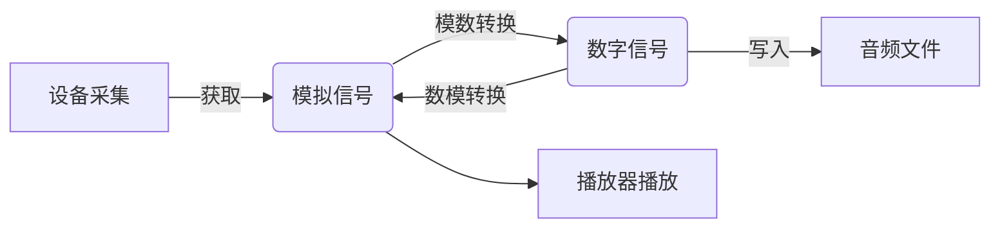

# Temp

## ?

### 服务器 进程

``` python
"""
写在xxx.py里，然后在后台bash端 
1. screen 
3. 在 screen 里 python xxx.py
3. 回来 
"""
from multiprocessing import Process

def main(a, b):
    a = funcA(a)
    b = funB(b)
    return a+b

process = Process(
    target=main,  # 写要调用的主函数 your_function
    args=(a,b)  # 传进主函数的参数
    )

process.start()
```

- 关于进程
    - 查看进程号 `ps -ef|grep ?`
    - 杀死进程 `kill pid`

- 查看==系统内存==
    - `free -h` **Linux**
    - `-h` 自动转换单位

    |<space>|total|used|free|shared|buff/cache|available
    |--|--|--|--|--|--|--|
    Mem: <br>物理内存|物理内存<br>总|已经使用的<br>物理内存|空闲的<br>物理内存|多个进程共享的<br>物理内存|缓存内存数|可用内存
    Swap:<br>交换分区|^|^|^|^|^|^

    - 公式
        **availale = free + buff/cache**
        **total = used + available**
    - 如果使用到==交换分区==，则表明物理内存不够或内存泄漏了
    - ==buff/cache==
        我们的数据是存放在磁盘上的，数据是交给CPU进行处理的，但磁盘的运转速度很快，CPU的运转速度很慢，不可能直接把磁盘的数据直接丢给CPU进行处理，因此要经过一个中间层，即内存，我们把这部分内存称为==缓存, cache==；相反地，CPU把数据处理完了，要存放到磁盘中，也要经过内存这个中间层，这部分内存则称为==缓冲, buffer==。因此，数据的流向不一样，内存的角色也不一样。系统会优先预留一部分内存给 buff/cache 使用，剩下的内存再留给系统或程序使用

        ``` mermaid
        graph LR
        磁盘 --缓存, cache--> CPU
        CPU --缓冲, buffer--> 磁盘
        ```

    ```shell
             total       used      free    shared     buff/cache   available
    Mem:     31Gi        10Gi      9.4Gi   4.0Mi      11Gi         20Gi
    Swap:    979Mi       227Mi     752Mi

    """
    20G = 9.4G + 11G
    31G = 10G + 20G
    """
    ```

    [linux free 命令 查看内存使用情况](https://www.cnblogs.com/mingerlcm/p/10305025.html)

- 查看各个进程内存 `ps`
    - `-aux`
    - `-ef`
    - `-aux/-ef --sort -col_name` 按col_name进行排序
    - <u>`ps -ef | grep myprocess` 查看预期的进程`myprocess`是否启动</u> ❗❗❗

    USER|PID| %MEM | VSZ | RSS |STAT
    |--|--|--|--|--|--|
    用户|进程号|已用物理内存**占比**|已用<br>**虚拟**内存|已用<br>物理内存|进程状态

    - STAT 进程当前的状态("S":中断 sleeping,进程处在睡眠状态,表明这些进程在等待某些事件发生--可能是用户输入或者系统资源的可用性;"D":不可中断 uninterruptible sleep;"R":运行 runnable;"T":停止 traced or stopped;"Z":僵死 a defunct zombie process)

    [linux系统下ps -aux和ps -ef命令参数的作用及区别详解](https://cloud.tencent.com/developer/article/1357618)

### 音频




- **采样**： 对模拟信号隔一定的时间间隔取一个点（图中交点）
- **量化**： 给纵坐标加刻度，根据近似取整数值，使采样得到的点的值都是整数。
- **编码**：对量化取得的整数值按二进制进行编码
- **数字信号**：把编码得到的 0 和 1 的序列变现为高低电平的信号

#### 一些数据指标

- **采样率, SampleRate, FrameRate**==\=1==
每秒的采样次数。采样率 ⬆，采样点越密集，离散信号对模拟信号的还原度👍, 但是占的资源⬆。
采样率 * 语音时长 = 语音采样点数
- **声道, Channel, 通道**==\=16000==
    - **单声道, monaural**：只有一个采集器采集音频
    - **立体音, stereophonic**：两个或两个以上声道数，多个设备录音，然后数据编码整合到一起。

- 格式
    |.wav|mp3|
    |--|--|
    首选

[音频相关的基础知识](https://zhuanlan.zhihu.com/p/91837880)

##### python 读取

|*|`soundfile`|`AudioSegment`|`librosa`|`dataset.Audio`
|--|--|--|--|--|
read|wav✔<br>mp3❌|wav✔<br>mp3✔<br>mp4✔|wav✔<br>mp3✔
属性||sound.frame_rate<br>sound.channels<br>sound.duration_seconds|
Notes||不能超过4GB|v|

``` python
import soundfile as sf

wav, samplerate = sf.read(wav_path)
sf.write(file=path, data=array_data, samplerate=samplerate, format='wav')
```

``` python
librosa.load
```

```python
from pydub import AudioSegment

# read
sound = AudioSegment.from_file(video_path, 'mp4')
sound = AudioSegment.from_wav(wav_path)

# setting
sound = sound.set_frame_rate(frame_rate)
sound = sound.set_channels(channel)

# export
sound.export(name+'.wav', format='wav')
```

- 平均分割音频
  
``` python
len_wav = sound.duration_seconds  # 时间的单位是秒
    if second_of_segment == None:
        lst = [0, len_wav * 1000]
        count_segments = 2
    else:
        # 以 second_of_segment 来划分，切片的单位是毫秒
        count_segments = math.ceil(len_wav / second_of_segment)
        lst = [i * 10000 for i in range(count_segments)]
        lst[-1] = len_wav * 1000  # 不要求定长，所以最后一段也要了
```

```python hl_lines="1 10 19 47 46 52"
from datasets import load_dataset, Audio

dataset_args = {
    'dataset_name': 'mozilla-foundation/common_voice_11_0',
    'lang': 'en',
    'split': 'validation',
    'streaming': True
}

def array_to_wav(dataset):
    """ Transform array format to WAV file 
    
    Not loading mp3 files, instead of extracting ID from their paths
    """
    mp3_path = dataset['audio']['path'].replace('.mp3', '', )
    dataset['ID'] = mp3_path[mp3_path.rfind('/')+1:]
    wav_path = str(DATASET_DIR + '/wavs/' + dataset['ID'] + '.wav')
    
    sf.write(file=str(wav_path), data=dataset['audio']['array'], 
             samplerate=FRAME_RATE, format='wav')
    dataset['audio']['path'] = wav_path
    return dataset

def process(dataset_args: Dict, to_wav=True):
    """ To generate a "new" dataset from common voice, streaming = True
    
    - Process:
        - Download the dataset with streaming mode to reduce the usage of memory
        - Select columns needed from the original dataset. 
            ['audio', 'sentence']
        - Set sample rate = 16000
            Assumption: all original data have only 1 channel
        - Transform array format to WAV file 
        - Get ASR, and delete the WAV file after finishing transcribing.
        - Save as JSON
    - the "new" dataset
        - ID: relate to the common voice by it
        - truth: the transcripts provided by the common voice
        - asr
    """
    dataset = load_dataset(dataset_args['dataset_name'], dataset_args['lang'],
                           split=dataset_args['split'], 
                           streaming=dataset_args['streaming'])
    
    dataset = dataset.select_columns(['audio', 'sentence'])
    print(dataset.features)
    dataset = dataset.cast_column('audio', Audio(sampling_rate=FRAME_RATE))
    # 加載datasets音頻樣本時發出信號以動態重新採樣它們
    if to_wav == True:
        if not os.path.exists(DATASET_DIR+'/wavs'):
            os.makedirs(DATASET_DIR+'/wavs')
        dataset = dataset.map(array_to_wav)
    i, asr_dict = 0, {}
    for data in iter(dataset):
        asr_dict[i] = {'ID': data['ID'],
                        'truth': data['sentence'],
                        'asr': gen_asr.asr(data['audio']['path'])
                        }
        os.remove(data['audio']['path'])
        i += 1
        if i % 200 == 0:
            print(f'-----------{i}-------------')
        if i % 3000 == 0:
            write_json(asr_dict, DATASET_DIR + f'/asr_{i}.json')
            asr_dict = {}
        if i>= 8000 and dataset_args['lang'] != 'yue' and dataset_args['lang'] != 'zh-HK':
            break
    if i % 3000 != 0:
        write_json(asr_dict, DATASET_DIR + f'/asr_{i}.json')
    return

```

[Python | 语音处理 | 用 librosa / AudioSegment / soundfile 读取音频文件的对比](https://blog.csdn.net/qq_37851620/article/details/127149729)

``` python
 wav phycical file

def asr_from_json(data_wav_path: str, asr_gt_path: str):
    """
    :param data_wav_path: 
        json that recorded data' wav relative path and goundtruth sentence 
        - json format
            {"idx": {
                "wav_path": wav relative path,
                "truth": ground truth sentence
                }
            }
    :return: no-return, generating json instead.
        - json format
            {"idx": {
                "asr": asr sentence,
                "truth": ground truth sentence
                }
    """
    data_dict = load_dataset_from_json(DATASET_DIR + data_wav_path)
    test_dict = {}
    # T1 = time.perf_counter()
    for idx, data in tqdm(data_dict.items()):
        test_dict[idx] = { 
            'truth' : data['sentence'],
            'asr' : asr(DATASET_DIR + '/' + data['wav_path'])
            }

    # T2 = time.perf_counter()
    # print(f'---------------程序运行时间:{T2-T1}s.-------------')

    write_json(test_dict, DATASET_DIR + asr_gt_path) 
```