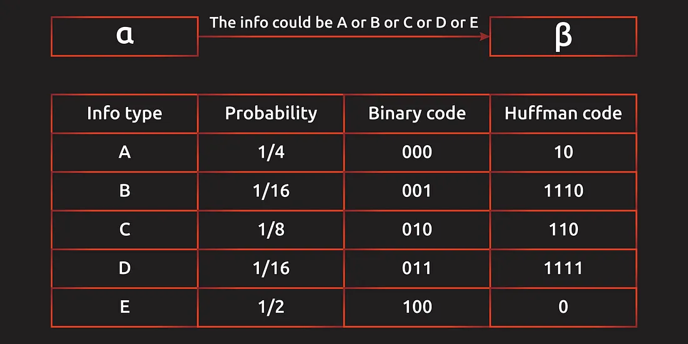

# math

## logrithm

在数据处理中，经常会把原始数据取对数之后再处理，无论是在画图，还是在 da 里。
讓我們在處理**指數級增長的事物時具有更大的靈活性(對數幫助我們處理“非線性”數據。)**。與普遍看法相反，指數增長並不總是像一棵樹長到天空一樣——**它僅僅意味著數據以相當恆定的速度複合（或衰減）**

**为什么能这样做：**<br>
log 是单调增函数，不会改变数据的相对关系。

**为什么要这样做：**

- 缩小数据的绝对数值, 方便计算。尤其是对一些直接计算会超过常用数据类型的取值范围。
    > 比如 TF-IDF 计算 在大规模预料中，常用词的频率会非常大 (I, 我)
    !!! p ""
        其实就跟 千万级别的数字 除以千万，从 $x*{10}^7\xrightarrow{\div{10}^7}x$，就可以在默认是千万级别只对千万位上进行处理。log 就是其中一种缩小数据的绝对数值的方法而已，只是它更擅长处理数据之间相差非常大，类指数增加或衰减的趋势的间距。
- 取对数后，可以将乘法计算 $\rightarrow$ 加法计算，更容易理解大小关系。
    !!! warning 这个特别常见在图片中！！！

    ``` python title = volume of planets
    planets= {
        'sun': 1.41*10**18,
        'jupiter': 1.43*10**15
        'earth': 1.83*10**12,
        'moon': 2.20*10**10
    }
    ```

    <div class="grid" markdown>
    <figure markdown="span"><p>不经过处理之前，只能知道 Sun 是一骑绝尘的大，但是这个一骑绝尘到底是多一骑绝尘也不知道，除此之外其它 items 是不知道相对大小的，所以不好。</p></figure>
    <figure markdown="span"><p>很明确知道相对大小关系，而且: Sun 在 18，Jupiter 在 15，两者相差了3，就是$10^3$ 量级。</p></figure>
    <div>
    > 測量地震強度。這被稱為里氏震級，給出了以 10 為底的對數的地震強度。 6.0級地震比5.0級地震強10倍
- 在数值小的场景比数值大的时候对差异更敏感。是一个这符合某些应用场景。
    > 对于价格，百元下的差几百 & 千元的差几百 不是一个敏感程度。
    > 对于中文分词，能分成 $A_1(200) \& A_2(800)$ & $B_1(500) \& B_2(500)$，单纯比较频率和都是1000，无法辨清优劣。但是比较对数和 $\begin{cases}A=\log_{10}(200)+\log_{10}(800)\approx2.30103+2.90308\approx5.2\\B:2\log_{10}(500)\approx2*2.69897\approx5.4\end{cases}\implies B>A$ 偏向都是常见的情况，选择 B 的方案。
- 所得到的数据易消除异方差问题。【不懂】
- 在经济学中，常取自然对数再做回归，这时回归方程为 lnY=a lnX+b ，两边同时对X求导，1/Y*(DY/DX)=a*1/X, b=(DY/DX)*(X/Y)=(DY*X)/(DX*Y)=(DY/Y)/(DX/X) 这正好是弹性的定义。【不懂】

!!! danger "实践中，取对数的一般是水平量，而不是比例数据，例如变化率等。"

!!! question "数据集有负数，可不可以通过加一个底数，使得整体数据为正再log 处理"

!!! danger “关于趋势的错觉：增加量 & 增长速率”
    增加量 $=Y-X$, 增加速率 $=\cfrac{Y-X}{X}$
    增加量大不代表增加速率大，而是要进行计算。通过 raw data 我们能感觉“量”的变化，通过 log data 我们能感到“速率的变化”。<br>
    $\begin{cases}x:=\log_{10}X\\y:=\log_{10}Y\end{cases}\implies \cfrac{Y-X}{X}=\cfrac{10^y-10^x}{10^x}=y-x-1$
    log data 中 y 轴变化越多，增长率越大，所以 log data ：<br>
    <mark>刻度线斜率⬆️🟰增长率⬆️<br>刻度线斜率➖🟰增长率➖<br>刻度线斜率⬇️🟰增长率⬇️</mark>


前 50 天病例从 0 增长远低于 10w（看起来依旧在0的附近），后 50 天病例从不到 30w 飙到了 50w。从量的变化来说，越后面增加的量越大。
但是从感染率的变化来说，前50天的感染率迅速飙升，后30天的感染率已维持稳定，证明已经逐步稳住趋势或者感染人数已经接近饱和，已经涨不了多少。

- [告诉你为什么数据要取对数](https://zhuanlan.zhihu.com/p/106232513)
- [What’s A Logarithm?](https://readmedium.com/whats-a-logarithm-cca50d031241)
- [Logarithms — What, Why and How](https://towardsdatascience.com/logarithms-what-why-and-how-ff9d050d3fd7)

协方差　衡量一个变量与另一个变量（在数值和方向上）一致变化程度的方式。

## 笛卡尔积

A×B={(x,y)|x∈A∧y∈B}

A square matrix A is called a projection matrix if AA = A. If this is satisfied, then An = A···A = A.

 The matrix Am×m is called an orthogonal matrix if A−1 = A′. Therefore AA′ = A′A = I.

 The space spanned by a set of vectors {x1, · · · , xm}, is the totality of all the linear combinations of these vectors. A linear combination is like
c1x1 +···+cmxm,
where c1, · · · , cm are constants, and in particular, they can all be
zero.
▶ The range, or image of a matrix A, is the space spanned by the
vectors which are the columns of A.
▶ ThenullspaceofamatrixA,istheset{x:Ax=0}.

||Range|Null space|
|--|--|--|
|Identity Matrix|The whole space|The zero vector|
|Zero Matrix|The zero vector|The whole space|

## Vector

$$x=\begin{bmatrix}x_1\\x_2\\\vdots\\x_n\end{bmatrix}\in\R^{n\times1}\Longleftrightarrow x^T=\begin{bmatrix}x_1&x_2&\cdots&x_n\end{bmatrix}\in\R^{1\times n}$$

- 简单的操作
    $cx =\begin{bmatrix}cx_1\\cx_2\\\vdots\\cx_n\end{bmatrix}$

    $x+y = \begin{bmatrix}x_1+y_1\\x_2+y_2\\\vdots\\x_n+y_n\end{bmatrix}$

    $<x, y> = <y, x>=x^Ty=y^Tx$

    $\Vert x\Vert =\sqrt{<x, x>} =\sqrt{x_1^2+x_2^2+\cdots+x_n^n}\\\Vert cx\Vert=c\Vert x\Vert$

    $\Vert x+y\Vert\le\Vert x\Vert+\Vert y\Vert$

## Matrix

$$A = []\in\R^{m\times n}$$

- 简单的操作
    $A+B\Longleftrightarrow (A+B)_{i,j}=A_{i,j}+B_{i,j}$
    $A-B\Longleftrightarrow (A-B)_{i,j}=A_{i,j}-B_{i,j}$
    $cA\Longleftrightarrow (cA)_{i,j}=cA_{i,j}$

### ss

#### Square Matrix

$A\in\R^{n\times n}$

- invertible

### Matrices

$A\in\R^{n\times n}\xRightarrow{A^2=A}\text{projection}\xRightarrow{A=A^T}\text{orthogonal}$

#### symmetric matrix

#### invertible

## Derivatives

### vector

$x\in\R^n, A, B\in\R^{m\times n}, c\in\R^m$
$\cfrac{\partial}{\partial x}c^Tx=c$

$\cfrac{\partial}{\partial x}Ax=A^T$

$\cfrac{\partial }{\partial x}c^TAx=A^Tc$

$\cfrac{\partial }{\partial x}x^TAx= (A^T+A)x\xRightarrow{if A\in
 S}2Ax$

$\cfrac{\partial }{\partial x}x^TB^TAx=(B^TA+A^TB)x$

$\cfrac{\partial }{\partial x}x^Tx=(I^T+I)x=2x$

## 关于约束条件

!!! p "To solve: 约束条件下的可行域空间不规则，难以求解。<u> 希望转化为规则的可行空间</u>"

|$\min\limits_x f(x)\\\text{s.t.} h(x)=0,g(x)\le0\\\text{不规则的约束}$ |$\implies$ |$\min\limits_x\max\limits_{\lambda,\mu} f(x)+\lambda h(x)+\mu g(x)\\\text{s.t.} \lambda,\mu\ge0\\\text{规则的约束}$|
|--|--|--|

**约束情况:**

$$\begin{align*}
\text{无约束}&\min f(x_1,\dots,x_n)\\
\text{等式约束}& \min f(x_1,\dots,x_n) \text{ s.t. }h(x_1,\dots,x_n)=0\\
\text{不等式约束}&\min f(x_1,\dots,x_n) \text{ s.t. }g(x_1,\dots,x_n)\red{\le} 0
\end{align*}$$

### 拉格朗日乘子法, Lagrange Multiplier

!!! p "For 求 $f(x_1,\dots,x_n)$ 在 $k$ 个约束条件 $h_i(x) =\le 0, i=1,\dots, k$下的极值"
    将约束条件函数与原函数联立，从而求出使原函数取得极值的各个变量的解。

$$\text{k 个等式约束: } \min f(x_1,\dots,x_n) \text{ s.t. }h_j(x_1,\dots,x_n)=0, j=1, \dots,k\\
\Leftrightarrow \min_x\max_\alpha \mathcal{L}(x,\alpha):=\min_x\max_\alpha f(x)+\sum_{j=0}^k\alpha_jh_j(x)$$

To solve:

$$\cfrac{\partial \mathcal{L}}{\partial x}=\cfrac{\partial \mathcal{L}}{\partial \alpha_1}=\dots =\cfrac{\partial \mathcal{L}}{\partial \alpha_k}\xlongequal{SET}0$$

!!! danger "p 个等式条件 $h_j(x_1,\dots, x_n)=0, j=1,\dots,p$ <br> q个不等式条件 $g_k(x_1, \dots, x_n)\red{\le}0, k=1,\dots,q$"

$$\min f(x_1,\dots,x_n) \text{ s.t. }\begin{cases}
h_j(x_1,\dots, x_n)=0, j=1,\dots,p\\g_k(x_1,\dots,x_n)\red{\le}0, k=1, \dots,q
\end{cases}\\
\Leftrightarrow  \mathcal{L}(x,\lambda,\mu):=f(x)+\sum_{j=0}^p\lambda_jh_j(x)+\sum_{k=1}^q\mu_kg_k(x)\\
\implies \min_{x}\max_{\lambda,\mu} \mathcal{L}(x,\lambda,\mu)$$

To solve:

$$\cfrac{\partial \mathcal{L}}{\partial x_i}=\cfrac{\partial \mathcal{L}}{\partial \lambda_j}=\cfrac{\partial \mathcal{L}}{\partial \mu_k}\xlongequal{SET}0$$

**证明：$\min\limits_x\max\limits_{\lambda,\mu}$**
讨论 $g(x)$ 的取值。
- $g(x)\gt0$，不在可行域内。先求的 $\max\limits_\mu\rightarrow\infin\impliedby\mu\rightarrow+\infin$
- $g(x)\le0$，在可行域内。先求的 $\max\limits_\mu\rightarrow f(x)\impliedby\mu\rightarrow0\impliedby \mu\ge0$
$\implies\mathcal{L}(x,\lambda,\mu)=\begin{cases}f(x)&g(x)\le0\text{在可行域内}\\+\infin&g(x)\ge0\text{不在可行域内}\end{cases}$
所以一旦可解($\neq\infin$)，就肯定是在可行域内范围内求得的解。

### 对偶问题

原始形式：$p^*:=\min\limits_x\max\limits_\lambda f(x)+\lambda h(x),\text{ s.t. }\lambda\ge0\rightarrow(x_p^*,\lambda_p^*)$
对偶问题：$q^*:=\max\limits_\lambda\min\limits_x f(x)+\lambda h(x),\text{ s.t. }\lambda\ge0\rightarrow(x_q^*,\lambda_q^*)$

$p^* \& q^*$ 存在 $\implies p^*\ge q^*\begin{cases}p^*=q^*&\text{强对偶}\\p^*>q^*&\text{弱对偶}\end{cases}$

证明：$p^*\ge q^*$,

Let $\mathcal{L}(x, \lambda)= f(x)+\lambda h(x)$
$\lambda_p^*=\max\limits_\lambda \mathcal{L}(x,\lambda)\implies \mathcal{L}(x,\lambda_p^*) \ge\forall x, \mathcal{L}(x, \lambda)$

$x_q^*=\min\limits_x \mathcal{L}(x,\lambda)\implies \mathcal{L}(x_q^*,\lambda) \le \forall \lambda, \mathcal{L}(x, \lambda)$

$$\mathcal{L}(x,\lambda_p^*)\ge\mathcal{L}(x, \lambda)\ge \mathcal{L}(x_q^*,\lambda)\\\implies p^*= \mathcal{L}(x_p^*,\lambda_p^*)\ge \mathcal{L}(x_q^*,\lambda_q^*)=q^*$$

#### KKT

!!! p "为了达到强对偶条件 $p^*=q^*$，真的拿到原问题的最优解。"

1. $f(x), g(x)$ 目标函数，不等式约束 是凸函数
2. $h(x)$ 等十约束 是 仿射函数
3. 不等式约束可严格不等于
4. 鞍点条件 $\cfrac{\partial \mathcal{L}(\cdot)}{\partial x}=\cfrac{\partial \mathcal{L}(\cdot)}{\partial \lambda}=\cfrac{\partial \mathcal{L}(\cdot)}{\partial \mu}\xlongequal{SET}0$
5. 可行条件 $\begin{cases} \lambda,\mu\ge0\\h(x)=0\\g(x)\le0\end{cases}$
6. 互补松弛条件 $\mu g(x)=0$

## 概率 & 统计

||概率|统计
|--|--|--|
输入|规律|大量样本
输出|特定样本的概率|规律
实质<br>似然函数|根据分布规律推算某一样本<u>发生概率</u>|根据大量样本总结推断背后的规律<u>(参数)</u>。<br> $\Updownarrow$出现x样本概率最大的参数

==伯努利大数定律==，设$f_A$是n次独立重复试验中事件A发生的次数。P是A在每次实验中发生的概率。$\forall \epsilon\gt0,\lim\limits_{n\rightarrow\infin}P\{\vert\frac{f_A}{n}-p\vert<\epsilon\}=0$。当试验次数趋向无穷时，事件 A 发生的频率<u>依概率收敛于</u>A事件在试验中发生的概率。
==中心极限定理==，大量相互独立随机变量的均值经过适当标准化后<u>依分布收敛</u>于<u>正态分布</u>。

### 模型评价

|实质计算|概率角度|～
|--|--|--|
最小二乘法 |最大似然估计 MAE| $(y-\hat{y})^2$
岭回归 |最大后验估计 MAP|引入正则项 $P(w), w^2$

最大似然法 $\xrightarrow{\text{奠定}}\\\xrightarrow{\text{概率解释}}$ 最小二乘法
最大后验估计 $\xrightarrow{\text{奠定}}\\\xrightarrow{\text{概率解释}}$ 岭回归
(最小二乘法 & 最大似然法),(岭回归 & 最大后验估计) **形式实质相等，实质思想一致，但出发角度不同**

最大后验估计是增加了 $p(w)$先验，作为正则项存在。

|～|最大似然|最大后验估计|
|--|--|--|
目标函数|$P(x\vert w)$|$P(w\vert x)=\cfrac{P(x\vert w)P(w)}{P(x)}$
假设|$\epsilon～N(0,\sigma^2)$高斯噪声|$\epsilon～N(0,\sigma_\epsilon^2)$高斯噪声<br>$w～N(0,\sigma_w^2)$高斯先验

!!! p "解析 MAE & MAP"
    $$A:=\text{车被砸了},\qquad\overline{A}:=\text{车没被砸}\\B:=\text{警报响了},\qquad\overline{B}:=\text{警报没响}$$
    **统计问题**：有大量样本，去探讨车被砸了和警报响了有什么关系
    **概率问题**：警报响了，有多少概率可以相信车是被砸了
    |||
    |--|--|
    最大似然 MAE| $P(B\vert A)$ 在车被砸了的情况下 警报响了
    最大后验估计 MAP| $P(A\vert B)=\cfrac{P(B\vert A)P(A)}{P(B)}=\cfrac{\text{似然函数*先验}}{P(B)}$ 在警报响了的情况下，车被砸

    如果两者具有强关联性 $P(A\vert B)\approx P(B\vert A)\rightarrow1$

!!! danger "$$\{(x_i, y_i)\vert i=1,\dots,n\}, x_i\in\R^d,y_i\in\R\\y_i=w^Tx_i+\epsilon_i=\hat{y}_i+\epsilon_i$$"

#### 最小二乘法

$$\min_{w^T}\mathcal{L}(w^T)=\frac{1}{2}\epsilon^2=\frac{1}{2}\sum_{i=1}^n(y_i-\hat{y}_i)^2\\\hat{y}=w^Tx$$

##### 最大似然估计
假设 <u>$\epsilon～N(0,\sigma^2)$，服从高斯分布</u>。$\begin{cases}y～N(w^Tx,\sigma^2)\\P(y=y^*)=\cfrac{1}{\sqrt{2\pi}\sigma}\exp(-\cfrac{(y^*-w^Tx)^2}{2\sigma^2})\end{cases}$

$$\max_{w^T}\prod_{i=1}^nP(y_i)=\max_{w^T}\sum_{i=1}^n\log P(y_i)\\\begin{align*}
\max_{w^T}\mathcal{L}(w^T)&=\sum_{i=1}^n\log \Big[\cfrac{1}{\sqrt{2\pi}\sigma}\exp(-\cfrac{(y_i-w^Tx_i)^2}{2\sigma^2})\Big]\\
&=\sum_{i=1}^n \Big[-\log(\sqrt{2\pi}\sigma)-\cfrac{(y_i-w^Tx_i)^2}{2\sigma^2}\Big]\\
&\propto \min_{w^T}\sum_{i=1}^n(y_i-w^Tx_i)^2\\
&\propto \min_{w^T}\sum_{i=1}^n(y_i-\hat{y}_i)^2
\end{align*}$$

**最大似然法的依据:**
- 误差是随机、无数、独立
- <u>中心极限定理</u>(大量相互独立随机变量的均值经过适当标准化后依分布收敛于正态分布)
$\implies$ 误差服从正态分布

若误差是正态分布，则最小二乘法得最优解也必然是最优解。

##### 最大后验估计
$$ \max_w P(w|x)=\cfrac{P(x|w)P(w)}{P(x)}$$
假设:
- $\epsilon$ 服从正态分布 $\begin{cases}\epsilon～N(0,\sigma_\epsilon^2)\\y～N(w^Tx,\sigma_\epsilon^2)\\P(y)=\cfrac{1}{\sqrt{2\pi}\sigma_\epsilon}\exp(-\cfrac{(y-w^Tx)^2}{2\sigma_\epsilon^2})\end{cases}$
- $w$ 服从正态分布 $w～N(0, \sigma_w^2), P(w)=\cfrac{1}{\sqrt{2\pi}\sigma_w}\exp(-\cfrac{w^2}{2\sigma_w^2})$

$$ \begin{align*}
\max_w P(w|x)&=\cfrac{P(x|w)P(w)}{P(x)}\\
&\propto P(x|w)P(w)\\
\Leftrightarrow\max_w\log P(w|x)&\propto \log P(x|w)+\log P(w)\\
&=-\log\sqrt{2\pi}(\sigma_1+\sigma_2)-\cfrac{(y-w^Tx)^2}{2\sigma_\epsilon^2}-\cfrac{w^2}{2\sigma_w^2}\\
&\propto-\cfrac{(y-w^Tx)^2}{2\sigma_\epsilon^2}-\cfrac{w^2}{2\sigma_w^2}\\
&\xrightarrow{\times-2\sigma_\epsilon^2}\min_w (y-w^Tx)^2+\cfrac{\sigma_\epsilon^2}{\sigma_w^2}w^2\\
&\xLeftrightarrow{=}\min_w(y-w^Tx)^2+\frac{\lambda}{2}w^2,\lambda=2\cfrac{\sigma_\epsilon^2}{\sigma_w^2}\text{ L1-penalty 岭回归}
\end{align*}$$

## Simplicity (linear) and Optimality (minimal risk).

Risk function.

$R(δ) = \int\limits_{f_X(z)>f_Y(z)}f_Y(z)dz + \int\limits_{f_X(z)≤f_Y(z)}f_X(z)dz=\intδ(z)f_Y(z)dz+\int(1-δ(z))f_X(z)dz$

Optimality:

$\forall δ^*,R(δ^*)-R(δ)=\int(δ^* −δ)(f_Y(z)−f_X(z))dz≥0\impliedby δ=I\{f_X(z) − f_Y (z)\}.$

If X is greater than FY, our classifier says that OK, we are going to classify sample Z into class X.
Right.
Because the density, the likelihood that it comes from cost X is greater than class Y.
Right. And we are going to cut our decision our best through just now says that OK, in this case we are going to classify the sample into class X.

## Entropy 熵

==Entropy 熵==。是一種對物理系統之無秩序或亂度的量度。

!!! p "信息量 & 熵 就是互补的关系，信息量就是负熵。"
    熵 可以用来衡量接收到的信息，获得信息后，<br>
    系统越无序越随机，熵增；系统越有序越确定，熵减。

| ?                        | High Entropy     | Low Entropy                     |
|--------------------------|------------------|---------------------------------|
| Distribution of variable | uniform like     | may have many peaks and valleys |
| histogram                | Flat             | may have many lows and highs    |
| Values sampled from it   | less predictable | more predictable                |
| information(about label) | Less             | More                            |

> We flip two different coins independently for 16 times, which have the following results:<br>
> Sequence 1 : 0 0 0 1 0 1 0 1 0 0 0 1 0 0 0 0 [0:1=12:4]<br>
> Sequence 2 : 0 1 1 0 0 1 0 1 0 1 0 1 0 1 1 0 [0:1=8:8]<br>
> Compute the information content (entropy) of the outcome of tossing these two coins, respectively.<br>
> I(conin_toss_1)= $-0.75\log_2(0.75)-0.25\log_2(0.25)=0.811$ bits <br>
> I(conin_toss_2)= $-0.5\log_2(0.5)-0.5\log_2(0.5)=1$ bits <br>

### 起源

信息论中熵的概念首次被香农提出，目的是寻找一种高效/无损地编码信息的方法：以编码后数据的平均长度来衡量高效性，平均长度越小越高效；同时还需满足“无损”的条件，即编码后不能有原始信息的丢失。这样，香农提出了熵的定义：**无损编码事件信息的最小平均编码长度**

对于 N 种信息，使用 0-1 的二值 bit，需要 $\log_2N$ bits 表示。在这样的情况下，每一个事件表示都不能缺少一位，否则就会引起歧义，同时也不需要多余的 bits 来进行编码。所以每个表示的位数都是恒定 $\text{AVL}=\log_2N(P_1+\dots+P_N)=\log_2N$(恒定的)

但其实可以选择在无损的情况下，把高可能事件使用短编码(减少位数)，对低可能事件使用长编码（增加位数）。这就是 ==霍夫曼碼 Huffman Code==。

<div class="grid" style="grid-template-columns: repeat(3, 1fr) !important;"markdown>
<figure markdown="span" style="grid-column-start: 1; grid-column-end: 3;"></figure>
<p style="grid-column-start: 3; grid-column-end: 4;">alpha 要发一串信息给 beta， 发送的信息是一个随机量，概率并不均等。通过编码的平均长度验证哪个编码比较有效率。<br><b>在霍尔曼编码中，每一个事件的表示位数并不是恒定，在一些高可能事件 AE 里仅采用两位甚至一位进行表示，在 BD 里采用更多的位数进行表示</b></p>
</div>

!!! p "缩短位数的同时相应的对某些事件的表示进行增加位数，否则会引起歧义"
    如果在霍尔曼编码的时候，只缩减 AE 的编码，BD 维持原形

    |A|B|C|D|E
    |--|--|--|--|--|
    |10(0)|001|010|011|0(00)|

    就会产生歧义：010 = 010 C ｜ 0_10 E_A 
    所以其实就是通过减少一些表示的位数来缩减平均编码长度，又通过增加一些表示的位数来消除歧义。<br> 平均编码长度又跟概率挂钩，所以选择高概率缩减，低概率增加消除歧义。

<div class="grid" style="grid-template-columns: repeat(3, 1fr) !important;"markdown>
<figure markdown="span" style="grid-column-start: 1; grid-column-end: 3;"></figure>
<p style="grid-column-start: 3; grid-column-end: 4;">单纯直接二进制编码需要平均 24/40 的编码长度，霍尔曼编码只需要平均 15/40 的编码长度</p>
</div>

<div class="grid" style="grid-template-columns: repeat(3, 1fr) !important;"markdown>
<figure markdown="span" style="grid-column-start: 1; grid-column-end: 3;"><p>霍夫曼編碼長度 & Entropy 之間的關係</p></figure>
<p style="grid-column-start: 3; grid-column-end: 4;">采用 2 为基，$E=-P(x)\log_2^P(x)$<br>$E(A)=-\cfrac{1}{4}\log_2\cfrac{1}{4}=\cfrac{1}{4}\log_24=2/8$</p>
</div>

**那么怎么确认无损编码的最小平均大小，也就是熵？**

**用每种报文类型的最小编码大小来计算平均编码大小。**

再说一次：一般用 bits 来对 N 种信息表示，需要 $\log_2N$ bits。<br>
换言之，如果一种信息在 N 次出现一次，所需的**最小大小**是 $\log_2N$。

!!! p "为什么这里是最小的大小是 $\log_2N$，不是说有些表示要延长位数吗？"
    还是以ABCDE的事情为例子：
    **最小单位是1次。** BD 出现的概率是 $\cfrac{1}{16}$,也就是 16 次里出现一次，这里的 N 是 16，而不是5种信息的5。所需最小大小是 $\log_2(16)=4\neq\log_25$

$$\log_2N=-\log_2(\cfrac{1}{N})=-\log_2(P)\\\text{AVL=Entropy}=-\sum_iP(i)\log_2P(i)$$

!!! summary "熵告诉我们遵循特定概率分布的事件的理论最小平均编码大小。"

### 熵的类比 & 意义

关于熵，有很多类比：无序、不确定性、惊喜、不可预测性、信息量等等。

如果熵很高，就意味着我们没有很多高概率事件进行缩减编码，每个信息的编码都很大（信息量大），当事件的可能性都相差不大，那么随机性就会很大；如果熵很低，意味着我们有很多高概率事件来缩减编码，我们更容易收到短的编码就是（信息量少），某一事件可能性越大，事情就充满确定性。

### Estimate Entropy ~ Cross-Entropy

$$\text{Entropy}=-\sum_iP(i)\log_2P(i)=\mathbb{E}_{x\sim P}(-\log_2P(x))$$

如果知道事情的概率分布，就可以计算它的熵。但是如果不知道，就无法计算熵，所以需要估计概率分布。$Q:=\hat{P}$

<div class="grid" markdown>
Groud truth<br> $\text{E}=\mathbb{E}_{x\sim P}(-\log_2P(x))$

Estimated <br> $\hat{\text{E}}=\mathbb{E}_{x\sim Q}(-\log_2Q(x))$
</div>

但是估计的 Q 同时影响事件的概率 & 事件的编码大小，导致 预测的期望最小编码的结果 & 真正的熵相差很大，也有可能阴差阳错之下相距很小。因此单纯 预测熵 & 真实熵 的比较并不重要，重要的是 **预测的编码方案** 和 **理论的最小编码方案** 是否接近。

!!! p "实际应用的编码大小 & 理论最小编码大小"
    重视的编码方案，其实就是说 重视的：是否知道哪些是高可能事件，哪些是低可能事件。也就是从 单一事件的最小需要 $-\log_2P(x)$ 又落脚概率上，牵扯上分布。所以说为什么是衡量两个分布的距离。

!!! danger "实际应用的编码大小：基于预测的 Q 制定编码方案，实际用的时候是真实地根据 P 来用。"
    在两种期望值计算中**使用了相同的真实分布**。比较的是理论上的最小编码和实际使用的编码。<br>
    对于期望值，我们应该使用真实概率 P，因为它说明了事件的分布情况。对于编码大小，我们应该使用 Q，因为 Q 是用来对信息进行编码的。<br>
    简而言之，我们正在交叉检查编码大小，这就是交叉熵中 "交叉 "的含义。

<div class="grid" markdown>
gt: Entropy<br> $\text{E}=\mathbb{E}_{x\sim P}(-\log_2P(x))$

CrossEntropy <br> $\hat{\text{E}}=\mathbb{E}_{x\sim P}(-\log_2Q(x))$
</div>

==CrossEntropy 交叉熵==。$H(P,Q)=\mathbb{E}_{x\sim P}\log Q(x)$

- $H(P,Q)\gt H(P)，H(P,Q)\xlongequal{P=Q}H(P)$ 交叉熵大于等于熵, 只有当 $P=Q$ 等号成立
- $H(P,Q)\neq H(Q,P)$

### Cross-Entropy as a Loss Function

<div class="grid" style="grid-template-columns: repeat(3, 1fr) !important;" markdown>
<figure markdown="span" style="grid-column-start: 1; grid-column-end: 2;"></figure>

<div class="admonition danger" style="grid-column-start: 2; grid-column-end: 4;">
<p class="admonition-title">"可以将一种热编码视为每幅图像的概率分布"</p>
<p>当 $P_1=[1,0,0,0,0]$, 是狗的概率 =100%, $ H(P_1)= 0$.<br> 模型 $Q1：Q1_1=[.4,.3,.05,.05,.2]$ 是狗的概率 =40%<br> $H(P_1,Q1_1)=\mathbb{E}_{x\sim P_1}-\log_2Q1_1=-\sum_iP_1(i)\log_2Q1_1(i)=-1\log0.4+0*\dots=-log0.4$ <br>模型 $Q2：Q2_1=[.98,.01,0,0,.01]$ 是狗的概率 =98%<br> $H(P_1,Q2_1)=\mathbb{E}_{x\sim P_1}-\log_2Q2_1=-\sum_iP_1(i)\log_2Q2_1(i)=-1\log0.98+0*\dots=-log0.98$ <br> $H(P_1, Q1_1)>>H(P_1Q2_1)>H(P_1)=0$</p>
</div>
</div>
交叉熵将模型的预测与标签（即真实的概率分布）进行比较。随着预测越来越准确，交叉熵会下降。如果预测是完美的，交叉熵就会变为零。因此，交叉熵可以作为训练分类模型的损失函数。

!!! danger "在机器学习中，我们使用基 e 而不是基 2 "
    改变对数基数不会造成任何问题，因为它只改变了大小。 $\log_2x=\cfrac{\log_ex}{\log_e2}$
    好处：便于计算导数；

!!! p "以 e 为底对数的信息单位是 ==纳特 nat==，而以 2 为底对数的信息单位称为 ==比特 bit=="
    1 纳特的信息量来自以 1/e 的概率发生的事件。<br>
    3 比特地信息量来自以 $\cfrac{1}{2^3}=\cfrac{1}{8}$ 的概率发生的事件。<br>
    以 e 为底的对数不如以 2 为底的对数直观。1 比特的信息量来自以 1/2 概率发生的事件。如果我们能用 1 比特编码一条信息，那么一条这样的信息就能减少 50%的不确定性。同样的类比在以 e 为底的情况下不易实现，这也是为什么人们经常使用以 2 为底的对数来解释信息熵概念的原因。不过，机器学习应用使用基 e 对数是为了执行方便。

- [Entropy (熵)是甚麼？在資訊領域的用途是？](https://medium.com/%E4%BA%BA%E5%B7%A5%E6%99%BA%E6%85%A7-%E5%80%92%E5%BA%95%E6%9C%89%E5%A4%9A%E6%99%BA%E6%85%A7/entropy-%E7%86%B5-%E6%98%AF%E7%94%9A%E9%BA%BC-%E5%9C%A8%E8%B3%87%E8%A8%8A%E9%A0%98%E5%9F%9F%E7%9A%84%E7%94%A8%E9%80%94%E6%98%AF-1551e55110fa)
- [一文搞懂熵(Entropy),交叉熵(Cross-Entropy)](https://zhuanlan.zhihu.com/p/149186719)
- [Entropy Demystified](https://naokishibuya.medium.com/demystifying-entropy-f2c3221e2550)
- [Cross-Entropy Demystified](https://naokishibuya.medium.com/demystifying-cross-entropy-e80e3ad54a8)
