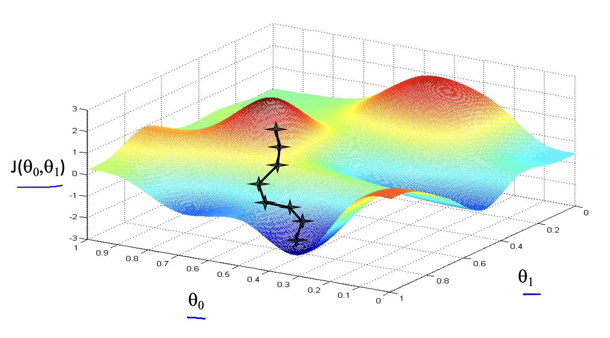
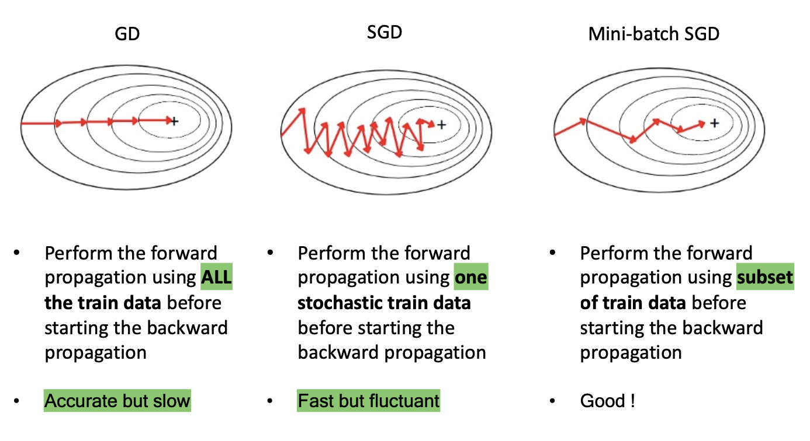
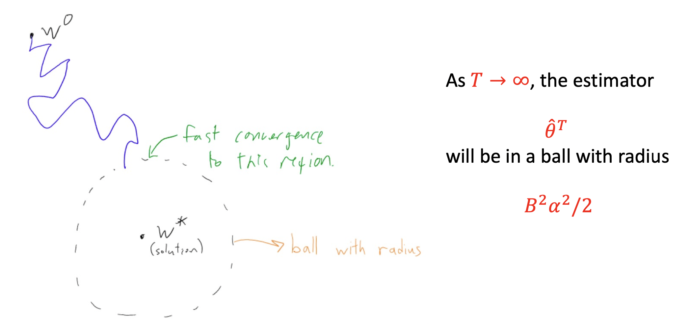
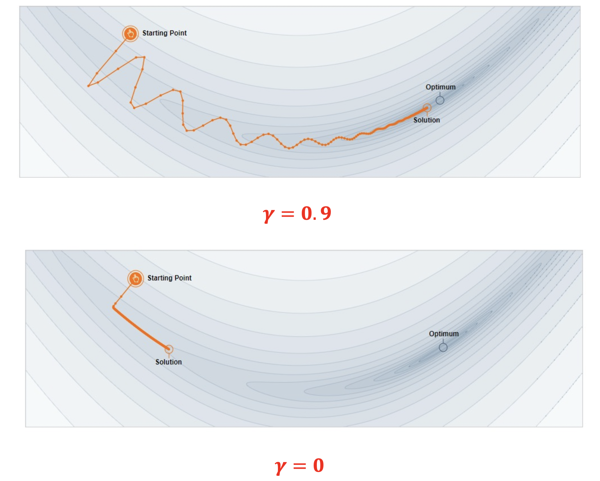
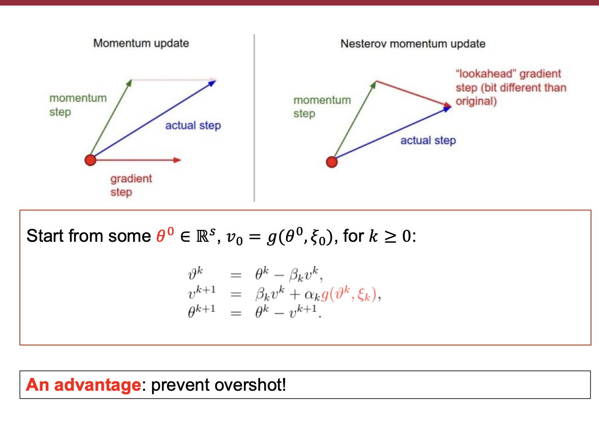
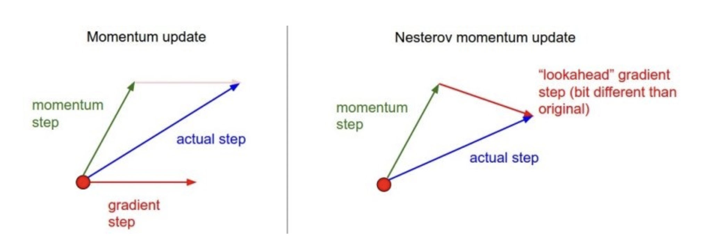
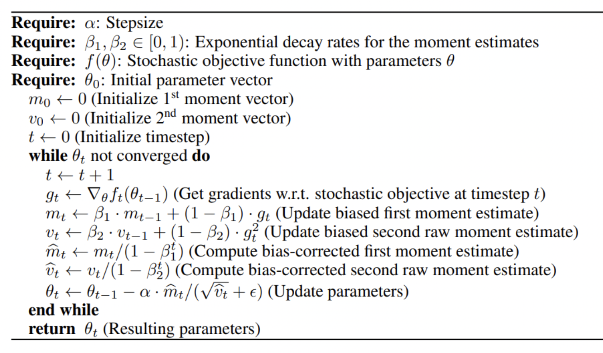
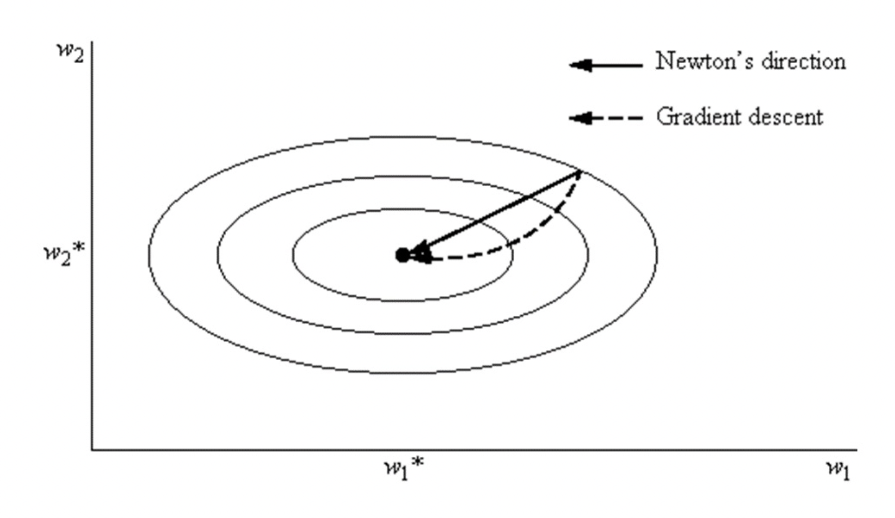
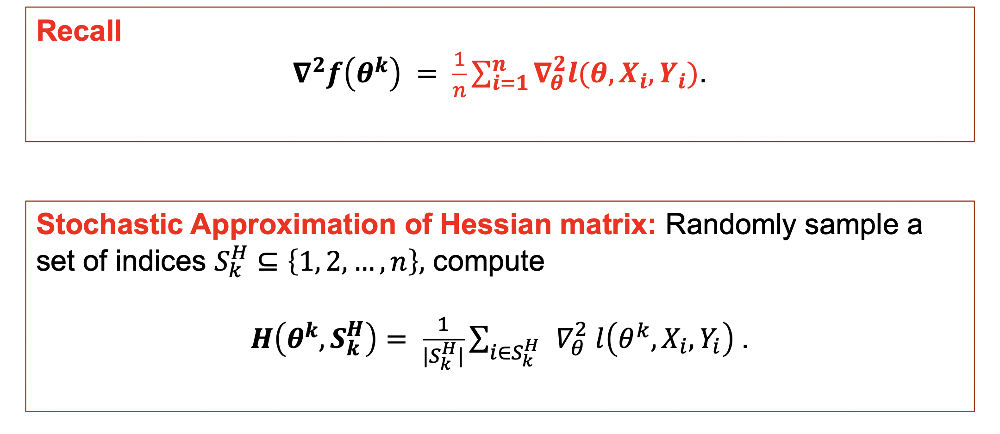

# Linear Search

## Background

### pre-info

==Structure Risk==. $\min\limits_{\theta\in\R^s}f(\theta):=\cfrac{1}{n}\sum\limits_{i=1}^nL_i(Y_i;f(X_i;\theta))$
==Gradient in multiple dimensions==. $\nabla f(x):=\begin{bmatrix}
\frac{\partial f}{\partial x_1}(x)\\
\vdots\\
\frac{\partial f}{\partial x_p}(x)\\
\end{bmatrix}=[Df(x)]^T \in \R^{p\times1}$

==L-smooth function==. $\begin{cases}f(\theta)\text{ is continuously differentiable }\\\nabla f(\theta)\text{ is Lipschitz continuous }\iff\Vert\nabla f(x)-\nabla f(y)\Vert≤L\Vert x-y\Vert,\text{ for some }L>0\end{cases}\\\qquad\implies f\text{ is  L-smooth }$
**Lemma 3.1** Given a L-smooth function $f,\forall x,y\in\text{dom}(f),f(y)\le f(x)+\nabla f(x)^T(y-x)+\cfrac{L}{2}\Vert y-x\Vert^2$

---

### Problem Setting

Assume: $f(\theta)$ is L-smooth
$$\min\limits_{\theta\in\R^s}f(\theta):=\cfrac{1}{n}\sum\limits_{i=1}^nL_i(Y_i;f(X_i;\theta))$$

!!! p "given a point $x^k$ 1. find a descent direction $d^k$  2. find a stepsize $\alpha^k$  $$x^{k+1}=x^{k}+\alpha^kd^k$$"
    假设在某点，寻找方向 direction 和步长 stepsize 使得最小，如果确定则只需要解决一维最优化问题就可以找到下一个搜索点.
    首先选择方向 $d^k$ 通过解决一维最优化问题找到步长 $\alpha^k$

---

## Content

given a point $x^k$:

1. find a descent direction $d^k$
2. find a stepsize $\alpha^k$
3. $x^{k+1}=x^{k}+\alpha^kd^k$

==Descent Direction $d^k$==, $f\in C^1(\R^n),x\in \R^n$ A $d\in\R^n$ is said to be a **descent direction** of $f$ at $x\impliedby\red{[\nabla f(x)]^Td < 0}$.

- More generally, if $D\succeq0$, then $d = -D\nabla f(x)$ is a descent direction.
$\iff$ 任一方向 $d$ 只要能分解成一个正定矩阵 $D$ 和负梯度 $-\nabla f(x)$ 的乘积，那么这个方向一定是下降方向
Proof：$[\nabla f(x)]^T\cdot\big(-D\nabla f(x)\big)=-\big(\nabla f(x)^TD\nabla f(x)\big)\\\qquad\qquad
    \because \nabla f(x)\not=0,\therefore <0$

!!! p "是不是下降方向就看：$[\nabla f(x)]^Td < 0$"
    > At an x that is **not stationary**,
    > > d = $-\nabla f(x)$ is a descent direction？
    >
    > yes. $[\nabla f(x)]^T\cdot-\nabla f(x)=-\Vert\nabla f(x)\Vert_2^2<0$
    >
    > > is the Newton direction $-[\nabla^2f(x)]^{-1}\nabla f(x)$  a **descent direction?**
    >
    > A: Not necessary. $\because d=[\nabla^2f(x)]^{-1}\nabla f(x),\therefore D=[\nabla^2f(x)]^{-1} ? \text{positive definite}\begin{cases}\in &\text{yes}\\\notin&\text{no}\end{cases}$

|  | $d^k=-D^k\nabla f(x^k),D\succeq0$ | descent direction |  |
| --- | --- | --- | --- |
| 牛顿法 | $-[\nabla^2f(x^k)]^{-1}\nabla f(x^k)$ | 一阶导=0 $d^k= -[\nabla^2f(x^k)]^{-1}\cdot\nabla f(x^k)\text{ (not necessary) }\\\text{only }[\nabla^2f(x^k)]\succeq0$ | 仅仅依赖函数值和梯度的信息(即一阶信息) |
| 最速下降法 | $-\nabla f(x^k)$ | 负梯度方向 $d^k=-1I\cdot \nabla f(x^k),\checkmark$ |  |
| 拟牛顿法 | $-B^k\nabla f(x^k)$ | $d^k= -B^k\cdot\nabla f(x^k)\text{ (not necessary) }\\\text{only }B^k\succeq0$ |  |
| 共轭梯度法 |  |  |  |

### direction

#### Gradient Descent, GD, Steepest descent 最速下降法

==梯度==,某一点处的梯度方向是函数值增长最快的方向

$$\text{Start from some }\theta^0\in\R^s,\\\text{ GD updates as}\theta^{k+1}=\theta^k-\alpha_k\nabla f(\theta^k),\\\text{ until }\Vert\nabla f(\theta^{k+1})\Vert\le\epsilon,\text{ for some }\epsilon>0$$

!!! p "Steepest descent with exact line search："
    希望得到一个**在该点下降最快的方向**，来使得我们的迭代过程尽可能的高效。
    **梯度的反方向就是函数值下降最快的方向**。

!!! question "1. In practice: Always use analytic gradient, but check implementation with numerical gradient. This is called a gradient check."

##### 存在性证明：负梯度方向就是下降最快方向

==Taylor展开==. $f\in C^1(\R), \exist \xi\in\{x+td:t\in(0,1)\}, f(x+d)=f(x)+[\nabla f(x)]^Td+[\nabla f(\xi)-\nabla f(x)]^Td$.
其中本来二阶导的地方： $\frac{1}{2}d^T\nabla^2 f(\xi)=[\nabla f(\xi)-\nabla f(x)]^T;\xi\text{ depends on }d$
如果 $\nabla f(x)≠0 \iff x\text{ is not a stationary}$, then，我们取 $\red{d=-\alpha\nabla f(x) \text{ for some }\alpha>0}$
then，$f(x+d)=f(x)+[\nabla f(x)]^Td+[\nabla f(\xi)-\nabla f(x)]^Td$ 变成
$$f(x-\alpha\nabla f(x))=f(x)-\alpha\Vert\nabla f(x)\Vert_2^2-\alpha([\nabla f(\xi)-\nabla f(x)]^T\cdot\nabla f(x))$$
其中第2项：$\nabla f(x)\cdot \alpha\nabla f(x)=\alpha\Vert\nabla f(x)\Vert_2^2；\xi \text{ depends on }\alpha$
其中第3项：$\alpha([\nabla f(\xi)-\nabla f(x)]^T\cdot\nabla f(x))=0$
$$\implies f(x-\alpha\nabla f(x))=f(x)-\alpha\Vert\nabla f(x)\Vert_2^2$$
$$\therefore \text{ for sufficiently small }\alpha>0, f(x-\alpha\nabla f(x))<f(x)\space\text{(是下降方向)}$$
$\implies\red{-\nabla f(x)} $ is called **the steepest descent direction**

- 为什么 $\alpha d:=-\alpha \nabla f(x) \text{ for some }\alpha>0,$(此处的d范围更缩小一点，指方向
    在没有给定d之前：$f(x+d)=f(x)+\alpha\nabla f(x)^Td$
    ∵ Given $ f\& x \implies f(x)\&\nabla f(x)^T\in$ 常量
    $\min\limits_\alpha f(x+d)=f(x)+\alpha\nabla f(x)^Td$ 是关于$\alpha$的函数，要随着$\alpha$增加而减小，且减少得尽可能快，
    $$\therefore d^k=\min_{d^k} \cfrac{\partial f}{\partial \alpha} = \max_{d^k} -\cfrac{\partial f}{\partial \alpha}$$
    Recall： ==Cauchy不等式==. $-\frac{\partial f}{\partial \alpha}=-\nabla f(x)^Td=(-\nabla f(x),d)=\Vert-\nabla f(x)\Vert\cdot\Vert d\Vert\cdot\cos\theta_k$.  $\theta_k$就是搜索方向d和负梯度方向的角度，当$\theta_k=0°$ 时，最大，所以就是最速.
    $$\implies \red{d=- \nabla f(x)}$$

##### Steepest descent with exact line search

$\text{Start at }x^0\in R^n. \text{ For each }k=0,1,…$

1. $\text{Set }d^k=-\nabla f(x^k)\qquad\text{(the search direction)}$
2. $\text{pick } \alpha_k\in\argmin\{f(x^k+\alpha d^k):\alpha>0\}\qquad\text{(step size | learning rate)}$

其中 $\alpha_k$ is chosen according to the exact line search criterion 通过**精确线搜索**确定步长（隐含地假定，对于精确线搜索，存在一个最小化器$\alpha_k$。）

##### Convergence of Steepest descent with constant stepsize

$\begin{cases}f\in C^2(\R^n)\\\inf f >-\infin\\\exist L>0, L\ge\Vert\nabla^2f(x)\Vert_2\\x^{k+1}=x^k-\cfrac{\gamma}{L}\nabla f(x^k)&(1)\end{cases}\implies\forall x, \text{fix any }\gamma\in(0,2)$ any accumulation point of $\{x^k\}$ is a stationary point of $f$
$(1)$: the formula as which sequence generated
也就是说，只要 stepsize $α \in(0, \cfrac{2}{L}),$ 我们就能达到收敛的目标。

- proof:

==Lemmma==
$f\text{ is L-smooth }\\
\implies \forall x,y\in \text{dom}(f), f(y)\le f(x)+\nabla f(x)^T(y-x)+\cfrac{L}{2}\Vert y-x\Vert^2\\
\implies f(y)-f(x)\le\nabla f(x)^T(y-x)+\cfrac{L}{2}\Vert y-x\Vert^2$
由上面的引理，我们可以对 stepsize 进行讨论, 目标是：$f(\theta^{k+1})-f(\theta^k)<0$
$$\begin{align*}f(\theta^{k+1})-f(\theta^k)&=f(\theta^k-\alpha_k\nabla f(\theta^k))-f(\theta^k)\\&\le\nabla f(\theta^k)^T(-\alpha_k\nabla f(\theta^k))+\cfrac{L}{2}\Vert\alpha_k\nabla f(\theta^k)\Vert^2\\&\le(\cfrac{L}{2}\alpha_k-1)\cdot\alpha_k\Vert \nabla f(\theta^k)\Vert^2\quad \colorbox{aqua}{\text{res-1}}\end{align*}\\\implies \cfrac{L\alpha_k}{2}-1<0\implies\alpha_k<\cfrac{2}{L}\rightarrow\cfrac{\gamma}{L}
$$

但是 **what is the optimal step size in the constant step-size strategy？**

$\colorbox{aqua}{\text{res-1}} \quad \Delta= f(\theta^{k+1})-f(\theta^k)\le(\cfrac{L}{2}\alpha_k-1)\cdot\alpha_k\Vert \nabla f(\theta^k)\Vert^2\\\qquad\Delta_{\alpha_k}:= \cfrac{L\alpha_k^2}{2}-\alpha_k<0,\therefore  \alpha_k^*=\argmin\limits_{\alpha_k }\cfrac{L\alpha_k^2}{2}-\alpha_k \\\qquad\quad \cfrac{\partial\Delta_{\alpha_k}}{\partial\alpha_k}=L\alpha_k-1\xlongequal{SET}0\implies \alpha_k^*=\cfrac{1}{L}$

**Convergence of GD with optimal constant step-size** $\alpha=\frac{1}{L}$

$\begin{cases}f\text{ is L-smooth }\\\inf f>-\infin\\\{\theta^k\}_{k=0}^T:=\text{ the sequence by GD with }\alpha=\cfrac{1}{L}\end{cases}\\\qquad\implies \forall\theta^0, \min\limits_{1\le k\le T}\Vert\nabla f(\theta^k)\Vert^2\le\cfrac{2L(f(\theta^0)-\inf f)}{T}$

也就是说，如果我们取这个 optimal step size，对任何的初始参数(分子 constant )，只要 run 足够多次(分母 T large enough), 这个梯度 $\nabla f(x)$ 总能收敛到接近0，也就是 $f(x)$ 达到我们的 local minimizer。

步长保守 the constant stepsize，下降缓慢 potentially

##### Expensive computation

!!! danger "在很高维的情况下，计算很复杂很好耗时间。 用全部样本**to estimate the exact gradient of a random variable。**"
    ==while computing gradient in GD==。算每一个样本点的梯度，如果有 n 个样本，就要算 n 个梯度，**使用了所有训练数据的误差,** 然后再算她们的平均值来充当参数。 This computation is expensive if n is huge !!!
    $$\nabla f(\theta^k)=\cfrac{1}{n}\sum\limits_{i=1}^n\nabla_\theta l(\theta^k;X_i,Y)$$

所以现在不是真的去算出来，而是算用估计的法子。
Instead of computing the exact gradient, we consider $g(\theta,\xi)$, which is **a estimation** satisfying $\mathop{E}\limits_\xi[g(\theta,\xi)]=\nabla f(\theta)$

$$\mathop{E}\limits_ξ[g(\theta,ξ)]\xlongequal{\text{estimate}}\nabla f(\theta)$$

|  | Assume ξ : | $g(\theta,ξ)$ |notes|
| --- | --- | --- |---|
| Noisy gradients | a random noise satisfying E[ξ]=0 | $\nabla f(\theta)+ξ$||
| Stochastic gradients | an index uniformly sampling from {1, 2, ..., n} | $\nabla_\theta l(\theta;X_ξ,Y_ξ)$ |基于 Batchsize 的分类和进化|

**assumption of** $g(\theta,\xi)$
$\begin{cases}f \text{ is convex }\\\mathbb E_\xi[g(\theta,\xi)]=\nabla f(\theta)&\text{(mean)}\\\text{given B, }\forall\theta,\mathbb E_\xi[\Vert g(\theta,\xi)\Vert^2]\le B^2&\text{(variance)}\end{cases}$

因为用随机变量来 estimate，所以期望本来就是我们想要的 $=\nabla f(\theta)$, 方差这里需要被 bounded by B $\iff \sup \mathbb E_\xi[\Vert g(\theta,\xi)\Vert^2]\le B^2$

$\mathbb E_\xi\Vert g(\theta^k,\xi)\Vert$

#### 抽样估计思路的比较

|  | Gradient Descent, GD | Stochastic Gradient Descent, SGD | Batch Gradient Descent, BGD | mini-batch SGD |
| --- | --- | --- | --- | --- |
| Batch_Size | None, All train data 得到梯度 | 1, stochastic | - | subset, Batch Size |
| T(n) | 但数据量大时，计算非常耗时，同时神经网络常是非凸的，网络最终可能收敛到初始点附近的局部最优点 | ^ |^  |^  |
| 梯度准确性 | Accurate but slow (迭代次数少，迭代一次慢 | Fast but fluctuant (迭代一次快，迭代次数多，迭代这么多次的whole process 还是会比GD快 | ^ | 梯度准确了，学习率要加大。 |
| ^ |^  |^  |^  | 利用噪声梯度，一定程度上缓解了GD算法直接掉进初始点附近的局部最优值 |

!!! danger "SGD 在训练 DNN 时并不容易找到全局最小值点。"
    SGD是基于随机采样的，每次迭代仅使用一个样本或一小批样本来估计梯度，因此它在参数空间中搜索最小值的路径是不确定的。
    对于复杂的损失函数和高维的参数空间，DNNs通常存在许多局部最小值和鞍点。局部最小值是损失函数的局部极小值，而鞍点是在某个维度上是局部极小值，而在另一个维度上是局部极大值。这些局部最小值和鞍点可能导致SGD陷入局部最小值或收敛到不理想的解。
    为了克服这个问题，研究人员发展了一些改进的优化算法，如随机梯度下降的变种（如动量梯度下降、Adam等）和自适应学习率方法。这些算法通过引入动量、自适应调整学习率等技术来更有效地搜索参数空间，并有助于避免陷入局部最小值

#### Stochastic Gradient Descent, SGD, 随机梯度下降

Instead of computing the exact gradient, we consider $g(\theta,\xi)$, which is **a stochastic estimation** satisfying $\mathop{E}\limits_\xi[g(\theta,\xi)]=\nabla f(\theta)$

SGD就是一次跑**一個樣本**或是小批次(mini-batch)樣本然後算出一次梯度或是小批次梯度的平均後就更新一次，那這個樣本或是小批次的樣本是隨機抽取的，所以才會稱為==隨機梯度下降法==。

==Stochastic Gradient==. $\xi$ is an index uniformly <u>sampling from </u> {1, 2, ..., n} 被随机选中的数据索引
 $ g(\theta,\xi)=\nabla_\theta l(\theta;X_\xi,Y_\xi)\rightarrow \mathbb E_\xi g(\theta,\xi)=\nabla f(\theta)$

==Stochastic Gradient Descent, SGD==
$$\text{Start from some }\theta^0\in\R^s,\\\text{ SGD updates as }\theta^{k+1}=\theta^k-\alpha_kg(\theta^k,ξ_k)=\theta^k-\alpha_k\cdot\nabla f_{\theta_k}(x_{\xi_k})\\\xrightarrow{\text{approximate}}\theta^k-\alpha_k\nabla f(\theta_k)$$
$g(\theta^k,\xi_k):=$ the stochastic gradient computed at $\theta^k$
$\xi_k :=$ the selected index at k round

1. Sampling strategy to compute 𝑔(𝜃$, 𝜉$).
2. Choose step size 𝛼$ > 0 **.**

    !!! danger "We need to choose decreasing step size. 如果是constant 就不能 find ultimate value"
       - if $\alpha_j\equiv \alpha>0$ ❌ (除非B递减
        $\xRightarrow{ \alpha_j\equiv \alpha>0}\mathbb E[f(\overline{\theta}^T)-f^*]\le\cfrac{\Vert\theta^0-\theta^*\Vert^2+B^2(T+1)\alpha^2}{2(T+1)}$
        $\xrightarrow{T->\infin}\hat{\theta}^T\text{ will be in a ball with radius }\frac{B^2\alpha^2}{2}$
        

       - if $\alpha_j\downarrow$ e.g. $\alpha_t=\frac{1}{t+1}(\text{decreasing})$  ⭕
        $\xRightarrow{\alpha_t=\frac{1}{t+1}}\begin{cases}\sum\limits_{t=0}^\infin\alpha_t=\sum\limits_{t=1}^\infin\cfrac{1}{t}=\infin\\\sum\limits_{t=0}^\infin\alpha_t^2=\sum\limits_{t=1}^\infin\cfrac{1}{t^2}=\cfrac{\pi^2}{6}<\infin\end{cases}$
        $\implies\lim\limits_{T\rightarrow\infin}\mathbb E[f(\overline{\theta}^T)-f^*]=0$

**Convergence of SGD with step-size** $\alpha>0$

$\begin{cases}f \text{ is convex }\iff f(\lambda u + (1-\lambda )v)\le\lambda f(u) + (1-\lambda )f(v).\\E_ξ[g(\theta,ξ)]=\nabla f(\theta)\\E_ξ[\Vert g(\theta,ξ)\Vert^2]\le B^2,\forall \theta, \text{given B}\\\{\theta^k\}:=\text{ the sequence by SGD with }\alpha>0\end{cases}$
$\implies E[f(\overline{\theta}^T)-f^*]\le\cfrac{\Vert\theta^0-\theta^*\Vert^2+B^2\sum\limits_{j=0}^T\alpha_j^2}{2\sum\limits_{j=0}^T\alpha_j},\begin{cases}\:\lambda_k=\sum\limits_{j=0}^k\alpha_j\\\overline{\theta}^k=\lambda_k^{-1}\sum\limits_{j=0}^k\alpha_j\theta^j\end{cases}$

$\xRightarrow{ \alpha_j=\alpha>0}E[f(\overline{\theta}^T)-f^*]\le\cfrac{\Vert\theta^0-\theta^*\Vert^2+B^2(T+1)\alpha^2}{2(T+1)}$

$\xrightarrow{T->\infin}\hat{\theta}^T=\cfrac{B^2\alpha^2}{2}$

$\xRightarrow{\alpha_t=\cfrac{1}{t+1}(\text{decreasing})}\begin{cases}\sum\limits_{t=0}^\infin\alpha_t=\sum\limits_{t=1}^\infin\cfrac{1}{t}=\infin\\\sum\limits_{t=0}^\infin\alpha_t^2=\sum\limits_{t=1}^\infin\cfrac{1}{t^2}=\cfrac{\pi^2}{6}<\infin\end{cases}$

!!! question "proof"

**Advantage:**

1. 计算快，最速下降法更新1次参数的时间，随机梯度下降法可以更新n次

**Limitation:**

1. Slow convergence，因为随机，所以方向摇摆不定，收敛很慢,狂走之字路线，快的是计算过程 ⇒ <u>SGD with momentum</u>
2. converge to the local optimal solution
不经意间收敛到local就停了，（随机梯度下降法由于训练数据是随机选择的，更新参数时使用的又是选择数据时的梯度，所以容易陷入目标函数的局部最优解。
3. converge to saddle points
4. 只能 go to some neighbourhoods of the optimal solution
$\mathbb E[f(\overline{\theta}^T)-f^*]\le\cfrac{\Vert\theta^0-\theta^*\Vert^2+B^2(T+1)\alpha^2}{2(T+1)}\rightarrow\hat{\theta}^T\text{ on a ball with radius}\cfrac{B^2\alpha^2}{2}$

每次更新参数时只使用一个样本来计算梯度，这样就避免了BGD计算非常缓慢的问题，同时SGD每次计算梯度的样本不同，所以计算出来的梯度不稳定，会出现抖动，正是这种不稳定产生的抖动，使算法可能跳出鞍点从而找到更优解。SGD每次只使用一个样本更新梯度，计算更快，并且在训练过程中可新增样本，因此适合online训练。

每次使用一个样本计算梯度具有高方差性，容易受到离群点或异常数据的干扰，在优化过程中会出现严重的抖动，这种随机性便是其名字的由来

#### mini-batch SGD

设随机选择m个训练数据的索引的集合为K，

假设训练数据有100个，那么在m=10时，创建一个有10个随机数的索引的集合，例如K={61, 53, 59, 16, 30, 21, 85, 31, 51, 10}，然后重复更新参数

==mini--batch Stochastic Gradient Descent, SGD==.
$$\text{Start from some }\theta^0\in\R^s,\\
\text{ SGD updates as }\large\theta^{k+1}=\theta^k-\alpha_k\mathop{\mathbb E}\limits_{\xi_k\in\Xi_k}g(\theta^k,ξ_k)=\theta^k-\alpha_k\cdot\mathop{\mathbb E}\limits_{\xi_k\in\Xi_k}\nabla f_{\theta_k}(x_{\xi_k})$$
$g(\theta^k,\xi_k):=$ the stochastic gradient computed at $\theta^k$
$\Xi_k :=$ the selected indexes at k round(mini-batch)

In each epoch, $n_E$ SGD updates will be executed. Usually, we select

$n_E=\text{ceil}(\frac{n}{p}),\quad\begin{cases}n:= \#\text{ samples in each epoch} = \#\text{ all samples}\\p:= \#\text{ samples in each mini-batch} \\n_E:=\#\text{batch in each epoch}\end{cases}$

不同代之间数据要shuffle

采用一个**小批量**的数据进行梯度的计算，其目的是在保证计算速度的同时，避免SGD的随机性，降低参数更新时的方差，使收敛更稳定。

MBGD容易受学习率的影响：设置得太大容易出现与SGD类似的不稳定现象，会在**鞍点处振荡**，甚至偏离最优解；设置得太小，会造成收敛速度过慢。
MBGD的学习率对所有的参数更新都是一样的，如果数据是稀疏的，我们更希望对出现频率低的特征进行较大的更新，并且学习率会随着更新次数逐渐减小。显然，MBGD并不能满足这些需求，所以我们需要能够自适应学习率的算法。

#### SGD with Momentum

==Momentum==
We often think of Momentum as a means of dampening oscillations and speeding up the iterations, leading to faster convergence.
Momentum proposes the following tweak to gradient descent. We give gradient descent a short-term memory:

> 【不那么正确但很好理解的例子】Momentum is a heavy ball rolling down the same hill. The added inertia acts both as a smoother and an accelerator, dampening oscillations and causing us to **barrel through narrow valleys, small humps and local minima. 动量是一个沉重的球滚下同一座山。增加的惯性既是平滑的，也是加速器，抑制振荡，导致我们穿过狭窄的山谷、小驼峰和局部最小值。**

$$\colorbox{grey}{\text{(def)}} \text{ SGD with momentum }\\\quad \text{Start from some }\theta^0\in\R^s, v_0=g(\theta^0,\xi_0), \text{ for }k\ge0,\\[1em]\qquad v^{k+1}=\red\gamma v^k+\red{(1-\gamma)}g(\theta^k,\xi_k),\quad (\gamma \text{ usually 0.9}\\[1ex]\qquad \theta^{k+1}=\theta^k-v^{k+1}$$

SGD和momentum在更新參數時，都是用同一個學習率(*γ*)

主要是用在計算參數更新方向前會考慮前一次參數更新的方向 $(v_{t-1})$，如果當下梯度方向和歷史參數更新的方向一致（因为是累积求和的），則會增強這個方向的梯度，若當下梯度方向和歷史參數更新的方向不一致，則梯度會衰退。然後每一次對梯度作方向微調。這樣可以增加學習上的穩定性(梯度不更新太快)，這樣可以學習的更快，並且有擺脫局部最佳解的能力。

加上动量之后的SGD优化算法会沿着梯度的方向越来越快地进行更新，而不相关的方向将逐渐得到抑制，因此能减少优化过程中出现的“之”字形路线

**Limitation:**
momentum may be wrong。如果一辆汽车一直加速，在遇到障碍物时是否能停下来？梯度更新也是一样的，Momentum虽然能加速SGD算法，但是很容易“冲上斜坡”

momentum 能逃离局部最小点，冲上小山谷，但是也有可能因为不断累积的动量太大，错过全局最小，一冲冲出去

#### SGD with Nesterov momentum

假设有一个“智能”的雪球从斜坡上往下滚，它在滚动过程中不仅会考虑动量为自己加速，还会思考“下一时刻是否会撞墙”，从而实现减速 —— 在计算参数的梯度时，应在损失函数中减去动量项

SGD with Nesterov  momentum

$$\text{Start from some }\theta^0\in\R^s, v_0=g(\theta^0,\xi_0), \text{ for } k\ge0,\\
\redν^k=\theta^k-\beta_kv^k \\
v^{k+1}=\red\gamma v^k+\red{(1-\gamma)}g(\redν^k,\xi_k), \\
\theta^{k+1}=\theta^k-v^{k+1}$$

$\redν^k:=$ 近似当作参数下一步会变成的值
$\gamma$ usually 0.9

difference between Origin and Nesterov:

- Origin momentum: 在 $θ^k$ 上既计算 gradient  $g(θ^k,\xi_k)$, 又计算 momentum $v^k$
    - Momentum SGD先计算当前的梯度，更新后的累积梯度会出现一个大的跳跃
- Nesterov momentum: 在 $θ^k$ 上先计算 momentum $υ^k$, 再在新的点上计算 gradient   $g(ν^k,\xi_k)$ .，在NAG算法中不是计算当前位置的梯度，而是计算未来位置上（下一时刻）的梯度
    - NAG SGD会在前一步梯度的基础上做修正，从而得到最下面的梯度，避免速度越来越快。with a shorter step to prevent overshoot
    - NAG算法在循环神经网络、LSTM等任务上表现良好。
- Momentum SGD和NAG SGD这两种加速算法只针对梯度进行优化，并没有**针对参数重要性进行不同程度的更新，也没有学习率的自动调整**

#### Adagrad: Adaptive Learning Rates

==學習率衰減(Learning rate decay)==。大的學習率可以較快走到最佳值或是跳出局部極值，但越後面到要找到極值就需要小的學習率。

Rescale the learning rate of **each coordinate** by the **historical progress**.

==Adagrad==
$$ \text{Start from some }\theta^0\in\R^s, n_g^0=0,\text{ for }k\ge0\\[1em]\qquad n_g^{k+1}= n_g+<g(\theta^k,\xi_k),g(\theta^k,\xi_k)>\\[1ex]\qquad \theta^{k+1}=\theta^k-\cfrac{\alpha_k}{\red{n_g+10^{-8}}}g(\theta^k,\xi_k) \qquad\text{ (rescale)}$$

The learning rate (step size) goes to zero quickly.

#### RMSProp

Discount the accumulated norm of the gradients.

==RMSProp==。
$$\text{Start from some }\theta^0\in\R^s, n_g^0=0,\text{ for }k\ge0\\
n_g^{k+1}=\red\gamma n_g+\red{(1-\gamma)}<g(\theta^k,\xi_k),g(\theta^k,\xi_k)>\\
\theta^{k+1}=\theta^k-\cfrac{\alpha_kg(\theta^k,\xi_k)}{\red{n_g+10^{-8}}} \qquad\text{ (rescale)}$$

仍然使用指数加权平均，旨在消除梯度下降中的摆动，与 Momentum 的效果一样。如果某个维度的导数比较大，则指数加权均值就大；如果某个维度的导数比较小，则其指数加权均值就小。这样可以保证各个维度的导数都在一个量级，从而减少摆动

#### ADAM, Adaptive Moment Estimation

Consider **momentum** and **adaptive learning rate** (second-order momentum) together.

是另外一种计算每个参数的自适应学习率的算法，比Adadelta算法和RMSprop算法更激进，不仅考虑了指数衰减均值，降低学习率过度衰减的问题，还加入了 Momentum 的动量思想。
$m_t=\beta_1m_{t-1}+(1-\beta_1)g_t$ t时刻的动量
$v_t=\beta_2v_{t-1}+(1-\beta_2)g_t^2$t时刻的指数衰减均值。
如果 $m_t，v_t$ 初始化为0，则会向0偏置，因此Adam做了偏差纠正
$\hat{m}_t=\cfrac{m_t}{1-\beta_1^t}$
$\hat{v}_t=\cfrac{v_t}{1-\beta_2^t}$
最终梯度更新
$$\theta_{t+1}=\theta_t-\cfrac{\iota}{\sqrt{\hat{v}_t}+\epsilon}\hat{m}_t$$

建议:$\alpha=0.001,\beta_1=0.9,\beta_2=0.999,\epsilon=10^{-8}$

大量事件表明 Adam 》 Adadelta & RMSprop. <u>Transformer in CV 很爱用ADAM</u>

当二阶动量参数 $\beta_2$ 很大且一阶动量参数 $\beta_1 < \sqrt{\beta_2}<1$ 时，Adam 可以收敛。据我们所知，我们是第一个证明具有任意大 $\beta_1$ 的 Adam 可以在没有任何形式的有界梯度假设的情况下收敛。这个结果表明，没有任何修改的Adam在理论上仍然可以收敛。当$\beta_2$ 较小时，我们进一步指出Adam 可以发散到无穷。我们的发散结果考虑了与收敛结果相同的设定（提前固定优化问题），这表明当增加 $\beta_2$ 时存在从发散到收敛的相变。这些结果可能会为更好地调整 Adam 的超参数提供指导。

### convergence  of ADAM

But the convergence analysis contains some **mistakes** in the original paper. ADAM can be **non-convergent**!

---

#### Newton’s method 牛顿迭代法

<u>方法本身：求解非线性方程 $g(x)=0$ 的==近似根== $x^*$</u>
在 Descent Direction 上的应用：求解  $\red{\text{新}\cdot g(x) = \nabla f(x^*)=0}$

使用**函数的泰勒级数**的前面几项来寻找方程的根。

##### 方法本身

- **背景**
多数方程不存在求根公式，因此求精确根非常困难，甚至不可能，从而寻找方程的<u>近似根</u>就显得特别重要。方程用二次函数的形式表示出来，我们就可以通过上面的办法大踏步的前进了！由此我们祭出将任意N阶可导函数化为N次多项式的神器：**N阶泰勒展开**
- **思路**
设 $x^*$ 是 $g(x)=0$ 的近似根，将 $g(x)$ 在 $x^k$ 附近**用一阶泰勒多项式近似**
$$g(x)=g(x^{k})+ \nabla g(x^k)^T\cdot (x-x^k)+o(\vert x-x_0\vert)$$
舍去高阶项：$g(x)=g(x^{k})+ \nabla g(x^k)^T\cdot (x-x^k)$
将近似根代入：
<a id="eq1"> $$\begin{align*} g(x^*)=g(x^{k})+ \nabla g(x^k)^T\cdot (x^*-x^k)=0\tag{1}\\x^*=x^k-\cfrac{g(x^k)}{g'(x^k)}\tag{2}\end{align*}$$ </a>
不能一步得到，所以需要迭代  ∴迭代公式：$\red{x^{k+1}=x^k-\cfrac{f(x^k)}{f'(x^k)}}$

    !!! p "【说人话】"
        1. 先随机选一个点，
        2. 然后求出$f(x)$在该点的切线。
        3. 该切线与x轴相交的点为下一次迭代的值。
        直至逼近$f(x)=0$的点。
- **停止标准**
  - $\vert x_{k+1}-x_k\vert <\epsilon_1$
  - $\vert f(x) \vert<\epsilon_2$: $f(x)$很小，小于精度，不能保证x的精度
    局限性：对于某些特殊函数，小区间急速变化
- **几何本质**
    **在原函数的某一点处用一个二次函数近似原函数，然后用这个二次函数的极小值点作为原函数的下一个迭代点。** 基于当前迭代点的梯度信息进行搜索方向的选择的，牛顿法是通过Hessian矩阵在梯度上进行线性变换得到搜索方向

##### 收敛

fast local convergence 快速的局部收敛  + Quadratic convergence 二阶收敛性
$\iff$ 牛顿法**靠近最优点**时是**二次**收敛的

$\begin{cases}g\in C^2(\red{\R})\\g(x^*)=0\\g’(x^*) ≠0.
\end{cases}\implies\exist \varepsilon>0, \vert x^0-x^* \vert<\varepsilon.$ And with Newton’s iterate: $x^{k+1}=x^k-\cfrac{g(x^{k})} {g'(x^{k+1})}$is well defined.
$$\implies\exist M>0, \vert x^{k+1}-x^k\vert≤M\Vert x^k-x^*\Vert_2$$

!!! p "【说人话】就是说如果 $x^0$ 选的好，那么牛顿法很好用，收敛速度很快，每次迭代之后，如果 $x^0$ 的初始化足够接近一个好的解决方案，那么牛顿方法的定义很好，收敛速度也非常快：每次迭代的正确数字数量大约翻一番。（甚至步长都不需要确定）。所以牛顿法对函数在迭代点处的信息利用更加充分，直观来看，相比于梯度下降法，函数足够正则的情况下牛顿法迭代得更加准确，收敛速率也会更快。"
    当x在以 $x^*$ 为原点，$\varepsilon$ 为区间的邻域内进行迭代，所有迭代过来的 $x^k$ 都以二次收敛的速度收敛于 $x^*$【局部の二次の收敛】，其中$M=\frac{\tau}{2\delta}$

##### 失效

1. $x^0$选的不好，离$x^*$很远，$\exist x^k\in(x^0,x^*),g'(x^k)=0$，几何上没有升降的空间，运算上分母为0失效（更远了）
2. due to cycling

##### 在 Descent Direction 上的应用

!!! p "目标：$\red{\text{新}\cdot g(x) = \nabla f(x^*)=0}$"
    $\exist x^{k+1}, \nabla f(x^{k+1})=0 \implies \nabla f(x)=\nabla f(x^k)+\nabla^2f(x^{k})(x-x^k)$

**迭代方程：**

<a href="#eq1">$$\begin{align*} g(x^*)=g(x^{k})+ \nabla g(x^k)^T\cdot (x^*-x^k)=0\tag{1}\\x^*=x^k-\cfrac{g(x^k)}{g'(x^k)}\tag{2}\end{align*}\\\Downarrow$$ </a>
$$\begin{align*} \nabla f(x^*)=\nabla f(x^{k})+ \nabla^2 f(x^k)^T\cdot (x^*-x^k)=0\tag{3}\\x^*=x^k-\cfrac{\nabla f(x^k)}{\nabla^2f(x^k)}\tag{4}\end{align*}$$
==经典牛顿法==:
$$d^k=-\cfrac{\nabla f(x^k)}{\nabla^2f(x^k)}, \alpha\equiv1$$

要求：

1. $\forall k,\nabla^2f(x^k)$可逆$\iff  \in\text{sigular 非奇异矩阵}$ 二阶可微函数
2. 计算$\cfrac{\nabla f(x^k)}{\nabla^2f(x^k)}$ 简单

!!! p "$\text{ For k=0,1,2…,}\text{ update }x^{k+1}=x^k-\cfrac{\nabla f(x^k)}{\nabla^2f(x^k)}$.  不要去求解$(\nabla^2f)^{-1}$然后再乘，而是把$d=\cfrac{\nabla f(x^k)}{\nabla^2f(x^k)}$，解$\nabla^2f(x^k)d=\nabla f(x^k)$"
⭐ 牛顿法也只是找到一阶导为0，也就是说朝着极值的$d^k$，不一定是函数值的下降方向，还要verify **通过$\nabla^2 f(x^*)$去验证$X=x^*$是否local minimizer**
⭐ 可以用更少的迭代次数大踏步地前进，并且前进的方向也更趋向于函数的全局最优解（即最值而非极值点），同时也能够摆脱上面梯度下降法中确定α的痛苦

Here we discuss just the local rate-of-convergence properties of Newton’s method. We know that for all x in the vicinity of a solution point x∗ such that∇2 f(x∗) is positive definite, the Hessian ∇2 f(x) will also be positive definite. Newton’s method will be well defined in this region and will converge quadratically, provided that the step lengths αk are eventually always 1.

##### 缺点

1. 每一步迭代需要求解一个 $n$ 维线性方程组，这导致在高维问题中计算量很大.海瑟矩阵 $\nabla^2 f (x^k )$ 既不容易计算又不容易储存.
2.  $\nabla^2 f (x^k )$ 不正定时，由牛顿方程给出的解 *dk* 的性质通常比较差.例如可以验证当海瑟矩阵正定时，*dk* 是一个下降方向，而在其他情况下 *dk* 不一定为下降方向.
3. We need to assume 𝑓 to be convex to guarantee the direction is a descent direction.
4. Newton’s method **only converges locally, even for strongly convex functions.**

- **advantage**:

1. Newton’s method enjoys **a local quadratic convergence rate** under some assumptions:
fast local convergence 快速的局部收敛  + Quadratic convergence 二阶收敛性
$\iff$ 牛顿法**靠近最优点**时是**二次**收敛的.当x在以$x^*$为原点，$\varepsilon$为区间的邻域内进行迭代，所有迭代过来的$x^k$都以二次收敛的速度收敛于$x^*$【局部の二次の收敛】
$\exist M>0 ,\vert \theta^{k+1}-x^*\vert≤M\Vert x^k-x^*\Vert^2$

If the current iteration achieves an accuracy of the order 𝟏𝟎^-𝟑, we can expect an accuracy of the order 𝟏𝟎^-𝟔 for the next iteration!!!

#### Conjugate gradient method 共轭梯度法

Flops per iteration is $O(n^2)$; It converges in at most *n* steps;
It keeps track of *O*(1) vectors of dimension *n* per iteration.

!!! p "idea: Modify the steepest descent direction to fit the (ellipse) geometry."

==Projection onto v==. $u\in\R^n,v\in\R^n\setminus\{0\}$. The projection of u onto v $\text{proj}_v(u):=w:=\cfrac{u^Tv}{\Vert v\Vert_2^2}v$
从几何的角度：$\Vert w\Vert_2=\Vert u\Vert_2\cos\theta=\Vert u\Vert_2\cfrac{u^Tv}{\Vert u\Vert_2\Vert v\Vert_2}=\cfrac{u^Tv}{\Vert v\Vert_2}\implies$ Unit vector along w is $\cfrac{v}{\Vert v\Vert_2}$

==Gram-Schmidt process==. Given a set of linearly independent vectors $\{v^0,...,v^k\} \subset\R^n, w^0\xlongequal{SET} v^0.$
$\forall j = 1,...,k, w^k=v^k-\sum\limits_{j=0}^{k-1}\cfrac{{(v^k)}^Tw^j}{\Vert w^j\Vert_2^2}w^j, \begin{cases}\forall i,w^i\ne 0\\\forall i\ne j,{(w^i)}^Tw^j=0\end{cases}\\\implies\text{Span}\{v^0,...,v^k\}=\text{Span}\{w^0,...,w^i\}$

==Generalized Gram-Schmidt process==. Given $A\in\R^n,A\succ0$ and a set of linearly independent vectors $\{v^0,...,v^k\} \subset\R^n, w^0\xlongequal{SET} v^0.$
$\forall j = 1,...,k, w^k=v^k-\sum\limits_{j=0}^{k-1}\cfrac{{(v^k)}^TAw^j}{{(w^j)}^TA w^j}w^j, \begin{cases}\forall i,w^i\ne 0\\\forall i\ne j,{(w^i)}^TAw^j=0\end{cases}\\\implies\text{Span}\{v^0,...,v^k\}=\text{Span}\{w^0,...,w^i\}$

##### Conjugate gradient method: Conceptual version

Start at $x^0\in\R^n$ and $d^0 =-\nabla f(x^0)=b-Ax^0$.

For each *k* = 0,1,2,...,

- If $d^k = 0$, terminate.
- Pick $\alpha_k\text{ s.t. }\alpha_k\in\min\{f(x^k +\alpha d^k): α\ge0\}$.
- $x^{k+1}\xlongequal{SET}x^k +α_kd^k, d^{k+1} = -\nabla f(x^{k+1})-\blue{\sum\limits_{j=0}^k\cfrac{[-\nabla f(x^{k+1})]^T Ad^j}{ (d^j)^TAd^j}}$

##### Conjugate gradient method: Formal version

Start at $x^0\in\R^n$ and $d^0 =-\nabla f(x^0)=b-Ax^0$.

For each *k* = 0,1,2,...,

- If $d^k = 0$, terminate.
- Pick $\alpha_k\text{ s.t. }\alpha_k\in\min\{f(x^k +\alpha d^k): \alpha\ge0\}$.
- $x^{k+1}\xlongequal{SET}x^k +\alpha_kd^k, d^{k+1} = -\nabla f(x^{k+1})-\blue{\cfrac{\Vert\nabla f(x^{k+1})\Vert_2^2}{\Vert\nabla f(x^k)\Vert_2^2}d^k}$

##### Conjugate gradient method: Actual version

**迭代过程：**

Start at $x^0\in\R^n$ and $\blue{r^0}=d^0 =-\nabla f(x^0)=b-Ax^0$.

For each *k* = 0,1,2,...,

- If $\Vert d^k\Vert \blue{\text{ is below a tolerance}}$, terminate.
- $α_k=\cfrac{(r^k)^Tr^k}{(d^k)^TAd^k}\:,\:x^{k+1}=x^k+\alpha_kd^k\:,\:r^{k+1}=r^k-\alpha_kAd^k\qquad\text{(excat line search)}$.
- $\beta_{k} =\cfrac{(r^{k+1})^Tr^{k+1}}{(r^k)^Tr^k}\:,\:d^{k+1}=r^{k+1}+\beta_kd^k\qquad\text{Update} d^{k+1}$

**优点:**

- One matrix-vector multiplication per iteration if $Ad^k$ is saved.
- Keeping track of four vectors, $x^k, r^k, d^k, Ad^k$ saved.

Newton-CG啊，其实挺简单的。传统的牛顿法是每一次迭代都要求Hessian矩阵的逆，这个复杂度就很高，为了避免求矩阵的逆，Newton-CG就用CG共轭梯度法来求解线性方程组，从而避免了求矩阵逆。

#### Truncated Newton’s method (Hessian-Free Optimization)修正牛顿法

==Projection onto $S_+^n$==. $A\in S^n,A = UDU^T$ be its eigenvalue decomposition.
$A_+ := UD_+U^T$
$D_+$ is the diagonal matrix with $(d_+)_{ii}=\max\{d_{ii},0\}, \forall i.$
$A_+$  is the **unique** solution of $ \min\Vert Y-A\Vert_F \text{ s.t.}Y\succeq0$

##### 定义

1. Pick $\sigma\in(0,1), \beta\in(0,1), \overline{\alpha}_k\equiv1$, a small  $\eta>0$ and a huge  $M > 0$. Initialize at $x^0 \in\R^n$
2. For $k = 0,1,2,...,$  
    1. let $UDU^T$ be an eigenvalue decomposition of $\nabla^2f(x^k).$
    2. Let $\varLambda$ be diagonal with $\lambda_{ii} = \max\{\min\{M,d_{ii}\},\eta\} \qquad\text{(Project } d_{ii} \text{ on }[\eta,M])$  
    3. Set $D^k \coloneqq U\varLambda U^T$ and $d^k\coloneqq -D^k\nabla f(x^k).$.
    4. Update $x^{k+1}=x^k+\alpha^kd^k\\\qquad \alpha^k\text{ is obtained via the Armijo line search by backtracking }$

Let $f\in C^2(\R^n)$ with $\inf f > 1$ and let $\{x^k\}$ be generated by **the truncated Newton’s method.** Then any accumulation point of $\{x^k\}$ is a stationary point of f.

##### Computational concerns

### 拟牛顿类算法

!!! p ""
    对于大规模问题，函数的海瑟矩阵计算代价特别大或者难以得到，即便得到海瑟矩阵我们还需要求解一个大规模线性方程组.
    它能够在每一步以较小的计算代价生成**近似矩阵**，并且使用**近似矩阵代替海瑟矩阵而产生的迭代序列**仍具有超线性收敛的性质.
    不计算海瑟矩阵 $∇^2 f (x)$，而是构造其**近似矩阵** $B^k$ 或**其逆的近似矩阵** $H^k$

#### Basic idea: Secant equations

- **思路**

    目的：$g(x)=0，g\in C^1(\R)$

    ==Taylor Formula==. $g(x^{k+1})=g(x^{k})+\nabla g(x^k)(x^{k+1}-x^k)=0$
    $\implies x^{k+1}=x^k-\cfrac{g(x^k)}{\nabla g(x^k)}$

    但当一阶导$\nabla g(x)$太难求，我们就想到了割线方程 Secant equation。Use finite difference to approximate $\nabla g(x)$

    ==Secant equations==. $\nabla g(x^k)\approx\cfrac{g(x^k)-g(x^{k-1})}{x^k-x^{k-1}}$
    $\implies x^{k+1}=x^k-g(x^k)\cfrac{x^k-x^{k-1}}{g(x^k)-g(x^{k-1})}$

  - Notes:
    1. 这里同时有k+1，k，k-1. initialized at $x^0,x^{-1},g(x^0)≠g(x^{-1})$
    2. The local convergence rate of the secant method is **typically slower** than Newton’s method. However, **the computational cost** per iteration can be smaller when $g'$ is hard to compute compared with *g*

> > Find the square root of 2 using the secant method, starting at $x^{-1} = 1.4, x^0 = 1.5$, up to 4 decimal places.

#### 在 descent direction 上的应用

目的：$\nabla f(x)=0$

same ideas: $\nabla g(x^k)(x^k-x^{k-1})\approx g(x^k)-g(x^{k-1})\Downarrow$
$$\nabla^2f(x^{k+1})(x^{k+1}-x^k)\approx\nabla f(x^{k+1})-\nabla f(x^k)$$

Notation: $s^k:=x^{k+1}-x^k,\space y^k=\nabla f(x^{k+1})-\nabla f(x^k)\implies \nabla^2f(x^{k+1})s^k=y^k$

**成功的关键：** 我们能够连续不断地构造矩阵$\begin{cases}\text{Method 1: }B^{k+1}\approx \nabla^2f(x^{k+1})\\\text{Method 2 }H^{k+1}\approx \cfrac{1}{\nabla^2f(x^{k+1})}\end{cases}$ 去拟合海塞矩阵，使得$\begin{cases}  B^{k+1}s^k=y^k \\H^{k+1}y^k=s^k\end{cases}$, 因为我们是要迭代的，所以就是能连续生成迭代

**问题：怎么迭代，迭代有什么要求?**

1. Initialize $B^0$ (or $*H^0*$) at a **positive definite** matrix.
   ==proposition of BFGS==. $\begin{cases}H_k\succ0\\{y^k}^Ts^k>0\\H_{k+1}\text{ is given by BFGS update}\end{cases}\implies H_{k+1}\succ 0.$
   Same for B
2. Since $B^0$ and $H^0$ were **symmetric** to start with, by induction, all $B^k$and $H^k$ are **symmetric**.
3. **Popular update formula**

- Note:
    1. DFP and BFGS are rank-2 updates, while SR1 is rank-1 update.
    2. In practice, **BFGS** usually performs better.
- Verify the secant equation for BFGS.

### Quasi-Newton method

Given $f\in C^1(\R^n).$

Initialize at $x^0\in\R^n$ and $B_0,H_0\succ 0$, is **symmetric and positive definite**

#### Quasi-Newton based on $B_k$

For $k = 0,1,2,...$  

1. Find $d^k =-B_k^{-1}\nabla f(x^k).$
2. Update $x^{k+1} = x^k +d^k\times 1$,
3. Set $y^k =\nabla f(x^{k+1})-\nabla f(x^k)$  and $s^k = x^{k+1}-x^k$.
4. Compute $B_{k+1}$ by **Popular update formula**

### BFGS

#### Quasi-Newton based on $H_k$

For $k = 0,1,2,...$  

1. Find $d^k =-H_k\nabla f(x^k).$
2. Update $x^{k+1} = x^k +d^k\times 1$,
3. Set $y^k =\nabla f(x^{k+1})-\nabla f(x^k)$  and $s^k = x^{k+1}-x^k$.
4. Compute $H_{k+1}$ by **Popular update formula**

## StepSize $\alpha_k$

!!! p "$\text{ given } x^{k} \text{ and }d^k$   变成了单变量优化：$\alpha^k =\min\limits_{\alpha>0}\varphi(\alpha) =f(x^k+\alpha d^k)$.它是目标函数 *f* (*x*) 在射线 $\{x^k + αd^k:α > 0\}$ 上的限制"

$$\alpha^k =\min\limits_{\alpha>0} f(x^k+\alpha d^k)$$

### 分类: exact & inexact

==exact line search strategy==. 等于求极小值点问题。

 $\nabla\varphi(\alpha)=[\nabla f(x^k+\alpha d^k)]^Td^k\xlongequal{SET}0\implies[\nabla f_{k+1}]^Td^k=0$

通常需要很大计算量，在实际应用中较少使用

==inexact line search strategy==。寻找**步长$\alpha$的一个区间**，通过逐步迭代的方法去寻找**仅仅是满足条件的点**。当搜索结束时，需要满足该步长能够对目标函数带来**充分的下降**。More practical strategies perform an inexact line search to identify a step length that achieves adequate reductions in f **at a minimal cost**.

### inexact line search strategy

#### Termination conditions 线搜索准则

因为迭代：
$$f(x^k + α^kd^k) = \min\limits_{α≥0}f(x^k + αd^k)$$

!!! p "为提高非精确算法的搜索效率，需要确定一些termination conditions 去判断是否迭代到 $\alpha^*$，确保**迭代的收敛性。**"

##### Sufficient Decrease condition (Armijo condition) 充分下降条件

- **定义：**

    $$\begin{cases}x\in \R^n, d\in \R^n\\\alpha>0, c_1\in(0,1)\\f(x^k+\alpha d^k)≤f(x^k)+c_1\alpha[\nabla f(x^k)]^Td^k
    \end{cases}\implies \alpha\text{ satisifies Armijo rule}$$

    其中：$d^k$: descent direction;$c_1=10^{-4}$is chosen to be quite small

    !!! p "**alone is not sufficient** to ensure that the algorithm makes reasonable progress along the given search direction:"
        *α* = 0 显然满足条件，而这意味着迭代序列中的点固定不变，研究这样的步长是没有意义的
        是 the Wolfe conditions $1^{st}$  condition
        是 the Goldstein conditions $2^{nd}$ inequality
        是 Backtracking line search 的停止标准stopping criterion， alone is ok

- **存在性证明:**

    $\alpha 存在 \iff \text{Armijo rule is not valid}$，选取符合Armijo rule 确实会使得函数值下降

    Let $f\in C^1(\R^n), x\in\R^n, d\in\R^n \text{ be a descent direction at }x$. Let $\sigma\in(0,1)$. Then there $\exist \alpha_1 > 0$ so that $\forall \alpha\in[0,\alpha_1],f(x + \alpha d)≤f(x)+\alpha\sigma[\nabla f(x)]^Td.$

- **How to execute Armijo rule in practice?**

    **Fix  $\sigma\in(0,1)$ and $\beta\in(0,1)$. Given  $x\in\R^n, d\in\R^n, \overline{\alpha}>0$. Find the smallest nonnegative integer $j = j_0$ so that**

    $$f(x +\overline{\alpha}\beta^jd)≤ f(x)+\overline{\alpha}\beta^j\sigma[\nabla f(x)]^Td$$
    normally: $\sigma= 10^{-4}, \beta=\cfrac{1}{2}, \overline{\alpha}\beta^{j_0}$ is the step size

    **Note:**

    1. $d$ is a descent direction +  $j$ is sufficiently large  $\rightarrow \beta^j$ is sufficiently small → Armijo rule satisfied。
    2. 可证 $\overline{\alpha}\beta^j \text{ is decreasing}\therefore \text{it is called backtracking}$
    3. $\overline{\alpha}$  选择对收敛效率来说很关键

- **Convergence under Armijo rule**
    $\begin{cases}f\in C^1(\R^n),\inf f>-\infin\\
    \{\overline\alpha_k\}\subset\R ,0<\inf\limits_k\overline{\alpha}_k≤\sup\limits_k\overline{\alpha}_k<\infin\\
    \sigma\in(0,1),\beta\in(0,1)\\
    \{D_k\}\succ 0,
    d^k=-D_k\nabla f(x^k)\\
    x^k \text{ is non-stationary}\\
    x^{k+1} = x^k + \alpha_kd^k
    \end{cases}$ $\alpha_k$ is generated via the Armijo line search by backtracking with $ x = x^k, d = d^k, \overline\alpha =\overline\alpha_k$ Then any accumulation point of  $\{x^k\}$ is a stationary point of  $f$.normally $\sigma=10^{-4},\beta=\frac{1}{2} $

    <u>for BFGS:</u>

    $\exist M>0,\Vert H_k\Vert_2\Vert H_k^{-1}\Vert_2≤M,\forall k\\\qquad\implies \lim\limits_{k\rightarrow\infin}\Vert_2=0$

    $\cos\theta_k=\cfrac{{d^k}^TH_k^{-1}d^k}{\Vert d^k\Vert_2\Vert H_k^{-1}d^k\Vert_2}\ge\cfrac{{d^k}^T{H_k}^{-1}d^k}{\Vert H_k^{-1}\Vert \Vert d^k\Vert_2^2}\ge\cfrac{\lambda_{\min}(H_k^{-1})}{\Vert H_k^{-1}\Vert_2}=\cfrac{1}{\lambda_{\max}(H_k)\Vert H_k^{-1}\Vert_2}=\cfrac{1}{\Vert H_k^{-1}\Vert_2\Vert H_k\Vert_2}\ge\cfrac{1}{M}$

- **Sufficient Decrease and Backtracking approach**
use **just the sufficient decrease** condition to terminate the line search procedure

##### Wolfe conditions

[sufficient decrease condition]

- **定义**
$1^{st}$ ：sufficient decrease condition：$f(x^k+\alpha^k d^k)≤f(x^k)+c_1\alpha^k[\nabla f(x^k)]^Td^k$
$2^{nd}$ ：curvature condition：$\nabla f(x^k+\alpha^kd^k)^Td^k≥c_2\nabla f_k^Td^k$
with $0<c_1<c_2<1，c_1\text{ usually }10^{-3},c_2\text{ usually }0.9$
*φ*(*α*) 在点 *α* 处切线的斜率不能小于 *φ*′(0) 的 $*c_2*$ 倍

- ==curvature condition==
$\nabla f(x^k+\alpha^kd^k)^Td^k≥c_2\nabla f_k^Td^k\\ \qquad\qquad\parallel\qquad\qquad\qquad\parallel\\\qquad\space
\nabla\varphi(\alpha^k)\qquad\qquad c_2\nabla\varphi(0)$
其中：$c_2=0.9$ in Newton or quasi-Newton method, $c_2=0.1$ in a nonlinear conjugate gradient method

- **Wolfe conditions 存在性证明：是有区间能满足 Wolfe conditions**

- **The strong Wolfe conditions**
<u>modify the curvature condition</u> to force $α^k$ to lie in at least a broad neighborhood of a local minimizer or stationary point of φ.  The only difference with the Wolfe conditions is that we no longer allow the derivative $φ′ (α^k )$  to be too positive.
$1^{st}$ ：sufficient decrease condition：$f(x^k+\alpha^k d^k)≤f(x^k)+c_1\alpha^k[\nabla f(x^k)]^Td^k$
$2^{nd}$ ：<u>**modified** curvature condition</u>：$\red{\vert}\nabla f(x^k+\alpha^kd^k)^Td^k\red{\vert≤} c_2\red{\vert}\nabla f_k^Td^k\red{\vert}$
with $0<c_1<c_2<1$

- **Convergence under Wolfe conditions**
==Zoutendijk’s theorem==. $f\in C^1(\R^n),\inf f >-\infin,x^0\in\R^n,\\\{x^k\} \text{is a sequence of non-stationary points generated as }x^{k+1}+\alpha_kd^k, \\\begin{cases}f\in C^1(\R^n),\inf f >-\infin\text{ (下有界，连续可微)}\\\exist\ell>0,\Vert \nabla f(x)-\nabla f(y)\Vert_2\le\ell\Vert x-y\Vert_2，\forall x,y\in\R^n\text{ (梯度满足L-利普希茨连续)}\\d^k\text{ is a descent direction}\\\alpha_k \text{ satisfies the Wolfe conditions }\text{(Wolfe )}\end{cases}\\\qquad\implies\sum\limits_{k=0}^\infin\cos^2\theta_k\Vert\nabla f(x^k)\Vert_2^2<\infin,\\\qquad\implies\exist\delta, \text{so that }  \cos\theta_k=\cfrac{-[\nabla f(x^k)]^Td^k}{\Vert\nabla f(x^k)\Vert_2\Vert d^k\Vert_2}\ge\delta,\forall k\text{(independent of k)}$
$\Vert\nabla f(x^*)\Vert=0 \rightarrow \Vert\nabla f(x^n)\Vert<\varepsilon$

##### Goldstein conditions 条件

- 定义
$f(x^k)+(1-c)\alpha^k[\nabla f(x^k)]^Td^k≤f(x^k+\alpha^k d^k)≤f(x^k)+c\alpha^k[\nabla f(x^k)]^Td^k$
with $0<c<\cfrac{1}{2}$
$2^{nd}$ ≤ ：sufficient decrease condition
必须在两条直线之间

are often used in **Newton-type methods** but are not well suited for quasi-Newton methods that maintain a positive definite Hessian approximation

Goldstein 准则能够使得函数值充分下降，但是它可能**避开了最优的函数值**.

[sufficient decrease condition]:  https://www.notion.so/line-search-53b5a2ab0bea46bd88c2ac43ac9fc52d?pvs=21
[Hyperparameter Tuning Black Magic]: https://community.alteryx.com/t5/Data-Science/Hyperparameter-Tuning-Black-Magic/ba-p/449289

[機器/深度學習-基礎數學(三):梯度最佳解相關算法(gradient descent optimization algorithms)]: https://chih-sheng-huang821.medium.com/機器學習-基礎數學-三-梯度最佳解相關算法-gradient-descent-optimization-algorithms-b61ed1478bd7
[如何理解SAG,SVRG,SAGA三种优化算法]: https://zhuanlan.zhihu.com/p/51184012
