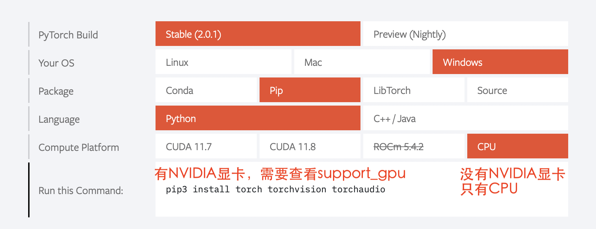

# pytorch

## Configuration

### pytorch 安装

1. 是否有显卡驱动

`任务管理器` 看 GPU 一般是 NVIDIA 的。

1. [pytorch downlaod]
   - [pytorch V.S.cuda] 查显卡决定pytorch
    <kbd>nvidia-smi</kbd>  cmds查看显卡情况
   - [pytorch V.S.python] 查pytorch 决定python虚拟环境
    <kbd>conda create -n env_name python=? </kbd>
   - 查架构

        ``` python title="查看架构"
        import platfrorm
        print(platform.uname()[4])
        #>>> arm64
        ```




1. check

    ``` python title="检查安装成功"
    import torch
    
    print(torch.__version__)
    print(torchvision.__version__)
    
    print(torch.cuda.is_available()) # windows
    print(torch.backends.mps.is_available()) # mac
    # >>> True : ok
    ```

!!! danger "`torch.cuda.is_avaliable()` -> False"
    1. 检查 platform 是哪个
    2. 检查 gpu 是否支持cuda
    3. 检查显卡驱动版本
    4. 检查更新是否成功

# concept

## Autograd

!!! p ""
    Conceptually, autograd ==records a graph== recording all of the operations that created the data as you execute operations, giving you ==a directed acyclic graph whose leaves are the input tensors and roots are the output tensors==. By tracing this graph from roots to leaves, you can automatically compute the gradients using the chain rule.

### locally disable gradient computation

## 完整的

!!! p "初步检查模型是否有写错"
    ``` python
    model = MyModel()
    input = torch.ones(batch, input_size)
    output = model(input)
    print(output.shape())
    ```

### cpu & gpu

!!! danger "要放进gpu的是"
    1. model
    2. 损失函数
    3. 数据（X，label）

==使用方法==

```python hl_lines="2 15 17"
"""
    :meth1: .cuda()
    但要注意 gpu 是否可用
"""
if torch.cuda.is_available():
    model = model.cuda()
    loss_fn = loss_fn.cuda()

for data in dataloader:
    imgs, targets = data
    if torch.cuda.is_available():
        imgs, targets = imgs.cuda(), targets.cuda()

"""
    :meth2: .to(device)
"""
device = torch.device('cuda' if torch.cuda.is_available() else 'cpu')

model.to(device)
loss_fn.to(device)

for data in dataloader:
    imgs, targets = data
    imgs, targets = imgs.to(device), target.to(device)
```

#### 多gpu

1. 选择一个运行

    ```python
    device = torch.device('cuda') # default = 第一块
    device = torch.device('cuda:0') # 第一块
    device = torch.device('cuda:1') # 第二块
    ```

2. 多gpu运行

### 训练和测试的不同

!!! p "当不涉及训练时： `with torch.no_grad():`"
    反向传播的时候需要 tensor 的 `requires_grad=True` 才能自动求导，从而优化参数。这其中涉及 ==求导图==即内存的消耗
    但是训练的时候不需要求导，在`with torch.no_grad():`下，所有计算得出的tensor的requires_grad都自动设置为False。
    [【pytorch系列】 with torch.no_grad():用法详解]

!!! p "`model.train()` & `model.eval()`"
    class:`Dropout`, :class:`BatchNorm`,
    etc.
    - `model.train()` 写在模型训练前
    - `model.eval()`==`module.train(False)` 写在模型测试前
    ```python hl_lines="2 6"
    for i in range(epoch):
        model.train()
        for data in traning_loader:
            ...

        model.eval()
        for data in testing_loader:
            ...
    ```

```python hl_lines="1 13"
def train(self: T, mode: bool = True) -> T:
    """
    把模型调到 training mode.

    Args:
        - mode: Bool
            default = True = 训练模式
            - False = 测评模式
    """
        ... 
    return self

 def eval(self: T) -> T:
    """
    把模型调到 evaluation mode
    """
    return self.train(False)
```

## Data

### Tensor

### class DataSet

!!! p "官方 `torch.utils.data.DataSet`"
    一个虚拟的类，All datasets that represent a map from keys to data samples
    - 所有的 dataset 都必须继承它
       1. 必须重写 `__getitem__`
       2. 选择重写 `__len__`
       3. 如果 key/indice 不是 int，对应的 DataLoader 也大改

``` python
class Dataset(Generic[T_co]):
    """
    设立数据集，包括 key/indice(default int)、data、label
    要能通过 key/indice 来访问对应的 data 和 label
    如果 key/indice 不是 int，对应的 DataLoader 也要大改
    """
    
    def __getitem__(self, index) -> T_co:
        raise NotImplementedError

    def __add__(self, other: 'Dataset[T_co]') -> 'ConcatDataset[T_co]':
        return ConcatDataset([self, other])

    # No `def __len__(self)` default?
    # See NOTE [ Lack of Default `__len__` in Python Abstract Base Classes ]
    # in pytorch/torch/utils/data/sampler.py
```

### Datalodar

!!! p "`torch.utils.data.DataLoader`"
    constructs a index sampler that yields integral indices

Epoch: 所有训练样本都以输入到模型中，称为一个Epoch
Iteration: 一批样本输入到模型中，为一个Iteration
Batchsize: 批大小，主要是决定一个Epoch有多少个Iteration

样本81， Batchsize=8;

1 Epoch = 10  drop_last=True
1 Epoch = 11  drop_last=False

``` python hl_lines="1"

class DataLoader(Generic[T_co]):
    """
    “抽样式”地少量 batch 加载数据，集 “数据集 dataset”， “抽样 sampler”，“迭代器 iterator” 于一体。
    可以 单或者多进程 来加载

    Args:
        - dataset: torch.DataSet
        - batch_size: Optional[int] = samples per batch 
            default = 1
        - shuffle: Optional[bool] = 在每个 epoch 开始的时候，对数据进行重新排序
            default = False
        - sampler: Union[Sampler, Iterable, None] = 自定义从数据集中取样本的策略
            default = None
            根据 dataset 的性质来决定
            和 shuffle 互斥
        - batch_sampler: Union[Sampler[Sequence], Iterable[Sequence], None] =  与sampler类似，返回 batch 的 indice
            default = None
            和 batch_size, shuffle, sampler, drop_last 互斥
        - num_workers: int = 有多少个子进程
            default = 0 只有 main process
        - drop_last: bool = 除不尽时候，要不要的最后一个 batch
            default = False
        - generator: torch.Generator
            default = None
        
    Warning:
        - iterable-style datasets are incompatible with custom samplers first
        - 设置了 batch_sampler，那么batch_size,shuffle,sampler,drop_last 就不能再制定了
    """
    ...

    def __init__(self, dataset: Dataset[T_co], batch_size: Optional[int] = 1,
                 shuffle: Optional[bool] = None, sampler: Union[Sampler, Iterable, None] = None,
                 batch_sampler: Union[Sampler[Sequence], Iterable[Sequence], None] = None,
                 num_workers: int = 0, collate_fn: Optional[_collate_fn_t] = None,
                 pin_memory: bool = False, drop_last: bool = False,
                 timeout: float = 0, worker_init_fn: Optional[_worker_init_fn_t] = None,
                 multiprocessing_context=None, generator=None,
                 *, prefetch_factor: Optional[int] = None,
                 persistent_workers: bool = False,
                 pin_memory_device: str = ""):
        ...

    def __len__(self) -> int:
        """
        Warning:
            - `IterableDataset` 会 不正确 ！！！
            - Cannot statically verify that dataset is Sized
            - 往上取整， 考虑 droplast
        """
        if self._dataset_kind == _DatasetKind.Iterable:

            length = self._IterableDataset_len_called = len(self.dataset)  # type: ignore[assignment, arg-type]
            if self.batch_size is not None:  # IterableDataset doesn't allow custom sampler or batch_sampler
                from math import ceil
                if self.drop_last:
                    length = length // self.batch_size
                else:
                    length = ceil(length / self.batch_size)
            return length
        else:
            return len(self._index_sampler)   
        ...
```

[]

# nn

## 一些基本的东西

## `Containers`  负责 nn 框架的构建

### `Module` 所有 NN 的 base class

可以包括其他的 module. Modules can also contain other Modules, allowing to nest them in a tree structure.

!!! danger "所有 NN 模型都要 ==继承 subclass== 它，并且要先 父类的 init"
    ``` python hl_lines="6"
    import torch.nn as nn
    import torch.nn.functional as F

    class MyModel(nn.Module):
        def __init__(self):
            super().__init__()
            self.conv1 = nn.Conv2d(1, 20, 5)
            self.conv2 = nn.Conv2d(20, 20, 5)
        
        def forward(self, x):
            x = F.relu(self.conv1(x))
            return F.relu(self.con2(x))

    mymodel = MyModel()
    y = mymodel(x)
    ```

``` python

class Module:
    """
    所有 nn 模型的 base class 都要继承它
    """
    ...
    
    def __init__(self, *args, **kwargs) -> None:
        """
        Initializes internal Module state, shared by both nn.Module and ScriptModule.

        Warning:
            - 如果改属性 最好用 `` super().__setattr__('a', a) ``
                而不是 `` self.a = a `` 防止 Module.__setattr__ overhead
        """
        ... 
```

### `Sequential` 类`transforms.Compose`的用法，模型进一步封装

!!! p "`torch.nn.Sequential`和 `torch.nn.ModuleList` 的区别"
    - `torch.nn.ModuleList` 就是真的一个储存模型的list

```python hlines="18 31 35 36 37 45"
class Sequential(Module):
    """
    模型的序列封装，输入会按序经过里面的每一个模型，最后进行输出。
    把所有的模型都封装 as a single module 
    如果不用 OrderedDict, 那么 str(index) 作为 key
    可以通过 index 也可以通过 key 来 access

    Meth:
        - .pop(key)
        - .append()
        - .extend(Sequential)
        - .insert(index, Module)
        - del(model)
        - = model1 + model 2

    Example:
        >>> # 按顺序经过 Conv2d(1,20,5) - ReLU - Conv2d(20,64,5) - ReLU
        >>> model = nn.Sequential(
                nn.Conv2d(1,20,5),
                nn.ReLU(),
                nn.Conv2d(20,64,5),
                nn.ReLU())
        >>> print(model)
        # Sequential(
            (0): Conv2d(1, 20, kernel_size=(5, 5), stride=(1, 1))
            (1): ReLU()
            (2): Conv2d(20, 64, kernel_size=(5, 5), stride=(1, 1))
            (3): ReLU())
        >>> print(model[-1])
        # ReLU()
        >>> model.pop(-1) # 和 stack 不一样，必须传 index 或 key
        # ReLU()
        >>> print(model)
        # Conv2d(20, 64, kernel_size=(5, 5), stride=(1, 1))
        >>> model[-1] = ReLU()
        >>> del(model[0])
        >>> model.append(Liner(10, 3)
        # Sequential(
            (0): ReLU()
            (1): ReLU()
            (2): Linear(10, 3)     
        -------------------------------------------
        >>> # Using Sequential with OrderedDict.
        >>> from collections import OrderedDict
        >>> model = nn.Sequential(OrderedDict([ 
                ('conv1', nn.Conv2d(1,20,5)),
                ('relu1', nn.ReLU()),
                ('conv2', nn.Conv2d(20,64,5)),
                ('relu2', nn.ReLU())
                ]))
        >>> print(model)
        # Sequential(
            (conv1): Conv2d(1, 20, kernel_size=(5, 5), stride=(1, 1))
            (relu1): ReLU()
            (conv2): Conv2d(20, 64, kernel_size=(5, 5), stride=(1, 1))
            (relu2): ReLU())
    """
    ...

    def __init__(self, *args):
        super().__init__()
        if len(args) == 1 and isinstance(args[0], OrderedDict):
            for key, module in args[0].items():
                self.add_module(key, module)
        else:
            for idx, module in enumerate(args):
                self.add_module(str(idx), module)

    def __setitem__(self, idx: int, module: Module) -> None:
        """ model[idx] = Linear(in, out) """
        key: str = self._get_item_by_idx(self._modules.keys(), idx)
        return setattr(self, key, module)

    def __delitem__(self, idx: Union[slice, int]) -> None:
        """ del(model[idx]) """
        if isinstance(idx, slice):
            for key in list(self._modules.keys())[idx]:
                delattr(self, key)
        else:
            key = self._get_item_by_idx(self._modules.keys(), idx)
            delattr(self, key)
        # To preserve numbering
        str_indices = [str(i) for i in range(len(self._modules))]
        self._modules = OrderedDict(list(zip(str_indices, self._modules.values())))

    def __add__(self, other) -> 'Sequential':
        """ model = model1 + model2 """
        if isinstance(other, Sequential):
            ret = Sequential()
            for layer in self:
                ret.append(layer)
            for layer in other:
                ret.append(layer)
            return ret
        else:
            raise ValueError('add operator supports only objects '
                             'of Sequential class, but {} is given.'.format(
                                 str(type(other))))

    def pop(self, key: Union[int, slice]) -> Module:
        """ model.pop(key) """
        v = self[key]
        del self[key]
        return v

    ...

    def forward(self, input):
        for module in self:
            input = module(input)
        return input

    def append(self, module: Module) -> 'Sequential':
        """ module.append(nn.Module) """
        self.add_module(str(len(self)), module)
        return self

    def insert(self, index: int, module: Module) -> 'Sequential':
        """ model.insert(nn.Module)"""
        if not isinstance(module, Module):
            raise AssertionError(
                'module should be of type: {}'.format(Module))
        n = len(self._modules)
        if not (-n <= index <= n):
            raise IndexError(
                'Index out of range: {}'.format(index))
        if index < 0:
            index += n
        for i in range(n, index, -1):
            self._modules[str(i)] = self._modules[str(i - 1)]
        self._modules[str(index)] = module
        return self

    def extend(self, sequential) -> 'Sequential':
        """ model.extend(model1) """
        for layer in sequential:
            self.append(layer)
        return self
```

## nn.xxx & nn.functional.xxx

```python
from torch import nn
from torch.nn inport Functional as F

layer_nn = nn.conv2d(...)
layer_F = F.conv2d(...)
```

### Liner

``` python
class Linear(Module):
    """
    h = W^Tx+b

    Args:
        - in_features: Int = 入
        - out_features: Int = 出
        - bias: Bool
            default = True

    Attributes:
        - weight: tensor[in_features, out_features]
        - bias: tensor[1]

    Examples::
        >>> m = nn.Linear(20, 30)
        >>> input = torch.randn(128, 20)
        >>> output = m(input)
        >>> print(output.size())
        #res: torch.Size([128, 30])
    """

    ...
```

### Conv

$$
\mathcal{U}(-\sqrt{k}, \sqrt{k})
\\
k = \frac{groups}{C_\text{in} * \prod_{i=0}^{1}\text{kernel\_size}[i]}
$$

-----
$$
\text{out}(N_i, C_{\text{out}_j}) = \text{bias}(C_{\text{out}_j}) +
        \sum_{k = 0}^{C_{\text{in}} - 1} \text{weight}(C_{\text{out}_j}, k) \star \text{input}(N_i, k)
        \\\begin{cases} N&\text{batch size}\\ C&\text{channel}\\H&\text{height}\\W&\text{width}\\\end{cases}

          .. math::
              H_{out} = \left\lfloor\frac{H_{in}  + 2 \times \text{padding}[0] - \text{dilation}[0]
                        \times (\text{kernel\_size}[0] - 1) - 1}{\text{stride}[0]} + 1\right\rfloor

          .. math::
              W_{out} = \left\lfloor\frac{W_{in}  + 2 \times \text{padding}[1] - \text{dilation}[1]
                        \times (\text{kernel\_size}[1] - 1) - 1}{\text{stride}[1]} + 1\right\rfloor
$$

!!! danger "input size"
    nn 可以[B, C, H, W] 或 [C, H, W]
    functional ==只可以 [B, C, H, W]==

``` python hl_lines="3"

class Conv2d(_ConvNd):
    """
    nn.Conv2d

    Args:
        - in_channels: int = C_{in} = 输入的通道数
        - out_channels: int = C_{out} = 输出的通道数 
        - kernel_size: Union[int. tuple(int)] (int or tuple) = 卷积核大小
        - stride: Union[int, tuple(int)] = 位移量 
            default = 1
            - int = 竖直方向 = 水平方向
        - padding: Union[int, tuple(int), str\in{{'valid', 'same'}}] = 填充 input 图像
            default = 0
            - int = 竖直方向 = 水平方向
            - 'valid' = no padding
            - 'same' = 使得 input‘shape = output’shape
        - dilation: Union[int, tuple(int)]= 填充 kernel 卷积核,  Spacing between kernel elements
            default = 1 = no space
            详看理论部分
        - bias: bool 可学习的偏置
            default: ``True``

    Shape:
        - Input = (N, C_{in}, H_{in}, W_{in}) 或 (C_{in}, H_{in}, W_{in})
        - Output = (N, C_{out}, H_{out}, W_{out}) 或 (C_{out}, H_{out}, W_{out})

    Attributes:
        - weight: Tensor[...] = 学习出来的卷积核 kernel
            详看理论部分
        - bias: Tensor[out_channels] = 学习出来的偏置
            需要 bias := True  
            详看理论部分

    Examples:
        >>> # non-square kernels and unequal stride and with padding and dilation
        >>> m = nn.Conv2d(16, 33, (3, 5), stride=(2, 1), padding=(4, 2), dilation=(3, 1))
        >>> input = torch.randn(20, 16, 50, 100)
        >>> output = m(input)
    """

    def __init__(
        self,
        in_channels: int,
        out_channels: int,
        kernel_size: _size_2_t,
        stride: _size_2_t = 1,
        padding: Union[str, _size_2_t] = 0,
        dilation: _size_2_t = 1,
        groups: int = 1,
        bias: bool = True,
        padding_mode: str = 'zeros',  # TODO: refine this type
        device=None,
        dtype=None
    ) -> None:
        ...
        super().__init__(
            in_channels, out_channels, kernel_size_, stride_, padding_, dilation_,
            False, _pair(0), groups, bias, padding_mode, **factory_kwargs)

    ...

```

``` python hl_lines="4"
conv2d = _add_docstr(
    torch.conv2d,
    """
    nn.funcational.conv2d

    conv2d(input, weight, bias=None, stride=1, padding=0, dilation=1, groups=1) -> Tensor

    Args:
        - input: Tensor[minibatch, in_channels, in_H , in_W] 
        - weight: Tensor[out_channels, ?, ke_H, ke_W] = 卷积核
        - bias: Union[Tensor[out_channels], None] 
        - stride: Union[Int, Tuple(Int, Int)]
            default =  1
        - padding: Union[Int, Tuple(Int, Int), Str{'valid', 'same'}]
            default = 0
            - 'valid' = no padding
            - 'same' = 
        - dilation: Union[Int, Tuple(Int, Int)] the spacing between kernel elements.
            default = 1

    Examples::

        >>> # With square kernels and equal stride
        >>> filters = torch.randn(8, 4, 3, 3)
        >>> inputs = torch.randn(1, 4, 5, 5)
        >>> F.conv2d(inputs, filters, padding=1)
    """
)  
...
```

### Pool

```python hl_lines="1"
class MaxPool2d(_MaxPoolNd):
    """
    2D 最大池化

    Shape:
        - input = [N, C, in_H, in_W] 或 [C, in_H, in_W]
        - ouptput = [N, C, out_H, out_W] 或 [C, in_H, in_W]
        - kernel = [ke_H, ke_W]
        公式详看理论部分

    Args:
        - kernel_size: Union[Int, Tuple(Int, Int)]
        - stride: Union[Int, Tuple(Int, Int)] 
            default = kernel_size !!!
        - padding: Union[Int, Tuple(Int, Int)] = 填充负无穷
            用来针对除不尽的情况，也不会影响到取值（MaxPool）
        - dilation: Union[Int, Tuple(Int, Int)] = controls the stride of elements in the window
        - return_indices: Bool = 返回 MaxPool 中被取值的索引
            default =
        - ceil_mode: Bool = 要不要边界料
            default = False
            - False = `floor` = 不要边角料
            - True = `ceil` = 要边角料 go off-bounds
            应对除不尽的情况， 详看理论部分

    Examples:
        >>> # pool of non-square window
        >>> m = nn.MaxPool2d((3, 2), stride=(2, 1))
        >>> input = torch.randn(20, 16, 50, 32)
        >>> output = m(input)
    """

    ...

    def forward(self, input: Tensor):
        return F.max_pool2d(input, self.kernel_size, self.stride,
                            self.padding, self.dilation, ceil_mode=self.ceil_mode,
                            return_indices=self.return_indices)
```

### activation

!!! danger "non-inpalce <br> shape：[B, *] 除了必须batchsize，后面 size 都随便"

#### softmax

$$
\text{Softmax}(x_{i}) = \frac{\exp(x_i)}{\sum_j \exp(x_j)}
$$

- 如果是稀疏向量 sparse vector（只传递非0的值），那些未传递的=原本是0的 在 softmax 里 看作 $-\inf，\rightarrow \text{softmax}(-\inf)\rightarrow0$

```python
class Softmax(Module):
    """
    将某一维的值 映射到[0, 1] & sum=1。

    Shape:
        都可以

    Args:
        - dim: Int = 要进行 softmax 的维度
            default = 

    Examples::
        >>> one, zerp = nn.Softmax(dim=1), nn.Softmax(dim=0)
        >>> input = torch.tensor([[-1., -1.],[2., 2.]])
        >>> y1, y0 = one(input), zero(input)
        # y1 = tensor([[0.5, 0.5], [0.5, 0.5]])
        # y0 = tensor([[0.0474, 0.0474], [0.9526, 0.9526]])
    """
    ...
```

#### ReLU, rectified linear unit

$$
\text{ReLU}(x) = (x)^+ = \max(0, x)
$$


```python
class ReLU(Module):
    """
    对于0以下截断

    Args:
        - inplace:Bool = 原地实现
            default = False

    Shape:
        都可以

    Examples::
        >>> m = nn.ReLU()
        >>> input = torch.tensor([[-1., -1.],[2., 2.]])
        >>> output = m(input)
        # output: tensor([[0., 0.], [2., 2.]])
    """
    ...
```

#### Sigmoid

$$
\text{Sigmoid}(x) = \sigma(x) = \frac{1}{1 + \exp(-x)}
$$


``` python
class Sigmoid(Module):
    """
    逐元素，映射到0-1 ，靠近0变化大，否则变化缓慢
        
    Shape:
        都可以

    Examples:
        >>> m = nn.Sigmoid()
        >>> input = torch.tensor([[-1., -1.],[2., 2.]])
        >>> output = m(input)
        # output: tensor([[0.2689, 0.2689], [0.8808, 0.8808]])
    """
    ...
```

### Normalization

### Droupout

!!! question "如果特征图中的相邻像素具有很强的相关性 (则 i.i.d. dropout 不会使激活正则化，否则只会导致有效学习率下降。"

!!! danger "必须有batch！！！"

``` python
class Dropout1d(_DropoutNd):
    """
    随机取0，增强 feature maps 的独立性，防止过拟合。
    概率 p 伯努利采样

    Args:
        - p: Optional[Float] 
        - inplace:bool 
            default = False 

    Shape:
        - Input: [B, C, L] 或 [C, L] 
            卷积的时候：nn.Conv1d: 1D-tensor
        - Output: [B, C, L] 或 [C, L]

    Examples::
        >>> m = nn.Dropout1d(p=0.2)
        >>> input = torch.randn(20, 16, 32)
        >>> output = m(input)
    """
    ...

class Dropout2d(_DropoutNd):
    """
    随机取0，增强 feature maps 的独立性，防止过拟合。
    概率 p 伯努利采样

    Args:
        - p: Optional[Float] 
        - inplace:bool 
            default = False 

    Shape:
        - Input: [B, C, H, W] 或 [B, C, L] 
            卷积的时候：nn.Conv1d: 2D-tensor
        - Output: [B, C, H, W] 或 [B, C, L] 

    Examples::
        >>> m = nn.Dropout2d(p=0.2)
        >>> input = torch.randn(20, 16, 32, 32)
        >>> output = m(input)
    """
    ...
```

### `flatten`

```python hl_lines="14 17"
class Flatten(Module):
    """
    给定维度展平向量

    Args:
        - start_dim: Int = 开始的维度
            default = 1
        - end_dim: Int  = 结束的维度
            default = -1
        default 就是 [B, H, W, ...] -> [B, H*W*...], 最外层不会被展平

    Examples::
        >>> input = torch.randn(32, 1, 5, 5)
        >>> m = nn.Flatten() # 默认 0B 除外
        >>> output = m(input)
        torch.Size([32, 25])
        >>> m = nn.Flatten(0, 2) # 自定义：最里面除外
        >>> output = m(input)
        torch.Size([160, 5])
        >>> m = nn.Flatten(0, -1) # 全展平
    """
    ...
```

## `torch.nn.`Loss & `torch.Optim`

``` python
model = # 定义模型
loss_fn = # 定义 loss 算法
optimizer = # 定义 梯度迭代 的算法
""" basic """
for input, target in dataset:
    output = model(input) 
    loss = loss_fn(output, target) # 算 loss
    optimizer.zero_grad() # 清空上一轮算出来的的梯度，否则梯度会累积 
    loss.backward() # 通过 反向传播 计算新一轮梯度
    optimizer.step() # 根据算出来的梯度 更新参数
```

``` python
from torch import nn
from torch.optim import SGD

model = nn.Sequential(
    Linear(10, 32),
    ReLU(),
    Linear(32, 3)
)
loss_fn = nn.L1Loss()
optimizer = SGD(model.parameters(), lr=0.01, momentum=0.9)

""" whole batch 整一个"""
for i in range(epoch):
    loss_epoch = 0
    for x, y in dataloader:
        y_hat = model(x)
        loss_epoch += loss_fn(y, y_hat)
    
    optimizer.zero_grad()
    loss_epoch.backward()
    loss_epoch.step()

""" mini-batch """ 
```

### `torch.optim`

构建一个优化器对象，该对象将保持当前状态，并将根据计算的梯度更新参数。

!!! danger "$\text{Minimize} f(\theta)$"
    `maximize = False(default)`$\iff g_t\leftarrow=-\nabla f(\theta)$
    $$\begin{aligned}
    &\textbf{关于梯度：}\nabla 是上升的方向\\[-1em]
    &\rule{110mm}{0.4pt}\\
    &\textbf{input}:
        \theta_0 \text{ (params)}, \:
        f(\theta) \text{ (objective)}, \: \textit{maximize}\\[-1em]
    &\rule{110mm}{0.4pt}\\
    &\hspace{5mm}\textbf{if} \: \textit{maximize}\iff \text{Maximize }f(\theta)\\
    &\hspace{10mm}g_t \leftarrow  +\nabla_\theta f(\theta)\\
    &\hspace{5mm}\textbf{else}\iff \text{Minimize}f(\theta)\\
    &\hspace{10mm}g_t \leftarrow -\nabla_\theta f(\theta)\\[-1em]
    &\rule{110mm}{0.4pt}
    \end{aligned}$$

!!! p "Nesterov momentum"
    is based on the formula from
    `On the importance of initialization and momentum in deep learning`__.

#### Adam

``` python
class Adam(Optimizer):
    """
    Args:
        - params: iterable = 需要迭代的参数
        -  lr: Float >0 = 学习率
            default = 1e-3
        - betas: Tuple(Float, Float)\in[0, 1)
            default = (0.9, 0.999)
    """
    def __init__(self, params, lr=1e-3, betas=(0.9, 0.999), eps=1e-8,
                 weight_decay=0, amsgrad=False, *, foreach: Optional[bool] = None,
                 maximize: bool = False, capturable: bool = False,
                 differentiable: bool = False, fused: Optional[bool] = None):
        ...

    ...
```

#### SGD 随机梯度下降

SGD, Stochastic Gradient Descent(optionally with momentum)

``` python
class SGD(Optimizer):
    """
    随机梯度下降

    Args:
        - params: iterable = 要迭代的参数
        - lr: Float >0  = 学习率
        - momentum: Optional(Int) >0 = 冲量
            default = 0
    """
    def __init__(self, params, lr=required, momentum=0, dampening=0,
                 weight_decay=0, nesterov=False, *, maximize: bool = False, 
                 foreach: Optional[bool] = None, differentiable: bool = False):
        ...

    ...
```

#### Adagrad, 自适应随机梯度下降

```python
class Adagrad(Optimizer):
    """
    Adaptive Stochastic Gradient
    
    Args:
        - params: iterable = 要迭代的参数
        - lr: Float >0  = 学习率
            default = 1e-2
        - lr_decay: Float >0 
            default = 0
    """
    def __init__(self, params, lr=1e-2, lr_decay=0, weight_decay=0,
        initial_accumulator_value=0,eps=1e-10, foreach: Optional[bool] = None,
        *, maximize: bool = False,differentiable: bool = False,):
        ...

    ...
```

### `torch.nn.`Loss

#### L1Loss, MAE

$$
\text{MAE} = \ell(f)= \begin{cases}\mathbb{E}\vert\hat{y_i}-y_i\vert\in\R&\text{reduction=mean} \\ \Vert\hat{y}-y\Vert_1\in\R&\text{reduction=sum}\\\vert\hat{y}-y\vert\in\R^n&\text{reduction=none}
\end{cases}
$$

``` python
class L1Loss(_Loss):
    """
    the mean absolute error (MAE)

    Args:
        - reduction: Optional[Str{'none', 'mean', 'sum}] 
            default = 'mean'

    Examples::
        >>> loss = nn.L1Loss()
        >>> y = torch.randn(3, 5, requires_grad=True)
        >>> pred = torch.randn(3, 5)
        >>> l = loss(pred, y) # 计算 loss
        >>> output.backward() # 回溯 
    """
    ...
```

#### MSE

$$
\text{MSE} = \ell(f)= \begin{cases}\mathbb{E}(\hat{y_i}-y_i)^2\in\R&\text{reduction=mean} \\ \Vert\hat{y}-y\Vert_2\in\R&\text{reduction=sum}\\(\hat{y}-y)^2\in\R^n&\text{reduction=none}
\end{cases}
$$

``` python
class MSELoss(_Loss):
    """
    mean squared error (squared L2 norm) 

    Args:
        - reduction: Optional[Str{'none', 'mean', 'sum}] 
            default = 'mean'

    Examples::
        >>> loss = nn.MSELoss()
        >>> input = torch.randn(3, 5, requires_grad=True)
        >>> target = torch.randn(3, 5)
        >>> output = loss(input, target)
        >>> output.backward()
    """
    ...
```

#### CELoss

!!! danger "`torch.nn.CrossEntropyLoss()`"
    = `torch.nn.LogSoftmax` + `torch.nn.NLLLoss`
    softmax 非负化归一化 + 交叉熵

$$\begin{align}\ell(f) &=w_{y^_}  * - \log \cfrac{\exp(\hat{y}^_)}{\sum_C \exp(\hat{y})}\cdot \mathbb{1}\{y^* \neq \text{ignore\_index}\}\\&=w_{y^*}  * -\text{softmax}(\hat{y}) \qquad\text{ 不在忽略}
\end{align}
  \\
\ell(x, y) = \begin{cases}
              \sum_{n=1}^N \frac{1}{\sum_{n=1}^N w_{y_n} \cdot \mathbb{1}\{y_n \not= \text{ignore\_index}\}} l_n, &
               \text{if reduction} = \text{`mean';}\\
                \sum_{n=1}^N l_n,  &
                \text{if reduction} = \text{`sum'.}
            \end{cases}\\\ell(x, y) = L = \{l_1,\dots,l_N\}^\top, \quad
          l_n = - \sum_{c=1}^C w_c \log \frac{\exp(x_{n,c})}{\sum_{i=1}^C \exp(x_{n,i})} y_{n,c}
$$

``` python

class CrossEntropyLoss(_WeightedLoss):
    """
    cross entropy loss, 二分类或多分类很有用，尤其是类别不平衡

    Warning:
        - 输入不必先经过 softmax（保证都为正且总和=1。
            因为这里会包括这个操作 = softmax->max->
    
    Shape
        - input: [C] 或 [B, C] 或  = 预测的，原始的不必经过 softmax
            C: #class
        - target: [1] 或 [B] = 真实的，类别，class indices
        - output: 
            - 'none' : [1], [B]
            - 'mean', 'sum' : Int 或 [1]

    Args:
        - weight: optional(Tensor[C]) = 权 
        - ignore_index: Optional[int] = 忽略的类别
            只有在 target 放的是正确的**类别(1, 2, ..)**才起效
            算 avg 时候 ignore 也 不算除数
        - reduction: Optional[Str{'none', 'mean', 'sum}] 
            default = 'mean'
        - label_smoothing: Optional[Float] \in [0.0, 1.0]. 
            - default = 0.0 = no smoothing. 
            看论文：`Rethinking the Inception Architecture for Computer Vision`
            a mixture of the original ground truth and a uniform distribution

    Examples::
        >>> # Example of target with class indices
        >>> loss = nn.CrossEntropyLoss()
        >>> input = torch.randn(3, 5, requires_grad=True)
        >>> target = torch.empty(3, dtype=torch.long).random_(5)
        # tensor([4, 3, 1])
        >>> output = loss(input, target)
        -----------------------------------------------------------
        >>> # Example of target with class probabilities
        >>> input = torch.randn(3, 5, requires_grad=True)
        >>> target = torch.randn(3, 5).softmax(dim=1)
        # tensor([[0.1190, 0.3896, 0.3429, 0.0254, 0.1231],
        #           [0.0963, 0.0300, 0.3308, 0.1970, 0.3459],
        #           [0.0920, 0.2793, 0.1674, 0.4453, 0.0159]])
        >>> output = loss(input, target)
    """
    ...
```

# Save & Load

!!! danger "`AttributeError: Can't get attribute 'MyModel' on <module '__main__' from 'xxx.py'>`"
    自定义的模型 必须先import进来，否则就会加载不了

``` python
vgg16 = torchvision.models.vgg16()
class MyModel(nn.Module):
    def __init__(self):
        super.__init__()
        self.linear1 = nn.Linear(4, 2)
        self.sigmoid1 = nn.Sigmoid()
    ... 
```

```python hl_lines="8 10 20 23-24"
""" 
    :meth1: 整个模型保存
1. 内存较大
2. 在自设 architecture 的时候需要import
3. 如果里面有 GPU tensors, 就会自动上传到 GPU上
    To avoid GPU RAM surge
        first, torch.load(.., map_location='cpu')
        then,  torch.load_state_dict(...)
"""

torch.save(vgg16, './models/vgg16.pth') # save
vgg16 = torch.load('./models/vgg16.pth') # load
------------------------------------------

mymodel = MyModel()
torch.save(mymodel, './models/mymodel.pth') # save

from models import MyModel # 加载的时候必须导入或者复制自定义的类 # load
model = torch.load('./models/mymodel.pth') 

>>> print(torch.load('./models/mymodel.pth'))
# MyModel(
#  (linear): Linear(in_features=4, out_features=2, bias=True)
#  (sigmoid): Sigmoid())
```

``` python hl_lines="8 10 11 14 16-18"
"""
    :meth2: 以字典形式只保存参数
1. 内存较小，官方推荐
2. 加载时需要重新init model，然后把保存的参数传进去
"""

vgg16 = torchvision.models.vgg16()
torch.save(vgg16.state_dict(), './models/vgg16_state.pth') # save

vgg16 = torchvision.models.vgg16()
vgg16.load_state_dict(torch.load('./models/vgg16_state.pth')) # load

mymodel = MyModel()
torch.save(mymodel.state_dict(), './models/mymodel_state.pth')

from models import MyModel
mymodel = Mymodel()
mymode.load_state_dict('./models/mymodel_state.pth')


>>> print(torch.load('./mymodel_state.pth'))
# OrderedDict([
#   ('linear.weight', tensor([[ 0.1370, -0.0558, -0.0024, -0.2526],
#                             [-0.2042, -0.1686, -0.1526, -0.3912]])), 
#   ('linear.bias', tensor([0.1713, 0.4829]))])
>>> print(model)
# MyModel(
#  (linear): Linear(in_features=4, out_features=2, bias=True)
#  (sigmoid): Sigmoid()) 
```

# representation

## `utils.tensorboard`

!!! danger "目前还是要先下载 tensorflow"
    `TensorFlow installation not found - running with reduced feature set.`
!!! danger "jupyter 使用 tensorboard"

    ``` python
    %load_ext tensorboard # 加载扩展
    %tensorboard --logdir runs # 运行 
    ```
    [在jupyter lab中使用tensorboard报错 UsageError: Line magic function `%tensorboard` not found.]

- SummaryWriter

    ``` python
    writer = SummaryWriter()
    
    writer.add_image('my_image', img, 0)
    
    for i in range(100):
        writer.add_scalar('y=2x', i * 2, i)
    
    writer close()
    ```

    ==source code==

    ``` python
    class SummaryWriter:
        """
        直接在 log_dir 里写 Tensorboard 要用的数据，可以在 training loop 里直接 call，而不用减缓训练的速度。

        Args:
            - log_dir: str = 存放的文件夹目录。
                Default = runs/**CURRENT_DATETIME_HOSTNAME**.
                Notes：对每次 experiment pass in 'runs/exp1', 'runs/exp2', etc.
            - comment: str = 只给默认的 log_dir 添加后缀
                Notes：log_dir 改了这个就没用
        Examples:
            >>> writer = SummaryWriter()
             # folder location: runs/May04_22-14-54_s-MacBook-Pro.local/

            >>> # using the specified folder name.
            >>> writer = SummaryWriter("my_experiment")
            # folder location: my_experiment

            >>> # with comment appended.
            >>> writer = SummaryWriter(comment="LR_0.1_BATCH_16")
            # folder location: runs/May04_22-14-54_s-MacBook-Pro.localLR_01_BATCH_16/
        
        """

        def __init__(
            self,
            log_dir=None,
            comment="",
            purge_step=None,
            max_queue=10,
            flush_secs=120,
            filename_suffix="",
        ):
            ...

        def add_image(
            self, tag, 
            img_tensor, 
            global_step=None, 
            walltime=None, 
            dataformats="CHW" ):
            """
            写图片， 需要 ``pillow`` 包
            
            Args:
                - tag: str =  名字
                - img_tensor: Union[torch.Tensor, numpy.ndarray, string,blobname = Image data
                - dataformats: str = 格式：CHW, HWC, HW, WH, etc.
            """
            ...
        
        def add_scalar(
            self,
            tag,
            scalar_value,
            global_step=None,
            walltime=None,
            new_style=False,
            double_precision=False,
        ):
            """ 
            画折线图

            Args:
                - tag: str = 名字
                - scalar_value: Optional[float or string/blobname] =  y 轴
                - global_step: int = x 轴，一般是 gloabl step 用作画迭代的变化
            """
    ```

!!! danger "`No dashboards are active for the current data set.`"
    [关于解决Tensorboard出现No dashboards are active for the current data set.问题]

# CV

- torchvion.

## transforms

!!! danger "一定要关注 compose 的输入和输出，要相互衔接匹配"

    torchvision 是用来处理==图像==的

``` python hl_lines="1 30 59 92 126"
class Compose:
    """
    用来 compose transform， 把好几个 trabsform process 组装成一个 composer

    Args:
        - transforms: List[transform的类]

    Example:
        >>> trans = transforms.Compose([
        >>>     transforms.CenterCrop(10),  # 中心切割
        >>>     transforms.PILToTensor(), # 变成tensor
        >>>     transforms.ConvertImageDtype(torch.float), # tensor dtyte
        >>> ])
        >>> img_trans = trans(img)
    """

    def __init__(self, transforms):
        if not torch.jit.is_scripting() and not torch.jit.is_tracing():
            _log_api_usage_once(self)
        self.transforms = transforms
    def __call__(self, img):
        """
        逐层去过
        """
        for t in self.transforms:
            img = t(img)
        return img

    ... 
class ToTensor:
    """
    转 PIL Image 或者 ndarray 变成 FloatTensor，并且 把值自动映射到01区间。
    (H x W x C) [0, 255] -> (C x H x W)[0.0, 1.0]
    转 target/label 为 LongTensor
    用 PIL.Image.open(img_path)->PIL.image, cv2.imread(img_path)-> numpy.ndarrary 都行

    - other cases: 不缩放
        - PIL Image 是其它 (L, LA, P, I, F, RGB, YCbCr, RGBA, CMYK, -    - ndarray 是其它 (np.uint8)
    """

    def __init__(self) -> None:
        _log_api_usage_once(self)

    def __call__(self, pic): 
        """
        Args:
            - pic: Union[PIL Image, numpy.ndarray]

        Returns:
            Tensor: torch.FloatTensor
        
        Examples:
            >>> img = Image.open(img_path)
            >>> img2tensor = transforms.ToTensor()
            >>> tensor_img = img2tensor(img)
        """
        return F.to_tensor(pic)
    ...

class Normalize(torch.nn.Module):
    """
    对 img Tensor 在每个 channel 正态标准化，默认 non-inplace
    ``output[channel] = (input[channel] - mean[channel]) / std[channel]``

    Args:
        - mean: sequence = Sequence of means for each channel.
        - std: sequence =  Sequence of standard deviations for each channel.
        - inplace: bool = False, 是否 inplace
    
    Examples:
        >>> trans_norm = transforms.Normalize([mean]*channel, [std]*channel)
        >>> img_norm = trans_norm.forward(img_tensor)
    """

    def __init__(self, mean, std, inplace=False):
        super().__init__()
        _log_api_usage_once(self)
        self.mean = mean
        self.std = std
        self.inplace = inplace

    def forward(self, tensor: Tensor) -> Tensor:
        """
        Args:
            - tensor: Tensor

        Returns:
            - Tensor: 归一化之后的 img
        """
        return F.normalize(tensor, self.mean, self.std, self.inplace)
    ...

class Resize(torch.nn.Module):
    """
    Resize the input image to the given size.

    Warning:
        根据输入的不一样，在 downsampling 时 PIL Image 和 Tensor 的 interpolation 有不一样。
        ：建议：用同一个 input dtype 进行，不要混用

    Args:
        - size: Union[sequence, int]: = Optional[(h, w), size] 
            - sequence = (h, w) 按位置匹配
            - int = size 短边变成size，长边按长短边的比例缩
                if h > w , (h, w) = (size * h/w, size)

    Example:
        >>> trans_resize = transforms.resize((heiht, width))
        >>> img_resize = trans_resize(img)
    """

    def __init__(self, size, interpolation=InterpolationMode.BILINEAR, max_size=None, antialias="warn"):
        ...

    def forward(self, img):
        """
        Args:
            - img: Optional[PIL Image, Tensor]

        Returns:
            Optional[PIL Image, Tensor]
        """
        return F.resize(img, self.size, self.interpolation, self.max_size, self.antialias)
    ...


    class RandomCrop(torch.nn.Module):
        """
        随机裁剪

        Args:
            - size: Union[sequence, int]
                - sequence = (h, w) -> (h, w)
                - int = size  -> (size, size) 正方形裁剪

            - padding: Union[int, sequence, None] = 在各 border 上可选的 pad
                - None(default) 
                - int = 四条边都填一样
                - sequence[int]*2 = [left&right, top&bottom]
                - sequence[int]*4 = [left, top, right, bottom] 顺时针

            - pad_if_needed: boolean = 为了避免裁剪完不合 expected size  
        """

        def __init__(self, size, padding=None, pad_if_needed=False, fill=0, padding_mode="constant"):
            ...

        def forward(self, img):
            """
            Args:
                - img:  Union[PIL.Image, Tensor]

            Returns:
                Union[PIL.Image, Tensor]
            """
            ...
```

## models

!!! danger  "现在提供的是 可以自由地将==预训练的 weights== 加载到模型上。（`pretrained=True`被舍用）"
    如果需要预训练的，推荐使用指定版本，因为还提供了每种权重对应的的图像预处理的操作。

    ``` python hl_lines="10 11"
    from torchvision.models import resnet50, ResNet50_Weights

    """
    ver | accu    | name
    Old | 76.130% | ResNet50_Weights.IMAGENET1K_V1
    New | 80.858% | ResNet50_Weights.IMAGENET1K_V2
    """

    # 直接看指定版本
    resnet50(weights=ResNet50_Weights.IMAGENET1K_V1)
    resnet50(weights=ResNet50_Weights.IMAGENET1K_V2)

    # 字符串, 默认是哪个就得看文档
    resnet50(weights='IMAGENET1K_V2')
    resnet50(weights='DEFAULT') # = pretrained=True
    resnet50(weights=None) # = pretrained=False
    
    ```

!!! p "预处理图像"
    在使用预训练模型之前，必须==预处理图像==（以正确的分辨率/插值调整大小，应用推理变换，重新缩放值等）
    现在统一提供了。

    ``` python
    weights = ResNet50_Weights.DEFAULT
    preprocess = weights.transforms() # Weight Transforms 初始化
    img_transformed = preprocess(img) # 预处理图像
    ```

### vgg16

[Very Deep Convolutional Networks for Large-Scale Image Recognition]

``` python
VGG(
  (features): Sequential(
    (0): Conv2d(3, 64, kernel_size=(3, 3), stride=(1, 1), padding=(1, 1))
    (1): ReLU(inplace=True)
    (2): Conv2d(64, 64, kernel_size=(3, 3), stride=(1, 1), padding=(1, 1))
    (3): ReLU(inplace=True)
    (4): MaxPool2d(kernel_size=2, stride=2, padding=0, dilation=1, ceil_mode=False)
    (5): Conv2d(64, 128, kernel_size=(3, 3), stride=(1, 1), padding=(1, 1))
    (6): ReLU(inplace=True)
    (7): Conv2d(128, 128, kernel_size=(3, 3), stride=(1, 1), padding=(1, 1))
    (8): ReLU(inplace=True)
    (9): MaxPool2d(kernel_size=2, stride=2, padding=0, dilation=1, ceil_mode=False)
    (10): Conv2d(128, 256, kernel_size=(3, 3), stride=(1, 1), padding=(1, 1))
    (11): ReLU(inplace=True)
    (12): Conv2d(256, 256, kernel_size=(3, 3), stride=(1, 1), padding=(1, 1))
    (13): ReLU(inplace=True)
    (14): Conv2d(256, 256, kernel_size=(3, 3), stride=(1, 1), padding=(1, 1))
    (15): ReLU(inplace=True)
    (16): MaxPool2d(kernel_size=2, stride=2, padding=0, dilation=1, ceil_mode=False)
    (17): Conv2d(256, 512, kernel_size=(3, 3), stride=(1, 1), padding=(1, 1))
    (18): ReLU(inplace=True)
    (19): Conv2d(512, 512, kernel_size=(3, 3), stride=(1, 1), padding=(1, 1))
    (20): ReLU(inplace=True)
    (21): Conv2d(512, 512, kernel_size=(3, 3), stride=(1, 1), padding=(1, 1))
    (22): ReLU(inplace=True)
    (23): MaxPool2d(kernel_size=2, stride=2, padding=0, dilation=1, ceil_mode=False)
    (24): Conv2d(512, 512, kernel_size=(3, 3), stride=(1, 1), padding=(1, 1))
    (25): ReLU(inplace=True)
    (26): Conv2d(512, 512, kernel_size=(3, 3), stride=(1, 1), padding=(1, 1))
    (27): ReLU(inplace=True)
    (28): Conv2d(512, 512, kernel_size=(3, 3), stride=(1, 1), padding=(1, 1))
    (29): ReLU(inplace=True)
    (30): MaxPool2d(kernel_size=2, stride=2, padding=0, dilation=1, ceil_mode=False)
  )
  (avgpool): AdaptiveAvgPool2d(output_size=(7, 7))
  (classifier): Sequential(
    (0): Linear(in_features=25088, out_features=4096, bias=True)
    (1): ReLU(inplace=True)
    (2): Dropout(p=0.5, inplace=False)
    (3): Linear(in_features=4096, out_features=4096, bias=True)
    (4): ReLU(inplace=True)
    (5): Dropout(p=0.5, inplace=False)
    (6): Linear(in_features=4096, out_features=1000, bias=True)
  )
)
```

``` python
@register_model()
@handle_legacy_interface(weights=("pretrained", VGG16_Weights.IMAGENET1K_V1))
def vgg16(*, weights: Optional[VGG16_Weights] = None, progress: bool = True, **kwargs: Any) -> VGG:
    """
    VGG-16 

    Args:
        - weights: Optional(torchvision.models.VGG16_Weights, None) = 是否使用预训练的参数
            default = None
        - progress: Optional(Bool =  displays a progress bar of the download to stderr. 
            default = True.
    """
    weights = VGG16_Weights.verify(weights)
    return _vgg("D", False, weights, progress, **kwargs)
```

[关于解决Tensorboard出现No dashboards are active for the current data set.问题]: https://blog.csdn.net/qq_40128284/article/details/109343301
[在jupyter lab中使用tensorboard报错 UsageError: Line magic function `%tensorboard` not found.]: https://blog.csdn.net/Casuall/article/details/109653238
[Very Deep Convolutional Networks for Large-Scale Image Recognition]: https://arxiv.org/abs/1409.1556
[【pytorch系列】 with torch.no_grad():用法详解]: https://blog.csdn.net/sazass/article/details/116668755

[pytorch downlaod]: https://pytorch.org
[pytorch V.S.python]: https://github.com/pytorch/text/
[pytorch V.S.cuda]:https://pytorch.org/get-started/previous-versions/
