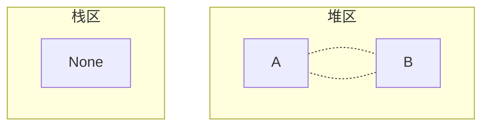
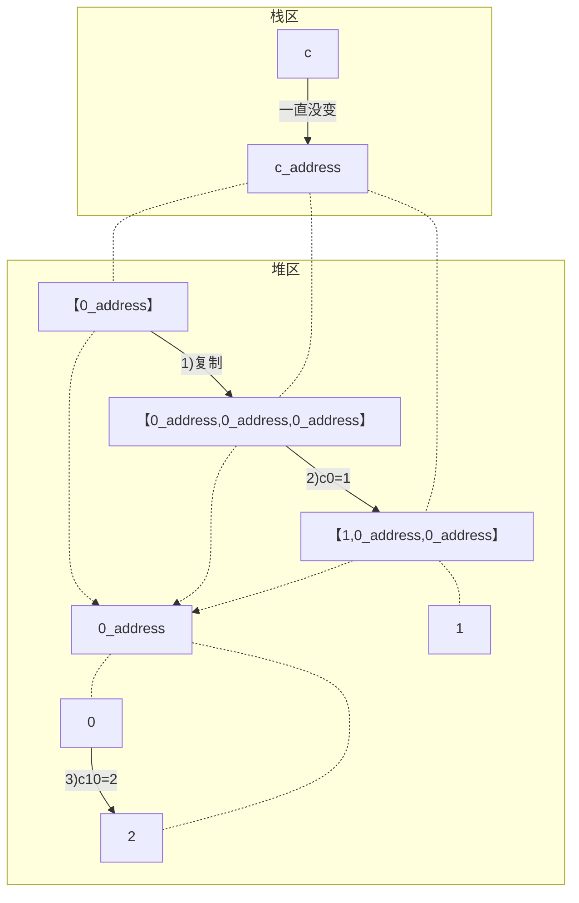
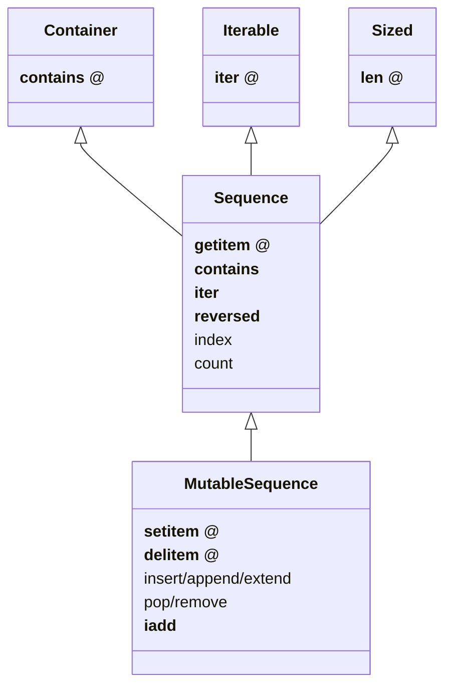
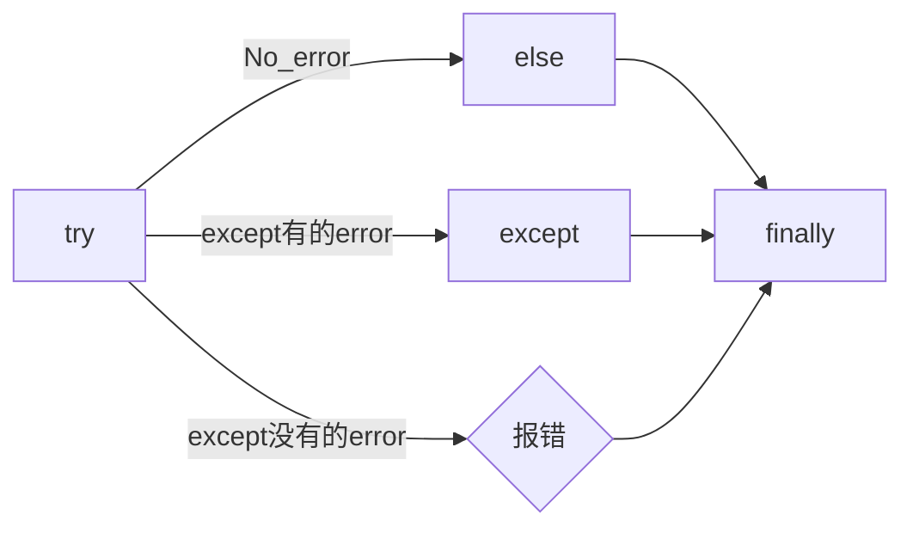

# Python

!!! question "迭代器 & 生成器 区别 哪个更好"
    


- **python 程序运行**，```python.exe xxx.py``` 实质上是使用<kbd>python.exe</kbd> 解释所写的 <kbd>.py文件</kbd> 里的代码，效率很大程度依赖 exe 解释器的效率。
    1. <kbd>python.exe</kbd>  启动
    2. <kbd>python.exe</kbd> 把<kbd>.py文件</kbd> 里的代码当作普通文本内容由硬盘读入内存。（本质上是向操作系统发起系统调用，控制硬件完成读取。）
    3. <kbd>python.exe</kbd> 识别 python 语法，执行读入内存的代码。

==PyObject==. 内存中长度可变的内置对象的 C 语言结构体。

[提升python执行效率的若干方法]

一开始应让代码结构尽可能简单。先尽可能在一个文件中完成所有的工作，确定一切都能正确运行后，再将类移到独立的模块中。先找出让你能够编写出可行代码的方式，再尝试让代码更为组织有序。
都应紧跟在类定义后面包含一个文档字符串。这种文档字符串简要地描述类的功能，并遵循编写函数的文档字符串时采用的格式约定。

```python
n = 1
c = 'a'
l = ['a', 1]
t = ('a', 1)
s = {'a', 1}
d = {'a':'A', 1:'one'}
```

## 对象

!!! quote 万物皆可对象
    一般对象 & 函数对象
📕 属性
`__doc__` 生成对象的帮助文本
`__dict__` 储存用户属性

`dir(obj)` 查看对象属性
`callable(obj)` 查看对象是否可调用

``` python
class C: pass
obj = C()  # 一般对象
def func(): pass  # 函数对象
sorted(set(dir(func)) - set(dir(obj)))
# >>> ['__annotations__', '__builtins__', '__call__', '__closure__', 
# >>> '__code__', '__defaults__', '__get__', '__globals__', 
# >>> '__kwdefaults__', '__name__', '__qualname__']
```

==可调用对象==。可使用==调用运算符==`()` 的对象。可用 `callable(obj)` 进行判断。

- 用户定义： 用 `def` & `lambda` 创建的
- 内置函数：`map` & `filter` ...
- 内置方法： `dict.get`
- 方法：在类的定义体中定义的函数
- 类：调用是会运行 `__new__` 创建一个实例，然后运行 `__init__` 初始化实例，然后返回实例
- 类的实例：如果定义了 `__call__` 方法
- 生成器函数：使用 `yield` 的 函数或方法

## Some

### 环境变量 系统路径 PATH

python 会在系统路径中找寻所需要的包

`import sys`
||meth|
|--|--|
|查看当前系统路径|`print(sys.path)`|
|加入系统路径|`sys.path.append(new_path)`|
|查看环境变量|`os.getenv(key)`|

!!! warning 模型下载的地址 & 环境变量
    模型下载一般各有各自的默认安装地址，但一般都下到个人文件夹中。如果项目在服务器上有多个分支的话，同个模型文件就会下载多次，占用大量内存。所以最好搞清下载地址，

```python
import os
"""hanlp"""
os.getenv('HANLP_HOME')
# >>> 
#为空就是系统没有储存HANLP_HOME的环境变量，
```

## 对象引用机制

!!! danger 变量是✅贴在对象上的标注，而不是❌承载对象的盒子。
    ==赋值==。是把变量分配给对象。对象在赋值之前就已经创建。
    赋值语句 从右到左执行。

    ```python
    var = 'obj'  # 先创建 obj 对象，再把 var 绑定给 obj (贴给 obj 上)

    a = b = c = 4  # 链式赋值
    m, n = n, m  # 交叉赋值

    # 解压赋值
    nums = [1, 2, 3, 4]
    a, *_, e = nums
    # >>> a=1, e=4
    a, _, c, _ = nums
    # >>> a=1, c=3
    ```

每个对象都有标识、类型、值。对象一旦创建，**标识**绝不会变。可以将标识理解为对象在内存中的地址。 `id(var)` 返回变量所引用的**对象标识**的整数表示。

### is & == 标识 & 相等性

```python
var1 = {'name':'Lily', 'sex':'F'}
var2 = var1
var3 = {'name':'Lily', 'sex':'F'}
var1 is var2  
# >>> True
var1 is var3  # id 是唯一的标识
# >>> False
var1 == var3  # 内容相同
# >>> True
```

`A == B` 对象内容 ↔️ `__eq__` 【相等】
通常我们关注的是值。
`A is B` id地址 是否同一个对象引用。【标识】
经常用来确定是不是 `None`: `is None` & `is not None`

!!! p `is` 通常比 `==` 快。
    因为 `is` 不能重载，所以 python 不需要寻找和调用特殊方法，而是直接比较两个整数ID。`==` 挂钩的是 `__eq__` 能重载，考虑更有实际意义的比较，相比于直接继承 `object` 的 直接比较ID的 `__eq__`，大多数类重载了 `__eq__`，设计到对象的类型、属性、可能复杂嵌套架构的值。需要多种比较。

!!! danger `is` & `==` SyntaxWarning
    从python 3.8 开始，使用 is 和 is not 运算符时，会抛出 `SyntaxWarning` 语句警告信息。解决方法：建议将对应语句中 is/is not 用 == 和 != 代替

### 内存管理

#### 栈区和堆区

**栈区**：存放的是变量名于内存地址的对应关系，简单理解是变量名存内存地址
**堆区**：存放的是变量值。
**直接引用**：直接从<u>栈区找到堆区</u>的关系是对变量值的直接引用
**间接引用**：在<u>堆区内找到堆区</u>的关系是对变量值的间接引用

!!! warning 变量名的赋值、变量名的传参，传递都是==栈区==的数据，而且栈的数据是==变量名与内存地址的对应关系==，是对变量值的引用

```python
a, b = 1, [1]
lst = [a, b]
# >>> lst = [1, 2]
lst.append(b)
a, b = 2, 4 
# >>> lst = [1, 2, 2]
```

#### 垃圾回收机制

==垃圾变量==， 当一个值**没有任何变量名和它进行捆绑**，该变量值就会无法被访问到，涉及到**引用计数**的算法

!!! danger `del x` 的理解
    解除了 x 和它所指向对象ID为*的 obj 的绑定关系
    ID为* 的 obj 的引用计数 -1

    ```python
    x = x-value  
    # 生成 x-value 的 ID为* 的 obj，把 x 变量名贴到 ID为* 的 obj
    del x  # 解除
    ```

==引用计数、标记清楚、分代回收==
**引用计数**，变量值被引用(指向)的数量，一旦没有引用关系(箭头指向)，引用计数=0，就当成需要回收的<u>垃圾</u>。垃圾对象会被销毁，释放被分配的内存
**标记清除**，因为间接引用有可能造成<u>循环引用</u>，导致引用计数不可能为0，以至于变量值永远不可能被删除。所以引入标记清除，将所有变量值进行扫描，若存在无法从栈区访达的变量值，则证明是<u>无直接引用，纯间接引用的垃圾</u>
**分代回收**，用空间换时间，不会每时每刻地去扫描全部变量值，而是将变量值分类，以不同的频率去扫描归属不同类别的变量。刚刚新建的变量属于**新生代**的变量，有可能用完即弃，所以扫描频率会高一点；被引用过很多次的变量属于**成熟变量**，可能属于一直都要用的重要变量，所以扫描频率会低一些。



### 不变 & 可变

==不可变==。数据结构的物理内容(即<u>元素保存的引用 item obj 的标识</u>)不可变，与 item obj 的内容无关。
不可变类型，不能进行 item assignment。赋值会改变元素的 ID。
不可变类型，一旦内容改变，百分之百是指向了新的内容，引用的ID已经改变。

> tuple 是不可变的，只是说 每个元素引用的 ID 不可变，元素可能引用的是可变类型的对象。如果就地修改，元素引用的ID不变，元素引用的内容发生改变。也不会产生 Error。

```python
a = (1, [1, 2])
[id(item) for item in a]
# >>> [4309582064, 4312627712]
a[1].append(3)
[id(item) for item in a]
# >>> [4309582064, 4312627712]  # id 不变
# >>> a = (1, [1, 2, 3])  # 内容变
```

!!! warning 变量名的赋值、变量名的传参，传递都是==栈区==的数据
    赋值就是将一个<u>旧的变量名</u>和
    - <u>旧值的地址</u>解绑关系
    - <u>新值的地址</u>绑定关系
    ``` python
    """ 对于a重新赋值
    - 与 4的地址 解绑关系
    - 与 5的地址 绑定关系
    """
    a = 4
    # >>> id(a) = 4373905744
    a = 5
    # >>> id(a) = 4373905776
    # >>> id(4) = 4373905744
    # >>> id(5) = 4373905776

    """ 对于lst重新赋值
    - 解绑关系
    - 绑定关系
    """
    lst = [1, 2]
    # >>> id(lst) = 4376984512
    lst = [1, 3]
    # >>> id(lst) = 4376922944

    """ 对于lst 的 item assignment【可变】
    - 不改变id地址
    - 但会改变容器内的地址
    """
    # >>> lst[1] = 3
    # >>> id(lst[1]) = 4373905712
    # >>> id(3) = 4373905712
    lst[1] = 2
    # >>> lst = [1, 2]
    # >>> id(lst) = 4376922944 # 和之前一致
    # >>> id(lst[1]) = 4373905680 # 改了之前的
    ```

#### 深浅拷贝

!!! warning 默认作浅拷贝
    对不可变类型施加的把戏：赋值时不创建副本，而是返回同一个对象的引用。因为不能进行修改，一旦修改就是 new 一个新对象 with 新 ID。

==浅拷贝==。无论如何，直接指向 item 所引用的对象地址。
`b = a.copy()` & 构造方法 & `[:]`
==深拷贝==。区分要拷贝的是可变的还是不可变的。
`b = copy.deepcopy(a)`
1️⃣ <u>不可变</u>，指向原来的地址（地址相同，同一个对象）；
2️⃣ <u>可变的</u>，重新构建一个，copy内容（地址不同，内容相同）。

!!! p 对于容器类型的分别：看是否在作出【修改之后 ab不一样】🟰 【a b 是独立的】
    修改从元素对象分：可变元素 & 不可变元素；从ID变化分 ID变 & ID不变。
    不可变元素一旦改变，只能进行赋值，ID一定会变。可变元素只有在赋值的时候 ID变，就地更改时ID不会变（譬如说 item assignment）。
    `a = [1, (1, 2), [1, 2]]`
    ||不可变的赋值|可变的赋值|可变的item assignment
    |--|--|--|--|
    ||`b[1]='a'`<br>元组|`b[2]='a'`<br>列表|`b[2][0]='a'`<br>列表的item assignment|
    |浅拷贝|✅|✅|✅|
    |深拷贝|✅|✅|❌|

```python
a, b = 1, [1]
lst = [a, b]
# >>> lst=[1, [1]]
a += 1
b += [1]
# >>> lst=[1, [1, 1]]
```

<div class=box2><div class=pic>
</div>
<p>a 是不可变；b是可变。假设创建对象的ID从1开始。<br>1. 创建 ID=1的1 & ID=2列表[1]<br>2. 把 a & b 分别贴到 ID=1 & ID=2上<br>3. 创建 ID=3的列表，把[0]位贴到ID=1，[1]位贴到ID=2。而不是贴到 a & b 上<br>4. 创建 ID=4的2，把 a 从ID=1撕掉，给ID=3<br>5. 修改b，b没有撕掉，其实修改ID=3<br>lst的位[0]在ID=1上与a无关；位[1]在ID=3上，所以也修改了。</p>
</div>

```python{highlight=[4,5]}
import copy

l1 = [0, [11, 22], (7, 8)]  # [不可变, 可变， 不可变]
l2 = list(l1)
l3 = copy.deepcopy(l1)

id(l1) == id(l2) or id(l1)==id(l3)
# >>> False
list(map(lambda i1, i2 : id(i1)==id(i1), l1 ,l2))
# >>> [True, True, True]
list(map(lambda i1, i3 : id(i1)==id(i3), l1 ,l3))
# >>> [True, False, True]

l1[0] += 1
l1[1].remove(11)
l1[1]+=[33,44]
l1[2]+=(9, 10)
# >>> l1=[1, [22, 33, 44], (7, 8, 9, 10), -1]
# >>> l2=[0, [22, 33, 44], (7, 8)]
# >>> l3=[0, [11, 22], (7, 8)]
```

<div class=pic>
</div>

#### 整数池

**理论上的正常情况**，变量都是需要申请**内存空间（id不同）** 存储数据然后把地址返回给变量名引用。但在 Python解释器（一般是cpython）==[-5, 256]== 是不会申请新的内存，而都是**引用同一块早已在解释器运行时就开辟的内存,==小整数池==**，导致**id相同**。另外 pycharm/vscode 有==大整数池==的概念

```python
"""正常来说，每次申请，id都不一样"""
a, b = 9999999999999, 9999999999999
a == b
# >>> True
a is b
# >>> Fasle
# >>> id(a) = 4336403888
# >>> id(b) = 4336403152

""" 在vscode里id依旧一样：大整数池"""
id(221111111)
# >>> 4336403952
id(221111111)
# >>> 4336403952
```

[小整数池]

## General

### convention

- prefernce
  - PEP8建议 **indent using space 空格缩进 = 4**，这既可提高可读性，又留下了足够的多级缩进空间。
  - **垂直参考线**，帮助你遵守行长不能超过79字符的约定。
- `.py` file
  - 在开头加上姓名和当前日期，再用一句话阐述程序的功能
  - 声明编码方式: `# -*- coding:utf-8 -*-`
  - 可使用空行来组织代码，但不要滥用。
    - 在类中，可使用一空行来分隔方法；
    - 在模块中，可使用两个空行来分隔类
- 诸如 `==, >=, <=`等**比较运算符**两边各添加一个空格，例如，`if age < 4` :要比 `if age<4` 好。
- **文档字符串, docstring**, 的注释，描述了函数是做什么的。文档字符串用三引号括起，Python使用它们来生成有关程序中函数的文档。

#### naming conventions

- **驼峰命名**的时候
- **使用单数和复数式名称**，可帮助你判断代码段处理的是单个列表元素还是整个列表。

|类型|notes|
|--|--|
|Package，Module.py，全局变量，Function|全小写，下划线|
|实例变量 instance varaibles |^|
|Classes | **驼峰命名**, 所有的缩写都要大写：`HTTPSever`|
|常量 constant | **全大写**，下划线|

实例变量 instance varaibles

- Non-public instance variables should begin with a single underscore
- If an instance name needs to be mangled, two underscores may begin its name

[CodingConvention] | [python3-cookbook] | [Python 中的下划线命名规则]

## 函数

!!! p 函数也是对象的一种，是 <u>`function` 类的实例</u>, 所以可以赋给变量，通过变量名调用；作为参数传给别的函数。。。
    ==function 类==
    📕 函数对象特有属性 `dir(func)` 查看对象属性
    `__call__:method-wrapper`
    `__closure__:tuple=None` ==函数闭包== 对自由变量的的绑定
    `__defaults__:tuple` 放 **形式参数**的默认值
    `__globals__:dict` 所在 module 的全局变量
    `__kwdefaults__` 放 **关键字形式参数**的默认值
    `__name__` 函数名

```python{highlight=[5,7,9]}
def func(n):
    """ return param """
    return n

f =func
# >>> f=func=<function func at 0x102fe88b0>
f(1)
# >>> f(1)=func(1)=1
list(map(f,range(3)))
# >>> [0, 1, 2]
```

==higher-order func 高阶函数==。接受**函数**为参数，或把**函数**作为结果返回的函数。
> map & filter & reduce & apply &...
> sorted(因为能用key去接受k函数作为参数，把k函数结果作为排序的依据)

==函数内省 Function introspection==。是指通过一些机制来获取**函数的元信息**，例如函数名称、参数列表、返回值类型等。它使得程序能够在运行时检查函数的结构和特性，进而进行动态的操作和分析。
> `type()`: 获取对象的类型
> `dir()`: 返回一个对象的所有属性和方法的列表。
> `inspect module`：`inspect.isfunction(obj)`:判断一个对象是否是函数，`inspect.getargspec(func)`: 获取函数的参数信息，`inspect.signature(func)` : 获取函数的签名信息。
> `__doc__` 属性：函数的文档字符串
> `装饰器` ：装饰器是一种修改函数行为的方式，也可以用于函数内省。通过定义一个装饰器函数，可以在函数执行前后进行一些操作，例如记录日志、计时等。装饰器可以用来动态地修改函数的行为，从而实现函数内省的目的。

==泛函数 generic function==。根据第一个参数的类型，以不同方式装饰

### 参数传递

#### 共享传参

!!! quote ""
    参数传递 根据引用的方式分为
    - 按值传递，函数得到参数的副本。
    传 a 的时候，拿到 a
    - 按引用传递，函数得到指向参数的指针
    传 a 的时候，拿到 指向 a 的指针

==共享传参 call by sharing==。函数的各个形式的参数获得实参中各个应用的副本。

!!! danger 参数传递是按值传递，但这里的值是引用。
    参数传递是【引用】按值的传递。函数内部的形参是实参的别名，就是贴在实参所引用的对象上，但是不能解除实参和对象的绑定关系。
    所以 函数内部能<u>修改</u>作为参数传入的可变类型。

```python
def f(a, b):
    a += b
    return a

x, y = 1, 2
f(x, y)
# >>> 3
# >>> x, y=(1, 2)
x, y = (1, 1), (2, 2)
f(x, y)
# >>> (1, 1, 2, 2)
# >>> x, y=((1, 1), (2, 2))
x, y = [1, 1], [2, 2]
f(x, y)
# >>> [1, 1, 2, 2]
# >>> x, y=([1, 1, 2, 2], [2, 2])  # 可变类型对象被修改
```

!!! danger 不要使用可变类型 `[]` & `dict{}` 作为默认参数，而是选择 `None`
    默认参数会自建对象，如果没有指定，就一律贴在其上，所以如果可变类型变化，引用的ID对象变了，只要绑定在这个ID对象（只要不是赋值），都随着一起变化。
    默认值在定义函数计算（通常在加载模块时进行对象创建），因此默认值会变成函数对象的属性，凡是没有传入，都会指向这个在一开始就创建好的默认值对象（ID为同一个）。

    ```python
    def func(a=[1,2]):
        a.append(3)
        return a

    func([3])
    # >>> [3, 3]  <- [3]
    res = func() 
    # >>> res=[1, 2, 3]  <- [1, 2]
    res.append(-1)
    # >>> res=[1, 2, 3, -1]
    func()  # 默认参数被改变
    # >>> [1, 2, 3, -1, 3] <- [1, 2, 3, -1]
    # >>> res=[1, 2, 3, -1, 3]
    ```

!!! warning 如果定义参数接受可变参数，谨慎考虑调用方是否期望修改传入的参数。

    ```python
    class C():
        def __init__(self,lst=None, modified=True):
            if lst is None:  # 当需要空的时候 用 None 来判定
                self.lst = []
            elif modified == Ture:
                self.lst = lst  # 指向传入的 ID，里面变，外面同样 ID的 也会变
            elif modified == Flase:
                self.lst = list(lst)  # 浅拷贝，for 元素都是不可变的
                self.lst = copy.deepcopy() # 深拷贝，for 元素有可变的
    ```

#### args & kwargs

==仅限关键词参数 kwargs==。只能用**关键字模式**传递。在函数定义时放在 `*args` 的后面.
==一般参数 args==。定位模式 & 关键字模式都可以。在函数定义时放在 `*args` 的前面
==定位模式，定位参数==。传入时没有用参数名捆绑，就按位置进行一一对应。用定位模式的是定位参数。
==关键字模式，关键词参数==。传入时有用参数名捆绑，用关键词模式的是关键词参数。

不设默认值 🟰 强制传入实参。无论是 args & kwargs

!!! quote `*` 展开 tuple 🟰 一般参数 & `**` 展开 dict 🟰 关键词参数

```python{highlight=[1, 5,7,9,11,13,16,18]}
def func(general, *args, kw_only=None, **kwargs):
    print(f'*args={args}')
    print(f'**kwargs={kwargs}')

func()
# >>> TypeError: func() missing 1 required positional argument: 'general'
func(1, 'a', 'b', 'c')
# >>> *args=('a', 'b', 'c') **kwargs={}
func(1, 'a', 'b', c='c')
# >>> *args=('a', 'b') **kwargs={'c': 'c'}
func(args='a', b= 'b', 1)
# >>> SyntaxError: positional argument follows keyword argument
func(args='a', b= 'b', general=1)
# >>> *args=()  **kwargs={'args': 'a', 'b': 'b'}
params = {'general': 1, 'a': 'a'}
func(**params)
# >>> *args=()  **kwargs={'a': 'a'}
params = (1,2,3)
func(*params)
# >>> *args=(2, 3)  **kwargs={}
```

<p>&#9312; kw-only 只允许使用关键字模式，因为在 *args 后面</p>
<p>&#9316; 没有指定默认值的，得不到参数就会报错</p>
<p>&#9318; 都是定位模式传入，按顺序进行分配，多出的不定量的参数会被 *args 捕获，存入元组</p>
<p>&#9320; 按定位模式传入多余的参数只会被 args 捕获，而不会被 kwargs捕获。按关键字模式传入的多余的才会被**kwargs捕获，存入字典</p>
<p>&#9322; 在传入时，定位模式的参数一定要在采用关键字模式的参数前面。</p>
<p>&#9324; 在传入时，一般参数可以使用关键字模式，此时不需要考虑位置关系。</p>
<p>&#9327; 字典传入的是纯关键字模式</p>
<p>&#9329; 元组传入的是定位模式，此时不能存在没有指定默认值的仅限关键字的参数。</p>

### 变量作用域

!!! danger python 在没有任何声明的前提下，假定在函数定义体内中<u>赋值</u>的变量是==局部变量==。
    如果想在函数定义体内赋值，还想 python 解释器把其认为全局变量，需要声明 `global`
    [Python 全局变量]

==闭包==。延伸了作用域的函数，其中包含函数定义体中运用，但不在定义体内定义的**非全局变量**。一般出现在嵌套函数里。闭包是一种函数，他会保留定义函数时存在的自由变量的绑定，哪怕是定义作用域不能用，绑定也能使用。
==自由变量==。未在本地作用域内绑定的变量。用 `nonlocal` 声明，哪怕是在函数定义体内赋值，python 解释器会把其认为自由变量(类 `global` )。保存在 返回对象的`.__code__.co_afreevars`  & `.__closure__[idx].cell_contents` 一一对应。

```python{highlight=[3-10]}
def outer():
    # 3-10 inner 的闭包延伸到 inner 之外，包含 自由变量 的定义
    series = []
    total, count = 0, 0 
    def inner(new_v):
        nonlocal total, count
        total += new_v  # 哪怕赋值了会解释自由变量。
        count += 1
        series.append(new_v)  # 自由变量
        return f'{sum(series) / len(series)} {total/count}'
    
    return inner

avg = outer()
avg(10)
# >>> '10.0 10.0'
avg(11)
# >>> '10.5 10.5'
avg2 = outer()
avg2(0)
# >>> '0 0'
avg.__code__.co_freevars
# >>> ('count', 'series', 'total')
avg.__closure__[1].cell_contents
# >>> [10, 11]
```

```python
glo = 'a'
def func():
    print(glo)  # 使用内部变量
    glo = 3     # 定义内部变量
    print(glo)
func()
# >>> UnboundLocalError: cannot access local variable 'glo' 

def Sol_A():
    global glo
    print(glo)  
    glo = 'A'    # 修改外部变量
    print(glo)

def Sol_B():
    glo = 'B'    # 定义内部变量
    print(glo)  

Sol_A()
# >>> a
# >>> A
print(glo)  # 外部变量改变
# >>> A
sol_B()
# >>> B
print(glo)  # 外部变量不变
# >>> A
```

### 函数分类

#### 用户定义的函数

`def` & `lambda` 创建

##### lambda 匿名函数

在表达式内创建，定义体内不能赋值，不能用 while for。

#### 内置函数

生成迭代器 iterator (后续需要搭配 `list` 等储存)：`map` & `filter`

规约函数：`sum` & `all` & `any`

##### map

!!! p 为什么 map 运行速度比 for 循环要快
    map 用 C 编写的并且经过高度优化, **底层自动实现并行**
    使用 map() 的第二个优势与内存消耗有关。使用 for 循环，您需要将整个列表存储在系统的内存中。使用 map() 可以按需获得项目，并且在给定时间系统内存中只有一个项目。

[Python's map(): Processing Iterables Without a Loop]

`map(function, iterable[, iterable1, iterable2,..., iterableN])`

如果我们将n序列传递给map()，则该函数必须采用n个参数，并且并行使用序列中的项，直到用尽最短的序列。

!!! danger 死循环
    纯计算无 IO 的死循环会导致致命的效率问题

    ```python
    # 1  有 IO 会卡 IO 所以不会死机
    while True:
        name = input()
        print(name)
    
    # 2 没有 IO 会耗尽计算资源
    while True:
        1+1
    ```

##### 规约函数

`sum(iterable)` **累计**之前的结果求和
`all(iterable)` 只有全 True 才是 True
`any(iterable)` 一个 True 都是 True

#### 装饰器

==装饰器== 是可调用对象，参数是另外一个函数（==被装饰的函数==）。装饰器可能： 1️⃣ 处理被装饰的函数再将其返回； 2️⃣ 将其替换成另外一个函数或可调用对象在返回。

``` python
def decorate(func):  # 装饰器
    print(f'running decorator({func})')
    return function  # 必须返回**一个可调用对象或者函数**s

@decorate  # 装饰
def func():
    pass
```

!!! danger 等于的是  `func = decorate(func)` 而不是 `func() = decorate(func)`

    - 装饰器会在被装饰函数定义之后立刻执行，通常是加载模块时。即背地里运行。所以一般会分开定义。装饰器在一个模块，应用在其他模块的函数上。但是不代表马上运行被装饰的函数。

        ``` python
        func = decorate(func)
        # >>> running decorator(<function func at 0x1356...>)
        ```
    如果 `decorate` 内 return 的是别的函数 🟰 `func=deco.return_func` ，那么 `func.__name__` & `func.__doc__` 变成了 `deco.return_func.__name__` & `deco.return_func.__doc__`
    ✏️ `functools.wraps`，不仅能传递，还能实现关键字传参。
    
    - 装饰器需要返回 **一个可调用对象或者函数**，才能在运行 `func()` 时返回来 跟后面的 `()` 继续用。<u>所以如果 func 需要传参，一般装饰器需要进行嵌套。</u>

        ```python
        func() # 等同于 decorate(func)() 
        ```
!!! warning 被装饰的函数完全是作为参数传入.
     `decorate(func)` ，此时没有带`()`, 所以 `func` 还没被调用。
    在 `deco1` 函数体内 带着 `()` 或者在 `deco2` 里 被返回 才是被调用运行, `deco3` 就是完全没运行

    ```python
    def deco1(func):
        res = func() + 1  # 在函数体内被运行
        return res

    def deco2(func):
        # func = deco2(func) = func
        return func  # deco2(func) () = func ()
    
    def deco3(func):
        # 没运行 func 运行的是 inner
        # func = deco3(func) = inner
        def inner:
            pass
        return inner  # deco3(func) () = inner ()
    ```

!!! p 装饰器可以叠放

    ```python
    @d1
    @d2
    def func():
        pass
    
    # 等价于 func = d1(d2(func))
    # func() = d1(d2(func))()
    ```

> > 更新策略。
>
> 当商场做营销，不断更新不同的折扣活动，在结算的时候往往需要计算不同策略下的价格，然后进行比较。如果把 所有的活动写进去结算函数，会使结算函数体变长还会在更改的时候需要修改着至关重要的结算函数，使错误的可能增高。所以思路大多都是把分开一个个策略写成函数，然后放进一个全局变量的数组里，for 循环地去 call 数组里的策略。但是在维持数组需要记得相应的函数名，对数组里的元素进行添删，比较麻烦。所以采用装饰器来完成 **“注册”** 这一功能

```python
promos = []

def promotion(promo_func):
    promos.appred(promo_func)  # 只是放进去，不改变 promo_func 本身 
    return promo_func

@promotion  # 需要就加上 
def fidelity(order):
    ...
    return discount

# @promotion  # 不需要就注释
def large_order(order)
    ...
    return discount

der best_promo(order):
    return max(promo(order) for promo in promos)
```

##### 参数化装饰器

1. 被装饰的函数本身需要参数
2. 装饰器本身也想拥有参数

!!! p 装饰器需要返回 **一个可调用对象或者函数**，才能在运行 `func()` 时返回来 跟后面的 `()` 继续用。<u>所以如果 func 需要传参，一般装饰器需要进行嵌套。</u>

> > 被装饰的函数本身需要参数 + 装饰器本身也想拥有参数
>
> 一个参数化的注册计时装饰器

```python{highlight=[4,5,12,13,17, 19, 21, 23,27,31]}
import time, functools
registry = set()  # 增删更快

def register(active=True):  # 装饰工厂函数
    def decorate(func):  # 真正的装饰器（接受的是函数
        print(f'running register={active} --> decorate {func}')
        if active:  #  True 注册
            registry.add(func)
        else:  # False 注销
            registry.discard(func)

        @functools.wraps(func)  # 包装一下才能接受关键词参数 & 变成 func 属性
        def clocked(*_args, **kwargs):  # 包装被装饰的函数 
            t0 = time.time()
            _result = func(*_args, **kwargs)  # 接受同样的参数
            t1 = time.time()
            return _result  # 返回：想要的结果

        return clocked  # 返回：函数
    
    return decorate  # 返回：装饰器 

@register(active=False)  # f1 注销
def f1():
    pass

@register()  # 必须作为函数调用
def f2():
    pass

f1 = register()(f1) # f1 重新注册
```

##### 现有的有用的装饰器

`functools.lru_cache(maxsize=128, typed=False)` 做备忘。【自动优化】。储存耗时的函数调用结果，避免重新计算。
Least Recently Used  缓存不会无限增长，一段时间不用就会被扔掉。
用字典存储结果，所以用 `lru_cache` 修饰的函数所有参数必须是可散列的

- `maxsize` 超过会被舍弃，建议 2的幂
- `typed` 是否根据类型把缓存的东西分开存放

> 第 n 个 斐波那契数 f(n) = f(n-1)+f(n-2) 当算f(6)的时候 f(2)会算5遍。。。重复计算

```python
import functools

@functools.lru_cache()  
def fibonacci(n):
    if n < 2:
        return n
    return fibonacci(n-1) + fibonacci(n-2)
```

`functools.wraps`，包装使得装饰后的函数或对象拥有被装饰函数的`__doc__` & `__name__` 等，还能实现关键字传参。
`functools.singledispatch` 可以吧整体方案拆分成多个模块。
使用 `singledispatch` 装饰的普通函数会变成 **泛函数**。
使用 `@func.register(type)` 来装饰，因为选用的函数名字没有关系，所以 `_` 是个不错的选择
装饰器 叠放 支持不同类型
注册的函数不一定与原来的函数放在一块，可以在不同的模块去做，也可以为不是自己写的或者不能修改那里去加。

!!! p 使用抽象基类 `numbers.Integral` & `abc.MutableSequence` 而不是具体实现 `int` & `list`
    可以支持抽象基类以及未来的具体子类或虚拟子类，使得代码支持的兼容类型1更广泛。

> 想要生成一个标签，常规的前后用 “p” 包围。如果是
> 数字：显示十进制 & 16进制，前后用 "pre" 包围
> str：里面的换行符“\n” 变成 “br”
> list：对每个元素都产生相应的标签

```python{highlight=[5,9,13,18-19]}
from functools import singledispatch
from collections import abc
import numbers

@singledispatch
def tag(obj):  # obj 类基函数
    return f'<p>{obj}</p>'

@tag.register(numbers.Integral)  # 是 int 的虚拟超类
def _(n):
    return f'<pre>{n} & {hex(n)}</pre>'

@tag.register(str)
def _(string):
    content= string.replace('\n', '<br>')
    return f'<p>{content}<p>'

@tag.register(tuple)  # 叠放 支持不同类型
@tag.register(abc.MutableSequence)
def _(seq):
    content = '</li>\n<li>'.join(tag(item) for item in seq)
    return f'<ul>\n<li>{content}</li>\n<ul>'

tag(['a/nb',2] )
# >>> '<ul>\n<li><p>a/nb<p></li>\n<li><pre>2 & 0x2</pre></li>\n<ul>'
```

### 函数式编程

`operator module`

- 为算术运算符提供对应函数
`mul(a,b)` 🟰 `lambda a, b: a*b`
- 从序列中**取出元素** ｜ **读取对象属性**
`itemgetter(n)` 🟰 `lambda seq: seq[n]`
`attrgetter('a')` 🟰`lambda obj: obj.a`
如果传入的是多个参数，返回来的就会是对应的元组

``` python{highlight=[10,12,14,16]}
from operator import itemgetter, attrgetter
seq = [('A', 3), ('D', 2), ('B', 2), ('C', 1)]
class Obj():
    def __init__(self, a, b):
        self.a, self.b = a, b
    def __repr__(self):
        return f'<Obj ({self.a},{self.b})>'

objs = [Obj(*obj) for obj in seq]
sorted(seq, key=itemgetter(1))
# >>> [('C', 1), ('D', 2), ('B', 2), ('A', 3)]
sorted(seq, key=itemgetter(1,0))
# >>> [('C', 1), ('B', 2), ('D', 2), ('A', 3)]
sorted(objs, key=attrgetter('b'))
# >>> [<Obj (C,1)>, <Obj (D,2)>, <Obj (B,2)>, <Obj (A,3)>]
sorted(objs, key=attrgetter('b','a'))
# >>> [<Obj (C,1)>, <Obj (B,2)>, <Obj (D,2)>, <Obj (A,3)>]
```

`functools module`

- `reduce（func, iterable, initializer)`
`initializer` 避免出现 `TyperError：empty sequence with no initial value`。如果序列为空，则返回初始值。否则在归约中作为第一个参数使用，所以应该使用恒等值
    > `*` & `&`: 1
    > `+` & `^` & `|`: 0
- `partial` **部分应用**一个**函数**。基于一个函数创建一个新的可调用对象，把原函数的某些参数固定。
可以通过 `func.func` & `func.args` & `func.keywords` 来查询固定了的原函数和参数
- `partialmethod` 和 `partial` 类似，后者处理**方法**
- `lru_cache` 做备忘。【自动优化】。储存耗时的函数调用结果，避免重新计算。

```python{highlight=[4,7]}
from functools import partial
from operator import mul

triple = partial(mul, 3)  # 本来是 mul(a, b)，固定了 a=3
triple(7)  # 一个新的调用对象，返回3倍的结果
# >>> 21
triple.func
# >>> <built-in function mul>
```

## Class

!!! danger  方法和函數
    |||inplaced
    |--|--|--|
    方法| `var.func()`|内置, ✅
    函数|`func(var)`  |❌

### 空 `None`

!!! danger 数据为空不代表是空对象
    ||包括|判别|
    |--|--|--|
    空的对象|`None`|`instance == None`
    数据为空|`[], '', {}, ()`,`None`,`0, False`|`not instance`

### 原子不可变对象

==可散列==

#### 数值 `int` & `float`

转换

与 `char` 的转换

!!! danger 万事先转 `float()`
    在不确定这个字符串是整形还是浮点数的情况下, 先转成`float()`，再转`int()`
    [ValueError: invalid literal for int() with base 10问题处理]

- `int(str)` 将**符合整数**的规定的字符串转换成 int
- `float(str)` 将**符合浮点型**的规定的字符串转换成 float
- `str(num)` 将**整数、浮点型**转换成 char

进制之间的转换

[Python 二进制，十进制，十六进制转换]

- ➡️ 10：`int(str, origin_进制)`
- 10 ➡️ 2: `bin(int)`
- 10 ➡️ 16: `hex(x)`
  
```python
""" 16 -> 10 """
>>> int('B', 16)
# 11
```

<u>Base convention</u>：==除基倒取余法==

**以10进制转2进制为例**：

输入一个十进制数n，每次用n除以2，把余数记下来，再用商去除以2...依次循环，直到商为0结束，把余数倒着依次排列，就构成了转换后的二进制数。

所有进制之间的转换都是如此，2可以换成任何数字。十进制转二进制、八进制、十六进制、64进制，

<div class=pic1></div>
<div class=pic1></div>
<div class=pic1></div>

```python
def two_ten(a: str):
    """ 2 -> 10 """
    ans = list(map(lambda i: int(a[-1-i])*2**i, range(len(a))))
    return sum(ans)

def ten_two(a: int):
    """ 10 -> 2 """
    ans = []
    while a != 0:
        ans.append(str(a%2))
        a = a // 2
        print(ans)
    ans.reverse()
    return ''.join(ans)


def two_eight(a: str):
    """ 2 -> 8 """
    ans, tmp = [], 0
    num, more = len(a)//3, len(a)%3
    a = list(map(int, a))
    tmp = 0
    if more != 0:
        for i in range(more):
            tmp += a[i] * 2 ** (more-i-1)
        ans.append(str(tmp))
    for i in range(num):
        tmp = a[more+3*i] * 4 + a[more+ 1+3*i] * 2 + a[more+2+3*i] * 1
        ans.append(str(tmp))
    return ''.join(ans)
```

格式要求

### 序列

任何一种都满足 迭代、切片、排序、拼接

按<u>是否存放多种类型</u> 🟰 <u>是否存放的是引用</u>

- ✅==容器序列==。存放的是它们所包含的**任意类型**的对象的**引用**
list, tuple, collections.deque
- ❌==扁平序列==。存放的是**值**, 一段连续的内存空间，更紧凑，只能存放字符、字节和数值这种**原子数据类型**。每次只能存放一种类型。
str, bytes, bytearray, memoryview, array.array

!!! warning set & dict 属于 容器 但是不属于序列。

按<u>能否迭代</u>

- ✅==IterableObject 可迭代对象==。如果我们可以从中获取迭代器。只要对象是可迭代的, 就可以执行**分解操作**
str, tuple, list, dict

按<u>能否被修改</u>

- ✅==Mutable Sequence==
list, bytearray, array.array, collections.deque, memoryview
- ❌==Sequence==
tuple, str, bytes

!!! question 一定要知道常用的容器底层都是如何实现的，最基本的就是map、set等等，否则自己写的代码，自己对其性能分析都分析不清楚

[collections --- 容器数据类型]

!!! p 如何选序列。
    - `list`: 方便又快捷，可修改，
    - `set`: 去掉重复元素, 不关心元素的顺序问题，经常检查是否包含
    - `tuple`: 不可变的列表
    - `array.array` 只包含数字，尤其是浮点数。
    - `deque` 频繁做两端增删。适合做“最近n个元素”

!!! danger `set` & `dict`
    都是 `{}`, 但是`a={}`默认空字典，空集合是`a=set()`
    - `set = {1, 2, ...}`
    - `dict = {a:1, b:2, ...}`

#### 序列操作

任何一种都满足 迭代、切片、排序、拼接

##### listcomps & genexps

==list comprehension, listcomps，列表推导==。只用来生成列表。
原则是：只用列表推导来创建新的列表，并且尽量保持简短，**不要超过了两行**
[python中，(x for y in z for x in y)这个结构怎么理解？]

``` python{highlight=[3, 6, 12]}
""" listcomps """
# 1. 一层
[item for item in items]

# 2. 二层， 可以将二维的列表展平
[item for items in items_list for item in items]
for items in items_list:
    for item in items:
        list_.append(item)

# 3. mix 两个
[(x,y) for x in list_x for y in list_y if x!=y]
for x in list_x:  # 所以是先按 y 再按 x
    for y in list_y:
        if x != y:
            yield (x,y)
```

!!! p 笛卡尔积  with Listcomps
    $\text{Cartesian Product}, A×B=\{(x,y)|x∈A∧y∈B\}\in\R^{\#A*\#B}$
    `[(a, b) for a in A for b in B]`
    内存里不会留下一个有组合的列表。因为在每次 for 循环的时候才会产生一个组合，所以内存变成是<u>一个组合的大小</u>

==generator expression, genexps, 生成器表达式==。具有生成各种类型的元素并用它们来填充**除列表外其他序列**的功能。
genexps 遵守了<u>迭代器协议</u>，**可以逐个地产出元素（节省内存）**，而不是先建立一个完整的列表，然后再把这个列表传递到某个构造函数里`tuple(list(range(3)))`
如果 genexps 是一个函数调用过程中的唯一参数，那么不需要额外再用括号把它围起来。
> `a = tuple(ord(str_) for str_ in 'abc')` 1个括号
> `array.array('I', (ord(str_) for str_ in 'abc'))` 2个括号

##### 拆包

==可迭代元素拆包==。把**任何一个可迭代对象**拆开进行

- **赋值**
- 用 `*` 解析作为**函数参数**。

因为位置有意义时拆包显得格外有意义，所以一般指 Tuple 拆包。
**唯一的要求：** 被可迭代对象中的元素数量必须是和接受这些元素的元组的空档数一致。
允许**嵌套拆包**

!!! warning `_` & `*`
    对待<u>少量不需要</u>的元素：`_` 占位符。必须数量对应，和位置对应
    对待<u>不确定数量无谓需不需要</u>的元素 `*`。可以出现在前中后

```python{highlight=[1,2,4,10,11,19]}
a, b = ('a', 'b')  # 平行赋值
a, b = b, a  # 不使用中间变量交换两个变量
a = (20,8)
divmod(*a)  # 用 * 解析作为函数参数 
# >>> (2, 4) # 20/8=2...4

filedir = '/home/dir1/dir2/a.txt'
filedir.split('/')
# >>> ['', 'home', 'dir1', 'dir2', 'a.txt']
_, _, _, _, filename = filedir.split('/') # 只要最后面的, 必须数量一样
_, *dirs, filename = filedir.split('/') # 每个文件储存的文件夹数量是不一定的
# 用占位符巧妙减少列表内存（第一个/前面的空格是不需要的）
filename 
# >>> a.txt
dirs
# >>> ['home', 'dir1', 'dir2']

area = ('Beijing', 'CN', (111,222))
city, cc, (latitude, longitude) = area  # 嵌套拆包
```

##### 切片

!!! p `seq[n]` 获得是一个元素，元素什么类型，返回就什么类型；<br> `seq[n-1:n]` 获得是一个长度为1的 seq 对象，seq 什么类型，返回就什么类型。

- `seq[a:b:c]` 对 s 在 $[a, b)$ 之间以 c 为间隔取值。【1d】
其实是调用 `seq.__getitem__(slice(a,b,c))`
  - **c = 1**. c>0 从第一个开始正向; c<0 从倒数第一个开始反向。<u>有可能完全不一样！</u>
- `seq[m:n, k:l]` 对 **多维** s 取 $[m, n)$ 行 $[k, l)$ 列 交叠的值。【>2d】
其实是调用 `seq.__getitem__([(m,k)(m,k+1)...])`

    !!! warning `seq[i, j]` 取 i 行 j 列的<u>一个值</u>
        其实是 `seq.__getitem__((i,j))`
- 切片赋值
如果赋值的对象是一个切片，那么赋值的右边**必须**是一个<u>可迭代序列</u>，哪怕只有单独一个值。

```python{highlight=[4,6,11]}
s = list('abcd')
s[::1]
# >>> ['a', 'b', 'c', 'd']
s[::2]
# >>> ['a', 'c']
s[::-2]  # != s[::2]的相反
# >>> ['d', 'b']

s[:2] = 1
# >>> TypeError: can only assign an iterable
s[:2] = [1]  # 哪怕只有单独一个值。
# >>> [1, 'd']
```

##### 拼接

- `+` 不修改原有的操作形象，而是构建一个全新的序列

###### 复制后拼接

- `seq * n` 不修改原有的操作形象，而是构建一个全新的序列。`seq[item]`➡️ `seq[item1, item1, ...]`

    !!! danger seq 里的元素是引用，复制的将会是引用，==一改全改== <br> seq 里的元素是值，复制的将会是值 ==具有独立==
- `seqA(seqB for i in range(n))` 对嵌套序列的序列，嵌套内的序列是存放不同内容的东西。
🟰`seA[seqB]`➡️ `seqA[seqB1, seqB2, ...]` 里面相互独立。
`seqA(seqB) *n` 🟰 `seA[seqB]`➡️ `seqA[seqB, seqB, ...]`（第一个方法，里面一改全改。）

```python{highlight=[1, 6, 11, 18, 25]}
a = [0] * 3  # [0] 是 seq， 0 是元素 = 值
# >>> a = [0, 0, 0]
a[0]=1
# >>> a = [1, 0, 0]

b = [[0]*3]  # [0] 是 seq，0 是元素 = 值
# >>> b = [[0, 0, 0]]  # 在 b 内层复制, b 只有1个元素 []
b[0]=1
# >>> b = [1]

c = [[0]] * 3  # [[0]] 是 seq， [0] 是元素 = 引用
# >>> c = [[0], [0], [0]] # 在 c 复制，c 有3个元素 []
c[0] = 1
# >>> c = [1, [0], [0]]
c[1][0]=2
# >>> c = [1, [2], [2]]

d = [[0] for i in range(3)]
# >>> d = [[0], [0], [0]]
d[0] = 1
# >>> d = [1, [0], [0]]
d[1][0]=2
# >>> d = [1, [2], [0]]

e = ['-'*3]
# >>> e = ['---']
```



只有前两步改的是 `c` 存的的东西，最后一步其实`c` 存的的东西没变，`c` 存的的东西存的东西变了

###### 就地加乘

`+=`, `*=`, `__iadd__`, `__imul__`
**重要**：对 ==Seq== & ==MutableSeq== 内存地址的变化

```python{highlight=[2,7]}
# Seq 变了
t = (1, 2)
# >>> t=(1,2), id(t)=4313022720
t *= 2
# >>> t=(1,2,1,2), id(t)=4311067808
# MutableSeq 不变
l = [1, 2]
# >>> l=[1,2], id(l)=4311024448
l *= 2
# >>> l=[1,2,1,2], id(l)=4311024448
```

!!! warning 关于就地加乘一个还没解决的问题

    ```python
    t = (1,2,[30,40])
    t[2]+=[50,60]
    # >>> TypeError: 'tuple' object does not support item assignment
    # >>> t=(1, 2, [30, 40, 50, 60])
    ```

##### 排序

!!! p 稳定的`Timsort`  
    两个元素同样大小的情况下，在排序的时候位置是相互固定的。如果在比较长的时候，两个元素一样长，那么结果的先后会以原本本身列表的先后决定，这样相对稳定。

    `lst.sort()` & `sorted(iterableObject)` 背后用的都是 Timsort。
    ==Timsort==。一种自适应算法，根据原始数据的顺序特点交替使用插入排序 & 归并排序。=，以达到最佳效率。

**不需要维护排序：**

- `lst.sort()` 就地排序列表，返回 None。
- `sorted(iterableObject)` 返回新建的列表。
  - 接受任何形式可迭代的对象为参数，包括不可变序列或生成器。

📗 都有两个可选的关键词参数

- `reverse=False` 默认升序
- `key=IdentityFunction` 一个只有一个参数的函数。这个函数会被用在序列上的每一个元素上，产生元素相对应的用于排序的对比关键词。默认恒等函数，以元素自己的值来排序。
  - `=len` 对比长度
  - `=str.lower` 忽略大小写的的排序
  - `=reverse` 从左到右进行比较

```python{highlight=[2,4,6]}
lst = ['Aa', 'b', 'Cc']
sorted(lst)
# >>> ['Aa', 'Cc', 'b']  # 按 首字母 ord
sorted(lst, key=str.lower)  # 按 不分大小写 ord
# >>> ['Aa', 'b', 'Cc']
sorted(lst, key=len)
# >>> ['b', 'Aa', 'Cc']
```

``` python
"""
    - 不支持原生比较的对象
"""

class User:
    def __init__(self, id, age):
        self.id = id
        self.age = age
    def __repr__(self):
        return 'User(id:{}, age:{})'.format(self.id, self.age)

users = [User(1, 50), User(9, 10), User(1, 30)]
print("\n--- uncomparable class ---")
print(users, "\n",
      "\t", sorted(users, key=lambda d: d.id), "\n",
      "\t", sorted(users, key=lambda d: (d.id, d.age)))


from operator import attrgetter # another
print(users, "\n",
      "\t", sorted(users,  key=attrgetter('id')), "\n",
      "\t", sorted(users,  key=attrgetter('id', 'age')))
```

**需要维护排序：**

!!! quote 已经排好了序，如何查找&维护
    排序很耗时，得到有序序列后最好保持它一直有序。

`bisect module` 底下的 `bisect` & `insort` 都是用<u>二分查找</u>在有序序列上 查找并插入元素。

📗 有`lo` & `hi`,来缩小搜寻范围。

- `bisect.bisect(sortedlst, target)` 查找索引，相同时，在同一个的右边。
可搭配上 `sortedlst.insert(idx, target)`配合使用
有 `bisect.bisect_left` 相同时，在同一个的左边。
- `bisect.insort(sortedlst, target)` 查找并插入。就地改变。一步到位，速度更快。
同样有 `bisect.insort_left`

```python
import bisect
lst = [2, 4, 6]
bisect.bisect(lst, 3)
# >>> 1
bisect.insort(lst, 3)
# >>> [2, 3, 4, 6]

# 用途
def grade(score):
    breakpoints=[60, 70, 80, 90]
    grades = 'FDCBA'
    i = bisect.bisect(breakpoints, score)
    return grades[i]

[grade(score) for score in [33, 99, 77, 60]]
# >>> ['F', 'A', 'C', 'D']
```

#### list

==容器== + ==MutableSequence==

- init。
`list(range(start, end, step))`
将`range()`作为`list()`的参数，输出将为一个数字列表
- 增加
  - `lst.append(x)` 末尾
  - `lst.insert(idx, x)` any position
- 删除
    ||根据____来删除|return|
    |--|--|--|
    |`del lst[idx]` |idx |❌ no-return|
    |`lst.pop(idx)` |idx |✅ **lst[idx]**，不指定索引默认删除最后一个|
    |`lst.remove(x)`| value, 只删除**第一个**指定的值|✅  **x**|
- 查 search
`lst.index(val)` 返回第一个找到的idx。找不到就会 `ValueError`

!!! warning `lst_1r = lst_1[:]`  切片等于浅拷贝

    ```python
    a = 'a:a:a:b'
    b = a[:]
    # >>> id(a)=id(b)=4382924912
    ```

拼接

|？|cases|
|--|--|
|`for + append` |修改元素|
|`list_c = list_a + list_b` | 效率好, 不适合做大数据处理|
|`list_c = [*list_a, *list_b]` **通过 '*' 解构**|效率好, 不适合做大数据处理|
|`list_a.extend(list_b)` 内置的meth: extend|需要修改原始列表比较合适|

[Python3 - 6种方法拼接合并列表list]

#### tuple

==容器== + ==Sequence==
==不可变的列表==(除了增删改，支持 list 其他所有操作)
==没有字段名的记录==(item 是携带位置信息，所以一般不搞排序)

虽好但是没有字段名 ➡️ `namedtuple`

- init
  - 【单条记录】`tuple(val1, val2, ...)`, `tuple(list1)`
  返回：`Tuple`
  - 【多列合并】 `list(zip(col1, col2, ...))`

    !!! warning `zip`
        zip 返回来的是 `<zip object at 0x103abc288>`: 元组组成的对象。需要叠层 list。

        ``` python{highlight=[2, 4]}
        col1, col2 = [1, 2, 3], ['a', 'b', 'c']
        >>> zip(col1, col2)
        # >>> <zip object at 0x103abc288>
        >>> list(zip(col1, col2))
        # >>> [(1, 'a'), (2, 'b'), (3, 'c')]
        ```

- 因为不可变可用作`dict`的key

    ``` python
    d = {(x, x + 1): x for x in range(10)}    
    print(d[(5, 6)])       
    # >>> 5
    ```

#### namedtuple

`collections.namedtuple`. 可以用来构建一个带字段名的元组和一个有名字的类
==容器== + ==Sequence==
==不可变的列表== + ==有字段名的记录==

`namedtuple` 构建的类的实例所<u>消耗的内存跟元组是一样的</u>，因为字段名都被存在对应的类里面。小号的内存比普通的实例对象要小一点，因为 python 不会用 `__dict__` 存放实例的属性。
> `p`的字段名都被存在对应的类`Point`里面

- init
`Records = namedtuple(typename:str, field_names:Optional(Iterable, String))`
`rec1 = Records(*rec1_data)`
`rec2 = Records._make(*rec2_data)`
📕 Args:
  - typename: 类表名的感觉
  - field_names: 由数个字符串组成的可迭代对象，或者是由**空格分隔开**的字段名组成的字符串

- 📗 属性
  - `Records._fields` 包含字段名的元组
  - `rec1._asdict()`把 namedtuple 以 `collections.OrderedDict` 形式返回。友好呈现信息
  - `rec1._replace(field_name=v)` 修改值。

``` python{highlight=[2,3,6]}
from collections import namedtuple
Point = namedtuple('Point', ['x', 'y'])
p = Point(11, y=22)  # 根据位置和kw实例化
p[0] + p[1] == p.x + p.y  # by idx | name 
# >>> True  # = 33
d = p._asdict()  # namedtuple ➡️ dict
# >>> d = {'x': 11, 'y': 22}
Point(**d)      # dict ➡️ namedtuple            
# >>> Point(x=11, y=22)
p._replace(x=100)
# >>> Point(x=100, y=22)
```

#### array 数组

!!! p 需要纯数字的列表是，array 比 list 更高效。
    在存数字时，array 背后存的不是 float 或者 int 对象，而是数字的机器翻译==字节表述==。
    指定数据类型，当序列很大的时候，可以节省很多时间。
    还提供从文件读取和存入文件更快的方法。

- init
需要**类型码**，表示底层 C 语言需要存放的数据类型

  - `b` signed char 有符号的字符，只能存放一个字节的整数。$2^7=[-128, 127]$
  - `d` 双精度浮点数组
- 快速读写文件
`array.fromfile(fp)` & `array.tofile(fp)`。读写二进制文件时间比对文本文件读写要快，因为不需要转换字符和数字形式；还节省空间。
- 排序
`a = array.array(a.typecode, sorted(a))`
不支持就地排序方法。

但是不支持 浅复制 `s.copy()` 操作，

```python{highlight=[4,7,10]}
from array import array
from random import random

floats = array('d', (random() for i in range(3)))
# >>> floats=array('d', [0.7997733053807442, 0.15195105711939816, 0.013224926567956818])
with open('floats.bin', 'wb') as fp:
    floats.tofile(fp)
floats2 = array('d')
with open('floats.bin', 'rb') as fp:
    floats2.fromfile(fp)
```

#### memoryview 内存视图

能在不复制内容的时候，操作同一个数组不同切片。

#### deque 双向队列

!!! quote ""
    利用 `.append()` & `.pop(0)` 可以把 list 当作 queue 使用。但是删除第一个或者增加到列表开始是很耗时，因为要移动其他元素。

`collections.deque` double-end queue 线程安全，可以快速向两端添加或者删除元素。

- 但是只在两端做了优化，从中间增删还是慢的。
- append & popleft 都是原子操作，deque 可以在多线程程序中安全地作为先进先出的队列使用，而不需要考虑资源锁的问题。

!!! question 原子操作
适合做类似“最近用到的几个元素”。因为在初始化的时候，指定队列的大小(一旦设定之后不能改)。如果满员的话，可以从**反向端**删除过期的元素，在尾端添加新元素。

- init
`q = deque([iterable[, maxlen=None])`
📕
`[iterable]` 没有指定，新队列为空
`maxlen=None` ，deques 可以增长到任意长度。一旦设定之后不能改。
- 旋转
`deque.rotate(n)` 当 n>0, 最右边的 n 个元素会被旋转到最左边；当 n<0, 最左边的 n 个元素会被旋转到最右边。
- 增加 **O(1)**
`deque.append(item)` & `deque.appendleft(item)`
`deque.extend(iterable)` & `deque.extendleft(iterable)`
如果满员的话，可以从**反向端**删除过期的元素，在尾端添加新元素。

    !!! warning `deque.extendleft(lst)` 将迭代器的元素逐个增加到队列上，最后呈现出来的是逆序。
- 删除 **O(1)**
`deque.pop()` & `deque.popleft()`

```python{highlight=[3,7]}
from collections import deque

dq = deque([1,2,3], maxlen=5)
# >>> dq=deque([1, 2, 3], maxlen=5)
dq.extend(range(4,8))
# >>> dq=deque([3, 4, 5, 6, 7], maxlen=5)
dq.extendleft(range(1,3))
# >>> dq=deque([2, 1, 3, 4, 5], maxlen=5)
```

#### bytes 字节

==二进制序列== 其实是整数序列：各个元素是介于 0 ～ 255=$2^8-1$ 之间的整数。

**为什么返回来的结果不一样？**
虽然二进制序列是整数序列，但他们的字面量表示法表明其中有 ASCII 文本。所以各个字节的值可能会使用下列三种不同的文本表示：

- 可打印的 ASCII 范围内的字节 ➡️  ASCII 字符本身
- 制表符、换行符、回车符、\对应的字节 ➡️ 转义序列
- 其他字节的值 ➡️ 16进制转义序列

```python{highlight=[3,4]}
b = bytes('A\t啊', encoding='utf8')
# >>> b=b'A\t\xe5\x95\x8a'
# >>> b[0]=65    b[1]=9       b[2]=229 其实是整数
# >>> b[:1]=b'A' b[1:2]=b'\t' b[2:3]= b'\xe5'
```

#### `str`

==Sequence==

!!! danger `s[i] = 'n'` 切片赋值 ❌ $\impliedby$ str 不可变

**字符编码问题：**
`t` 文本
`b` 二进制/bytes,非文本只能 byte 模式

!!! p 内存固定使用 <kbd>unicode</kbd>, 我们改变的是从<u>内存存入硬盘的格式</u>
    linux 默认 utf-8， windows 默认 gbk

!!! p 存储数据 - 大小写
    存储数据时，方法`lower()`很有用。很多时候，你无法依靠用户来提供正确的大小写，因此需要将字符串先转换为小写，再存储它们。以后需要显示这些信息时，再将其转换为最合适的大小写方式。

!!! danger 空白泛指任何非打印字符，如空格、制表符和换行符

|cases|code|return=non-inplaced|
|--|--|--|
|大小写 | `str.upper()`,`str.lower()`, `str.capitalize()`，`str.title()`|✅ 结果|
|^|`str.swapcase()`|✅ 结果 大小写互换|
|去除前后字符串|`str.lstrip(sub_str)`, `str.rstrip(sub_str)`,`str.strip(sub_str)`|✅ 结果 默认是空白|
|字符串是否只由__组成|`str_.isalpha()`, 只由字母，==中文也是==| ✅ bool|
|^|`str_.isdigit()`,`str.isnumeric()`, `str.isdecimal()` 只由数字|^|
|^|`str_.isspace()`, 只由空格|^|
|^|`in string.punctuation` 标点|^|
|查找|`long_str.find(sub_str)` ➡️|✅  第一次出现的位置 or ==-1==.|
|^|`long_str.rfind(sub_str)`⬅️|^|
|^|`long_str.index(sub_str)`➡️|✅ 第一次出现的位置 or ==ValueError==|
|^|`long_str.rindex(sub_str)`⬅️|^|
|^|`str.count(sub, start= 0, end=len(str))`|✅  sub 在 str中出现的次数|
|执行|`eval(string)`执行一个字符串表达式|✅ 表达式的值|
|填充| `str.ljust(int, pad_str)`,`str.rjust(int, pad_str)`, `str.center(int, pad_str)`|✅ 结果 `pad_str=' '`默认是空格|
|^|`str.zfill(int)`|✅ 结果 用0在前面的填充|
|修改|`s = s[:l] + s[l:][::-1]` 重新赋值 |✅ 结果|
|^| `string.replace(old, new)`所有都换一遍 | ✅ 结果|
|连接字符串| `s3 = s1 + s2` ==不推荐== | ✅ 结果|

``` python
>>> a = 'string'
>>> a.rjust(9)
# '   string'
>>> a.center(9)
# '  string '
```

- 识别数字
数字分：  ，

```python
num1, num2, num3, num4 = b'4', u'4', '四'， 'IV'
```

||bytes(二进制储存)|unicode(就是普通的数字)|中文数字|罗马数字|
|--|--|--|--|--|
|`num=`|`b'4'`|`u'4'`<br>python3前面不带`u`就是|`'四'`|`'IV'`|
|`str.isdigit()`|✅|✅|❌|❌|
|`str.isnumeric()`|✅|✅|✅|✅|
|`str.isdecimal()`|❌|✅|❌|❌|

[Python中修改字符串的四种方法]

str match

- `str.startswith(sub_str)`
- `str.endswith(sub_str)`

str的 转换

list ↔️ str

- `str = ''.join(lst)`
- `lst = str.split(':')`
  - `lst = str.split(':', 1)`
  - `lst = str.rsplit(':', 1)`
- `lst = list(str)`

```python
a = 'a:a:a:a'
list(a)
# >>> ['a', ':', 'a', ':', 'a', ':', 'a']
a.split()
# >>> ['a:a:a:a']
a.split(':')
# >>> ['a', 'a', 'a', 'a']
a.split(':', 1)
# >>> ['a', 'a:a:a']
a.rsplit(':', 1)
# >>> ['a:a:a', 'a']
```

### 散列表-support

==查询性能出众== ==无序== ==键不稳定== ==空间换时间==
是 dict & set 性能出众的根本原因。虽然无序但是内容一样的话一样等价。

==可散列类型 hashable==。如果一个对象是可散列的，那么在这个对象**生命周期**中，它的散列值是不变的，而且这个对象需要实现 `.__hash__()` & `.__eq__()` 。因为`hash()` 方法可以作用于对象上，并且如果两个可散列的对象是相等，那么散列值一定是一样。

- 原子不可变类型( str & bytes & 数值)
- frozenset（因为只能容纳可散列类型）
- <u>包含的所有元素都是可散列的</u> tuple
- 一般用户自定义的的类型的对象是可散列的。所有对象在比较的时候都是不相等，哪怕是内容一样。

    !!! question 散列值是 `id()`?

    ```python
    class Fruit():
        def __init__(self, name):
            self.name=name

    apple1, apple2 = Fruit('apple'), Fruit('apple')
    hash(apple1) == hash(apple2)
    # >>> False
    ```

!!! p 从 python3.3 开始，str & byte & datetime 的单列值计算多了 ==随机加盐==这一步。
    所加的盐值是 python 进程的一个常量，但是每次启动时 python.exe 都会生成一个不同的盐值。随机盐值是为了防止 DOS 攻击而采取的一种安全措施。

!!! danger python 里所有不可变的类型都是 hashable ❌
    虽然 tuple 是不可变的，但是里面的元素可能是其他可变类型的引用。

**散列表的工作原理。**
需要 `hash()` 来计算散列值，并且如果两个可散列的对象是相等，那么散列值一定是一样。
> 1 == 1.0 $\implies$ hash(1) == hash(1.0)
> 哪怕是整型和浮点的内部结构完全不一样。

!!! danger 散列值一定是一样 $\nRightarrow$ 两个可散列的对象是相等

为了让散列值能胜任散列表索引这一角色，散列值必须在索引空间尽量分散开。在最理想的情况下，越相似但不想等的两个对象的散列值差异应该越大。
==表元==，散列表里的单元，所有的表元的大小一致，所以可以通过偏移量来读取某个单元。
为了查询 `search_item` 是否存在在结构中：

1. `hash(search_item)` 计算散列值
2. 把散列值最低的几位数字当作偏移量，在散列表查找表元。
3. 🟰 空，➡️ `search_item` 不在结构中。 🔚
4. 🟰 非空，即表元存放了一个 `found_item`，但是散列值相同的不一定是一样的
5. 比较 `if search_item == found_item`
6. 🟰 `True` ，就对了。🔚
7. 🟰 `False`，只能证明出现 <u>散列冲突</u>。
为了解决散列冲突，算法在散列值中再另外去几位，然后用特殊的方法处理一下，得到新的散列值来在散列表查找表元，重复 2-7。
8. 直至发现 1️⃣ 表元为空 2️⃣ `search_item == found_item` 结束循环

**效率到底有多高？**
> > 对 s2 里每个元素，查询是否存在 s1 里？ `if s in s1`
>
> 1）集合进行并操作，但前提是 s1 & s2 都是集合
> 2）s1 是 字典
> 3）s1 是 集合
> 4）s1 是 列表。
> 在字典和集合不超出内存的前提下，无论 s1 里有多少元素，查询时间可忽略不计。
> 因为列表没有散列表支持 `__contains__` 操作，每一次扫描都需要扫描一遍完整的列表，时间根据 s1 的大小呈**线性增加**
> 虽然第一种最快，但是需要 s2 也是集合，涉及转成 set 的成本，不必强求。

**为什么元素是无序且不稳定？**
键对的排列顺序与添加顺序不同，也与存储顺序不同。
==散列表== 是一个稀疏数组(**总是**有空白元素)。**为了减少散列冲突的概率**，python 会设法保证大概还有三分之一的表元是空白的，每快到这个阈值时，python 会重新分配内存，所有的散列表就会被复制到一个更大的空间里面。**【空间换时间】** 如果增加散列表的大小，散列值所占的位数和索引的位数都随之增加。
在扩容的过程中，有可能发生新的散列冲突，导致新散列表中元素的次序变化。所以是无序且不稳定。

!!! danger 不要在迭代的过程中 对 dict & set 进行修改。有可能会跳过一些键。
    1. 首先迭代，记录要修改的东西，再在迭代后进行更新。

#### dict

一系列键—值对。每个键都与一个值相关联，使用键来访问与之相关联的值。
内存开销巨大，不仅因为散列表耗费，还因为需要【重复的键】在每个记录里都要存一遍。
模块的命名空间、实例的属性、函数的关键字参数。跟它相关的内置函数在 `__builtins__.__dict__` 模块中

- init
`d = dict(one=1, two=2)`
`d = {'one':1, 'two':2}`
`d = dict(zip(['one', 'two'],[1,2]))` & `d = dict([('one', 1),('two', 2)])`
`d = {k: v for k, v in [('one', 1),('two', 2)]}` 字典推导
- get. 只想查，并不想对字典更改。
`d[k]`, 没有就`KeyError`.
`d.get(k, [default=None])`, 没有就返回`default`， 纯粹 get

    !!! warning 1. `d.__getitem__(v)` 的 call 是 `d[k]`； 和`d.get(..)` 一点关系都没有。<br> 2. `d.get(..)` 不会改变原有的字典。
- contains
`k in d.keys()` & `k in d:` & `v in d.values()`
- loop
`for k, v in d.items():`
- 更新。

  - `d[k]=v` 只有赋值时管用。
  - 更新的时候
  `d.setdefault(k, default)` 值的格式不统一
  `from collections import defaultdict` 值的格式统一，都是 list | str | int

!!! warning 为什么不用 get 的方法。【针对部分改变 v 值 情况】
    更新 1️⃣ 彻底改变 v 值(包括新增 k-v 对) 2️⃣ 部分改变 v 值（`d[k]+=1` & `d[v].append()`）
    对于 1️⃣：`k[v]` 是可以的，标准赋值语句，但是 2️⃣ 会引发 `KeyError` 直接报错，因为操作需要 k-v 存在。
    如果用 `.get()` 的方法 就必须涉及二次查询，因为当不存在时，返回的 default 并没有跟 `d[k]` 绑定在一起，需要赋值语句进行绑定，其中涉及再次查询。

    ```python{highlight=[1,4,7]}
    v = d.get(k, [])  # 查一次
    v.append(a) 
    d[k] = v  # 查两次
    d.setdefault[k, []].append(a)  # 只查一次

    from collections import defaultdict
    d  = defaultdict(list)  # list []
    d[k].append(a)
    ```

!!! question 如非需要，`defaultdict` 比 `.setdefault()`更快
    因为一个是在创建初期就设好统一的初始值，一个是根据值的不一样，在找的时候设值
    [setdefault vs defaultdict performance](https://stackoverflow.com/questions/38625608/setdefault-vs-defaultdict-performance)

##### defaultdict

`collections.defaultdict` 当值的格式统一，都是 list | str | int。

具体而言，在实例化一个 defaultdict 对象时，给构造方法提供了一个**可调用对象(不是方法)**。当 `.__getitem__` 找不到键时，调用`.__missing__`, 然后 `.__missing__` 调用存放在 `default_factory`属性的这个可调用对象，可调用对象产生默认值，让 `.__getitem__` 返回。

!!! p 关键是实现了 `.__missing__`方法。
    为了自定义映射类型在找不到键时的反应，可以重定义`.__missing__`（见魔法方法那一节）。
    基类 dict 没有定义，但是它知道，所以如果某个类继承了 dict，又是实现了 `__missing__` ，那么在 `__getitem__` 找不到键时，python 会自动调用它，而不是抛出  KeyError.

- init
    `defaultdict([default_factory])`
    如果没有指定 default_factory， 找不到还是会产生 keyError

```python
from collections import defaultdict
d = defaultdict(list)
# >>> defaultdict(<class 'list'>, {})
d.default_factory
# >>> <class 'list'>
```

> `d = defaultdict(list)`，当 k 找不到的时候：
> 1）调用 `list()` 建立一个新 list
> 2）d[k] 存放 新 list 的引用
> 3）返回 d[k]

##### OrderedDict

`collections.OrderedDict`.

与 dict 的 区别 : 维护插入顺序的字典，区别只在于**记录了键—值对的添加顺序**
`.popitem()` 默认删除并返回的时字典里最后一个元素（最新添加的）

##### ChainMaps

##### Counter

`collections.Counter` 整数计数器

```python{highlight=[3,5,7,9]}
from collections import Counter

ct = Counter('abbcbcbb')
# >>> ct=Counter({'b': 5, 'c': 2, 'a': 1})
ct.update('aaa') 
# >>> ct=Counter({'b': 5, 'a': 4, 'c': 2})
ct.most_common(1)
# >>> [('b', 5)]
sum(ct.values()) # 求总数
# >>> 11
```

#### 不可变的映射类型

`types.MappingProxyType`

提供一个映射的**只读的动态视图**。不能进行修改，但是如果原映射改了，作为的动态视图 MappingProxyType 也能看见。

```python{highlight=[3,6,7]}
from types import MappingProxyType
d = {1:'A'}  # dict \in mapping
d_proxy = MappingProxyType(d)
# >>> d=d_proxy=mappingproxy({1: 'A'})
d_proxy[2] = 'B'
# !!! TypeError: 'mappingproxy' object does not support item assignment
d[2] = 'B'
# >>> d=d_proxy=mappingproxy({1: 'A', 2: 'B'})
```

#### set

==Mutable== + ==去重==， ==无序==
专为**检查元素是否存在**做过优化。
set 里的元素必须是 hashable，但 set 本身是 unhashable。如果set 底下是要放集合，必须放 **frozenset**

!!! p 姊妹类型 frozenset ： ==unmutable== + ==hashable==

- init
`s = set()` <u>空集合必须</u>。
`s = set(iterater)`
`s = {v for v in iterater}` & `s = {v1, v2, ...}`
- element level
`s.add(e)`
`s.discard(e)` <u>不存在do nothing</u>
`s.remove(e)` <u>不存在就报错</u>
- 数学运算
同样存在 in-placed 的方法 `&=` `|=` `-=` `^=`
`s1 & s2` $s1 \cap s2$ 交 `.__and__`
`s1 | s2` $s1 \cup s2$ 并 `.__or__`
`s1 - s2` $s1 \setminus s2$ 差 `.__sub__`
`s1 ^ s2` $(s1 \cup s2) - (s1 \cap s2)$ 对称差集 `.__xor__`
- 比较运算
重写了 `__le__` `__lt__` `__ge__` `__gt__`
`s1 < s2` $s1 \subset s2$
`s.issuperset(it)` 把可迭代 it 转换为 set，然后看 s 是否是它的子集
`s1 <= s2` $s1 \subseteq s2$

### sparse_matrix

#### `scipy.sparse.coo_matrix`

**只存储非零元素**
三元组`(row, col, data)`(或称为**ijv format**)的形式来存储矩阵中非零元素的信息。

- 实际
  - 用来创建矩阵，因为`coo_matrix`**无法**对矩阵的元素进行增删改操作
  - 转置、矩阵运算等，要转 `csr_matrix`、`csc_matrix`
- 实例
- 转化

[Python稀疏矩阵详解]

### 堆

!!! p 最小的元素总是在根结点：`heap[0] is smallest`
    堆是一个二叉树，它的每个父节点的值都只会小于或等于所有孩子节点
        `parent <= childs`。

- 一棵完全二叉树的数组对象 = 它使用了数组来实现：

- 【最小堆】从零开始计数，对于所有的 k ，都有 `heap[k] <= heap[2*k+1]` 和 `heap[k] <= heap[2*k+2]`。 为了便于比较，不存在的元素被认为是无限大。
  
#### `heapq.py` 堆队列 = 优先队列算法

**Heap queue algorithm (a.k.a. priority queue):**

!!! p 最小堆
    `heapq[0] is smallest`

- properties
  - **排序稳定性**：具有相同的优先级的话就会按他们被插入到队列的顺序返回 ——> 条目计数可用来打破平局
  - **堆** pop 操作总是返回优先级最高
- ref
  - [heapq --堆队列算法]

##### code

`heap.sort()` 维护了堆的不变性

!!! danger heapq 不是一个类而是一个模块
    ``` python
    import heapq

    Meth:
      - heapify(h)
    ```

|operations|code|return|T(n)|
|--|--|--|--|
|建立空堆|`h = []` |||
|list ➡️ heap|`heapify(h)`|❌ **in-placed** | O(n)|
|加入弹出|`heapq.heappush(h, x)`|❌| **O(logn)**|
|^|`heapq.heappop(h)`| ✅ 最小`h[0]`, 空就有`IndexError`| O(logn)|
|^|`heapq.heappushpop(h, x)` <br><=> `push+pop`, 先加x再弹出|✅  <= x(因为先加x)|比连调两个单纯函数要快|
|^|`heapq.heapreplace(h, x)` <br><=> `pop+push`, |✅  :question: x(因为后加x), 空就有`IndexError`|^|

## Basic operaions

### 查找最大或最小的 N 个元素

|简单对象||
|--|--|
|全部排序或查找Top N<len(lst) 个 |`sorted(lst, *, key=None, reverse=False)`, `sorted(lst)[:N]`|
|查找Top N<<len(lst) 个| `heapq.nlargest()`, `heapq.smallest()`|
|最大/最小|`max(lst)` `min(lst)`|

#### 复杂对象

- comparable : `key=lambda` or `key= itemgetter()`
- uncmparable : `key=lambda` or `key= attrgetter()`
    选择使用 `lambda` 函数或者是 `attrgetter()` 可能取决于个人喜好。 但是， `attrgetter()` 函数通常会运行的快点，并且还能同时允许多个字段进行比较。同样适用于像 `min()` 和 `max()` 之类的函数

[python之排序操作及heapq模块]

#### 其他常用

`random.choice(seq)` 从一个序列中随机选出一个元素

- `math`
`.sqrt(n)`$=\sqrt{n}$ `.pow(n, a)` $=n^a$ `.exp(n)` $=e^n$ `.log(n, a)` $=\log_2^n$
`.fabs(n)` $\text{float}(|n|)$  `abs(n)` $=|n|$
`.factorial(n)` $=n!$

    ||`.ceil(f)` $=\ge f$|`.floor(f)` $=\le f$|`.trunc(f)` 只要整数部分|
    |--|--|--|--|
    |3.3|4|3|3|
    |-2.3|-2|-3|-2|

##### 并行迭代对象

`zip(IterableA, IterableB, ...)` 并行多个迭代对象返回生成器，生成元组。但会在**最短**的可迭代对象耗尽时停止,但不给提示。
`itertools.zip_longest(IterableA, IterableB, ..., fillvalue=None)` 用 fillvalue 填充缺失的值，直到**最长**的可迭代对象耗尽。

```python
import itertools
z1 = zip(range(1,4), 'ABC', 'ab')
# >>> z1=<zip object at 0x10288bf40>
list(z1)
# >>> [(1, 'A', 'a'), (2, 'B', 'b')]  # 停止不给提示

z2 = itertools.zip_longest(range(1,4), 'ABC', 'ab', fillvalue='?')
# >>> z2=itertools.zip_longest(range(1,4), 'ABC', 'ab', fillvalue='?')
list(z2)
# >>> [(1, 'A', 'a'), (2, 'B', 'b'), (3, 'C', '?')]  # 填充
```

## 基本操作

### 运算符

!!! p 中缀运算符的基本原则是返回来一个新的值，而不改变操作对象本身。

|❗算术运算符|a/b|a//b|a%b|a**b|
|--|--|--|--|--|
|a=3,b=2|整数+小数|只要整数|余数|幂|
|^|1.5|1|1|9|

!!! warning 逻辑运算符 not 》 and 》  or  的优先级
    ==最好用括号括起来==
    1. 先算 `not`
    2. 如果全 `and` 或 全 `or`,从左到右
    3. 先括 `and`

    ```python
    0 or False and 1
    # >>> False
    # 0 or (False and 1)
    3>4 and 4>3 or 1==3 and 'x'=='x' or 3>3
    # >>> False
    # (3>4 and 4>3) or (1==3 and 'x'=='x') or 3>3
    ```

### iterator 迭代器

它是访问容器（例如列表、元组等）中的元素的一种方式，可以**逐个访问容器中的元素，而不必将整个容器存储在内存中**。

- properties
  - 惰性计算, lazy evaluation,
    惰性计算指的是在需要时才进行计算，而非提前将所有的计算都执行完毕。对于大型数据集合，惰性计算可以节省内存开销并提高程序性能
  - 可逆性, reversibility
    可以通过**反向迭代器（reverse iterator）** 来逆序访问容器中的元素。Python标准库中提供了`reversed()`函数用于创建反向迭代器。

||只有data|一个列表|notes|
|--|--|--|--|
|`iter()`| ✅|✅||
|`enumerate(sequence, [start=0])`| ❌ auto_index + data|✅||
|`zip(strict)`|✅|❌ 多个| 3.10版本设`strict=True`为严格遵守大小相等|

``` python
names = ['Alice', 'Bob', 'Charlie']
ages = [24, 50, 18]
sexs = ['M','F', 'M']

# 1. iter -> data
for name in iter(names):
    print("{}".format(name))

# 2. enumerate -> (index, data)
for index, name in enumerate(names):
    print('NO.{} is {}'.format(index, name))

# 3. zip ->
for (name, age, sex) in zip(names, ages, sexs):
    print('{} - {} - {}'.format(name, age, sex))


# 4. enumerate + zip
for index, (name, age, sex) in enumerate(zip(names, ages, sexs)):
    print('NO.{} is {} - {} - {}'.format(index, name, age, sex))
        # 0 Alice 24 M
        # 1 Bob 50 F
        # 2 Charlie 18 M
```

[Python中的zip()：从多个列表中获取元素]

### `itertools` module

!!! p 读取大型文件数据
    当我们需要处理大量数据时，将整个数据集加载到内存中可能会导致程序崩溃或效率低下。使用Python迭代器来处理大型文件数据非常理想，这种方式只在内存中维护当前处理的数据块，而不需要一次性读取整个文件。

    ``` python
    with open('large_file.txt', 'r') as f:
        for line in f:
            process_line(line)
    ``` 

[python迭代器详解]

迭代器必须实现__iter__和__next__方法，而生成器只需要实现一个yield语句即可。
生成器可以保存状态，每次调用yield语句时会自动保存当前的局部变量和执行位置，并在下一次调用时恢复执行状态，从而实现了迭代器的功能。
生成器的主要作用是生成序列，而迭代器则可以用于各种数据结构的遍历，包括序列、映射、文件等

## 循环

想看索引  `for idx, obj in enumerate(objs):`

```python
animals = ['cat', 'dog', 'monkey']
for idx, animal in enumerate(animals): 
    print(f'{idx} - {animal}') 
# >>> 0 - cat
# >>> 1 - dog
# >>> 2 - monkey
```

!!! danger 看清楚循环的是啥

    ```python
    for a, b, c in ['abc', 'def', 'ghj']:
        print(a, b, c)
    # >>> a b c 
    # >>> d e f
    # >>> g h j
    """！！！！ 而不是 a d g
    这种需要 zip
    """
    for a, b, c in zip('abc', 'def', 'ghj'):
        print(a, b, c)
    # >>> a d g
    # >>> b e h
    # >>> c f j
    ```

## 类 cls

!!! p ==实例化==。根据类来创建对象
    `MyClass`: 类,==驼峰命名法==，即将类名中的 **每个单词的首字母都大写，而不使用下划线**。
    `myclass_1`: 根据类创建的实例。实例名采用 **小写格式，并在单词之间加上下划线**。

### 协议

!!! quote ==鸭子类型 duck typing==。主要是一种思想。不要去**严格验证**是不是鸭子，而是检查有没有鸭子的**重点特征和行为**。何谓重点特征和行为，取决于你想使用的类型的根本特征是什么。忽略对象的真正类别，转而关注对象又没有实现所需的 方法 & 签名 & 语义。
    > 序列类型，只要迭代就行。🟰 只要能迭代都是序列类型，而不需要继承什么或者什么严格定义。
    > 说序列，是因为它的行为像序列。如果只想迭代，只需要 `__iter__` 就行，而不需要`__len__` 多余的但是属于序列的行为。

!!! quote ==白鹅类型==。只要 cls 是抽象基类 🟰 cls 的元类是 `abc.ABCMeta`，就可以使用 `isinstance(obj, cls)`
==协议==。是一种约定，用于指导对象之间的交互和行为。Python并没有严格的接口定义，而是通过协议来实现接口的概念。**协议是非正式的接口**。对象的类型无关紧要，只要实现特定的协议即可。
协议是**动态**的：函数不关心参数的类型，只要求对象实现了部分所需协议，即使一开始定义时没有实现，**也可以之后再补上**。

!!! p 不一定要自己实现所需协议，如果能委托给对象的带有所需协议的属性也可以。但是单纯委托有缺点，可能会返回 委托类型，而不是自定义的类型。
    > 向量的切片操作委托给 list 的切片。但是有缺点：切片返回的是 list 类型，而不是自定义的 vector 类型。
    ✏️ 看 getitem

    ```python
    class Vector():
        
        def __init__(self, components):
            self._components = list(components)
        
        def __getitem__(self, index):  # 委托给 list 类型的 _components
            return self._components[index]  # 单纯委托

    v = Vector([0,1,2])
    # >>> v[0]=0
    v[:]
    # >>> [0, 1, 2]  # list not vetor
    ```

==序列类型==。



具体方法和抽象方法是面向对象编程中的两个概念，用于描述类中的方法的特性和行为。
==抽象方法 Abstract Methods==。(后面加`@`)在类中声明**但没有具体实现**，它只包含方法的签名（返回类型、方法名和参数列表），没有方法体。**子类必须实现抽象方法**，才能创建对象并调用这个方法。否则就会产生 `NotImplentedError`，或子类也必须声明为抽象类。
==具体方法Concrete Methods==。在类中实现了具体功能的方法，它**包含了具体的代码实现**。

!!! p Sequence 抽象方法没有 `__iter__`。
    python 存在一种**后备机制**：当有 `__getitem__` 时，python 会调用它，传入从 0 开始的整数索引，尝试迭代对象。哪怕是没有 `__iter__` & `__contains__` python 也会设法使迭代 & in 可用。

!!! p 猴子补丁：运行时实现协议。
    > FrenchDeck 类已经定义好了，但是突然想实现可变协议，就是需要添加 `__setitem__`方法。
    ✏️ 在运行时修改修改类或模块，而**不改动源码**。但是关键是要和源码耦合十分紧密（即知道源码，并对上来写

    ``` python{highlight=[5]}
    # 终端台写
    def set_card(deck, pos, card):
        deck._card[pos] = card
    
    FrenchDeck.__setitem__ = set_card  # 把函数赋给属性
    ```

``` python
import module
myclass = module.MyClass()
```

### 借口

- 导入
导入整个模块，再使用句点表示法访问需要的类。需要从一个模块中导入很多类时，最好导入整个模块，并使用 `module_name.class_name` 语法来访问类。

修改属性的值

- 直接通过实例进行修改
- 通过方法进行设置-
- 通过方法进行递增（增加特定的值）。

### 继承类

如果你要编写的类是另一个现成类的特殊版本，可使用继承。一个类继承另一个类时，它将自动获得另一个类的所有属性和方法；

- 原有的类称为父类，父类也称为超类（`superclass`）
- 新类称为子类。
- 子类继承了其父类的所有属性和方法，同时还可以定义自己的属性和方法。

#### 可继承的类

##### UserDict

!!! p quote 更倾向继承 UserDict 而不是 dict
    dict 会在某些方法的实现上走一些捷径，如果继承的话，可能需要在子类中重写这些方法。
    ==UserDict==。把标准 dict 用纯 python 实现了一遍，所以就不会遇到这个问题。

!!! question UserDict 不是 Dict 的子类，但是 用来给 UserDict 最终存储数据的 `UserDict.data` 属性是 dict 的实例。所以

### 魔法方法

==magic method 魔法方法 dunder method 双下划线方法==。类似**前后带双下划线**的`__method__():`内置函数的昵称。在这个方法的名称中，开头和末尾各有两个下划线，这是一种约定，旨在避免Python默认方法与普通方法发生名称冲突。
**工作方式**：当对象接收到一个消息，但在该对象上没有对应的方法时，会自动查找并调用该对象所在类中的特殊方法，从而实现对该消息的处理。

> 如min、max、all、map等都是用C语言实现的。运算会更快

|magic meth|call|解释|
|--|--|--|
|`__abs__(self)`|`abs(myclass)`|取模|
|`__bool__(self)`|`bool(myclass)`<br>`if myclass:`|判断真假|
|`__call__(self, *args, **kwargs):`|`mycalss(params)`|<u>可调用对象协议</u> ()操作|
|`__contains__(self, a)`|`a in myclass`|包含|
|`__getitem__(self, idx):`|`myclass[idx]` |<u>序列协议</u>[]操作|
|`__init__(self, *args, **kwargs)`| `MyClass()`step2| 初始化实例|
|`__iter__(self)`|`iter(myclass)`<br>`for i in myclass`|<u>迭代协议</u>|
|`__len__(self)` |`len(myclass)` |长度|
|`__missing__`|?|映射找不到键|
|`__new__(self)` |`MyClass()` step1| 新建实例|
|`__repr__(self)` |<kbd>控制台</kbd>`myclass`|表达是什么东西<br>方便调试和记录日志|
|`__setitem__(self, idx，new):`|`myclass[idx]=new` | <u>序列类修改</u>|
|`__slots__`| ?|节省内存|
|`__str__`| `print(myclass)` <br> `str(myclass)`|对终端用户友好|

运算符的重载在它那个章节

- `__bool__(self)` ➡️ `if myclass` | `bool(myclass)`
默认情况下，我们自己定义的类的实例总认为是真，除非这个类对`__bool__` | `__len__` 有自己的实现。
因为这个判断真假会先去搜 `__bool__` 存在吗，如果不存在就会去找 `__len__`。**一般默认模为0就是假的**
- `__call__(self)` ➡️ `myclass()`
    成为可调用对象，也可以作为类方法的快捷方式。

    ```python{highlight=[5,6]}
    class MyClass():
        def func1(self):
            ...
        
        def __call__(self):
            return self.func1(self)  # mycalss() = myclass.func1()
    ```

- `__contains__(self, a)`➡️`a in myclass`
如果没有实现，`in` 就会按顺序做迭代搜索
- `__getitem__(self, idx):` ➡️ `myclass[idx]` <u>[]操作</u>
支持的话, 自动支持切片操作，变成可迭代。
- `__len__(self)`➡️ `len(myclass)`
如果是 python 内置类型，CPython 就会抄近路，实际直接返回 PyObject 里的 `ob_size` 属性.会比调用这个方法更快。
- `__missing__` 映射找不到键
所有的映射类型在处理找不到键时，都会牵扯`.__missing__` 方法。`.__missing__`会调用 `default_factory` 里存的可调用对象产生默认值，给 `__getitem__` 返回。
基类 dict 没有定义，但是它知道，所以如果某个类继承了 dict，又是实现了 `__missing__` ，那么在 `__getitem__` 找不到键时，python 会自动调用它，而不是抛出  KeyError.

    !!! warning `__missing__` 只会被 `__getitem__` 调用，对 `.get(k)` & `__contains__` 没有影响。所以

#### Example

> 一叠纸牌

```python{highlight=[4]}
class FrenchDeck():
def __init__(self, a:int):
      self._cards = list(range(a))
  def __getitem__(self, idx):
      return self._cards[idx]
```

> 二维向量
> 为生成字节序列，将 typecode 转成字节序列，然后迭代实例得到数组，再将数组转成字节序列。

```python{highlight=[5,7,9,11]}
from math import sqrt
class Vector():
    typecode = 'd'  # 类属性，在 Vector 实例 & 字节序列之间转换时使用
    def __init__(self, x, y):
        self.x, self.y = float(x), float(y)  # 格式转换 为统一 也为尽早捕捉错误参数
    def __iter__(self):  # 只有实现可迭代，才能类里的属性拆包 *self
        return (i for i in (self.x, self.y))
    def __repr__(self):
        class_name = type(self).__name__
        return f'{class_name}({self.x}, {self.y})'
    def __str__(self):
        return str(tuple(self))
    def __bytes__(self): 
        return (bytes([ord(self.typecode)]) + bytes(array(self.typecode, self)))
    def __eq__(self, other):  # 为了快速比较所有分量
        return tuple(self) == tuple(other) 
    def __abs__(self):
        return sqrt(self.x**2 + self.y**2)
    def __bool__(self):
        # 换bool 是因为直接的话可能就会返回真的元素那一个值，而不是TF
        return bool(self.x or self.y)
    def __format__(self, fmt_spec):
        data = (format(c, fmt_spec) for c in self)
        return '({0}, {1})'.format(*data)
    
v1, v2 = Vector(3,4), Vector(0,0)
v1
# >>> Vector(3.0, 4.0)
print(v1)
# >>> (3.0, 4.0)
# >>> abs(v1)=5.0
# >>> bool(v1)=True
# >>> abs(v2)=0.0
bool(v2)
# >>> False  # 如果不是重写了bool 实例就会默认为真
format(v1)  # default
# >>> '(3.0, 4.0)'  # default
format(v1, '.3f')
# >>> '(3.000, 4.000)'  # 小数点后三位的小数
format(v1, '0.1%')
# >>> '(300.0%, 400.0%)'  # 小数点后一位的百分数
```

> > general 向量
>
> 序列类型：不限元素个数，接受可迭代对象
> 同时用 `array` 存，检查类型
> 受保护类型
> 个数太多用 `...` 表示

```python
from array import array
import reprlib
import math
import numbers
import functools
import operator
import itertools

class Vector():
    type_code = 'd'  # 什么类型数组
    def __init__(self, components):  # 接受可迭代对象
        self._components = array(self.type_code, components)
    
    def __iter__(self):
        return iter(self._components)  # 委托给 array 的实现
    
    def __len__(self):
        return len(self._components)
    
    def __getitem__(self, index):
        cls = type(self)  # for init
        if isinstance(index, slice):  # 切片
            return cls(self._components[index])  # 构造序列类型
        elif isinstance(index, numbers.Integral):  # 单索引
            return self._components[index]
        else:
            msg = f'{cls.__name__} indices must be integers'
            raise TypeError(msg)
    
    def __repr__(self):
        components = reprlib.repr(self._components)  # return str
        components = components[components.find('[') : -1]  # 删去构造细节 array 
        # reprlib.repr(array('d', [1.0, 2.0, 3.0, 4.0, 5.0, 6.0]))
        # >>> "array('d', [1.0, 2.0, 3.0, 4.0, 5.0, ...])"
        # 同样的结果有两种方法：1 直接传 array 生成 str + find 2 变成 list 再传，不需要 find
        # 选第一种是为了减少 生成数组时的复制成本。
        return f'Vector({components})'  # 只显示 类型 & 数值
    
    def __str__(self):
        return str(tuple(self))
    
    def __bytes__(self):
        return (bytes(ord(self.type_code)) + bytes(self._components))
    
    def __hash__(self):
        hashes = map(hash, self._components)
        return functools.reduce(operator.xor, hashes, 0)
     
    def __eq__(self, other):
        return len(self) == len(other) and all (a==b for a, b in zip(self, other))
    
    def __abs__(self):
        return math.sqrt(sum(x ** 2 for x in self))
    
    def __neg__(self):
        return Vector(-x for x in self)
    
    def __pos__(self):
        # return Vector(+x for x in self)  # Wrong
        return Vector(self)
    
    def __add__(self, other):
        paris = itertools.zip_longest(self, other, fillvalue=0.0)
        return Vector(map(add, pairs))

    def __radd__(self, other):
        return self + other  # 委托给 add 因为数值相加不讲求顺序

    def __bool__(self):
        return all (self)

v = Vector([1,2,3,4,5,6])
# >>> v=Vector([1.0, 2.0, 3.0, 4.0, 5.0, ...])
v2 = Vector([0, 0 ,0, 0, 0 ,0])
bool(v2)
# >>> False
v == v2
# >>> True
v[:2]
Vector([1.0, 2.0])
v['a']
# >>> TypeError: Vector indices must be integers
```

> `__missing__`
> 当字典里存放的键有英文 & 数字时，为了保持一致性，在存入时希望将所有的键都转成 str。但是在查询的时候，为了方便查询，用数字做键也可以。`d[13]=d['13']`，但是存的时候是 str，注定不会找到，所以在 `__missing__` 里进行再转 str 再查询。

```python
from collections import UserDict
class StrKeyDict(UserDict):
    def __missing__(self, k):
        if isinstance(k, str):
            raise KeyError(key)
        return self[str(key)]
```

#### init

`__init__(self, *args, **kwargs)` ➡️ `myclass = MyClass(params)`
根据类**创建新实例**时，Python都会自动运行它。
不用显式地包含return语句，但Python自动返回一个表示 `NewClass` 的实例

!!! p 序列类型的构造最好接受可迭代的对象参数

创建子类时，父类必须包含在当前文件中，且位于子类前面。子类必须在括号内指定父类的名称

- `super()` 是一个特殊函数，帮助 Python 将父类和子类关联起来。这行代码让 Python 调用 `NewClass` 的父类的方法`__init__()`，让 `NewClass` 实例包含父类的所有属性

``` python
    def SuperClass():

        def __init__(self, attr1):
            self.attr1 = attr1


    def NewClass(SuperClass):

        def __init__(self, attr1, attr2):
            super().__init__(attr1)
            self.attr2 = attr2
```

##### 私有属性

1️⃣ 遵循 python 的设定 `__`两个前导线(尾巴没有或最多一个)标记属性为**私有的**。
==名称改写，name mangling==。为了避免意外访问(但是如果用户知道了私有属性也不能防止用户修改。) python 会自动把这种的属性名存入实例的 `__dict__` 属性中，而且会在前面加上”一个下划线+类名“ `_MyClass` 变成 `_MyClass__private`。
2️⃣ 遵循私下约定俗成的设定 `_`一个前导线。标记为**受保护的**
python 不会对这种的属性进行特殊处理。

!!! warning 其实不能实现真正的私有和不可变。

``` python{highlight=[4,10-12,14,16]}
class Vector():
    def __init__(self, x, y):
        self.__x = x  # 两个下划线标记为 私有属性
        self.__y = y
    
    @property  # 把读值方法标记为特性
    def x(self):  # 读值方法名称 x(self) => 公开属性 self.x
        return self.__x
    
    @property
    def yy(self):  # 读值方法名称 yy(self) => 公开属性 self.yy
        return self.__y
v1 = Vector(1,1)
v1.__dict__
# >>> {'_Vector__x': 1, '_Vector__y': 1}
v1._Vector__x = 2  # 知道之后故意修改
# >>> v1 = (2, 1) 
```

#### call

!!! p 对象也可以成为函数类对象。实现 `__call__`

```python{highlight=[8]}
class NormClass():
    def __init__(self):
        self.a = 1

class FuncClass():
    def __init__(self):
        self.a = 1
    def __call__(self):
        self.a = 2

norm, func = NormClass(), FuncClass()
# >>> norm.a = norm.b =1
callable(nor)
# >>> False
callable(func)
# >>> True
func()
# >>> func.a =2
```

#### getitem

==切片 slice==。

如果切片传入不合格：一般返回 `msg = f'{cls.__name__} indices must be integers'`

!!!  warning 如果单个索引，就会返回一个元素，**元素类型**。<br> 一般切片之后，返回一个子序列，**序列的类型**。
    如果有底层序列类型，可以委托，但不能单纯委托给具有序列协议的属性，需要 额外处理一下
    如果没有底层的序列类型，可以用 `slice` 进行操作。（参见向量类型）

!!! p 切片原理
    单个切片返回 `silce(start, stop, step)`; 多个切片(有 `,` )返回 `tuple(slice)`
    ==slice==。内置类。有个属性 `.indices(len)->(start, stop, stride)` 给定长度 len 的序列，计算 S 表示的扩展切片的起始 & 结尾 & 步伐，使其不超出列表序列长度&转换负数。

    ```python{highlight=[5, 9, 10]}
    class Seq():
        def __getitem__(self, index):
            return index
    s = Seq()
    # >>> s[1] =1 单索引就是想要的索引
    # >>> s[:]=slice(None, None, None)
    # >>> s[1:4:2]=slice(1, 4, 2)
    # >>> s[1:4, 9]=(slice(1, 4, None), 9)
    # >>> s[1:4, 5:7]=(slice(1, 4, None), slice(5, 7, None))
    slice(-3, None, None).indices(5)
    # >>> (2, 5, 1)
    ```

==动态存取==。

如果序列里有太多分量，为了方便访问，通过单字母访问前几个分量。

属性查找失败后，解释器会调用

#### setitem

`__setitem__(self, idx, new):` ➡️ `myclass[idx]=new` <u>[]修改</u>
在不破坏类的封装性的同时，对序列类进行修改。

随机打乱 shuffle 需要调转序列中元素的位置，即**可变协议**，需要`__setitem__`

#### IterableObject 可迭代对象

如果我们可以从中获取迭代器，则该对象称为 iterable 的。
只要对象是可迭代的, 就可以执行==分解操作==

**IterableObject** 必须实现两个特殊meth:

1. 支持协议（二选一满足即可）
   - 迭代协议，iteration protocol，`__iter__(self)`  并返回`self`
   - 序列协议，sequence protocol `__getitem__()`
2. `__next __(self)`, 逐个访问容器中的元素。

    !!! danger `StopIteration` 异常
        超出范围

``` python{highlight=[6, 14, 29, 30, 32, 33]}
class Users:
  def __init__(self, data):
    self.data = data
    self.index = 0 

  def __iter__(self):
    """
    #@summary: 初始化一个迭代器对象
    #@call: iter(users)
    通常只会返回self，它持有当前实例
    """    
    return self

  def __next__(self):
    """
    #@summary: 逐个访问容器中的元素.
    #@call: next(Iterator)
    # for循环调用该方法，不断访问下一个，当没有的时候会 StopIteration Error
    """
    if self.index < len(self.data):
      value = self.data[self.index]
      self.index += 1
      return value
    else:
      raise StopIteration
    ... 

>>> users = Users(data)
>>> users_iterator = iter(users)
>>> for user in users_iterator:
>>>    ...
>>> for i in range(len(users_iterator)):
>>>    user = next(users_iterator)
```

!!! warning 可迭代对象的赋值
    不需要或者不定量的时候, `*variables`可在开头也可在结尾

    ``` python
    >>> lst = [1, 2, 3, 4]
    >>> *dontneed, a, b = lst
    # dontneed=[1, 2], a=3, b=4
    ```

#### 字符串表现形式

==字符串表现形式==。把一个对象用字符串的形式<u>表达出来</u>。返回的应该是<u>字符串</u>。

- `__repr__(self)` ↔️ <kbd>控制台</kbd>`myclass`  | `repr(myclass)`
便于**开发者**理解。返回的字符串应该准确、无歧义、并且尽可能表达出如何用这个代码创建出这个被打印的对象。方便调试和记录日志
- `__str__(self)` ↔️ `print(myclass)` | `str(myclass)`
便于**用户**理解。
- `__bytes__(self)` ↔️ `bytes()`
获取对象的**字节序列**表现形式。
- `__format__(self, format_spec)` ↔️ `format(obj, format_spec)` | `str.format()`
`format_spec` 格式说明符号 `'.4f'`
使用**特殊的格式**显示对象的字符串表现形式。
如果没有定义`__format__`, `format()` 会找`__str__`，但不能传入 format_spec，否则就会 `TypeError`

!!! p 如果非要二者选其一来实现，`__repr__` 是更好的选择。因为当没有 `__str__` 时， 解释器会找 `__repr__`

!!! quote ==格式规范微语言 format_spec==。指导格式的字符串。
    int ：`bedoxXn` ; float：`eEfFgGcn`； str：`s`
    自定义格式代码尽量避免使用已有的，而不至于使别的读者困惑。
    > `'b'` 二进制 int & `'x'` 十六进制 int
    > `'f'` 小数形式 float `'.4f'` & `'%'` 百分数形式 float

!!! p 关于显示上
    - 如果分量太多，考虑用 `...` 表示截断部分，而不需要展开很多的数据占据视窗，同时提醒不止展现这几行.  
    `reprlib.repr(data)` 超过6个元素，用省略号代替。用于生成大型结构或递归结构的**安全表现形式**，限制字符串输出长度。

    ```python
    import reprlib
    reprlib.repr([1,2,3,4,5,6,7,8])
    # >>> '[1, 2, 3, 4, 5, 6, ...]'
    reprlib.repr([1,2,3])
    # >>> '[1, 2, 3]'
    ``` 
    - 重点是在对象，而不是构造细节。在显示上可以简化，只出现内容。
    > `Vector(1, 2)` & `Vector(array('d', [1, 2]))` array 是实现细节，不需要展示以免复杂。

> 二维向量

```python
class Vector():
    ...
    def __abs__(self):
        """ 模 """
    def __angle__(self):
        """ 角度 """
    def __format__(self, fmt_spec=''):
        if fmt_spc.endswith('p'):  # 极坐标
            fmt_spec = fmt_spec[:-1]
            coords = (abs(self), self.angle())
            outer_fmt = '<{},{}>'
        else:  # 直角坐标
            coords = self
            outer_fmt = '({},{})'
        data = (format(item, fmt_spec) for item in coords)
        return outer_fmt.format(*data)

v = Vector(1, 1)
format(v, '.3ep')
# >>> '<1.414e+00, 7.854e-01>'
format(v, '.5fp')
# >>> '<1.41421, 0.78540>'
```

#### 重载运算符

重载运算符是为了让自定义对象使用 中缀运算符 `+ |` & 一元运算符 `- ~`

!!! p 中缀运算符的基本原则是**创建并返回类型合适的一个新的对象，而不改变操作对象本身**。只有增量赋值可能修改第一个操作对象<br> 不能重载内置类型的运算符 <br> 不能新建运算符，只能重载。<br> 不能重载 `is and or not` <br> 当序列进行按元素运算，要处理序列**长度不一的情况**。（迭代多个可迭代对象`itertools.zip_longest(.., fillvalue=None)`）

|magic|运算符|meaning|
|--|--|---|
|`__add__(self, other)`|`a+b`|相加<br>序列一般**拼接**|
|`__mul__(self, other)`|`a*b`|标量积相乘<br>序列一般**复制**|
|`__neg__(self)`|`-a`|一元取反|
|`__pos__(self)`|`+a`|一元取正 通常 `x==+x`|
|`__invert__(self)`|`~a`|对整数按位取反|

!!! p `i` 就地运算，增量赋值可能修改第一个操作对象 <br> `r` 反向运算，右位
    `__radd___` 是 `__add__` 的 反射 reflected | 反向 reversed
    > `__add__(a,b) = a+b` 左位 & `__iadd__(a,b)= a+=b` & `__radd__(a,b) = b+a` 右位

特殊的分配机制。

<div class=pic1></div>

算 `a+b`，a左b右。先找 a 有没有左加b(1.有没有左加；2.能不能左加b)，不能的话再找b有没有右加a(1.有没有右加；2.能不能右加a)

!!! quote “”
    `x==+x` 的特殊情况:当精度不一样的时候会 `False`

#### hash

!!! quote ""
    ==可散列类型 hashable==。如果一个对象是可散列的，那么在这个对象**生命周期**中，它的散列值是不变的，而且这个对象需要实现 `.__hash__()` & `.__eq__()` 。因为`hash()` 方法可以作用于对象上，并且如果两个可散列的对象是相等，那么散列值一定是一样。

**目的**：
对象不可修改。将自定义类里的 `__init__` 里的元素设为<u>只读模式</u>
散列值唯一。推荐使用位运算符异或 `^` 混合个分量的散列值

1. `__`

``` python{highlight=[17]}
class Vector():
    def __init__(self, x, y):
        self.__x = x  # 两个下划线标记为 私有属性
        self.__y = y
    
    @property  # 把读值方法标记为特性
    def x(self):  # 读值方法名称 x(self) => 公开属性 self.x
        return self.__x
    
    @property
    def yy(self):  # 读值方法名称 yy(self) => 公开属性 self.yy
        return self.__y
    
    def __iter__(self):
        return (i for i in (self.x, self.yy))
    
    def __hash__(self):  # 异或 '^' 混合个分量的散列值
        return hash(self.x) ^ hash(self.yy)
    
    def __eq__(self, other):
        return tuple(self) == tuple(other)

    def __repr__(self):
        return f'({self.x}, {self.yy})'

set([Vector(1,1), Vector(1,1), Vector(1,2)])
# >>> {(1, 1), (1, 2)}
```

#### 一些优化

!!! p 如果数百万个数值，使用 numpy

`__slots__` 节省空间，建议储存数百万（而不是几千）使用，而且内存严重不足时。
为提高访问速度，python 在实例中将属性存进 **dict**，但消耗大量内存。使用 `__slots__`，python 在实例中将属性存进 **tuple**， 节省内存。（有点像 namedtuple，告诉 python 这个类中所有的实例属性都在这里）

!!! warning 【副作用】在类中定义了 `__slots__` 外，实例中不允许 `__slots__` 存储名称以外的属性。

```python
class Vector():
    __slots__ = ('x', 'y')  # 由字符串组成的可迭代对象，各个元素表示属性
    # __slots__ = ('__x', '__y')

    def __init__(self, x, y):
        ...
```

## 重写

对于父类的方法，只要它不符合子类模拟的实物的行为，都可对其进行重写。为此，可在子类中定义一个这样的方法，即它与要重写的父类方法同名。这样，Python将不会考虑这个父类方法，而只关注你在子类中定义的相应方法

## Re

- `flags=0` 用于控制正则表达式的匹配方式，如：是否区分大小写，多行匹配等等
  - re.I 忽略大小写
  - re.X 为了增加可读性，忽略规则表达式中的空白和注释，并允许使用 ’#’ 来引导一个注释。这样可以让你把规则写得更美观些。

|symbol|meaning|special usage|
|--|--|--|
|`\D`|任何非十进制数字的字符|`re.sub(r'\D', '', string)` 只保留十进制数字|
|`[0-9-]+`|0-9 还有`-`号, `+`：不止一个|`re.match('[0-9-]+', string)` 提取的仅包含数字和-的电话号码|

------

- `re.match(pattern, string, flags=0)`
  - 从字符串的**起始位置**匹配一个模式
  - 成功 `return <re.Match object; span=(0, end_idx), match=pattern>`
    - `<re.Match object>.group()` 返回正则匹配的字符串
    - `<re.Match object>.start()`, `<re.Match object>.end()`
    - `<re.Match object>.span()`: (start, end)
    - 不是起始位置匹配成功 `return None`

- `re.sub(pattern, repl, string, count=0, flags=0)`
  - `count=0`: 模式匹配后替换的最大次数，默认 0 表示替换所有的匹配。

## 用户交互

### Input

!!! danger input 接收后字符串性质

```python
a = input('plz input a number:')
# >>> plz input a number: 9
# >>> a = '9'
```

#### 读照片

``` python
from PIL import Image
img = Image.open(image_path) # PIL.....
```

### output  格式化输出

- print
  
  - `end = '\n'`
  - `sep = ''`

    ```python
    print("aaaa",end='')
    print("bbbb",end='&')
    print("cccc",end='@')
    # >>> aaaabbbb&cccc@
    print('a', 'b', sep='__', end = '@')
    # >>> a__b@
    ```

- str.format
- f-string
Python3.6 新增了一种 f-字符串格式化，也可以写成print(f"训练数据集的长度为:{train_data_size}")

## 读写文件

### 文件路径

```python
import os
files_lst = os.listdir('dirctory_path')
```

文件内容分类

文件操作分类

||`r`只读|`w`只写|`a`只追加写|`+`|
|--|--|--|--|--|
|文件不存在|❌||||
|指针|开头||||

!!! danger 留意指针
    写完再读就会读不出东西

### txt

read(), readline(), readlines()

||`read(limit)`<br>limit:int 限制读的内存字节|`readline()`|`readlines()`|
|--|--|--|--|
|读取|全部|逐行|全部|
|返回|str|str|list|
|每一行分离|❌|✔|✔|
|notes|全部读取的需要考虑内存|||
|^|`readlines()`比`readline()`快|||

```python{highlight=[8, 13,20]}
"""1.txt
aaa
bbb


"""
with open('1.txt', 'r', encoding='utf-8') as f:
    res = f.read()  # 读全部
# >>> 'aaa\nbbb\n\n'

with open('1.txt', 'r', encoding='utf-8') as f:
    res = []
    line =  f.readline()  # 第一行
    while line is not None and line != '':
        res.append(line)
        line =  f.readline()  # 逐行读取
# >>> ['aaa\n', 'bbb\n', '\n']

with open('1.txt', 'r', encoding='utf-8') as f:
    res = f.readlines()
# >>> ['aaa\n', 'bbb\n', '\n']
```

### json

``` python
import json
try:
    with open(json_path, 'r', encoding='utf-8') as f:
        data_dict = json.load(f)
except FileNotFoundError:
    print(f'{json_path} doesnt exist.')
    return ''

with open('./built-in.json', 'w', encoding='utf-8') as f:
    json.dump(res, f, indent=4, ensure_ascii=False)
```

### 快速序列

- `pickle`
快速序列化数字类型。可以处理几乎所有的类型。

## 测试

### 时间

简单感觉时间可用time，但是对优化来说，得看quota，看哪部分占比比较明显，如果是那些外调的函数比较明显的话，那也木有办法。

!!! warning 加载模型尽量在外部一次加载，load是比较慢的，不要每次调每次都加载。

#### time

```python
import time

start = time.time()
main()
print(time.time()-start)  # 秒
```

#### `cProfile` + `pstats`

|`cProfile` 结果列|意思|
|--|--|
|ncalls|调用次数|
|tottime|在指定函数中消耗的总时间<u>（不包括调用子函数的时间）</u>|
|percall| = tottime / ncalls|
|cumtime|指定的函数<u>及其所有子函数</u>（从调用到退出）消耗的总时间。|
|percall| = cumtime / ncalls, 函数运行一次的平均时间|
|filename|函数名|

|`pstats` 函数|意思|
|--|--|
|strip_dirs() |移除了所有模块名称中的多余路径|
|sort_stats(key) |对key列==降序==排序|
|print_stats(n) | 打印统计数据 , default n = all|
|print_callers(n)|每个被列出的函数的调用方列表 , default n = all|

1. step1

    ```python
    """main.py"""
    def run():
        pass
    
    if __name__ == '__main__':
        for i in rang(10):
            run()
    ```

2. <kbd>python -m cProfile -o output_file main.py</kbd>

   - `-o` 将结果写入文件

3. step3

    ```python
    """analysis.py"""
    import pstats
    from pstats import SortKey
    p = pstats.Stats('./output_file')

    # 按一个函数中的累计时间对性能分析数据进行排序,打印多的30行
    p.sort_stats(SortKey.CUMULATIVE).print_stats(30)
    # 每个函数耗费的时间进行排序，然后打印前十个函数的统计数据 
    p.sort_stats(SortKey.TIME).print_stats(10)
    # 以时间为主键，并以累计时间为次键进行排序，然后打印10条
    p.sort_stats(SortKey.TIME, SortKey.CUMULATIVE).print_stats(.5)
    ```

## Error



``` python
def numb(a):
    try:
        a = int(a)
    except (ValueError, OverflowError):
        print(f'{a} is not valid') 
    else:
        print(a)
    finally:
        print("It is over.")

numb(2.1)
# >>> 2
# >>> It is over.
numb('a')
# >>> a is not valid
# >>> It is over.
```

!!! danger NotImplementedError 未实现父类接口重写
    在继承的时候，父类有可能留下接口需要子类去重写，但子类并没有重写.
    ==Sol==: 重写方法

    ```python
    class Parent():
        def talk(self):
            rasie NotImplementedError("没有重写talk方法")  # 实现原理

    class Children(Parent):
        pass
    a = Children()
    a.talk()
    # >>> NotImplementedError: 没有重写talk方法

    class TrueChildren(Parent):
        def talk(self):
            print("aaaaa")
    b = TrueChildren()
    b.talk()
    # >>> aaaaa
    ```

### 字符串相关

==UnicodeEncodeError==。选定的编码方式不能编码这个字符。
==UnicodeDecodeError==。选定的解码方式不能解码这个字符。

!!! danger 文本存取乱码问题
    - 存乱了，编码格式应该设置成支持文本内字符串的格式。日文就不要用 <kbd>gbk</kbd>
    - 取乱了，编码格式应该对应该文件存入硬盘的格式

`string.encode(encoding, errors='strict')` & `string.decode(encoding, errors='strict')`
✏️  指定 errors 参数

- `='strict'` 抛出 Error
- `='ignore'` 忽略跳过字符
- `='replace'` 替换成官方指定符号，表示未知字符
en：? & de: � (U+FFFD)

```python
'啊'.encode('shift-jis', errors='replace')
# >>> b'?'
b'\xe9'.decode('utf-8', errors='replace')
# >>> '�'
```

==SyntaxError==。使用预期以之外的编码记载模块。
✏️ 在文件顶部添加 coding 注释

```python
# coding: gbk
```

[ValueError: invalid literal for int() with base 10问题处理]: https://www.cnblogs.com/chaojiyingxiong/p/10189357.html
[CodingConvention]: https://visualgit.readthedocs.io/en/latest/pages/naming_convention.html#modules
[python3-cookbook]: https://python3-cookbook.readthedocs.io/zh_CN/latest/c01/p03_keep_last_n_items.html
[Python 中的下划线命名规则]: https://zhuanlan.zhihu.com/p/42228723
[python迭代器详解]: https://blog.csdn.net/weixin_43796670/article/details/129699669
[Python 二进制，十进制，十六进制转换]: https://blog.csdn.net/u012063703/article/details/42609833
[Python3 - 6种方法拼接合并列表list]: https://mediumcn.com/python3/how-to-concatenate-a-list
[Python中的zip()：从多个列表中获取元素]: https://note.nkmk.me/en/python-zip-usage-for/
[python中，(x for y in z for x in y)这个结构怎么理解？]: https://blog.csdn.net/weixin_42427638/article/details/85261284
[Python's map(): Processing Iterables Without a Loop]: https://realpython.com/python-map-function/
[提升python执行效率的若干方法]: https://mdnice.com/writing/f4237ac1c4b6432c8a36138495886fc4
[Python中修改字符串的四种方法]: https://zhuanlan.zhihu.com/p/119420131
[heapq --堆队列算法]: https://docs.python.org/zh-cn/3/library/heapq.html
[collections --- 容器数据类型]:https://docs.python.org/zh-cn/3/library/collections.html?highlight=deque
[Python稀疏矩阵详解]: https://zhuanlan.zhihu.com/p/456904535
[python之排序操作及heapq模块]: https://segmentfault.com/a/1190000017383322
[小整数池]: https://zhuanlan.zhihu.com/p/371758783
[Python 全局变量]: https://www.freecodecamp.org/chinese/news/python-global-variables-examples/
