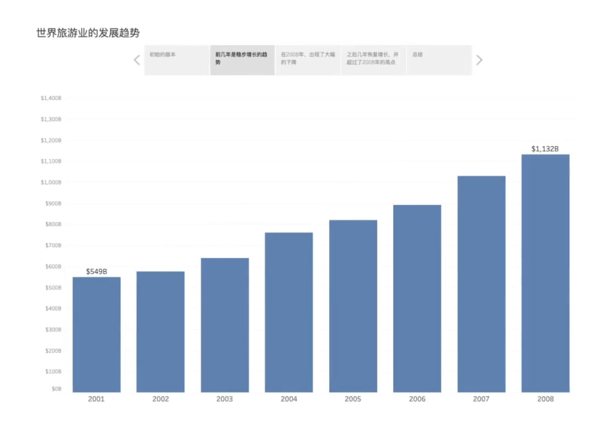
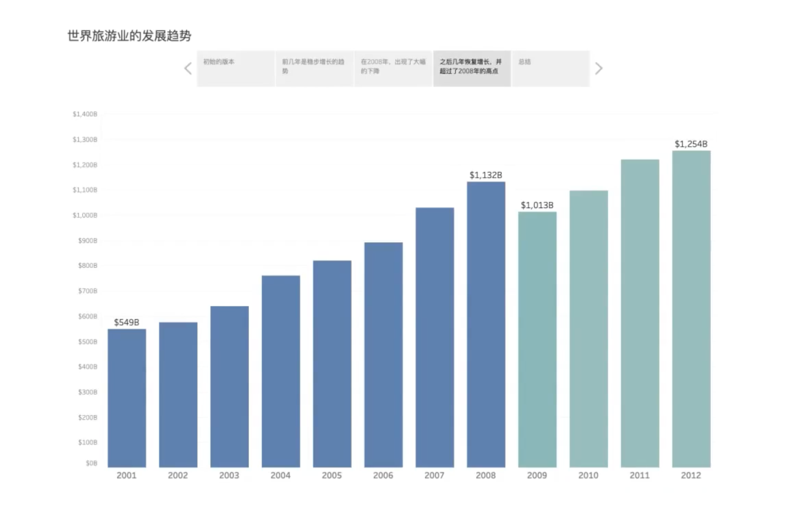
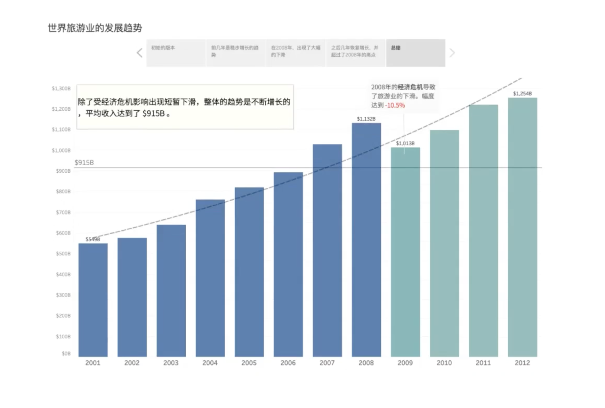

# PPT

根据不同的场景选择，要考虑互动方式、制作难度、是否需要炫酷的动画效果。
•直接在分析工具里讲解（Tableau）
• 在幻灯片里讲解（PowerPoint）

<figure markdown="span"></figure>
<figure markdown="span"></figure>
<figure markdown="span"></figure>
<figure markdown="span"></figure>

> 一次呈现太多的信息不容易突出重点。通过分步呈现，让观众关注当前，也方便标注。对于没有来现场的用户，阅读最后一页就好（最为详细完整）可以发布到Tableau Server，以方便用户自助的探索挖掘

使用表格时需要注意结构与呈现逻辑，并可以作为可视化分析的一种补充。

==SCQA==：构建沟通氛围（Situation），指出冲突（Complication）和疑问（Question），提供解决方案（Answer）

- Situation 情境：提供事件背景，构建与受众共同认知（情感）的基础起点，获得理解与共识
- Complication｜Conflict 障碍/冲突：描述障碍与冲突，让受众认识到存在扰乱稳定的问题
- Question 提问：针对C，提出一个问题
- Answer 回答：解决问题，提供克服C的答案

> 酒店订单
> （S） 2020开年以来，酒店订单一如既往稳步发展
> （C）票务处理团队有人离职导致人手逐渐吃紧，六月以后，订单量增加明显，我们团队已经进了全力加班加点，仍然弥补不上这个逐渐放大的缺口。现在，这已经影响了公司的业绩和客户体验
> （Q）我们究竟怎样才能解决这个订单处理的缺口问题呢？
> （A）希望总公司能够增加订单处理部门的人手

!!! warning "选定ppt主题字体可在默认字体上更换，这样更快。"

[PPT（PowerPoint）更改默认等线字体](https://blog.csdn.net/qq_42539194/article/details/111317271)
