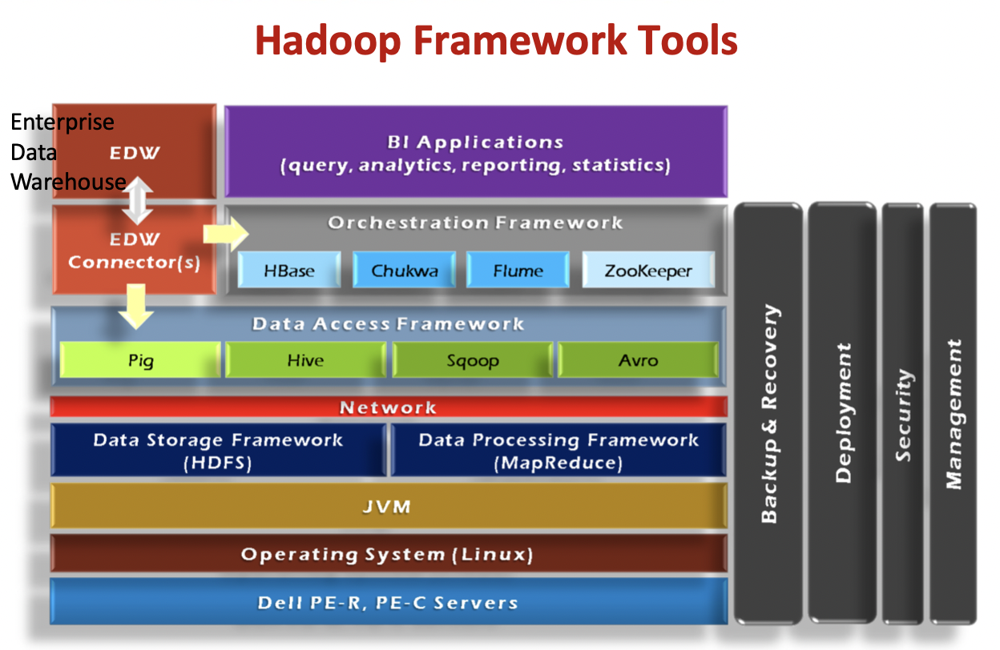
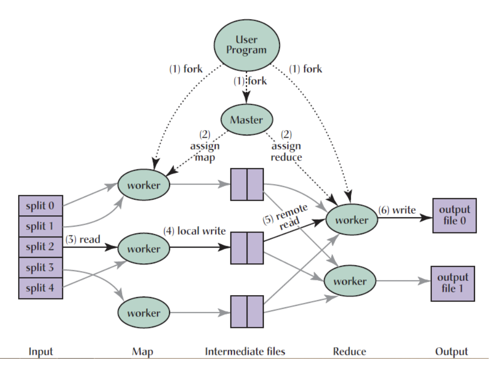
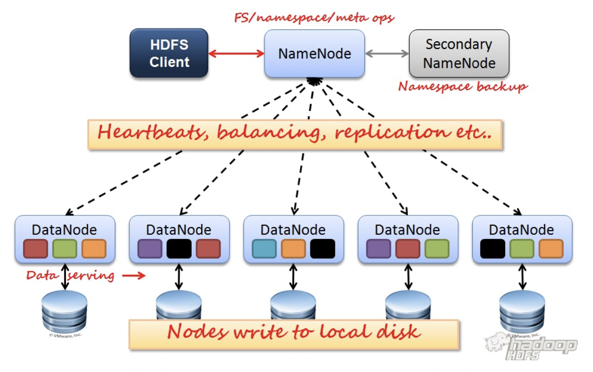
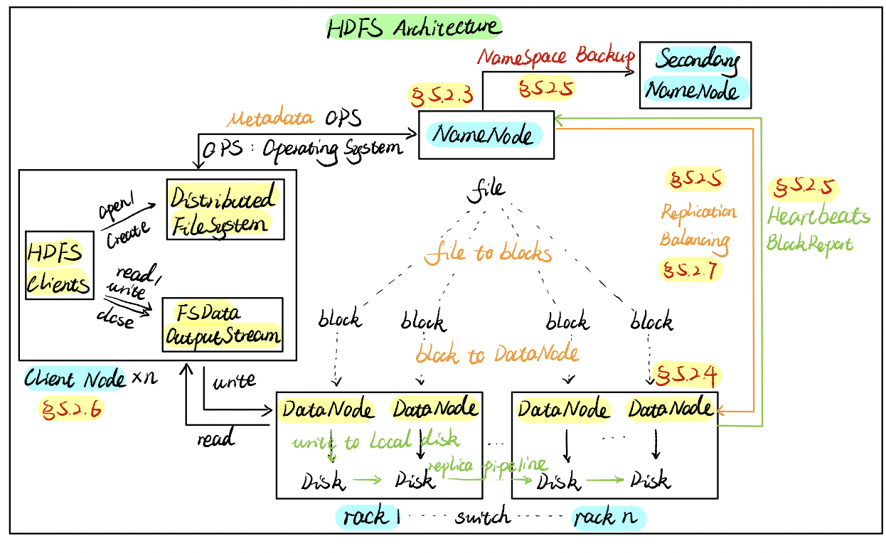
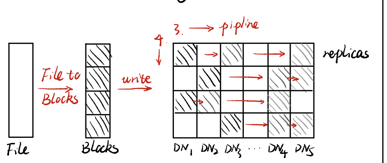
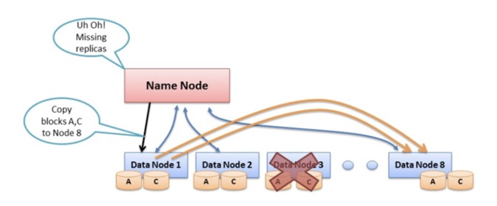
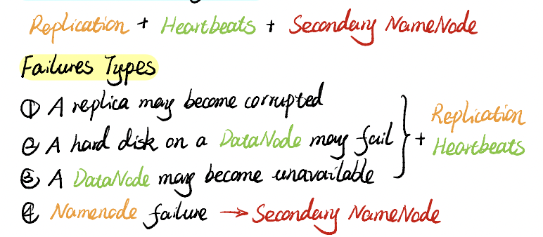

# (Apache 基金会的) Hadoop

==Hadoop==是一个 **实现了mapreduce算法** 的开源的分布式并行编程框架。open-source implementation of frameworks for reliable, scalable, distributed computing and data storage.

**Goals/Requirements:**

1. Abstract with high scalability and availability 它是一个**高可扩展性和可用性**框架
2. Facilitate the storage and processing of large and/or rapidly growing data sets 对大数据进行储存和处理
    - 大数据包括 结构化和非结构化 Structured and non-structured data
    - Process中：Move computation rather than data 更多的还是数据的移动读取
3. Use commodity hardware with little redundancy 就是说那种最基本配置的标配出售的东西，因为不加任何配置就是标准有一定能力但是不贵
    - Simple programming models
4. **Fault-tolerance** 容错性是最重要的

## architecture

**Hadoop Ecosystem：**
==Hadoop Common==。 A set of components and interfaces for distributed file systems and general I/O; 组件和接口
==Hadoop Distributed File System, HDFS==。 A distributed file system that runs on large clusters of commodity machines; 分布式文件系统
==Hadoop MapReduce==。A distributed data processing model and execution environment that runs on large clusters of commodity machines;

**Hadoop Framework：**
==HBase==。A distributed, column-oriented database.
Table storage for semi-structured data

- Row/column store
- Billions of rows/millions on columns
- Column-oriented - nulls are free
- Untyped - stores byte

==Zookeeper==。Coordinating distributed applications。

==Pig==。High-level language for data analysis

- Expresses sequences of MapReduce jobs
- Data model: nested “bags” of items
- Provides relational (SQL) operators (JOIN, GROUP BY, etc.)
- Easy to plug in Java functions

==Hive==。SQL-like Query language and Meta-store

- Used for majority of Facebook jobs
- “Relational database” built on Hadoop
- Maintains list of table schemas
- SQL-like query language (HiveQL)
- Can call Hadoop Streaming scripts from HiveQL
- Supports table partitioning, clustering, complex data types, some optimizations

==Mahout==。Machine learning

### Hadoop Distributed File System

**Problems and Solutions of HDFS.**

- Data is too big to store on one machine
💡HDFS: store the data on **multiple machines**
- High end machines are too expensive
💡HDFS: Run on commodity hardware
- Many commodig hardnare will fail occasional
💡HDFS: Intelligent enaugh to handle harduard failure
- How to handle date on failed hardward
💡HDFS: Data replication

**Goals of HDFS:**

- Verg Large Distributed File System ==Scalability==
10K nodes, 100 million files, 10PB
- Assumes Commodity Hardware ==Failure Tolerane==
    - Files ane replicated to handle hardware  failures
    - Detect failures and recover from them
- Optimized from Batch Processing ==High Throughaut==
    - Data locations exposed so that computations can move to where data resides
    - Provide very high aggregate bandwidth
- With interfaces to move application operation closer to data to reduce data communication costs
- HDFS is designed to just work, to process Large data sets with write-once-read-many (WORM) semantics. it's not for low latency access
- Can be built out of commodity hardware

**Distributed**, with some **centralization**

==A Hadoop Cluster== includes a single master and multiple slave nodes.

Main nodes run ==TaskTracker TT== to accept and reply to MapReduce tasks, and also ==DataNode DN== to store needed blocks closely as possible
Central control node runs ==NameNode== to keep track of HDFS directories & files, and ==JobTrack== to dispatch compute tasks to TaskTracker.
**When you create a MapReduce job**, at the very beginning, you have to seek the metadata from Namenode. Normally the namenode will maintain the metadata into his main memory, so we can search. You can retrieve the metadata immediately because everything is on the main memory. Normally on one namenode okay.
==Main nodes== of cluster are where most of the computational power and storage of the system lies

- No need for RAID on normal nodes (Raid is a very expensive storage system supporting parallel IO operations.)
- **Data Coherency** Write-once-read-many (WORM) access model Client can only append (not override) to existing files

#### Architecture

|  |  | 从架构位置分 |
| --- | --- | --- |
| Central Control Node  The Master | NameNode | keep track of HDFS directories & files, Central manager for the file system Namespace |
| ^ | JobTracker | dispatch compute tasks to TaskTracker, Central manager for running MapReduce jobs |
| The Slaves | Main nodes TaskTracker, TT | accept and reply to MapReduce tasks. accept and run map, reduce and shuffle |
| ^ | DataNode, DN | store needed blocks closely as possible |

|  |   | 从功能分 |
| --- | --- | --- |
| Store Data | NameNode | metadata, Transaction log, |
| ^ | DataNode, DN | actual data  |
| MapReduce Engine | JobTracker | splits up data into smaller tasks(“Map”) sends it to the TaskTracker process in each node |
| ^ | TaskTracker, TT | reports back to the JobTracker node;reports on job progress;sends data (“Reduce”) or requests new jobs |

##### DataNode, DN

- Individual machines in the cluster
- Typically 2 level architecture. 两层架构
- 30-40 nodes/rack. 一个rack里30-40个nodes
- Nodes are commodity PCs. 都是商品PC
- Uplink from one rack is 3-4 gigabit. rack之间互传是3-4千兆
- Rack-internal is 1 gigabit. rack内部的nodes 是1千兆
- Can run on any underlying filesystem (ext3/4, NTFS, etc) 可以在任何底层平台上使用

**with Client:**

- Serves data and metadata to Clients
- Periodically sends a report of all existing blocks to the NameNode 告诉NameNode自己存了啥数据

**Store:**

- actual data in the local file system(e.g. ext3) 在本地储存实际数据
- Stores metadata of local block (e.g. CRC)
- NameNode replicates blocks 2x in local rack, 1x elsewhere. 关于自己这一台rack的local data会在自己这存两份备份，一份在别的rack那里，由NameNode记录

**with others DN:**

- Forwards data to other specified DataNodes

##### NameNode

- **Single Namespace for entire cluster**
- The server holding the NameNode instance is **quite crucial**, as there is **only one**. 非常重要只有一个

**Store:**

- **metadata for the files** 储存元数据
    - like **the directory structure** of a typical FS(file system). ，比如说data的编号和data的储存位置。不储存data，而是data的搬运工，知道在哪里然后搬到DataNode
    - **The entire metadata is in main memory**
    - **No demand paging of metadata**
    - List of files, List of Blocks for each file, List of DataNodes for each block, File attributes, e.g., creation time, replication factor
- **Transaction log** for file deletes/adds, etc.
    - Does not use transactions for whole blocks or file streams, **only metadata**. 文件删除/添加等的事务日志。不将事务用于整个块或文件流，仅使用元数据。类似垃圾桶，在元数据那里标操作，意义上transaction，但实际储存上还是那样

**with client:**

- is responsible for maintaining the file namespace and directing clients to datanodes;

**with DataNode:**

- Maps a file name to a set of blocks
- Maps a block to the DataNodes where it resides
- Handles **creation of more replica blocks** when necessary after a DataNode failure。
    - **Replication Engine for Blocks**
    - 当某个DataNode挂了之后就搬运data——创建副本，确保data有定量的replications in DataNode
- **Cluster Configuration Management**

#### Strategy

##### Block Placement - Data Pipeline

- **Large blocks stored across a cluster** 每一个file都被分成很多个block储存在一个集群
    - Individual files are broken into blocks of a fixed size (64MB by default);
    - Blocks are stored across a cluster of one or more machines;
    - **High degree of data replication on multiple DataNodes** 每块都被高度复制储存在不同DataNode上
    - 至少三份 (3x by default) ：1st on local node；2nd on a remote rack；3rd on the same remote rack；Additional replicas are randomly placed
- **Blocks are moved primarily across DataNodes** 块的备份的写入主要靠DN之间传递
    - client retires a list of DataNodes on which to place replicas of a block from NameNodes
    - Client writes block to the first DataNode
    - The first DataNode forwards the data to the next node in the
    - When all replicas are written, the Client moves on to write the next block in file

- **Nearest replicas are retrieved by Client in network** 客户端检索最近备份的位置，通过网络直接访问
    - Client connects to NN to request to read data
    - NN tells client whichDNS to find the data block
    - Client read blocks of **nearest** replica **directly** from DNS
    - In case of node failures. clients connects to another DN that severs the missing block
    - Client accesses data directly from DataNode
        - **why not ask clients to read blocks through NN?**
            - present NN from being the bottleneck of the cluster
            - Allow HDFS to scale to large number of concurrent clients
            - Spreadthe data traffic across the cluster

### Mapreduce

因为 Targeted towards many reads of filestreams, Writes are more costly 针对在data process 读比写更重要
MapReduce is very good at dealing with warm proper property: Read once and write once and read many times right.

- Written in Java, also supports Python and Ruby

**Fine-grained Map and Reduce tasks:**

- Improved load balancing
- Faster recovery from failed tasks

### Parallelism in Hadoop

1. multi-threaded？
No need to handle multi-threaded code
Each Mapper / Reducer is typically single threaded
Allows for restarting of failed jobs
Runs entirely independent of each other in separate JVMs (Java Virtual Machines)

### Load Balancing

Goal: % disk full on DataNodes should be similar
不超过balance的时候：就加更多 Mappers/Reducers!

**Map:**

Usually as many as the number of HDFS blocks being processed, this is the default, else the number of maps can be specified as a hint. The number of maps can also be controlled by specifying the minimum split size. The actual sizes of the map inputs are computed by: $\max(\min(\text{\#block},\cfrac{data}{\#maps}), min\_split\_size$

**Reduces:**

Unless the amount of data being processed is small
0.95*num_nodes*mapred.TaskTracker.tasks.maximum
What happens if the number of reducers is less than the distinct of number keys?
The total running time is dominated by Reducer who deals with most intermediate pairs
Solution: use domain knowledge to decide the partitioning scheme
到了需要加DataNode的时候：

Usually run when new DataNodes are added

Cluster is online when Rebalancer is active

Rebalancer is throttled to avoid network congestion

### Locality Optimization, local 优化

Because some of machines are very busy, I cannot assign so many reduced to you the whole job, right? So this system level optimization should be considered locality optimization.

<u>Problem</u>：For large data, bandwidth to data is a problem for **Batch Processing**
By one reading, everything will be transferred from disc into the main memory. So this server time are expensive
<u>Solution</u>：Map-Reduce + HDFS is a very effective with the **Master scheduling policy**

**Master scheduling policy:**

- Map-Reduce queries HDFS for locations of input data
- Map tasks scheduled so HDFS input block replicas are on the same machine or the same rack
- Map tasks are scheduled close to the inputs when possible

**Benefits:**

- Thousands of machines read input at local disk speed，
    - It's not random access partial from here, partial from there, take a lot of time, it's everything is already local localised on the same place and you just by once reading everything can be available.
- Provides very high aggregate bandwidth
- Eliminate network bottleneck 消除网络速度瓶颈
Bandwideh at Different Lenels
Process on the same node
Different nodes on the same rack
Nodes on different racks in the same data center( cluster)
Nodes in different centers

### Fault Tolerance

!!! p "首先明确一点：Failure is norm, not an exception"

我们采取的是分布式系统，这么多台PC都同时都不出问题概率为0，哪怕一台报错概率极小。所以我们一定要做好确保 **Fault Tolerance** 的工作，包括:

1. replication 有备份
2. checksum 时刻检查是否出错
3. Data transfer bandwidth is critical (location of data) 数据传输带宽至关重要（数据位置）

**Automatic re-execution on failure**§ In a large cluster, some nodes are always slow or flaky

Framework re-executes failed tasks

| Failure | Failure Recovery |
| --- | --- |
| Worker failure | Detect DataNode failure via periodic heartbeats  |
|  | Detect Data correctness via Checksums |
|  | Re-execute in-progress map/reduce tasks |
| Master failure | Resume from Execution Log |

**Worker failure:**

**DataNode** failure

**Detect** via **periodic heartbeats**

DataNodes send heartbeats a Block Report from each DataNode to the NameNode. Once every 3 seconds via a TCP handshake

**Recover.**

Chooses new DataNodes for new replicas
Balances disk usage
Balances communication traffic to DataNodes

**Data** correctness

**Detect** via **Checksums**

Client computes checksum per 512 bytes.  DataNode stores the checksum

**Master failure:**

属于 Single point of failure 单点故障
Transaction Log stored in multiple directories:
A directory on the local file system
A directory on a remote file system (NFS/CIFS)
Need to develop a real HA (high availability) solution

****Secondary NameNode****

同步運行 The other can be replaced immediately without interrupting.

- Copies FSImage and Transaction Log from NamNnode to a temporary directory
- Merges FSImage and Transaction Log into a new FSImage in temporary directory
- Uploads new FSImage to the NameNode§ Transaction Log on NameNode is purged

