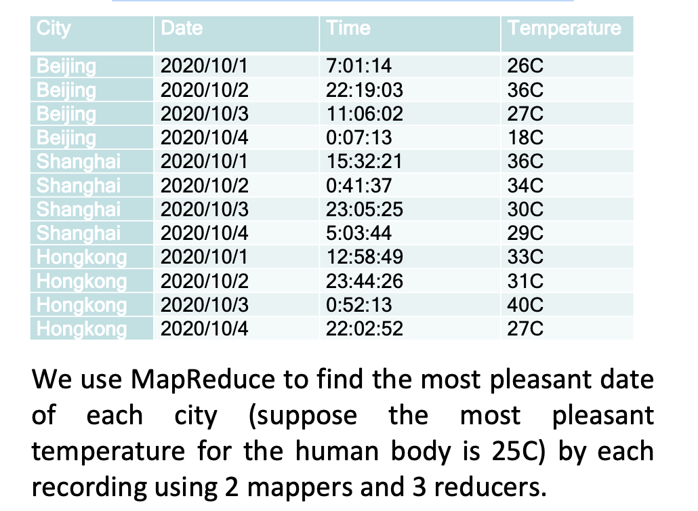

# MapReduce

## background

以前我们设计数据库以及其 transaction 操作最迫切地要求是 **make sure the transactions safe and consistent**，确保这项 transaction 安全一致。除此之外满足：**the throughput, the reliability, the asset property 吞吐量、可靠性、资产属性。**

但是对于谷歌，一个做 search的，最迫切的是快。无论是能马上返回用户搜索的结果的快，还是 break down之后能马上重启的快（the fault tolerance 容错， **most important**）。前者需要多台机器共同协作，后者需要多台机器独立并足够备份。根本就是 parallel machines→ **distributed processing** 。考虑到预算，他们发明了Map-Reduce，并不需要很昂贵的机器，而是用<u>非常多台性能一般并 heterogeneous （异构不一样结构）</u>机器去运行维护。

**Why not Parallel DBMS ?**

|  | Parallel DBMS  | we need |
| --- | --- | --- |
| most important | speed | the fault tolerance |
| machine  | Use of 10-100 high-end and preferably homogenous set of machines <br> 少，高端，相同结构 | Cluster of thousands of heterogeneous low-end servers <br> 大量，可以不一样结构，低端|
| transaction | Long loading time: good for load-once, query many times <br> 加载不行 | directly reads the file and processes the data <br> Just load the used data, process it, and go <br> 疯狂需要加载|

### Ideas： Distributed Processing

In a computing cluster, a ==worker node== is a computer that works on data. Data is split into several parts

**Details:**

1. incorrect results by wrong update

|  | Locking-based Solution | MapReduce |
| --- | --- | --- |
| how to works | must hold a lock on data before using Read/Write <br> 谁在读写就锁上，防止同时读写 | using its local storage,send their local arrays to the central node <br> 本地自己读写，再统一发到中心点update |
| Disadvantage | 1. Complicate the implementation <br> 2. Expensive runtime overhead.因为1在读写的时候，同样也访问这个东西的2就会被迫suspend| postpone the corporation to the end of the task and the most of the time they're running in parallel without waiting. |

## Map-Reduce

==Map-Reduce==. A simple programming model that applies to many **large-scale** computing problems

- ability to explore **large-scale cloud resources**
- inherently designed for **batch and high throughput** 专为**批处理和高吞吐量**而设计

### messy details in Map-Reduce runtime library 潜在的一些问题

#### automatic parallelization

既然是平行，那么就有可能

1. 同时process同一份data，就会重复
    - Do not allow workers to access shared data immediately
    - Do not allow workers to interrupt each other
    - Processing data sequentially to avoid random access
2. 完成独立任务后，怎么合成成果
    - Move operations near the data
    - MapReduce assumes an architecture where processors and storage are co-located
    - When workers finish, perform batch updates

#### load balancing

**network and disk transfer optimization：**

Cluster of thousands of heterogeneous low-end servers

- Hide system-level details from the application developer
- Simple and well-defined interfaces between a small number of components
- When workers finish, perform batch updates
The reason is that random access will move the drive from one location to the other and take a longer time if the data is sequentially stored, one read will be upload will be will be uploading everything in in in in, in once. So the IO time is very limited.

#### handling of machine failures

Assume failures are common§ Fault-tolerant service must cope with failures

without impacting the quality of service

## Workflow

{width=80%}
{width=80%}
{width=80%}

**key-points：**

1. definition of key-value pairs

### Map

a **mapping** that is responsible for

1. dividing the data
2. transform the original data into key-value pairs **`input data → (key, value) pairs`**
3. produces set of intermediate pairs

### Shuffle: Sort and Segment

the process of further organizing and delivering the Map output to the Reduce

1. the output of the Map must be sorted and segmented **Sorting is done before calling “reduce”**
2. then passed to the corresponding Reduce

### Reduce

a **merge** that

1. processes the values with the same key  **`(key, value) pairs → <result>`**
**All pairs in the same “reduce” call share the same key**
2. produces a set of merged output values

## Example

### the average gpa for the male students in each year from table Student

**Input:** Given a 10TB table: Student(id, name, year, gpa, gender)

****Target:**** Finish the SQL Execution

```sql
SELECT year, AVG(gpa) 
FROM Student
WHERE gender = ‘Male’ 
GROUP BY year
```

**Map:**

```c
Map(String key, Record value){
    // key: table name 
    // value: table content
    for each row in value:
        if (row.gender = ‘Male’):
            emit(row.year, row.gpa) // intermediate key value pairs
}
```

**Reduce:**

```c
Reduce(String key, Iterator values){
    // key: year
    // values: a list of gpa
    sumGPA = 0
    for each gpa in values:
        sumGPA += gpa
    emit(key, sumGPA/sizeof(values))
}
```

### Wordcount

{width=90%}

**Input:**  

```python
f = open("/content/drive/MyDrive/COMP5434-TA/input.txt", "r")
input_data = f.readlines()
```

**Map:**

`char.strip()` # 去除首尾空格

```python
def Map():
    while has lines left:
        L = Read a line
        S = tokenize(L) # S is a list of tokens 
        for each token in S:
            emit(S[i], 1); # k: word, v:1
```

```python
def map(input_data):
  map_result = []
  for line in input_data:
    words = line.split(" ")
    for word in words:
      print(" ".join([word.strip(), "1"]))
      map_result.append(" ".join([word.strip(), "1"]))
  return map_result

map_result = map(input_data)
print(map_result)
```

**Reduce:**

```python
def Reduce(k: word, value_list):
    emit(k, len(value_list)) # k:word, v:wordcount
```

```python
def reduce(map_result):
    word_cound_dict = {}
    for line in map_result:
        kv = line.split(" ")
        word = kv[0].strip()
        count = int(kv[1].strip())
        word_cound_dict[word] = word_cound_dict.get(word, 0) + count
    sorted_word_count = sorted(word_cound_dict.items(), key=itemgetter(0))

    for word, count in sorted_word_count:
        print(" ".join([word, str(count)]))

reduce(map_result)
```

### K-Means with MapReduce

{width=80%}

- Each Mapper loads a set of data samples, and assign each sample to a nearest centroid
- Each Mapper needs to keep a copy of centroids

### Find the most pleasant date

{width=80%}

```python
def Map():
    for each turple(City, Data, Time, Temperature) in the table:
        Temperature = Temperature,strip("C")
        value = Date + "-" + Temperature
        emit(City, value)  # k:city, v:date+temperature
```

|  | Mapper1 | Mapper2 |
| --- | --- | --- |
| output | Beijing, 2020/10/1-26 | Shanghai, 2020/10/3-30 |
|  | Beijing, 2020/10/2-36 | Shanghai, 2020/10/4-29 |
|  | Beijing, 2020/10/3-27 | Hongkong, 2020/10/1-33 |
|  | Beijing, 2020/10/4-18 | Hongkong, 2020/10/2-31 |
|  | Shanghai, 2020/10/1-36 | Hongkong, 2020/10/3-40 |
|  | Shanghai, 2020/10/2-34 | Hongkong, 2020/10/4-27 |

```python
def Rdeuce(k:city, value_list):
    tem_abs = 100
    date_pleasant = 0
    for each value in value_list:
        date, temperature = value.strp("-")
        if abs(temperature, 25) < tem_abs:
            date_pleasant = date
            tem_abs = abs(temperature, 25)
    emit(k, date_pleasant) # k:city, v:date_pleasant 
```

|  | Reducer1 | Reducer2 | Reducer3 |
| --- | --- | --- | --- |
| input | Beijing, 2020/10/1-26 | Shanghai, 2020/10/1-36 | Hongkong, 2020/10/1-33 |
|  | Beijing, 2020/10/2-36 | Shanghai, 2020/10/2-34 | Hongkong, 2020/10/2-31 |
|  | Beijing, 2020/10/3-27 | Shanghai, 2020/10/3-30 | Hongkong, 2020/10/3-40 |
|  | Beijing, 2020/10/4-18 | Shanghai, 2020/10/4-29 | Hongkong, 2020/10/4-27 |
| output | Beijing, 2020/10/1 | Shanghai, 2020/10/4 | Hongkong, 2020/10/4 |

- Map and Reduce are the main operations: simple code
- § All Map should be completed before Reduce starts
- § Number of map tasks and reduce tasks are configurable
- § Operations are provisioned near the data
- § Commodity hardware and storage
- § Runtime takes care of splitting and moving data
- § Special distributed file system, e.g., Hadoop Distributed File System and Hadoop Runtime
