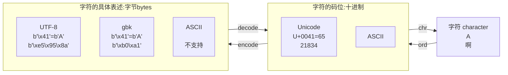
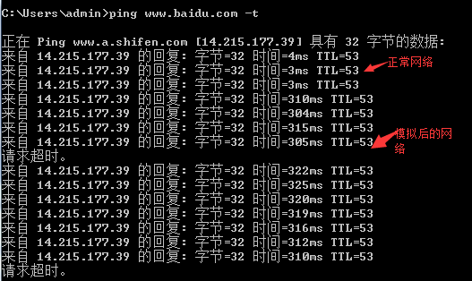

# other

## 计算机网络

### 数据加密解密体制

#### 对称密钥密码体制

加密 Encrypt、解密 Decrypt 都用同一把钥匙

- DES 数据加密标准
  
#### 不对称密钥

- 加密密钥和解密密钥不是同一把
- 由 given public key 在计算上推断 private key 不可能
- All public key、 encrypt algorithm，decrypt algorithm are open

##### RSA

- keys
    - `id_rsa`: private key ，需要保密
    - `id_rsa.pub`: public key， 公开信息

- 具有保密的数字签名


## Docker

==传统虚拟机技术==是虚拟出一套硬件后，在其上运行一个完整操作系统，在该系统上再运行所需应用进程；
==Container 容器==内的应用进程直接运行于宿主的内核，容器内没有自己的内核，而且也没有进行硬件虚拟。因此容器要比传统虚拟机更为轻便。

<div class=pic1>
    
</div>

==Ubuntu== is a **Linux** distribution based on Debian and composed mostly of free and open-source software.

### Concept

==images, 镜像== 就是原始的文件系统，为用户提供用户空间支持
==container 容器== 镜像运行的实体
==repository 仓库== 就是储存分发镜像

#### images 镜像

==操作系统==分为 **内核**和 **用户空间**。对于 `Linux` 而言，内核启动后，会挂载 `root`文件系统为其提供用户空间支持相当于是一个 root 文件系统。

==Docker 镜像== 是一个特殊的文件系统，除了提供容器运行时所需的程序、库、资源、配置等文件外，还包含了一些为运行时准备的一些配置参数（如匿名卷、环境变量、用户等）。镜像 **不包含** 任何动态数据，其内容在构建之后也不会被改变。

- `docker images`  查看所有的 images

- `docker pull <images(repository)_name>`
eg: `docker pull ubuntu`

#### Container

每一个容器运行时，是以镜像为基础层，在其上创建一个当前容器的存储层

镜像是静态的定义，容器是镜像运行时的实体。容器可以被创建、启动、停止、删除、暂停

#### repository

以 Ubuntu 镜像为例，ubuntu是仓库的名字，其内包含有不同的版本标签，如，16.0, 18.04。我们可以通过 ubuntu:16.04，或者 ubuntu:18.04来具体指定所需哪个版本的镜像。如果忽略了标签，比如 ubuntu，那将视为 ubuntu:latest。

!!! p 使用images(repository)上的container

- `docker run --name <container_name> -it <images(repository)_name> /bin/bash` 创建image上的container
eg: `docker run --name my_ubuntu -it ubuntu /bin/bash`
💡 每一次run都是create 完全新的container
- `exit` 退出container
- `docker ps -a`  查看所有的containers
- `docker start <container_id> or <container_name>` 打开restart
- `docker attach <container_id> or <container_name>`

## 字符 问题

字符的标识通常是指字符的编码方式，用于在计算机系统中表示和存储字符。最常见的字符编码标准是ASCII（American Standard Code for Information Interchange，美国信息交换标准代码），它使用7位或8位二进制数来表示字符，包括字母、数字、标点符号和控制字符。

除了ASCII之外，还有其他的字符编码标准，例如Unicode（统一码、国际码），它是一种用于表示世界上几乎所有字符的字符集标准。Unicode使用不同的编码方案，如UTF-8、UTF-16和UTF-32，其中UTF-8是最常用的编码方案，可以用来表示几乎所有的字符。

字符的具体表述是指字符在具体编码标准下的表示方式。例如，在ASCII编码中，字符'A'的标识是65，字符'a'的标识是97。在UTF-8编码中，字符'A'的标识是0x41，字符'a'的标识是0x61。具体的表述方式取决于所使用的字符编码标准。

==字符集标准==，定义了字符集，表示世界上几乎所有的字符，定义了每个字符的唯一编码点。
==字符编码方案==，一般基于一个字符集标准，对字符进行编码，使得在**存储和传输文本数据**时节省空间和带宽。也就是将内存存入硬盘的格式

> en + zh =》 <kbd>unicode</kbd> =》<kbd>gbk</kbd>
> en + jp =》 <kbd>unicode</kbd> =》<kbd>shift-jis</kbd>
> 万国字符 =》 <kbd>unicode</kbd> =》<u><kbd>utf-8</kbd></u>

!!! p 内存固定使用 <kbd>unicode</kbd> 完整, 我们改变的是从<u>内存存入硬盘的格式</u>
    linux 默认 utf-8， windows 默认 gbk

    !!! danger 文本存取乱码问题
        - 存乱了，编码格式应该设置成支持文本内字符串的格式。日文就不要用 <kbd>gbk</kbd>
        - 取乱了，编码格式应该对应该文件存入硬盘的格式

==Unicode==是一种**字符集标准**。Unicode，通常用**十六进制数**表示。但也可以用不同的表示形式表示，如十进制
> 'A' = 十六进制 U+0041 = 十进制 65

基于 Unicode 的, \* ：表示不支持

|字符|Unicode 码位|ASCII|gbk|shift-jis|utf-8|
|--|--|--|--|--|--|
|A|U+0041|41|41|41|41|
|啊|21834|*|b'\xb0\xa1'|\*|b'\xe5\x95\x8a'|

- ==UTF-8 Unicode Transformation Format-8== 是一种基于**Unicode的字符编码方案**。它使用可变长度的编码方式，可以表示Unicode字符集中的所有字符。
特点：**兼容ASCII编码**，即ASCII字符的UTF-8编码与ASCII编码完全一致，不会引入额外的字节。对于非ASCII字符，UTF-8使用多字节表示，根据字符的Unicode编码点范围，将字符编码为1到4个字节。
优势：它既可以表示Unicode字符集中的所有字符，又能够高效地处理ASCII字符，使得在存储和传输文本数据时节省空间和带宽。因此，UTF-8成为了互联网上使用最广泛的字符编码方案。

    !!! p 总结: UTF-8 是基于 Unicode 的一种字符编码方案，用于表示 Unicode 字符集中的字符，并且兼容 ASCII 编码。
- gbk

!!! quote ""
    'A 被编码成一个字节，所以可以直接显示 b'A' == b'\x41'.



```python{highlight=[1,7,9,11]}
'A'.encode('utf8')
# >>> b'A'
b'A' == b'\x41'
# >>> True
A' == b'A'
# >>> False
b'\x41'.decode('utf8')
# >>> 'A'
unicode_A = ord('A')
# >>> unicode_A=65
chr(unicode_A)
# >>> 'A'
```

### clumsy

[official](https://jagt.github.io/clumsy/cn/index.html)
[弱网模拟工具Clumsy使用指南](https://www.lfzxb.top/clumsy-guide/)
[add Bandwidth version](https://github.com/skywind3000/clumsy)

!!! p "1. 重现网络异常造成的程序错误<br>2. 评估应用程序在不良网络状况下的表现"
    当clumsy被激活时，只有符合这些标准的网络数据会被进行处理，而你不需要的数据仍然会由系统正常传输。

#### 使用

1. 自定义filter，正确的 WinDivert 规则
2. 如果有预设的filter 可以自定义 see: #self-define-presets
3. <kbd>Start</kbd>。
4. 选择<kbd>Fuctions</kbd>，对应指标前面出现绿点，表示该项拦截生效
5. 修改params

6. 通过 ping 网络，查看工具模拟网络是否生效


##### Self-define <kbd>presets</kbd>

软件根目录下的<kbd>config.txt</kbd>以<u>键值对</u>的形式填写自己的配置

> 添加一个 起始和目标端口为10003，10004的udp连接 配置
>
> ``` title="config.txt"
> # you can add your usual filters here for your own use:
> #http requests ONLY(data transmit on other ports): outbound and tcp.DstPort == 80
> NKGMoba: udp and (udp.DstPort == 10003 or udp.DstPort == 10004) 
>         or (udp.SrcPort == 10003 or udp.SrcPort == 10004) 
> ```

##### Functions

- **Lag**, 延迟，把数据包缓存一段时间后再发出，这样能够模拟网络延迟的状况。
- **Drop**, 掉包，随机丢弃一些数据。
- **Throttle**, 节流，把一小段时间内的数据拦截下来后再在之后的同一时间一同发出去。
- **Duplicate**, 重发，随机复制一些数据并与其本身一同发送。
- **Out of order**, 乱序，打乱数据包发送的顺序。
- **Tamper**, 篡改，随机修改小部分的包裹内容。
- **Bandwidth**, ，小带宽
    统计包大小时用的是整个 IP 包的大小（包括各种协议头），所以你设置成 500 KB/s 的话，实际按 tcp 计算的下载速率会<u>略小</u>。
  
**params**

- **Inbound/Outbound**: 是否处理输入/输出数据包。这里在 filter 的控制之外额外提供一个选择的机会，并且也可以在实时生效。
- **Chance:** 功能生效的概率。显然你需要把它们设置在一个合理的范围内才不会让网络在可以接受的范围内劣化。

[Example](https://testerhome.com/topics/11001/show_wechat)
